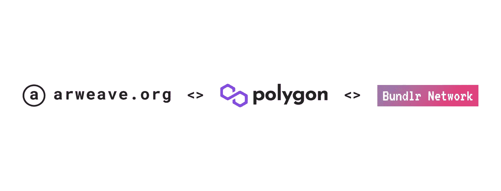
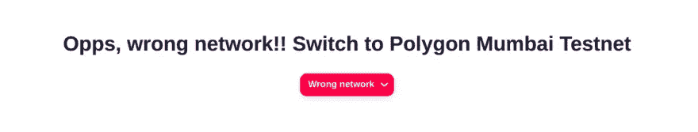

# 使用 Arweave、Bundlr、Next.js、RainbowKit 和 Wagmi 为 Web3 应用程序提供永久文件存储

> 原文：<https://betterprogramming.pub/permanent-file-storage-for-web3-apps-with-arweave-bundlr-next-js-rainbowkit-and-wagmi-18aa1506fa6e>

## 如何创建存储数据的最佳方式


[斯蒂夫·约翰森](https://unsplash.com/@steve_j?utm_source=medium&utm_medium=referral)在 [Unsplash](https://unsplash.com?utm_source=medium&utm_medium=referral) 上拍照

在本文中，我将向您展示如何使用 testnet 上的 bundlr 创建一个 Dapp，允许我们在 Arweave 网络上存储数据。

在继续之前，让我们看看今天我们要构建什么。



如果您想尝试一下，下面是已部署的链接:

【https://bundlr-arweave.netlify.app/ 

# 我用过的技术堆栈和库:

*   Nextjs
*   Chakra UI
*   RainbowKit
*   瓦格米
*   Bundlr 客户

# 好吧，好吧，让我们先看看什么是 Arweave 和 Bundlr(来自文档)

如果你像我一样喜欢视频，这里有一个视频给你:

# [Arweave](https://www.arweave.org/)

Arweave 使信息永久可持续。

Arweave 是一种新型存储，它以可持续和永久的天赋支持数据，允许用户和开发人员第一次真正永久地存储数据。

# [Bundlr](https://docs.bundlr.network/docs/about/introduction)

Bundlr 使 Arweave 上的 web3 数据存储变得像传统数据存储一样快速、简单和可靠。Arweave 是唯一真正分散的永久性数据存储解决方案。

Bundlr 在不牺牲安全性或可用性的情况下，将 Arweave 上进行的交易数量增加了 4，000%，上传数据的速度提高了约 3，000 倍。

Bundlr 目前占上传到 Arweave 的数据的 90%以上。它支持无限的可伸缩性，并支持即时和有保证的事务终结。这是一个多链解决方案，兼容领先的区块链，包括以太坊，索拉纳，雪崩，多边形，等等。

# 使用 Bundlr 上传到 Arweave 必须遵循的步骤

1.  连接钱包
2.  初始化 Bundlr 客户端
3.  添加资金(BNDLR 代币)
4.  上传文件

> *注意:我们将在 polygon mumbai testnet* 上构建这个应用程序
> 
> *Bundlr 有一个 devnet，允许您使用 devnet/testnet 加密货币网络支付存储费用。devnet 节点的行为与 mainnet 节点完全一样——除了数据不会移动到 Arweave，并且会在一周后从 Bundlr 中清除。*

# 让我们开始建造吧

为了更好地理解 [Github](https://github.com/Deep1144/bundlr-arweave-testnet-uploader) ，将完成的代码放在一边打开

# 1.设置项目

用 tailwind CSS 和 Chakra ui 设置一个 Nextjs 项目你可以使用 [create-web3-frontend](https://github.com/dhaiwat10/create-web3-frontend) 包快速完成设置，或者直接克隆这个[项目报告](https://github.com/Deep1144/bundlr-arweave-testnet-uploader)

另外，安装这两个依赖项:

```
yarn add @bundlr-network/client bignumber.js
```

# 2.连接钱包

由于我们使用的是 Rainbow kit，这一步在`index.tsx`中非常简单:

有了这 5-6 行代码，我们就完成了钱包的连接。

我们还添加了一个条件来检查用户是否在 Mumbai 测试中，因为我们将在本文中使用 polygon Mumbai testnet。

在`_app.jsx`中，在配置 Rainbow kit 时，我们已经将其配置为使用 polygon Mumbai testnet

```
const { chains, provider } = configureChains(
  [chain.polygonMumbai],
  [
    jsonRpcProvider({ rpc: () => ({ http: process.env.NEXT_PUBLIC_ALCHEMY_RPC_URL }) }),
    publicProvider(),
  ]
);
```

因此，Rainbow kit 还会负责为我们更改网络，这就是这个警告的样子



# 3.初始化 Bundlr

让我们为 bundlr 创建一个上下文，这样我们就可以从那里维护所有与 bundlr 相关的逻辑。

创造`bundlr.context.tsx`

现在，让我们在这个文件中创建上下文。你可以在这里看到文件[的完整版本](https://github.com/Deep1144/bundlr-arweave-testnet-uploader/blob/main/state/bundlr.context.tsx):

为了初始化 Bundlr，我们将使用上面代码中的`initialiseBundlr`方法。代码也非常简单。

```
const bundlr = new WebBundlr(
            "https://devnet.bundlr.network",
            "matic",
            provider,
            {
                providerUrl:
                    process.env.NEXT_PUBLIC_ALCHEMY_RPC_URL,
            }
        );
        await bundlr.ready();
        setBundlrInstance(bundlr);
```

我们正在创建 Bundlr 客户端的一个实例，并将其存储在一个状态变量中

阅读更多关于 [bundlr 客户端](https://docs.bundlr.network/docs/client/js)的信息。

使用 Bundlr 和 testnet，[阅读此处](https://docs.bundlr.network/docs/devnet)。

> 为了使用 devnet，您需要使用`https://devnet.bundlr.network`作为节点，并将提供者 url 设置为给定链的正确 testnet/devnet RPC 端点。

我们的 RPC URL 看起来像这样，因为我们将使用 polygon testnet。

```
NEXT_PUBLIC_ALCHEMY_RPC_URL=https://polygon-mumbai.g.alchemy.com/v2/{{alchemy_project_id}}
```

在此阅读，关于 bundlr [支持的所有货币/网络。](https://docs.bundlr.network/docs/currencies)

# 4.添加资金(bndlr 代币)

我们已经有了关于 bundlr 上下文中的`balance`的数据，我们也有了一个方法`fundWallet`，我们将使用它来添加资金。

添加基金也非常简单。只需在`bundlrInstance`上使用`fund`方法，并传递您想要存入钱包的金额。

```
let response = await bundlrInstance.fund(amountParsed)
```

在`index.tsx`中，进行以下更改:

现在，让我们创建`<FundWallet />`组件。

创造`components/FundWallet.tsx`

# 5.上传图像

现在，由于我们已经添加了资金，我们可以将图像(或任何其他文件)上传到 Arweave 网络。

在`index.tsx`中，在文件末尾添加以下代码:

现在，让我们创建`<UploadImage />`组件:

有了这个，我们现在可以把文件上传到 Arweave 网络。

# 进一步改进

1.  目前，我们只上传图片。我们还可以添加对其他格式的支持(视频、音频等)。
2.  在 Supabase 中存储带有钱包地址的上传图像的 URL，并在用户连接钱包时显示用户之前上传的文件列表。

完成代码: [GitHub](https://github.com/Deep1144/bundlr-arweave-testnet-uploader)

```
**Want to Connect?**Connect with me on [Twitter](https://twitter.com/pateldeep_eth) @pateldeep_eth.[Linkedin](https://www.linkedin.com/in/patel-deep-dev/)*Originally published at* [*https://pateldeep.xyz/*](http://pateldeep.xyz/)
```