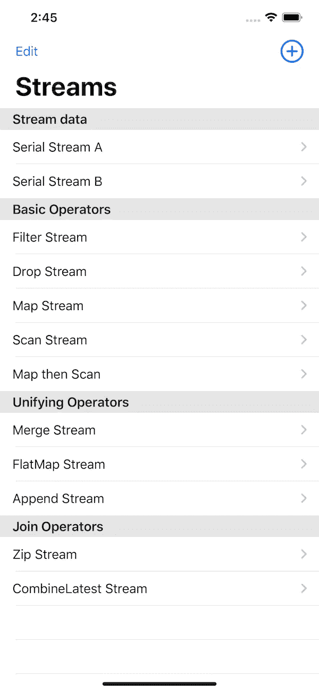
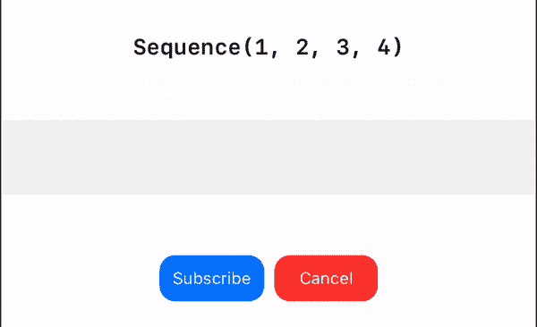

# 通过 Swift Combine 保持业务逻辑

> 原文：<https://betterprogramming.pub/persist-business-logic-with-swift-combine-519efb3a7e37>

## 数据驱动联合收割机


在之前的[系列](https://medium.com/flawless-app-stories/visualize-combine-magic-with-swiftui-part-5-2783adddbd1d)中，我们成功地在 SwiftUI 的基础上搭建了这个平台，在这里你可以自由地观察流经 Combine [publisher](https://developer.apple.com/documentation/combine/publisher) 的值序列。

我们还创建了一些例子，展示了一些默认的组合操作符，它们能够改变和转换序列中的值，比如`[filter](https://developer.apple.com/documentation/combine/publishers/filter)`、 `[map](https://developer.apple.com/documentation/combine/publishers/map)`、`[drop](https://developer.apple.com/documentation/combine/publishers/drop)`、[、](https://developer.apple.com/documentation/combine/publishers/drop)和`[scan](https://developer.apple.com/documentation/combine/publishers/scan)`。此外，我们引入了更多的运算符来连接(`[Zip](https://developer.apple.com/documentation/combine/publishers/zip)`和`[CombineLatest](https://developer.apple.com/documentation/combine/publishers/combinelatest)`)或统一(`[Merge](https://developer.apple.com/documentation/combine/publishers/merge)`和`[Append](https://developer.apple.com/documentation/combine/publisher/3204685-append)`)序列。

在这一点上，你们中的一些人可能有点厌倦了为每个例子管理或维护这么多代码(至少我是这样)。看教程文件夹下的这个[combine-magic-swift ui](https://github.com/kevinjohnason/combine-magic-swiftui)repo 里有多少？每个例子都是 SwiftUI 视图。每一个简单地向`StreamView`提供一个或几个发布者，当点击订阅按钮时`StreamView`订阅发布者。

因此，我应该能够在应用程序的启动和重用`StreamView`上以编程方式生成一个发布者列表，如下面的截图所示。



然而，这种解决方案的问题是当有许多发布者要创建时的可伸缩性。

我对这个问题的解决方案是我必须设法坚持这些出版商。如果我能以某种方式序列化这些发布者，我就能持久化它们。如果我设法持久化它们，我不仅能够在不改变代码的情况下修改它们，还能够与其他支持[合并](https://developer.apple.com/documentation/combine)的设备共享它们。

# 保持和转移组合运算符

现在，让我们更具体地回顾一下我们的目标。由于我们有一个`Publisher`格式的流和操作符列表，我们希望能够将它们保存在任何类型的存储中——比如硬盘或数据库。

显然，我们还需要能够将存储的数据转换回发布者，但是此外，我们希望能够与运营商从一个地方到另一个地方共享、传输和分发这些发布者。

一旦我们建立了这种结构，你可能已经想到了，在一个分布式环境中，一个集中的服务可以开始为一群客户端驱动计算逻辑。


# 可编码结构

我们该怎么做？我们从设计一个可序列化和反序列化的结构开始。Swift 的`[Codable](https://developer.apple.com/documentation/swift/codable)` 协议允许我们通过`JSONEncoder`和`JSONDecoder`做到这一点。此外，该结构需要正确地表示流中最小值单元的数据和行为，直到复杂的操作符链。

在我们继续之前，为了理解我们将要创建的结构需要哪些组件，让我们回顾一下我们从之前的[系列](https://medium.com/flawless-app-stories/visualize-combine-magic-with-swiftui-part-5-2783adddbd1d)中构建的基本流程。

# 数字流



这是最简单的流程；然而，如果你深入观察，你会发现这不仅仅是一个简单的数组序列。每个圆形框都有自己的延迟操作符，用于驱动应该发出的实际时间。Combine 中的每个值看起来像:

```
Just(value).delay(for: .seconds(1), scheduler: DispatchQueue.main)
```

整个事情看起来像:

```
let val1 = Just(1).delay(for: .seconds(1), scheduler:   DispatchQueue.main)
let val2 = Just(2).delay(for: .seconds(1), scheduler: DispatchQueue.main)
let val3 = ....
let val4 = ....let publisher = val1.append(val2).append(val3).append(val4)
```

每个值延迟一秒钟，下一个值附加相同的`delay`操作符。

因此，我们从观察中了解到两件事。

1.  流不是结构中最小的单元。流值为。
2.  每个流值都可以有无限的操作符，这些操作符控制发出值的内容和时间。

# 创建您的流项目

由于流值和它的操作符是最小的单元，所以让我们从创建它的结构开始。姑且称之为`StreamItem`。

```
**struct** StreamItem<T: Codable>: Codable { **let** value: T **var** operators: [Operator]}
```

`StreamItem`包含一个流值和一个运算符数组。按照我们的要求，我们希望能够持久化结构中的一切，这样`value`和`StreamItem`都符合`Codable`协议。

流值需要是泛型的，以便容纳任何类型的值。

# 创建您的流模型

我们稍后将讨论操作符的结构。让我们把一个`StreamItem`数组放在一起作为`StreamModel`。

```
**struct** StreamModel<T: Codable>: Codable, Identifiable { **var** id: UUID **var** name: String? **var** description: String? **var** stream: [StreamItem<T>]}
```

`StreamModel`保存一个`StreamItem`的数组。`StreamModel`还具有 ID、名称和描述属性，用于识别和描述目的。同样，`StreamModel`中的所有东西都必须是`Codable`才能持久和分发。

# 创建操作员结构

如前所述，`delay`操作员可以改变`StreamItem`的发射时间。

```
**enum** Operator {
  **case** delay(seconds: Double)
}
```

我们将`delay`操作符视为带有一个关联值的`enum`，以保持延迟时间。

当然，运算符`enum`还需要符合`Codable` *、*，其中包括对下划线关联值的编码和解码。请参见下面的完整实现。

现在，我们有一个很好的结构来表示这个串行流，它以第二个延迟间隔从`1`到`4`发出值。

```
**let** streamA = (1...4).map { StreamItem(value: $0,operators: [.delay(seconds: 1)]) }**let** serialStreamA = StreamModel(id: UUID(), name: "Serial Stream A",description: **nil**, stream: streamA)
```

# 将 StreamModel 转换为 Publisher

现在我们已经构建了一个流实例；然而，如果我们不将其转换为发行商，那么到目前为止的一切都将毫无意义。让我们试一试。

首先，每个操作符模型链接到一个实际的组合操作符，该操作符应该添加到给定的发布者并返回被操作的发布者。

```
**extension** Operator {**func** applyPublisher<T>(**_** publisher: AnyPublisher<T, Never>) -> AnyPublisher<T, Never> { **switch** **self** {
 **case** .delay(**let** seconds):
 **return** publisher.delay(for: .seconds(seconds), scheduler: DispatchQueue.main).eraseToAnyPublisher()
  }
 }
}
```

目前只有一种类型的运营商，`delay`。我们将继续添加更多内容。

现在我们可以开始为每个`StreamItem`申请出版商了。

```
**extension** StreamItem { **func** toPublisher() -> AnyPublisher<T, Never> { **var** publisher: AnyPublisher<T, Never> =
                   **Just**(value).eraseToAnyPublisher() **self**.operators.forEach {
       publisher = $0.**applyPublisher**(publisher)
    } **  return** publisher
 }}
```

我们从一个`[Just](https://developer.apple.com/documentation/combine/just)`值开始，用`[eraseToAnyPublisher](https://developer.apple.com/documentation/combine/just/3333471-erasetoanypublisher)` 方法将其一般化，然后应用来自所有相关操作符的发布者。

在`StreamModel`层面上，这就是我们如何获得整个流的发布者。

```
**extension** StreamModel { **func** toPublisher() -> AnyPublisher<T, Never> { **let** intervalPublishers = 
         **self**.stream.map { $0.toPublisher() } **var** publisher: AnyPublisher<T, Never>? **for** intervalPublisher **in** intervalPublishers { **if** publisher == **nil** {
        publisher = intervalPublisher
 **continue** } publisher = 
         publisher?.append(intervalPublisher).eraseToAnyPublisher() }
 **return** publisher ?? Empty().eraseToAnyPublisher()
  }
}
```

您猜对了:我们使用`[append](https://developer.apple.com/documentation/combine/publisher/3204684-append)`方法将发布者连接在一起。

# 可视化流，编辑，并再次可视化

现在，我们可以简单地解码发布者并提供和构建流视图(参见我们在[之前的系列文章](https://medium.com/@kevinminority/visualize-combine-magic-with-swiftui-part-4-6d0c5678f89e)*中是如何做的)。*最后但同样重要的是，我们现在可以简单地编辑`StreamModel`，添加更多具有新值的`StreamItem`，甚至可以通过互联网与其他设备共享这个模型。

请看下面的演示。我们现在能够在不改变代码的情况下改变流。


# 下一章:序列化/反序列化过滤器和映射操作符

在下一篇文章中，我们将在`enum`操作符中添加更多的操作符，并开始在流级别上应用它们。

[](https://medium.com/better-programming/persist-filtering-logics-with-swift-combine-6c3594be77cc) [## 通过快速组合保持过滤逻辑

### 数据驱动联合收割机(下)

medium.com](https://medium.com/better-programming/persist-filtering-logics-with-swift-combine-6c3594be77cc) 

直到下一次，你可以在这个[combine-magic-swi fui repo](https://github.com/kevinjohnason/combine-magic-swiftui)的 combine-playground 文件夹下找到源代码。