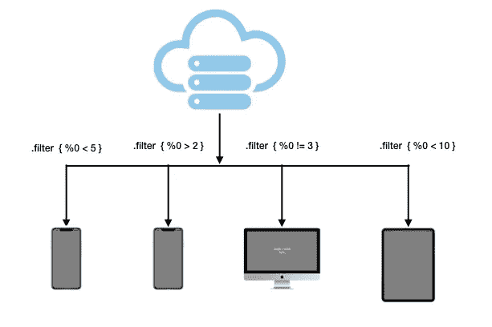
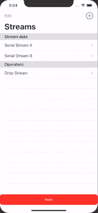
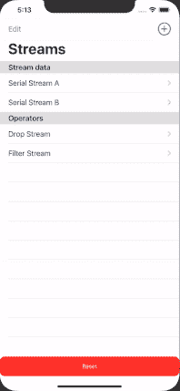

# 通过快速组合保持过滤逻辑

> 原文：<https://betterprogramming.pub/persist-filtering-logics-with-swift-combine-6c3594be77cc>

## 数据驱动联合收割机



在[上一集](https://medium.com/@kevinminority/persist-business-logic-with-swift-combine-519efb3a7e37)中，我们成功地模拟了一个值流，并为每个值附加了一个简单的操作符(`delay`)。

在本文中，我们将研究更多的操作符，将它们命名为`Codeable`，并最终在运行时将它们翻译成 Combine publisher。

# 运算符的类型

在我们开始对操作符建模之前，我们需要了解有多少种操作符。

ReactiveX 网站将其大致分为 10 种类型:创建、转换、过滤、合并、错误处理、实用、条件、数学/聚合、背压、可连接-可观察和运算符-转换可观察。如果您感兴趣，ReactiveX 对每种类型和操作符都有很好的解释。

**注:**如果不熟悉 RxSwift，RxSwift 中的[可观察](https://github.com/ReactiveX/RxSwift/blob/master/Documentation/GettingStarted.md)相当于 Combine 中的[发布者](https://developer.apple.com/documentation/combine/publisher)。

在前一篇文章中，我们提到了`delay`操作符，它属于`utility`类型。今天我们将重点关注在`filtering`类型中保持两个操作符。

# 过滤运算符

这种类型的操作符根据给定的条件，删除所有或部分(或不删除)向下游发送的流项目。

## 下降优先

`dropFirst`停止顶部 *n* 项目的发射。考虑到简单性，我们可以将它添加到我们的`Operator`枚举中。

```
**enum** Operator {
  **case** delay(seconds: Double)
  **case** **dropFirst**(count: Int)
}
```

我们也可以很容易地将这个 enum case 转换成 Publisher。

```
**extension** Operator {**func** applyPublisher<T>(**_** publisher: AnyPublisher<T, Never>) -> AnyPublisher<T, Never> { **switch** **self** {
 **case** .dropFirst(**let** count):
        return publisher.dropFirst(count).eraseToAnyPublisher()
    //skip the rest of cases
  }}}
```

现在，`dropFirst`操作符可以被持久化并显示在操作符列表中。



持久化`dropFirst`似乎类似于 and `delay`操作符。或许，过滤与实用操作符并没有太大的不同。在我们下结论之前，让我们再尝试一个操作符。

## 过滤器

与`dropFirst`有非常基本的过滤标准不同，`filter` 运算符采用闭包而不是原语类型。现在，这是一个挑战。我们如何保持和分发一个闭包？

 [## 过滤器(_:)

### 重新发布与提供的闭包匹配的所有元素。

developer.apple.com](https://developer.apple.com/documentation/combine/publisher/3204709-filter) 

让我们仔细看看`filter`方法。

```
func filter(_ isIncluded: @escaping (Self.Output) -> [Bool](https://developer.apple.com/documentation/swift/bool)) -> [Publishers](https://developer.apple.com/documentation/combine/publishers).[Filter](https://developer.apple.com/documentation/combine/publishers/filter)<Self>
```

它的闭包`isIncluded`采用泛型类型并返回一个布尔值。

Foundation 中有没有表示逻辑条件并返回布尔值的东西？想起什么了吗？

## 用 NSPredicate 筛选

答案是`[NSPredicate](https://developer.apple.com/documentation/foundation/nspredicate)`。如果我们可以将过滤条件作为字符串格式的表达式持久化，我们可以简单地传递流值并使用`NSPredicate`来评估结果。

让我们继续将`filter`添加到枚举中。

```
**enum** Operator {
  **case** delay(seconds: Double)
  **case** dropFirst(count: Int)
  **case** **filter**(expression: String)
}
```

这里我们需要的只是过滤像`%d !=3`或`%@ != “D”`这样的表达式；因此，`expression`是我们的关联类型。同样，我们需要能够将`filter`枚举移动到 Publisher 中。

```
**extension** Operator {
**func** applyPublisher<T>(**_** publisher: AnyPublisher<T, Never>) -> AnyPublisher<T, Never> { **switch** **self** {
 **case** .filter(**let** expression):
    return publisher.filter { value **in** NSPredicate(format: expression, 
                            argumentArray: [value])
                 .evaluate(with: **nil**) }.eraseToAnyPublisher()

        //skip the rest of cases
  }}}
```

按照计划，我们将表达式和从 Publisher 向上游发送的值一起发送到`NSPredicate`。

注意`NSPredicate`接受一个参数数组。因此，经过一些修改，即使值是元组格式，它也应该可以工作，这在反应式场景中非常常见。我们将在以后讨论组合运算符时讨论这个问题。



如您所见，过滤器流被添加到这个持久化的操作符数组中，并被转换为 Publisher，以便从上游值中过滤出数字`3`。

# 下一集:持久化——转换操作符、映射和扫描

在演示 GIF 中，您可能会发现操作符列表相当空。在接下来的几周里，我们将用不同类型的运算符来填充它们:转换运算符、`map`、*、*和`scan`。

你可以在 combine-playground 文件夹下的这个[combine-magic-swi fui repo](https://github.com/kevinjohnason/combine-magic-swiftui)中找到源代码。