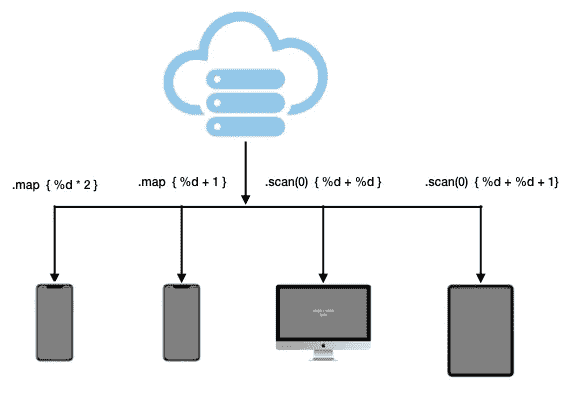
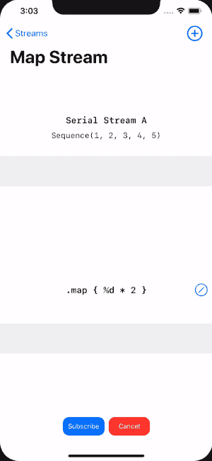
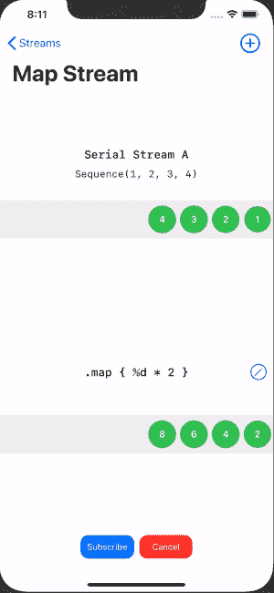
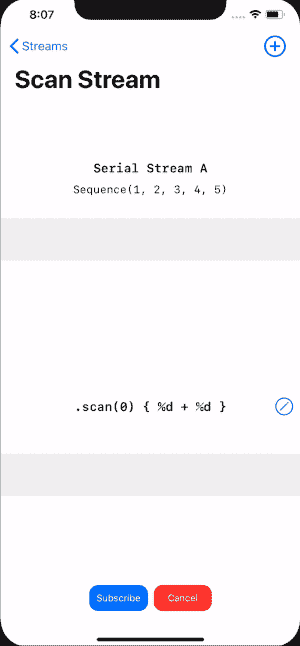
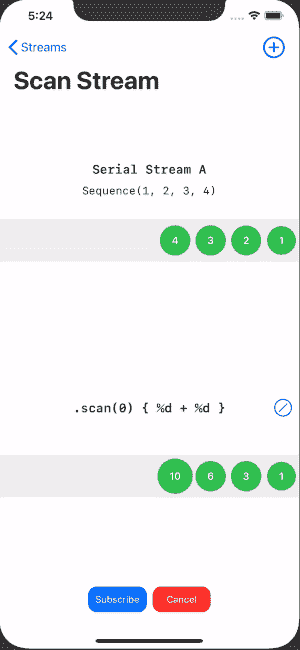

# 如何坚持转换逻辑与快速合并

> 原文：<https://betterprogramming.pub/persist-transforming-logic-with-swift-combine-84238accf1fa>

## 数据驱动联合收割机



上一集我们序列化持久化了过滤逻辑，并成功反序列化回`Combine Publishers`。

今天，我们将在转换逻辑上表演同样的魔术。我们将对`map and scan`的逻辑进行建模、序列化、反序列化，最后用给定的上游值运行逻辑。

# 转换运算符

变换操作符变换由`Publisher`发出的项目。

# 地图操作员

`map`操作符通过对每个项目应用一个函数来转换由`Publisher`发出的项目。下面的 GIF 展示了一个例子，说明了`map`操作符如何转换整数并将它们乘以 2。



。地图{ $0 * 2 }

如果你有兴趣了解动画视图是如何创建的，可以看看系列[可视化结合魔术和 SwiftUI](https://medium.com/better-programming/visualize-combine-magic-with-swiftui-part-2-2c613370388b) 。

# 持久映射逻辑

为了序列化转换逻辑，我们必须将业务逻辑、函数或闭包转换成可编码的原始类型。

就像我们之前的[持续过滤逻辑](https://medium.com/better-programming/persist-filtering-logics-with-swift-combine-6c3594be77cc)一样，我们在这里使用一个字符串表达式。例如，`%d * 2`不仅解释了主要逻辑，还暗示了结果将是整数类型。

```
**enum** TransformingOperator: Codable {
  **case** **map**(expression: String)
}
```

注意`TransformingOperator`是一个`Codable`枚举。我们将在本章末尾附上完整的定制一致性。

# 使用 NSExpression 映射

不像过滤操作符可以简单地使用带有布尔类型的`NSPredicate`作为结果，这里我们在最后使用带有类型转换的`NSExpression`来实现这种动态计算。我们用代表映射逻辑的`NSExpression`映射给定的`Publisher`。然后我们将上游值作为一个参数传递给`NSExpression`。请注意，这是一个通用方法，因为我们希望能够将来自`NSExpression`的结果转换为与给定的`Publisher`相同的类型。

```
**extension** TransformingOperator {**func** applyPublisher<Output: Numeric>(**_** publisher: AnyPublisher<Output, Never>) -> AnyPublisher<Output, Never> { **switch** **self** {
 **case** .map(**let** expression):
    **return** publisher.map { value **in** NSExpression(format: expression, 
                          argumentArray: [value])
             .expressionValue(with: **nil**, context: **nil**) **as!** Output
           }.eraseToAnyPublisher()
}}
```

现在我们将`map`操作符应用于给定的`Publisher`。不仅仅是映射逻辑被保留，我们还可以通过在运行时改变表达式来改变它，如下所示:



# 扫描操作员

`[Scan](https://developer.apple.com/documentation/combine/publishers/combinelatest/3229133-scan)`依次对由`Publisher`发出的每个项目应用一个函数，并发出每个连续的值。下面是一个`scan`操作的例子，它显示了所有上游数字的总和列表:



同样，你可以在以前的系列中找到 SwiftUI 模拟，[可视化将 Magic 与 SwiftUI](https://medium.com/better-programming/visualize-combine-magic-with-swiftui-part-2-2c613370388b) 结合。

# 扫描挑战

到目前为止，我们还没有怎么处理泛型。尽管我们确实在`applyPublisher`方法中考虑了泛型`Output`，但它只是`enum`的扩展方法，而不是在声明级别。然而，对于`scan`，我们不得不面对它的泛型本质，因为`scan`总是以泛型形式接受`initialResult`。

```
func scan<T>(_ initialResult: T, _ nextPartialResult: @escaping (T, (A.Output, B.Output)) -> T) -> [Publishers](https://developer.apple.com/documentation/combine/publishers).[Scan](https://developer.apple.com/documentation/combine/publishers/scan)<[Publishers](https://developer.apple.com/documentation/combine/publishers).[CombineLatest](https://developer.apple.com/documentation/combine/publishers/combinelatest)<A, B>, T>
```

# 使用 NSExpression 扫描

我很懒，试着用 0 硬编码`intialResult`，用 map 跟踪相同的路径，然后用`NSExpression`简单地扫描。在这种情况下，表达式可以是类似于`%d + %d` 的东西——两个整数的和。让我们看看结果如何。

```
**enum** TransformingOperator: Codable {
  case map(expression: String)
  **case** **scan**(expression: String)
}
```

我们只是添加了一个与`map`案例具有相同关联值的 `scan`案例:

```
**extension** TransformingOperator {
**func** applyPublisher<Output>(**_** publisher: AnyPublisher<Output, Never>) -> AnyPublisher<Output, Never> { **switch** **self** {
。。。。。。。。。。。。。。。。。。。。。。。。。。。。。。。。。。。。。。
  case .scan(let expression):
       **return** publisher.scan(***0***) { (sum, num) **in 
       let** expressionValue = 
           NSExpression(format: expression,
                       argumentArray: 
          [sum,  num]).expressionValue(with: **nil**, context: **nil**) **return** expressionValue **as**! Output
}.eraseToAnyPublisher()
}}
```

注意，我们将两个参数`sum`和`num`都传递给了`NSExpression`。在我们构建它之前，这看起来还不错:

```
Cannot convert return expression of type 'AnyPublisher<Int, Never>' to return type 'AnyPublisher<Output, Never>'
```

这里的问题是编译器不能将泛型类型转换成整数`0`。另外，从 API 设计的角度来看，`initialResult`应该是灵活的，由用户提供。

# 持续扫描逻辑

我们需要做的是包含`initialResult`作为`scan`的关联值。该关联值类型需要是通用的。换句话说，与预期的发布者输出相同的类型。

```
**enum** TransformingOperator<Output: Codable>: Codable {
  case map(expression: String)
  **case** **scan**(initialResult: Output, expression: String)
}
```

现在我们正式踏上通用领域。`TransformingOperator`现在包含了`Output`类型，它显式地存储了转换逻辑及其结果类型。请参见以下示例:

```
TransformingOperator.scan(initialResult: 0, expression: "%d + %d")
```

我们现在可以用`initialResult`反序列化并应用到 publisher，如图所示。

```
**extension** TransformingOperator {
**func** applyPublisher<Output>(**_** publisher: 
AnyPublisher<Output, Never>) -> AnyPublisher<Output, Never> { **switch** **self** {
。。。。。。。。。。。。。。。。。。。。。。。。。。。。。。。。。。。。。。
  case .scan(let **initialValue**, let expression):
       **return** publisher.scan(***initialValue***) { (sum, num) **in 
              let** expressionValue = 
                  NSExpression(format: expression,
                               argumentArray: 
                               [sum,  num])
                  .expressionValue(with: **nil**, context: **nil**) **return** expressionValue **as**! Output
        }.eraseToAnyPublisher()
}}
```

同样，我们将通过动态改变其逻辑来演示 scan 的序列化和反序列化:



正如承诺的，这里是完整的`Codable`列举供你参考。

在对`map`和`scan`进行反序列化的过程中，您可能已经注意到有一些限制。

*   `Publisher`的输出必须是`Numeric`类型。
*   `Expression`必须产生一个有效值，否则，`expression`值的强制解包会崩溃。
*   `Output`的类型无法转换。

我们将在以后的文章中逐一解决并改进它们，但是现在，就到此为止吧！

## 接下来:持久化组合操作符:合并和追加

在下一篇文章中，我们将添加另一个代表包括`Merge`和`Append`在内的`Combining`操作符的`enum`。它将能够将两个发布者合并成一个，而不是对一个`Publisher`应用操作符。

直到下一次，你可以在这个[combine-magic-swi fui repo](https://github.com/kevinjohnason/combine-magic-swiftui)中找到源代码，在 combine-playground 文件夹下。