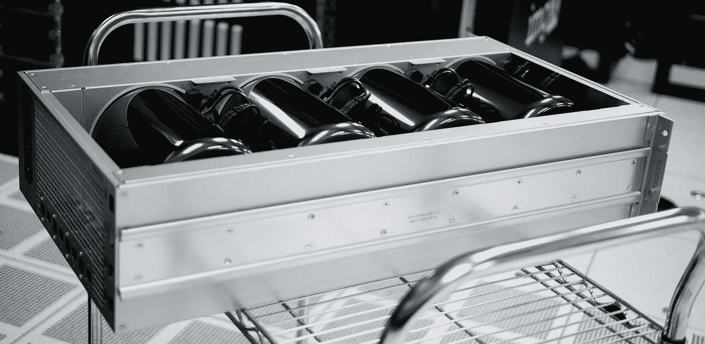
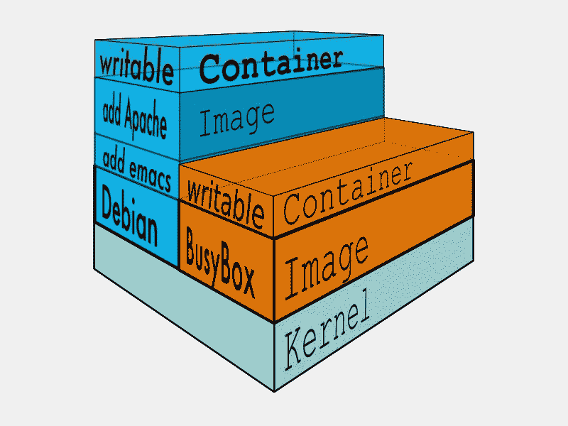
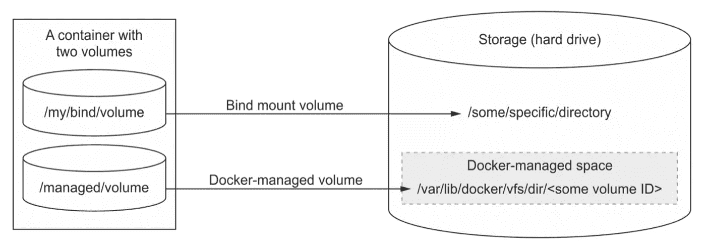
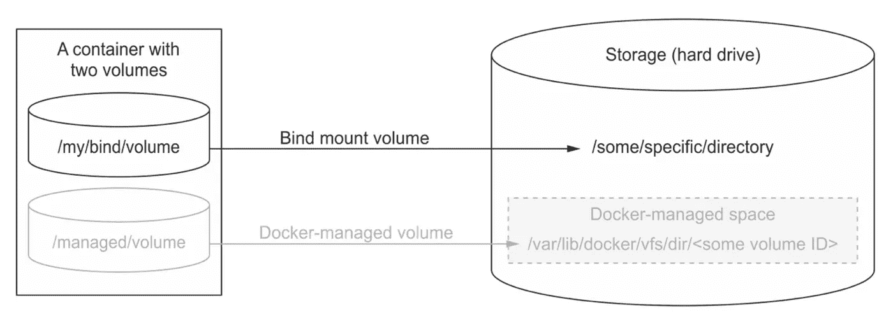
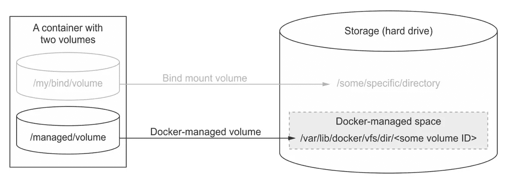

# 使用 Docker 的卷和 MongoDB 的持久数据库

> 原文：<https://betterprogramming.pub/persistent-databases-using-dockers-volumes-and-mongodb-9ac284c25b39>

## 使用 Docker Compose 版本 3



[imgix](https://unsplash.com/@imgix?utm_source=unsplash&utm_medium=referral&utm_content=creditCopyText) 在 [Unsplash](https://unsplash.com/s/photos/storage?utm_source=unsplash&utm_medium=referral&utm_content=creditCopyText) 上的照片

这将帮助你理解 Docker 中的`Volumes`，并解释如何使用它们来存储数据。这是第三版 Docker Compose 的最新指南。

在我之前关于 Dockerizing Express、Mongo 和 React 的文章中，我使用了一个非持久的容器，在这篇文章中，我将解释如何正确地存储你的数据以及它是如何工作的。

# 码头工人

我们先来解释一下 Docker 是如何存储数据的。不管您是使用单个容器和 Docker CLI，还是使用多个容器和 docker-compose，想法都是一样的。

当我们运行 Docker 时，它获取一个图像，这是只读的，并在顶部添加一个额外的层，这是读写的，这是临时存储。



可写层下的基础图像层

当容器修改文件或添加数据时，它使用一个可写层来完成。问题是当容器被删除时，层也被删除。当我们重新启动 Docker 时，我们保存的所有数据都不见了。

这种技术称为[写入时复制](https://docs.docker.com/glossary/#copy-on-write)，通常它会加快启动时间和整体性能，并最大限度地减少映像的占用空间。

为了能够持久存储数据，Docker 提出了卷的概念。

# 卷

卷基本上是容器之外的数据存储，存在于主机文件系统中。有两种类型的卷，Docker 管理的卷和绑定装载卷。



Nickoloff，J. (2016) Docker 在行动

如上图所示，您可以看到容器是独立于卷的实体，存储在主机的硬盘上。它们所在的路径取决于卷的类型。

## 绑定装载卷

顾名思义，这些卷指向主机文件系统上用户指定的位置。



Nickoloff，J. (2016) Docker 在行动

要在 Mongo 中使用它们，我们必须指定一个到主机驱动器上所选位置的路径，它必须是一个绝对路径。在我们的例子中，这将是`~/mongo/data`。

接下来，我们将这个位置绑定到 Mongo 在一个容器中的数据位置，这个容器就是`/data/db`。使用 Docker CLI 定义卷是通过使用`-v`或`--volume`标志完成的。

```
docker run -d --name db \
  -v ~/mongo/data:/data/db \ 
  -p 27017:27017 \
  mongo:latest
```

您可以对`docker-compose`文件做同样的事情，语法非常相似。

**优点**

*   如果您需要将几个容器指向一个存储，这非常有用。
*   如果您删除带有`-v`标志的容器，该卷仍然存在。
*   您知道数据在主机文件系统中的确切位置。

**缺点**

*   很难移除，你必须手动移除。
*   将容器绑定到一个特定的主机。
*   由于许多 confiners 使用同一个卷，很容易覆盖数据。
*   在具有许多容器和卷的大型系统中管理起来很复杂。

## Docker 管理的卷

托管卷由 Docker 守护程序自动创建。用户不能选择位置，因为它们是在 Docker 拥有的主机文件系统部分中创建的。

Docker 用卷自己的 id 创建一个目录。所有被管理的卷都存储在同一个 Docker 目录中。



Nickoloff，J. (2016) Docker 在行动

使用起来相当容易，对于 Mongo 来说，只需要在容器`/data/db`中提供 Mongo 的数据位置。

```
docker run -d --name db \
  -v /data/db \ 
  -p 27017:27017 \
  mongo:latest
```

对于`docker-compose`文件也是如此。

**优点**

*   拆卸容器时便于拆卸，`docker rm <name> -v`。
*   绑定到单个容器。
*   独立于宿主。
*   在具有许多容器和卷的大型系统中更易于管理。

**缺点**

*   当您在删除容器时忘记使用`-v`时，很难删除。
*   与许多容器共享一个卷更加困难。

# 共享 Docker 管理的卷

为了在容器之间共享 Docker 管理的卷，我们将使用*卷容器模式*。


Nickoloff，J. (2016) Docker 在行动

使用这种模式，我们创建两个容器并将它们链接到一个卷。首先，我们创建一个*卷容器*作为 Docker 管理的卷，我们用前缀`vc_`调用这个映像。在我们的例子中，这将是`vc_db`。

下一步是使用顶级的 [volumes](https://docs.docker.com/compose/compose-file/#volumes) 键创建一个命名卷。

Docker Compose 版本 3 中提供了此功能。旧版本使用了`--volumes-from`标志。

我们的`docker-compose`文件应该是这样的:

有些人可能会注意到没有用于`vc_db`容器的端口。不需要它们，因为我们不会连接到它。它只是用来保持与共享卷的连接。

现在，我们必须将两个映像链接到我们创建的命名卷。语法与绑定模块非常相似，但是我们只提供卷的名称，而不是卷的绝对路径。在我们的例子中，是`shared_database`。

我们仍然使用 MongoDB 的数据位置`/data/db`，就像在*容器*中一样。

```
volumes: shared_database:/data/db
```

让我们更新我们的`docker-compose`文件，并将绑定添加到指定的卷。

这种模式背后的思想是:

1.  能够轻松地与其他容器共享一个卷，只需绑定指定的卷。
2.  无论何时出于某种原因删除主数据库映像，即使使用了`-v`标志，卷仍然存在。只要卷连接到至少一个容器，就不能删除卷。
3.  因为我们使用 Docker 管理的卷，所以我们得到了上面提到的所有好处。

感谢你花时间阅读它。我希望这能帮助你更好地理解 Docker 的卷，并鼓励你使用这一基本功能。