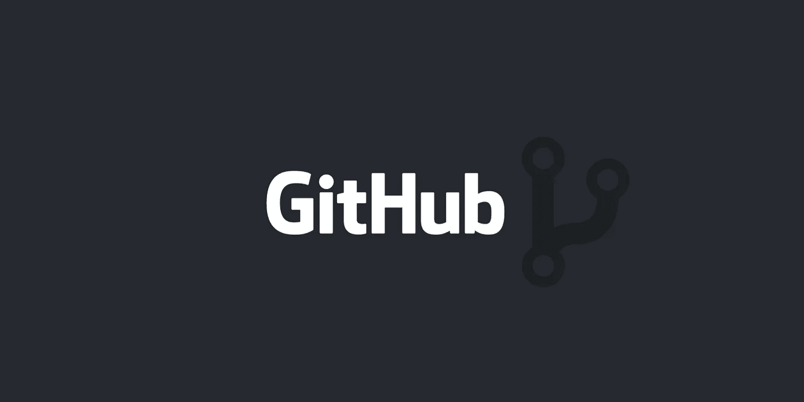

# 作为开发者的个人品牌:你的 Github 档案比你想象的更重要

> 原文：<https://betterprogramming.pub/personal-branding-as-a-developer-why-your-github-profile-matters-more-than-you-think-c4367c0f4db1>

## 如何建立你的 GitHub 档案，让你脱颖而出



来源 Github.com

***免责声明:*** *这是一篇高度自以为是的作品，以我和其他人的个人经验为依据，寻找程序员人才。*

我在 12 个月的时间里进行了数百次采访。5 年来，我浏览并评估了数百份潜在候选人的简历，同时积极领导一个前端和后端开发团队。

*所以，我认为公平地说，我已经看到了相当多的人才收购行动。这可能使我有资格陈述一些我将要介绍的关于为什么你的 GitHub 档案很重要的经历。*

正如许多千禧一代和 Z 世代逐渐明白的那样，找工作并不是最容易完成的壮举。我们可能会觉得自己只是老一辈象棋游戏中的一枚棋子，但我们必须了解的是，这其实是关于你如何通过营销自己来玩游戏。

作为程序员，我们为什么要做这些事情？因为我们是建设者和创造者。

> 我们做我们所做的是因为我们想改变世界。
> 
> 我们做我们所做的，因为我们是无私的。
> 
> 我们做什么都是为了个人利益。
> 
> 我们做我们所做的是因为我们热爱这门手艺。

作为一名程序员，为了实现你的任何目标，我们需要想办法让需要我们服务的人看到我们。毫无疑问，谋生是不自然的——现在有新冠肺炎在我们身后潜伏，这就更难了。

为了给自己制定一个战略计划，开始学习是非常必要的。掌控自己的命运将最终帮助你在未知的领域导航，当你提升技能和展示你作为软件开发人员的天赋时，你将会面对这些未知的领域。

设计师和艺术家使用作品集来展示过去的作品和他们的创意来推销自己。类似地，像 topcoder.com 这样的地方，有星级的自由网站简介，GitHub 简介都是程序员的作品集。它们是一个展示我们所擅长的东西的机会。

在 Github 上拥有个人资料，并不能保证你得到梦想中的工作，但它至少为获得更多机会铺平了道路。改变招聘者想法的额外动机是一个机会。

# 做自己的品牌意味着什么？

*不积极努力做自己的品牌。让它成为你自然而然产生共鸣的东西。让它成为一种习惯。*

我完全相信这是真的——如果我没有尽可能好地宣传我的品牌，我就不会有今天。每天我们都有机会展示我们能做什么和我们有什么能力。能够很好地展示这些东西可以确保机会之门为我们敞开。

# 从人群中脱颖而出

GitHub 不仅仅是一个源代码库。它不仅仅是各部分的总和。你有没有想过 Git 是一个像脸书或 Twitter 一样的社交网络？特征是相似的——你建立一个档案，上传项目以共享，并通过“关注”其他用户的帐户与他们联系。

可以共享的内容不一定是代码——没有什么可以阻止您在项目文件夹中保存 pdf、word 或文本文档或任何其他文件类型。

许多机构大约有 10-20%的时间在创新。其余的工作通常是单调的，这需要一些基本的编程知识来处理繁琐而又必要的任务。最好的公司也雇佣了大量不太熟练的开发人员来处理普通单调的活动。20/80 法则是适用的——尽管我们可能不愿意承认这一点，因为这是一颗难以下咽的药丸！

找到脱颖而出的方法至关重要。Github 为招聘人员提供了各种见解:

*   你的表现。
*   你是如何分支的。
*   你如何提交你的拉取请求。
*   你如何提问或者？回答 GitHub 问题部分的问题。他的，在我看来，是一些最困难的问题被解决的地方(还有 Stackoverflow)。

拥有一个 Git 概要文件是有帮助的，因为我们至少可以在一定程度上衡量你是否遵循了最佳实践或编码原则。是的，我们有些招聘经理会用谷歌搜索你，检查你是否为开源项目做出了贡献，或者是否积极参与了 StackOverflow 等网站的在线讨论。

技术招聘人员倾向于从你的社交媒体档案中搜寻关于你的信息——你的 GitHub 档案也不例外。

让我们来看看如何为求职准备你的 GitHub。

# 整理您的 Github 档案

拥有一份完整的个人资料会给招聘人员留下你有自我组织能力的印象。你可能会说简历或 LinkedIn 简介就足够了，但它们并没有清晰地展现你的能力——证据就在代码中。

有一个目标或愿景是很重要的，在优化你的 Github 简介时，根据你希望接触的目标受众优化和定制你的简介也是很重要的。

*   你可能是一名开发人员，正在一家公司求职。
*   你可能是一名自由职业者，正在寻找你的下一份合同。
*   你可能是一个开源贡献者，希望加入一个开源项目。

一旦你决定了谁是你的目标受众，是时候开始决定如何展示自己了。

让我们浏览一下你在 Github 个人资料中需要的最基本的内容。

## 一张干净的照片说明了很多

添加你的照片，随后是简短的简历，以及展示你所做工作的任何其他相关网站的链接。

如果你在找工作，你必须看起来很整洁；看起来不被接受没用。招聘过程仍然是一个人的过程，第一印象有很长的路要走。尽量避免那些你通常不会发给雇主的照片。

你要确保的一件事是，你在 GitHub 个人资料上看起来很放松，避免过于正式的照片，但保持专业。当有疑问时，以半休闲为目标。

## @提及

使用@ reference 链接到您希望招聘人员注意到的其他 Git 存储库。这可能是您的公司、小组或您参与或管理的其他存储库。

## 链接到你的其他相关专业简介

包括你网站的网址——如果你有的话，而且看起来还不错。例如，如果你在 StackOverflow 或 CodePen 上很活跃，添加这些网站的链接来展示你的热情以及你在帮助其他软件开发人员方面有多投入。

你需要意识到的一件事是，谷歌是一个伟大的链接生成器。在多个社交媒体网站上重复使用同一个用户名会让招聘者很容易找到你。我们最不需要的就是让他们发现你的副业与你目前在 Upwork 上的工作直接竞争，或者你在 Instagram 上有不合适的图片。你关起门来或者在你的社交圈子里做什么是你的特权——但是你也需要认识到，不是每个人都会对此有一个不加评判的心态，尤其是一些可能有严厉政策的公司。

## 精心挑选要展示的固定存储库

如果你碰巧在找工作，出现在你的个人资料顶部的固定存储库应该展示你想向招聘人员突出显示的存储库，这些存储库应该是相关的，并显示已经完成的工作。

## 选择并锁定您希望招聘人员查看的前三个存储库。

*不要钉教程。原因如下。*

技术招聘人员并不盲目。我们中的一些人确实会花时间仔细查看你的 GitHub 简介和简历，不管网上一些非常固执己见的文章会说些什么。如果你的回购来自一个教程，像我这样的招聘人员很可能已经看过几次了。复制粘贴过于简单的项目，这些项目都是关于 CRUD 的，都来自你刚刚填补空白的教程，并不能说明你的能力。不管出于什么原因，如果你有很多复制粘贴的代码，你最好不要固定它们，而是把它们调用出来。

如果你要固定技术演示，一定要先固定那些相关技术的演示，然后再固定那些技术过时的大型项目。

如果你正在寻找一份 SPA 开发人员的工作，那么把相关的技术，例如 Angular，Vue JS 技术演示放在你五年前从事的遗留 JSP + jQuery 项目之上。

如果你像大多数程序员一样，你可能在任何方面都没有运行一个成功的开源项目。大多数日常代码都是高度专有的，但是这不应该成为展示一个或多个令人印象深刻的项目的障碍。

如果您属于这一类，请在您选择的框架中关注一些有趣的小演示。

如果你碰巧没有主意了，试着想想你解决的一个问题，这将是一个有趣的演示。也许你可以快速重写一些部分。或者更好的是，请求你的雇主授权出版不侵犯所有权和版权的作品。

## 移除零贡献分叉

作为开发人员，我们要做的一件关键事情是派生公共存储库，然后向原始回购发送拉请求。

这种方法的结果是，开发人员拥有包含数百个分叉库的概要文件，而没有任何贡献。这会让你看起来前后不一致，到处都是。只有当你的贡献最终出现在根存储库中时，才分叉一个存储库。

## 清理您标有星号的存储库

这大概会磨很多人的齿轮。标有星号的库向招聘人员和访问者表明了你的兴趣，所以它们应该反映你的技能。你所做的事情会影响人们对你的看法。

## 不要做一个追求卓越的初级开发人员

对于这一次，听我说完。寻找高级职位的人应该关注包含更复杂项目的库，避免太多初学者教程库——当然，除非你有理由做出贡献。如果你申请的是初级入门职位，或者你已经表明你目前正在学习某项新技术，那么在这两个知识库中打星号“是有意义的”

## 整理你的展示库

一旦您选择了一些要展示的存储库，请确保它们可以公开访问，并且没有被密码锁定。

所有项目都应该有一个自述文件。我想我们都明白自述文件的目的。至少，给你的项目添加一个描述。这听起来可能是显而易见的，但它值得重申，因为对一些人来说，显而易见的事情并不总是那么明显。

以下是您的自述文件中应包含的最低内容:

*   描述:让只有一分钟时间的人容易理解的描述。把复杂的事情变难很容易，把复杂的事情变容易很难。
*   **结果如何？**说明代码应该产生什么
*   **栈是什么？**列出使项目工作的所有核心相关框架和库。这给了那些可能不熟悉每一个框架的技术招聘人员一瞥什么是重要的。
*   项目的愿景是什么？清楚地说明这个项目的发展方向。
*   **项目处于哪个阶段？指出你在项目的哪个阶段。例如，它已经完成还是正在进行中？如果工作正在进行中，清楚地说明什么已经完成，什么还没有完成，什么还没有完成。我喜欢放一个免责声明，以防人们想要使用在生产环境中完成的工作。如果被强调了，有一些不起作用的东西是很好的。**

## 告诉我们看什么

如果你计划展示一个大型项目，可能会有很多乏味的样板文件或“管道工程”。不要犹豫，指出酷的部分在哪里。

如果你的项目被分叉了，而你正在积极地为之做出贡献，那么就要非常清楚地表明你正在做什么，已经完成了什么。

## 告诉我们如何运行它

你应该有一个如何运行它的清晰的解释。

尽一切努力确保运行项目的演示版本是一个单行活动。诸如`npm run`、`graddle serve`、`docker run`之类的活动，或者你的框架所使用的任何东西。

在今天这个时代，没有什么理由要有一长串的手动依赖和预设置来运行任何东西。

这是你应该争取的:

```
# serve with hot reload at localhost:8080
npm run dev# build for production with minification
npm run build
```

## 单元测试是展示你了解你的东西的关键

现在是 2020 年——你可能已经听过很多次了——单元测试是程序员需要养成的关键习惯之一。如果你要把任何有意义的东西放在那里，而这个项目没有单元测试，那么你可能不应该引用它——这会对你不利。没有借口。

我们都知道，对于大多数开发人员来说，编写单元测试用例是一种很难养成的习惯。编写单元测试用例说明了很多关于你的事情——像我这样的招聘人员肯定希望看到这种展示，以及如何执行测试用例的清晰说明。

## 一个演示胜过千言万语

就像谚语“一张图片胜过千言万语”一样，拥有一个现场演示的链接也是如此。例如，关于你的项目词如何给人一种专业感。

# 其他 Git 风格的存储库呢？

你可以利用一些替代方案，比如 GitLab 和 bit bucket——它们都有自己独特的卖点。由于其采用和网络效应，当涉及到社会证明时，Github 仍然是一个更好的替代方案。GitHub 上还有更多公开托管的高价值开源项目，这些项目在谷歌搜索中排名相当高。

以下是 Github 2018 年排名靠前的 Git 仓库列表:

*   Microsoft/vscode
*   facebook/react-native
*   张量流/张量流
*   角度/角度气候
*   微软文档/azure-docs
*   角度/角度
*   ansible/ansible
*   库伯内特/库伯内特
*   npm/npm
*   确定类型/确定类型

# 最后的想法

我们已经看到了你可以做些什么来提升自己的地位和获得理想工作的可能性。这不仅仅是创建一个漂亮的 Github 帐户，而是告诉你很多关于你的思维过程。

我们应该永远记住，面试过程不仅仅是关于你创造了多少项目或者你知道多少种语言，它也是关于人际交往技巧和文化契合度。

你没有 GitHub 简介并不代表你不是一个好的开发者。我们中的许多人都有多年的商业专有项目，这些项目与 NDA 的项目密不可分，我们希望能够展示这些项目，但却不能——这并不意味着我们不能花些时间做点兼职。

在另一个频谱上有一个 Github 配置文件可能会给你一个优势。有优势总比没有好。有一个好的并不意味着你知道你的东西，你仍然可能在嘶嘶作响的问题上失败，但是有一个也意味着——下一扇门可能在等着你。

雇主明白在工作和个人爱好项目之间保持平衡很难。那些拥有最新的 GitHub 简介和 cam 演示有意义的开源项目的人确实表明他们愿意投入时间——付出额外的努力来帮助开源社区，或者通过他们的贡献为社会提供更广泛的价值。

增强你的 Github 帐户只是你作为一个程序员可以保留的自我品牌的工具之一，以给你额外的优势。

我希望你喜欢这篇文章。请在下面分享你的想法。

编码快乐！

[](https://github.blog/2019-09-03-pins-to-win-stunning-student-profiles/) [## 赢的别针:惊人的学生简介

### 6 月，我们宣布了通过 GitHub 学生开发包赢得学生竞赛的 pin。我们挑战…

github.blog](https://github.blog/2019-09-03-pins-to-win-stunning-student-profiles/)