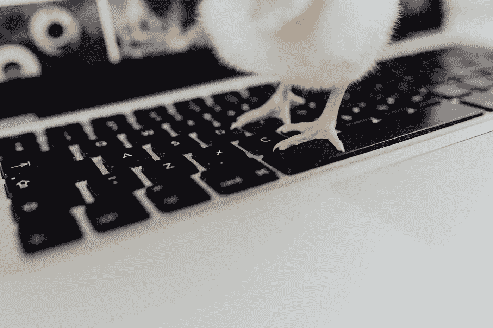
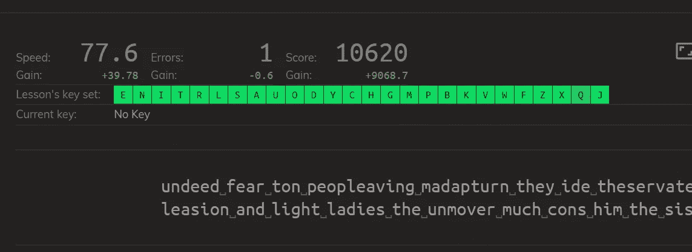

# 触摸打字如何提高我的工作效率

> 原文：<https://betterprogramming.pub/perspectives-on-productivity-why-did-i-go-hunting-and-pecking-after-4-years-of-touch-typing-677669125545>

## 我在 4 年的触摸打字后的经验是寻找和啄击。

在 [Kaboompics](https://kaboompics.com/) 上由 [KAROLINA GRABOWSKA](https://kaboompics.com/photographer/karolina) 拍照。

回到 2016 年，我做出了学习触摸打字的决定。我觉得这是提高我作为程序员的生产力的必要步骤。

打字更少意味着有更多时间做重要的工作:解决问题。这也意味着我可以将全部注意力集中在显示器上，而不是看着键盘分散注意力。

对按键的肌肉记忆使我的非正式打字风格变得易于掌握，但仍有改进的空间。

所以我每天花 15 分钟在 keybr 上练习。这是一个缓慢的过程，我花了大约一个月的时间达到平均 35wpm。

我的[练习课](https://www.keybr.com/profile/32lhiez)的频率截图。

我的大脑最终形成了一个所有按键的心理地图，我可以越来越快、越来越准确地打字了。

# 动机

所以现在，四年后，当我的平均每分钟工作时间徘徊在 60 分钟左右时，我开始好奇我从传统的狩猎-啄法中脱离出来，对我的生产力产生了多大的影响。

下面写的所有观点都是我在撰写这篇文章的过程中观察到的。

*快速声明:所有观点都是我个人的主观经验，可能不适用于所有人。也有可能我不是一个真正的猎人和啄木鸟的好代表。我可能需要花更多的时间来习惯这种打字风格。*

# 1.我发现用两个手指打字很困难

连续多年触摸打字后，我的手拒绝适应。我的手指会无意识地回到自己的位置上。因此，用我的两个手指打字需要持续的关注。

# 2.我不得不在看屏幕和键盘之间切换

屏幕和键盘之间有一个来回切换的上下文。这是头痛诱导，使我反胃和疲劳。

我想在打字的时候情况会变得更糟，因为你现在必须在屏幕、键盘和被复制的文本来源之间切换注意力。

我试图通过花更多的时间在键盘上来减少这种上下文切换，但它对打字不起作用，这引出了我的另一个观点。

# 3.我犯了更多的错误，花了更多的时间去改正它们

因为我花了很多时间寻找键盘上的键，所以我不会意识到我之前犯的几个单词甚至几行的错误。这意味着要花额外的时间将光标定位在错误上——这很让人头疼。

# 4.我犯了更多的拼写错误

我遇到的另一个问题是…拼写。我在拼写上犯了更多的错误。即使完全意识到每一次击键，我的大脑似乎在触摸打字时拼写常见单词有困难。

# (几乎)伟大的均衡器:代码编辑器

典型的代码编辑器包括代码完成、自动括号配对和语法突出显示等功能。这些有助于缩小差距，尽管只是微小的差距。

# 结论

我看到很多借口将性能瓶颈从打字转移到决策上。是的，你可能不会比打字更快地做出决定，但触摸打字为其他任务释放了精神负荷——它变得无意识(只是思考和单词出现在屏幕上)。

所以我认为触摸打字的主要优势不是速度，而是认知自动性。

看都不看就打字的好处似乎甚至转移到了操作手机键盘上。

一句话:大多数猎人和啄木鸟将[永远不会像普通触摸打字员那样高效地打字，他们下意识地使用所有十个数字。](https://europepmc.org/article/med/27748613)

利用脑机接口以目前无法实现的速度打字，这可能会成为[的可行之举](https://thenextweb.com/artificial-intelligence/2019/07/17/elon-musks-neuralink-wants-you-to-type-on-your-iphone-using-your-brain/)。这是一条很长的路要走，但这很有可能会使触摸输入变得无关紧要。

目前，触摸打字仍然是提高工作效率的最佳方式之一。

# 讨论

脑机接口会让触摸输入变得无关紧要吗？

我很想听到你的回答。干杯，感谢阅读！