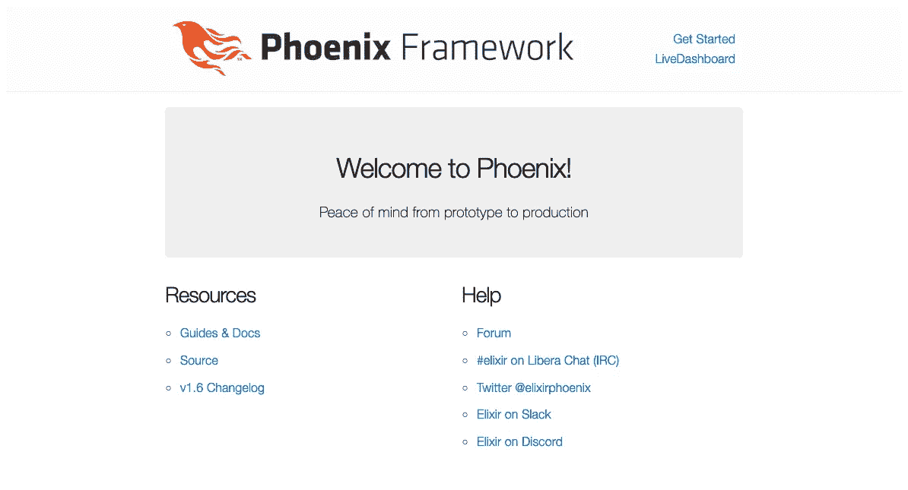
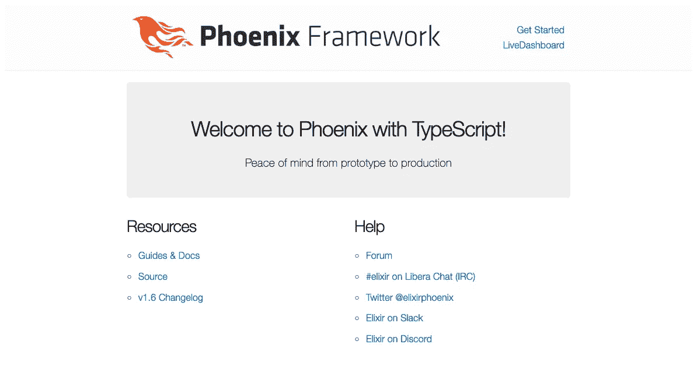
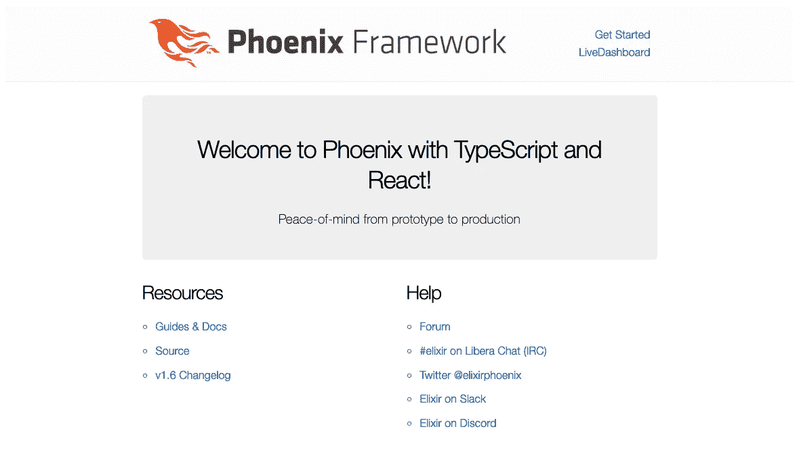

# Phoenix 1.6，带 TypeScript 和 React

> 原文：<https://betterprogramming.pub/phoenix-1-6-with-typescript-react-bea7f3a792d5>

## 仙丹、凤凰、打字稿和反应——2022 年版


照片由[卢克·南](https://unsplash.com/@lukesouthern?utm_source=medium&utm_medium=referral)在 [Unsplash](https://unsplash.com?utm_source=medium&utm_medium=referral) 拍摄

> *这是我之前的* [*文章*](https://levelup.gitconnected.com/elixir-phoenix-typescript-and-react-2020-edition-32ceb753705) *关于构建现代 Web 应用堆栈的 2022 年更新。*
> 
> Github 上也有代码:[aisrael/elixir-phoenix-typescript-react](https://github.com/aisrael/elixir-phoenix-typescript-react)。

凤凰 1.6 的发布带来了一些显著的改进，比如 HEEx 模板化。然而，对我来说，改善开发者体验的最显著的事情是放弃`webpack`而支持 [esbuild](https://github.com/evanw/esbuild) 。

`esbuild`不仅承诺更快的构建时间，它支持开箱即用的打字稿*，而且添加 React 也容易得多！*

*整个过程已经变得如此简化，以至于在本文中我们可以跳过它的前身的整个部分。*

*现在，让我们继续使用 Elixir 和 Phoenix 1.6 以及 TypeScript 和 React 创建一个新项目。*

# ***先决条件***

*本指南要求您在撰写本文时具备以下指定版本:*

*   *[二郎](https://www.erlang.org/) (24.2+)*
*   *[仙丹](https://elixir-lang.org/) (1.13+)*
*   *[npm](https://www.npmjs.com/) (7.6.0+)*
*   *[git](https://git-scm.com/)*
*   *[Docker](https://www.docker.com/) 与 Docker 构成*

*在 macOS 上，最简单的入门方法是安装[家酿](https://brew.sh/)，然后用家酿安装 Node、Git、Docker、 [asdf](https://github.com/asdf-vm/asdf) 。*

```
*$ brew install node git homebrew/cask/docker asdf*
```

*然后我们可以使用`asdf`来安装 Erlang 和 Elixir:*

```
*$ asdf plugin add erlang
$ asdf install erlang 24.2
$ asdf global erlang 24.2$ asdf plugin add elixir
$ asdf install elixir 1.13.1
$ asdf global elixir 1.13.1*
```

## *凤凰*

> *对于那些已经熟悉 Elixir 和 Phoenix 的人来说，您可能希望直接跳到集成 TypeScript 并使用 Phoenix 1.6。*

*如果您还没有这样做，让我们按照 [Phoenix 安装说明](https://hexdocs.pm/phoenix/installation.html#content)安装 Phoenix。*

*首先，我们需要获得十六进制软件包管理器:*

```
*$ mix local.hex
Are you sure you want to install "https://repo.hex.pm/installs/1.13.1/hex-1.0.1.ez"? [Yn]*
```

*然后安装 Phoenix 应用程序生成器:*

```
*$ mix archive.install hex phx_new
Resolving Hex dependencies...
Dependency resolution completed:
New:
phx_new 1.6.5
* Getting phx_new (Hex package)
All dependencies are up to date
Compiling 11 files (.ex)
Generated phx_new app
Generated archive "phx_new-1.6.5.ez" with MIX_ENV=prod
Are you sure you want to install "phx_new-1.6.5.ez"? [Yn]*
```

*您可以使用`mix phx.new --version`检查 Phoenix 安装是否顺利:*

```
*$ mix phx.new --version
Phoenix installer v1.6.5*
```

# *生成 Phoenix 应用*

```
*$ mix phx.new hello --umbrella*
```

*这将在当前目录下生成一个名为`hello_umbrella`的[凤凰伞项目](https://elixir-lang.org/getting-started/mix-otp/dependencies-and-umbrella-projects.html)，目录结构如下:*

```
*.
├── apps
│   ├── hello
│   └── hello_web
└── config*
```

*这两个 Elixir 应用是`/apps/hello`(领域模型)和`/apps/hello_web`(网络应用)。*

*每个应用都有自己的依赖配置，尽管整个保护伞项目将为所有应用提供一个共享的依赖库(在`/deps`)。*

*所有子应用程序也将在`/config`文件夹中共享相同的根配置。*

*我们从伞状项目开始，因为随着应用程序的规模和复杂性的增长，它有助于组织代码。我还发现，将一个伞状项目重构为一个单独的应用程序项目比反过来更容易。*

*如果你认为你只需要一个单独的应用程序项目，只需使用`mix phx.new hello`(没有`--umbrella`选项)。*

## *PostgreSQL、MySQL 或无*

*默认情况下，Phoenix 的数据库使用 Postgres。*

*如果您想使用 MySQL 而不是 Postgres，那么您需要使用*

```
*mix phx.new hello_react --umbrella --database mysql*
```

*如果你不需要一个数据库，或者只希望在没有数据库的情况下使用，那么使用*

```
*mix phx.new hello_react --umbrella --no-ecto*
```

*然而，本指南的其余部分假设缺省值为 Postgres。*

## ***Git***

*此时，我们应该开始使用 Git 来跟踪我们的更改。如果您不需要使用 Git，请随意跳到下一节。*

```
*$ cd hello_umbrella~/hello_umbrella$ git init
Initialized empty Git repository in /Users/aisrael/hello_umbrella/.git/~/hello_umbrella$ git add -A
~/hello_umbrella$ git commit -m "mix phx.new hello --umbrella"*
```

## *Docker 撰写*

*我们需要一个 PostgreSQL 服务器来运行我们的 Phoenix 应用程序。对于本地开发和测试目的，我发现使用 Docker，或者更确切地说， [Docker Compose](https://docs.docker.com/compose/) 使得处理服务依赖变得轻而易举。*

*在项目根目录下创建下面的`docker-compose.yml`文件:*

```
*version: "3"
services:
  postgres:
    image: postgres:14.1
    ports:
      - 5432:5432
    environment:
      POSTGRES_USER: postgres
      POSTGRES_PASSWORD: postgres
      POSTGRES_DB: hello_dev*
```

*注意，我们配置 PostgreSQL(使用`POSTRES_*`环境变量)来处理生成的 Phoenix 应用程序默认值。*

*然后，要在后台运行 Postgres，您只需要:*

```
*$ docker compose up -d
[+] Running 2/2
⠿ Network hello_umbrella_default             Created
⠿ Container hello_umbrella_postgres_1        Started*
```

*对于其他 Docker 编写命令，请访问[https://docs.docker.com/compose/reference/](https://docs.docker.com/compose/reference/)*

*如果您不能或不想使用 Docker & Docker Compose，您将不得不在本地工作站上手动安装 PostgreSQL。确保使用由`mix phx.new`生成的相同默认值对其进行配置，或者使用适当的配置修改各自的`config.exs`文件。*

# *欢迎来到凤凰城！*

*此时，我们应该能够运行我们的 Phoenix 应用程序了。从项目根目录(您可能希望在新的终端窗口或标签中运行它)，只需:*

```
 *~/hello_umbrella$ mix phx.server*
```

*(如果你得到一个提示，问你是否要安装`rebar3`，就说是。)*

*现在如果我们访问 [http://localhost:4000](http://localhost:4000) 我们应该能够看到熟悉的“欢迎来到凤凰城！”页面:*

**

*欢迎来到凤凰城！*

# *Phoenix 1.6 中的 TypeScript*

*凤凰 1.6 最好的一点是它抛弃了`webpack`而选择了`esbuild`。*

*这不仅保证了更短的构建时间，`esbuild`支持开箱即用的 TypeScript *！* —不需要更多的工具或配置！*

## *欢迎来到凤凰城*

*为了实际演示 TypeScript，让我们创建一个新的 TypeScript 模块`apps/hello_web/assets/js/greeter.ts`:*

```
*function greet(name: string): string {
  return "Welcome to " + name + " with TypeScript!";
}export default greet;*
```

*然后，在`apps/hello_web/assets/js/app.js`中，向末尾添加以下几行:*

```
*import greet from "./greeter";document.querySelector("section.phx-hero h1").innerHTML = greet("Phoenix");*
```

*刷新 localhost:4000 上的页面，您应该会看到“欢迎来到 Phoenix with TypeScript！”：*

**

*欢迎来到凤凰城！*

*就是这样！无需`npm`或摆弄`tsconfig.json`和`webpack.config.js`！*

# *反应*

*现在，我们可以将 React 添加到组合中。为此，我们现在需要`npm`来获取并安装必要的包。*

*首先，确保我们在`apps/hello_web/assets`目录中:*

```
*~/hello_umbrella$ cd apps/hello_web/assets*
```

*从那里，我们将发出:*

```
*npm install --save react react-dom
npm install --save-dev [@types/react](http://twitter.com/types/react) [@types/react-dom](http://twitter.com/types/react-dom)*
```

## *我们的第一个组件*

*让我们将`greeter.ts`重命名为`greeter.tsx`(类似于将常规的`.js`文件重命名为`.jsx`)。*

*然后，用`Greeter`反应组件替换`greeter.tsx`的内容:*

```
*import React from "react";interface GreeterProps {
    name: string;
}const Greeter: React.FC<GreeterProps> = (props: GreeterProps) => {
    const name = props.name;
    return (
        <section className="phx-hero">
          <h1>Welcome to {name} with TypeScript and React!</h1>
          <p>Peace-of-mind from prototype to production</p>
        </section>
    );
};export default Greeter;*
```

## *欢迎来到 Phoenix 与 TypeScript 和 React*

*接下来，编辑文件`apps/hello_web/lib/hello_web/templates/page/index.html.heex`并替换整个部分:*

```
*<section class="phx-hero">
  <h1><%= gettext "Welcome to %{name}!", name: "Phoenix" %></h1>
  <p>Peace of mind from prototype to production</p>
</section>*
```

*只需*

```
*<div id="greeting"/>*
```

*现在，我们需要将`apps/hello_web/assets/js/app.js`重命名为`app.jsx`，并将之前添加的最后两行替换为:*

```
*import React from "react";
import ReactDOM from "react-dom";import Greeter from "./greeter";const greeting = document.getElementById("greeting");
ReactDOM.render(<Greeter name="Phoenix" />, greeting);*
```

*(我们需要将其从`.js`重命名为`.jsx`，以避免最后一行出现语法错误。)*

*最后，我们需要编辑`config/config.exs`来告诉 esbuild 寻找`app.jsx`而不是`app.js`。寻找从`# Configure esbuild`开始的部分，并替换该部分*

```
*~w(js/app.js --bundle --target=es2017 --outdir=../priv/static/assets --external:/fonts/* --external:/images/*),*
```

*随着*

```
*~w(js/app.jsx --bundle --target=es2017 --outdir=../priv/static/assets --external:/fonts/* --external:/images/*)*
```

*此时，我们可能需要重启我们的 Phoenix 服务器(按下`Ctrl+C`然后`(a)bort`)并使用`mix phx.server`再次重启它。*

*当我们重新加载 http://localhost:4000 时，应该会看到:*

**

*欢迎来到 Phoenix with TypeScript and React！*

*瞧吧！*

*我认为带有`esbuild`的 Phoenix 1.6 提供了我最近在建立一个最现代和最高效的 Web 应用程序栈时遇到的最好的开发者体验，我希望这篇文章已经让你相信这是多么容易，特别是与以前相比。*

*现在就去构建你的下一个独角兽网络应用吧！*