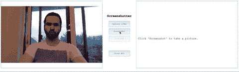
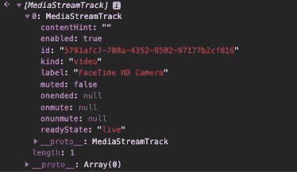
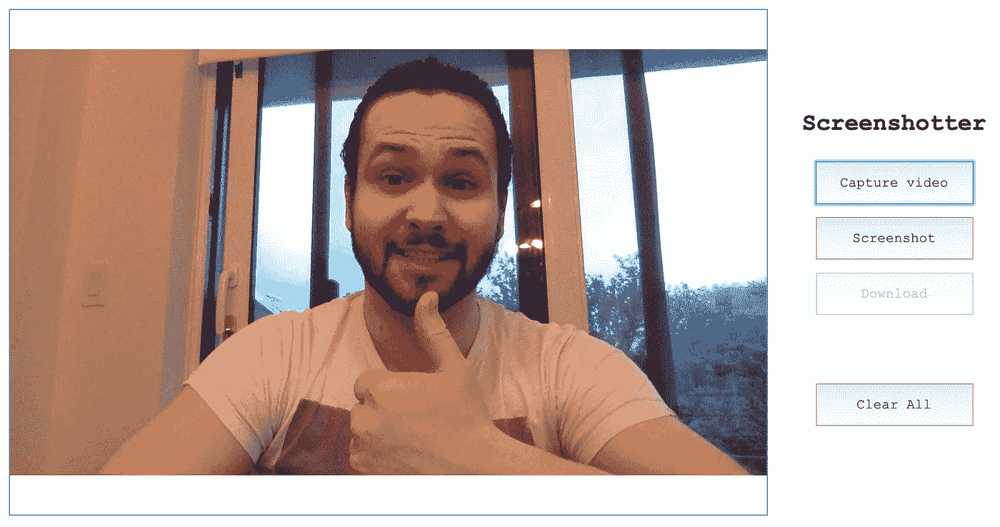
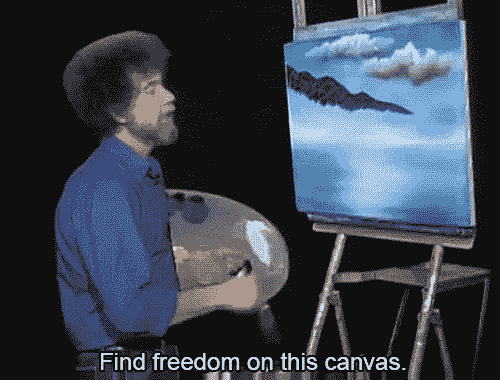
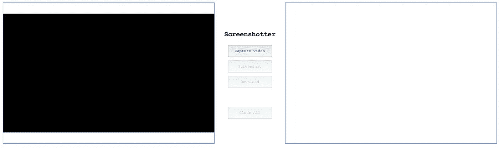
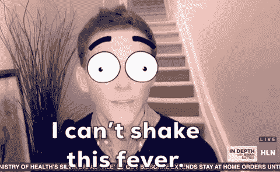

# 用 JavaScript 构建一个照片亭应用程序

> 原文：<https://betterprogramming.pub/photo-booth-app-with-javascript-847d20c97ebd>

## 让我们构建一个应用程序，使用你的计算机的摄像头来录制视频，添加背景，并让用户拍照


照片由 [Thibault Copleux](https://unsplash.com/@annecy?utm_source=unsplash&utm_medium=referral&utm_content=creditCopyText) 在 [Unsplash](https://unsplash.com/?utm_source=unsplash&utm_medium=referral&utm_content=creditCopyText) 上拍摄

我正在开发一个应用程序，它将访问设备的摄像头，记录视频流，添加背景，并允许用户截图和下载。背景操作仍在进行中，但截至目前，我已经能够实现视频流，截图和下载功能。

我给你*截图*:



震惊我的模特生涯还没开始。

左边是通过访问设备摄像头生成的视频流。右边是拍摄的截图。在初始化视频流之前，屏幕截图按钮是禁用的。一旦捕获到视频流，就可以截图了。一旦截图，就可以选择文件格式并下载。“清除”按钮会重新初始化所有内容，删除屏幕截图并结束当前视频流。

让我们深入研究一下，从 HTML 开始。

# 超文本标记语言

这个应用程序中有几个按钮。第一个是`capture`，它负责提示用户访问他们的网络摄像头，然后初始化视频流。`screenshot`执行获取视频截图的功能,(使用`canvas`)将绘制截图并将其作为数据 URL 添加到`img`标签的`src`。

`download`将捕获图像数据，创建锚标记，将`img.src`分配给锚的`href`，命名文件和扩展名，然后模拟触发下载的`click`事件。`clear`按钮触发重置 UI 并结束视频流的功能。

这将我们带到应用程序的下一部分:我们如何实际开始视频流？介绍`[MediaStream](https://developer.mozilla.org/en-US/docs/Web/API/MediaStream)`界面。

`MediaStream`界面代表媒体内容流，由分解成**轨道**的数据组成。这些轨道是代表流中的单个媒体轨道的`[MediaStreamTrack](https://developer.mozilla.org/en-US/docs/Web/API/MediaStreamTrack)`的实例。在我们的案例中，我们将使用视频轨道。下面是其中一个轨迹的样子。



这些轨道是我们将访问视频流中的数据的地方。我们可以通过使用`[navigator.mediaDevices.getUserMedia()](https://developer.mozilla.org/en-US/docs/Web/API/MediaDevices/getUserMedia)`来获取这些数据。下面是一个例子。

```
navigator.mediaDevices.getUserMedia({video: true})
  .then(stream => {console.log('we got the stream!')})
  .catch(err=>alert('Error occurred: ' + err));
```

该功能提示用户授权访问设备的摄像头。授权后，`getUserMedia`创建的`Promise`要么被解析(返回曲目)，要么被拒绝，由`catch`处理。你可以在这里阅读更多关于为什么`getUserMedia`可能会出错[的信息。](https://blog.addpipe.com/common-getusermedia-errors/)

在我们进入工作流程之前，这里是我们将在整个应用程序中初始化使用的变量。

`**img**`是我们的`img`标签，当用户点击`screenshot`按钮时，谁是将被分配视频帧的`src`。

`**video**`是我们的`video`标签，它将包含我们的视频流。

`**prompt1**`和`**prompt2**`是提示，告诉用户下一步是什么。如果用户还没有开始视频捕捉，`prompt1`会明显地告诉他们这样做。如果他们已经开始抓图，`prompt2`会提示他们抓图。

`**screenshot**` 是对视频流进行截图的按钮。

`**download**`是触发图像下载的按钮。

`**select**`是我们的`select`标签，包含我们的文件格式选项。这个和代表`select`标签的`**label**`将被隐藏，直到用户截屏。

`**clear**` 是重置 UI 和停止流的按钮。

`**enable**`将决定应用程序是否可在设备上使用。

`**canvas**`是我们将要创建并用来将视频流数据写入图像的`canvas`元素。

最后，`**format**`是用户为图像下载选择的文件格式。

我们可以通过首先检查用户是否拥有带有函数`hasGetUserMedia`的`getUserMedia`来初始化我们的应用程序。

```
const hasGetUserMedia = () => {
  if (!navigator.mediaDevices &&
!navigator.mediaDevices.getUserMedia){
    alert('Unable to enable camera.')
  } else {
    enable = true
  }
}
```

该功能将检查用户的设备是否有`mediaDevices`和`getUserMedia`。如果是，我们将`enable`设置为真。为真时，可以使用应用程序的其余功能，我们可以开始获取我们的 DOM 元素(将存储在上面提到的它们各自的变量中)，然后向它们添加我们的事件侦听器。第一个事件监听器是一个名为`onCapture.`的`onclick`函数

```
const onCapture = () => {
  navigator.mediaDevices.getUserMedia({video: true})
  .then(stream => {
    video.srcObject = stream
    prompt1.style.display = 'none';
    prompt2.style.display = 'block';
    screenshot.disabled = false;
    clear.disabled = false;
  })
  .catch(err=>alert('Error occurred: ' + err));
}
```

点击`capture`按钮，用户可以启动媒体流。这将执行`getUserMedia`功能，允许我们捕获用户的视频流。我们将视频流分配给`video`的`[srcObject](https://developer.mozilla.org/en-US/docs/Web/API/HTMLMediaElement/srcObject)`属性。`srcObject`对`video`的操作与`src`相似，除了它允许`video`元素使用`MediaStream`作为其来源，而不是静态视频文件。

此时，我们应该在应用程序的左侧看到网络摄像头的实时视频。



现在我们有了视频流，我们可以继续下一个功能，`onScreenshot`。

```
const onScreenshot = () => {
  canvas.width = video.videoWidth;
  canvas.height = video.videoHeight;
  canvas.getContext('2d').drawImage(video, 0, 0);
  prompt2.style.display = 'none'
  img.src = canvas.toDataURL('image/png');
  img.style.display = 'block'
  download.disabled = false
  select.style.visibility = 'visible'
  label.style.visibility = 'visible'
}
```

如果你还不熟悉的话，可以用一个`canvas`元素在网页上绘制图形。在我们的例子中，我们将绘制一幅图像。这是通过利用`drawImage`来完成的。我们可以通过访问`canvas`的二维绘图上下文来访问该功能。



这个 gif 我以前用过。我不感到羞耻。

我们通过`drawImage`三个论证。首先是我们的`video`元素。`drawImage`将从该实例的视频中捕获帧，并将其绘制到`canvas`元素上。接下来的两个参数是画布上的`x`和`y`坐标，我们将在那里放置我们的绘图。

我们对两者都使用`0`，因为我们希望图像占据整个画布。这样，它就尽可能接近视频的比例，因为我们将画布'`height`和`width`设置为等于`video`。然后我们使用另一个名为`[toDataURL](https://developer.mozilla.org/en-US/docs/Web/API/HTMLCanvasElement/toDataURL)`的`canvas`函数，它将返回一个数据 URL，允许我们内嵌一个图像文件。该函数的其余部分有条件地显示或隐藏 DOM 上的其他元素，以移动 UX。

此时，我们现在有了一个正在运行的视频流和一个绘制在我们的`canvas`上的截图。下一部分将允许用户下载生成的图像。这里有一个如何做到这一点的完美例子。

我们创建锚标记，给该标记的`href`分配我们的`img`的`src`标记的值，然后给它的`download`属性分配名称`yourScreenshot`以及选择的`format`。我们将 anchor 标签附加到 DOM 的主体，通过使用`click()`模拟用户点击它，然后在使用后从 DOM 中移除该元素。

```
const onDownload = () => {
  var download = document.createElement('a');
  download.href = img.src
  download.download = 'yourScreenshot' + format;
  download.style.display = 'none';
  document.body.appendChild(download);
  download.click();
  document.body.removeChild(download);
};
```

用户现在可以初始化视频流，截取视频流的截图，并以他们选择的格式下载截图。这将我们带到应用程序的最后一部分:允许用户结束视频流并重置 UI。

```
const clearAll = () => {
  video.srcObject.getVideoTracks().forEach(track => track.stop())
  document.getElementsByClassName('container')[0].removeChild(video);
  video = document.createElement("video")
  video.autoplay = true
  document.getElementsByClassName('container')[0].insertBefore(video, prompt1)
  if (img){
    img.style.display = 'none'
  }
  screenshot.disabled = true;
  download.disabled = true;
  select.style.visibility = 'hidden';
  label.style.display = 'none';
  format = null;
  prompt2.style.display = 'none';
  prompt1.style.display = 'block';
  clear.disabled = true;
}
```

这个功能的很多部分要么隐藏，要么根据应用程序的初始 UI 要求显示不同的元素，但有两个重要的部分。

```
video.srcObject.getVideoTracks().forEach(track => track.stop())
```

这一行非常重要，因为它结束了用户当前的媒体流。我们通过`video`的`srcObject`属性来访问函数`getVideoTracks()`。这个函数返回一个`MediaStreamTracks`数组，我们可以对其进行迭代，并`stop`其…轨道中的每个轨道。


不管怎样，米歇尔，你才 3 岁。

下一个重要的部分是删除`video`元素，创建一个新的元素，然后将它插入到 DOM 的原始位置。如果没有这个，视频将不会重置为它现在的初始化状态，它将在视频应该播放的地方呈现一个黑色方块。



恶心。

我们可以通过在应用程序的容器上使用`removeChild(video)`来移除`video`标签。然后我们可以使用`document.createElement`来创建一个新的`video`标签。我们将它的属性`autoplay`指定为 true，这样一旦视频流被拾取，视频将实时开始/显示。最后，我们使用`insertBefore`并将新的`video`标签作为第一个参数传递给它，将`prompt1`作为第二个参数传递给它(因为在 app 容器中，原来的`video`标签刚好在`prompt1`之前)。

未来的功能包括允许用户添加背景和过滤器。



感谢阅读！这款应用的源代码可以在 [GitHub repo](https://github.com/macro6461/simple-screenshot) 中找到。

[*在这里将你的免费中级会员升级为付费会员*](https://matt-croak.medium.com/membership) *每月只需 5 美元，你就可以拥有数千位作家的无限量无广告故事。这是一个附属链接，你的会员资格的一部分帮助我为我创造的内容获得奖励。谢谢大家！*

# 参考

[](https://developer.mozilla.org/en-US/docs/Web/API/MediaStream) [## 媒体流

### 媒体流接口表示媒体内容的流。一个流由几个轨道组成，如视频或…

developer.mozilla.org](https://developer.mozilla.org/en-US/docs/Web/API/MediaStream) [](https://developer.mozilla.org/en-US/docs/Web/API/MediaStreamTrack) [## MediaStreamTrack

### MediaStreamTrack 接口表示流中的单个媒体轨道；通常，这些是音频或视频…

developer.mozilla.org](https://developer.mozilla.org/en-US/docs/Web/API/MediaStreamTrack) [](https://developer.mozilla.org/en-US/docs/Web/API/MediaDevices/getUserMedia) [## MediaDevices.getUserMedia()

### 媒体设备。getUserMedia()方法提示用户允许使用媒体输入，这将产生一个…

developer.mozilla.org](https://developer.mozilla.org/en-US/docs/Web/API/MediaDevices/getUserMedia) [](https://blog.addpipe.com/common-getusermedia-errors/) [## 常见的 getUserMedia()错误

### 一旦您让 getUserMedia()处理音频和视频约束，您马上就会遇到这样的问题:用户…

blog.addpipe.com](https://blog.addpipe.com/common-getusermedia-errors/) [](https://www.w3schools.com/tags/canvas_drawimage.asp) [## HTML canvas drawImage()方法

### 组织良好，易于理解的网站建设教程，有很多如何使用 HTML，CSS，JavaScript 的例子…

www.w3schools.com](https://www.w3schools.com/tags/canvas_drawimage.asp) [](https://developer.mozilla.org/en-US/docs/Web/API/HTMLCanvasElement/toDataURL) [## HTMLCanvasElement.toDataURL()

### HTMLCanvasElement.toDataURL()方法返回一个数据 URI，其中包含格式为…

developer.mozilla.org](https://developer.mozilla.org/en-US/docs/Web/API/HTMLCanvasElement/toDataURL) [](https://ourcodeworld.com/articles/read/189/how-to-create-a-file-and-generate-a-download-with-javascript-in-the-browser-without-a-server) [## 如何在浏览器中用 Javascript 创建文件和生成下载(没有服务器)

### 了解如何在浏览器中使用 javascript 生成文件并直接下载，而不使用任何服务器(本地…

ourcodeworld.com](https://ourcodeworld.com/articles/read/189/how-to-create-a-file-and-generate-a-download-with-javascript-in-the-browser-without-a-server) [](https://github.com/macro6461/simple-screenshot) [## macro 6461/简单-截图

### 在 GitHub 上创建一个帐户，为 macro 6461/简单截图开发做出贡献。

github.com](https://github.com/macro6461/simple-screenshot)