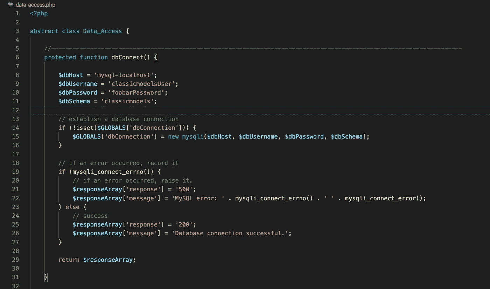
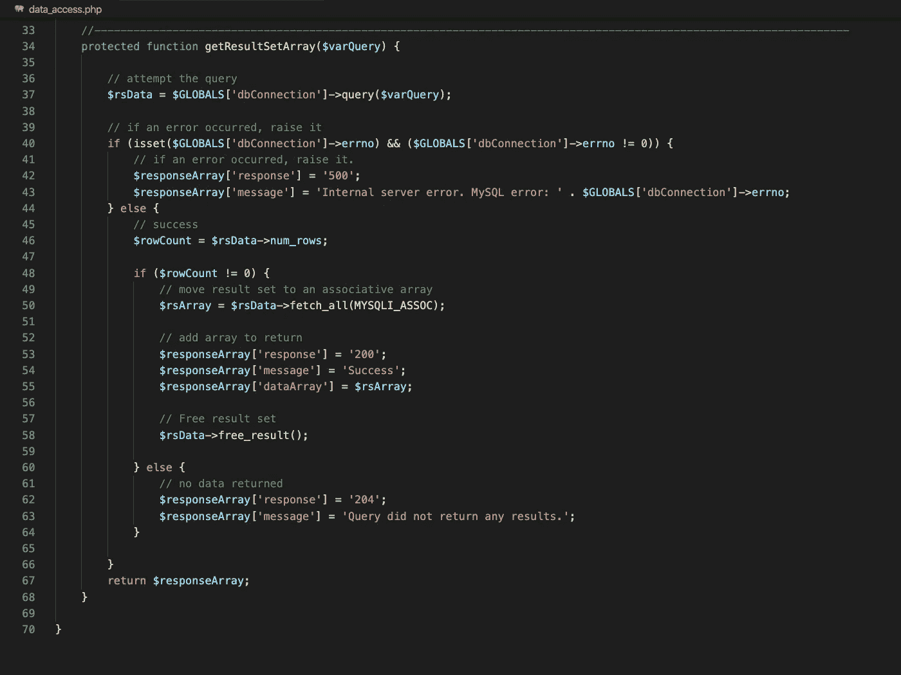
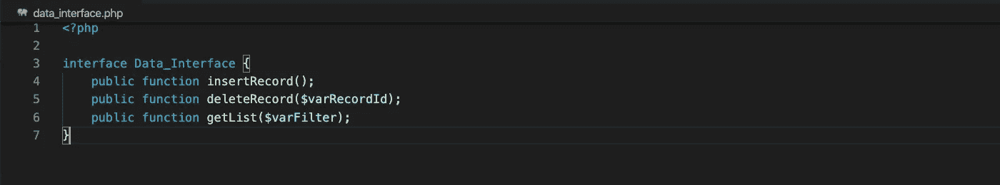
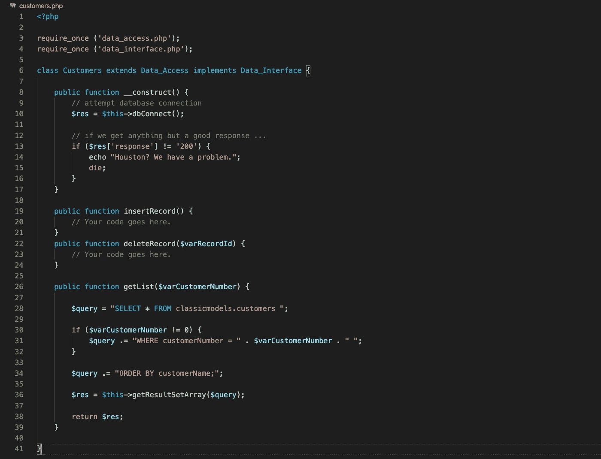
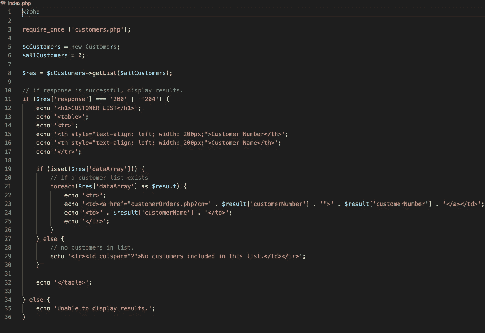
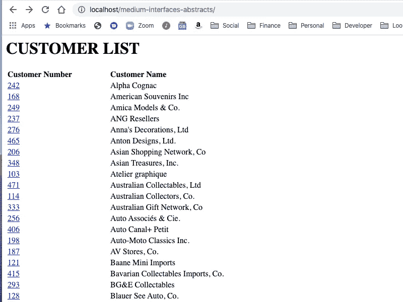
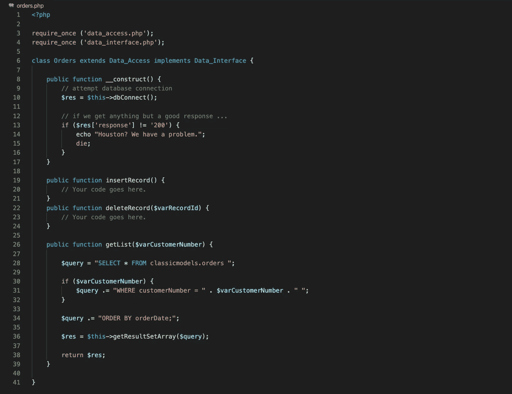
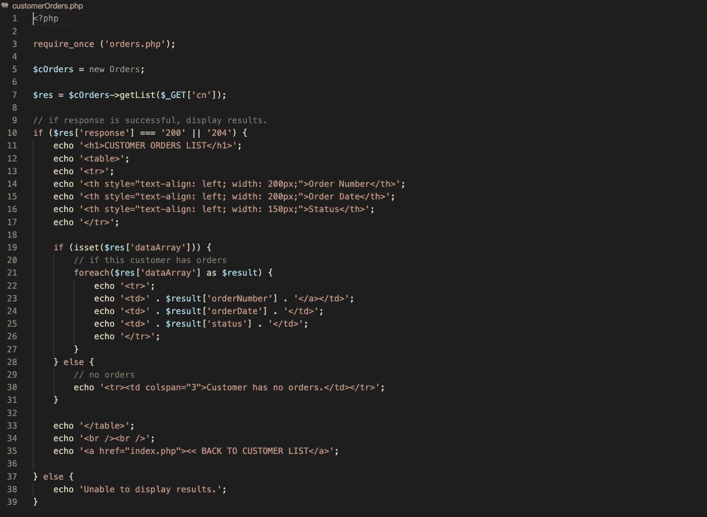
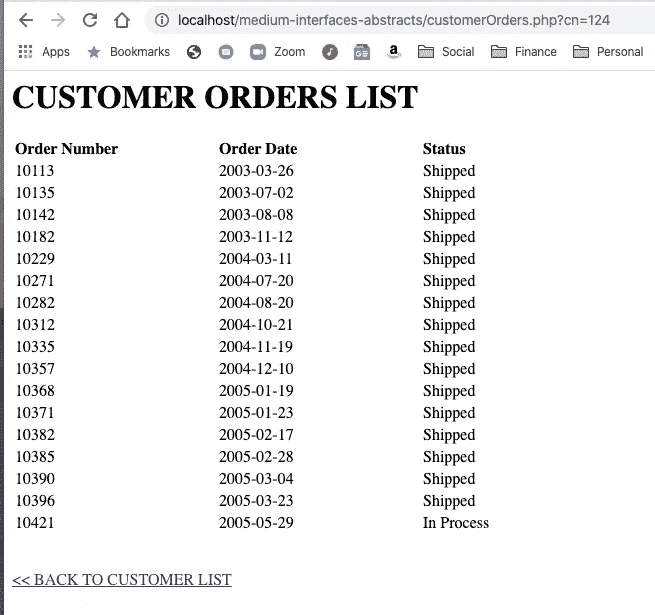

# PHP 中接口和抽象类的实际演示

> 原文：<https://betterprogramming.pub/php-a-practical-demonstration-of-interfaces-vs-abstract-classes-56d9838cd5b7>

## 轻松越过这个非常常见的开发人员面试问题


我从 2008 年开始写 PHP 代码。在那段时间里，我为各种目的构建了各种应用程序。当你写这么长时间的代码时，你会发现自己创建了一个工具、实用程序和代码片段的库，你会反复使用它们。过了一段时间，你发现你在重用多年前写的代码，而现在却不记得它是如何工作的，为什么，甚至不记得是否有新的更好的方法。你的老的可靠的代码只是做它一直做的和工作，所以你使用它，不要问问题。

最近，当有人让我解释接口和抽象类之间的区别时，我意识到我无法回答这个问题(至少不明智)。在这里，我多年来一直在构建这些东西，但不知道如何，或者被要求，来阐明这些差异。

我开始用谷歌搜索这个常见的问题，发现它得到了非常普遍的答案。除了使用示例代码`Function1`和`Function2`以及一些同样通用的方法的响应之外，我没有发现任何东西。在现实生活中，我为`Customers`和`Orders`之类的东西编写代码，如果这些例子也更真实一点，对我来说会更有意义。

所以，我决定创建这个使用抽象类和接口的实际例子。我已经包括了一些工作代码，您可以访问并亲自试验。

我们开始吧！

# 示例代码和数据库设置

这个例子的所有 PHP 代码都可以在下面的 Github 库中找到。请随意下载并以任何方式使用这些代码，无需注明出处。

```
[https://github.com/crmcmullen/medium-interfaces-abstracts/](https://github.com/crmcmullen/medium-interfaces-abstracts/)
```

此外，对于这个例子，我将使用一个 MySQL 服务器，设置在 Docker 容器中，按照我的文章中的说明，“ [***如何在 macOS 上的 Docker 容器中运行 MySQL 并使用持久本地数据***](https://medium.com/@crmcmullen/how-to-run-mysql-in-a-docker-container-on-macos-with-persistent-local-data-58b89aec496a) ”

对于我的演示，我需要一个数据库，所以我安装了 MySQL 教程[中的示例数据库。](https://www.mysqltutorial.org/mysql-sample-database.aspx)

如果您打算试用我的示例代码，您应该从他们的网站下载并安装数据库。它将创建一个名为`classicmodels`的数据库，其中包含我们需要的表格。

完成后，运行下面的 MySQL 脚本来创建一个数据库用户，我们将在示例代码中使用它来连接数据库。

**注意**:下面的代码片段中有几行代码，您可以复制所有代码，然后在一次执行中运行它们。

```
/*  Create DB user */USE `classicmodels`;CREATE USER 'classicmodelsUser'@'%' IDENTIFIED WITH mysql_native_password BY 'foobarPassword';CREATE USER 'classicmodelsUser'@'localhost' IDENTIFIED WITH mysql_native_password BY 'foobarPassword';GRANT SELECT, INSERT, UPDATE, DELETE, EXECUTE ON classicmodels.* TO 'classicmodelsUser';
```

# 使用案例

在这个例子中，我们将查询并显示来自于`classicmodels` MySQL 数据库中的两个数据库表的数据:`customers`表和`orders`表。

因此，我需要能够连接到数据库。这样做的 PHP 代码对于数据库中的两个表(实际上是所有的表)都是相同的，所以我将创建一个`abstract class`，我的所有数据库类都可以`extend`连接到数据库。

然后，我将为每个表创建数据库类，其中包含特定于每个表的函数和方法。我想确保我(或我的开发团队)构建的所有数据库类都遵循相同的规则。我的数据库类中总是需要某些方法。例如，每个数据库类都需要一个插入数据的函数、一个删除数据的函数和一个生成记录列表的函数。因此，当我的开发人员构建数据库类时，我希望确保这些特定的方法总是被包含在内，即使它们内部的代码可能有一点不同。为了实施这种“类蓝图”，我将 ***实现******接口*** 来定义必须包含在所有数据库类中的函数。

为了满足这个用例的需求，我将首先构建查询和显示来自`customers`表的数据的部件。这将包括以下内容:

*   一个名为`Data_Access`的抽象类，我的“具体”数据库类可以扩展它。它将提供连接到`classicmodels`数据库的方法和功能。
*   一个名为`Data_Interface`的接口类，它将定义必须包含在我的具体数据库类中的函数。
*   一个名为`Customers`的“具体”数据库类，它将包含与`customers`表交互所需的函数。
*   一个`index.php`页面将成为我们的登录页面，它实例化我们的类，并检索和显示客户数据。

完成后，我们会回来:

*   添加一个名为`customerOrders.php`的页面来显示客户订单。
*   创建一个名为`Orders`的具体类，它将包含与`orders`表交互所需的所有函数，并展示抽象类和接口的强大功能。

# 抽象类

抽象类不仅有能力定义具体类所需的方法，还能提供这些方法的*实现*。要使用抽象类，具体类必须*扩展*抽象类，然后使抽象中定义的所有方法在具体类中可用。

为了说明这一点，让我们从检查我们的`Data_Access`抽象类开始。在我们的示例代码中，我创建了一个名为`data_access.php`的文件。它有两个功能:`dbConnect`和`getResultSetArray`。

在下图 1 中，你可以看到我们在第三行将`Data_Access`定义为一个“抽象类”。这强化了这样一个概念，即它是一个抽象类，因此*不能被实例化为一个独立的类。它只能*延长*。这是抽象类的一个规则，确保它被视为抽象类。*

如果我们试图将`Data_Access`类实例化为一个独立的对象:

```
$cDataAccess = new Data_Access;
```

它会抛出以下错误:

```
PHP Fatal error:  Uncaught Error: Cannot instantiate abstract class Data_Access ...
```



图 1: Data_Access::dbConnect

上面的图 1 显示了`Data_Access`中的`dbConnect`函数，它执行到数据库的连接。

***注意:*** *在这个函数的顶部你可以看到我正在为数据库凭证定义一些变量。通常我不会在代码中保存这类东西，我会从公共 web 文件夹外的 INI 文件中获取这些凭证。但是对于这个演示来说，它有助于保持简单。*

`*dbConnect*`函数试图连接到数据库，并将该连接存储在一个`GLOBAL`变量中，在实例化该类的 PHP 页面的生命周期中，该变量可用于与其他数据库类共享。如果发生错误，它将被引发回数组中的调用函数。

最后，在下图 2 中，我们有`Data_Access` **:** 中的`getResultSetArray`函数



图 2:Data _ Access::getResultSetArray

函数`getResultSetArray`接受一个查询字符串作为参数，并使用已建立的数据库连接来执行查询。然后，它将结果放入一个关联数组，并将其返回给调用函数。如果发生错误，也会引发给调用函数。

***注意:*** *我之所以以响应数组的形式返回一切，是为了给调用函数提供一致性。通过这样做，我的调用函数可以知道响应总是以这种形式返回，无论是通过还是失败，响应代码、消息和任何数据结果都在一个名为* `*dataArray*` *的关联数组中。这个关联数组很容易在 PHP 或 Javascript 中使用。*

随着`Data_Access`的完成，我们现在有了一个可以被具体类扩展的抽象类。它提供了实现所有类可以共享的代码的函数。它不特定于任何数据库或表(尤其是如果您删除了`dbConnect`中的硬编码凭证)，因此满足了 PHP 中抽象类的要求。

现在我们来看一个接口。

# 界面

把一个接口想象成你的具体类的模板或契约。在我们的例子中，我们说我们希望所有的数据库类都有三个函数——一个插入记录，一个删除记录，一个获取记录列表。

我可以通过创建一个包含所有这些函数的签名的接口，然后在我的具体类中用*实现*这个接口，在所有的数据库类中实施这个规则。

让我们看看下图 3 中的例子。我创建了一个名为`*data_interface.php*`的文件，并添加了所需的三个函数的签名以及它们所需的参数。



图 3:数据接口

请注意，接口中的函数都没有主体。这是因为，虽然接口可以实现方法，但它们不能实现功能。这将由实现类提供。

我们对一个接口所做的一切都是强制实现这个接口的类都有相同的方法。接口还有其他一些好处，我稍后会讨论。

现在让我们在第一堂混凝土课上把这些结合起来。

# 客户类

这个简单的具体类旨在用作我们访问数据库中的`customers`表的网关。它将包含与该表交互所需的所有功能。

在下面的图 4 中，我们看到了文件`customers.php`中的`Customers`类:



图 4:顾客

在`Customers`类中，我们扩展了抽象类`Data_Access`并实现了接口`Data_Interface`。一个具体类只能扩展一个抽象类，但是它可以实现许多接口。您只需用逗号分隔您的接口。我们将很快演示这一点。

`Customers`类有一个构造函数，调用`dbConnect`并尝试数据库连接。如果失败，我们会有一个不那么体面的退出。通常你会导航到一个对访问者友好的页面来解释这个问题。

接下来，您会看到我们的三个函数，以及接口所需的参数(如果有的话):`insertRecord`、`deleteRecord`和`getList`。

因为接口执行它的实现规则，如果我试图省略掉`Customers`中的一个函数，例如`insertRecord`，并试图实例化它，我们会收到一个致命错误:

```
PHP Fatal error:  Class Customers contains 1 abstract method and must therefore be declared abstract or implement the remaining methods (Data_Interface::insertRecord)
```

`getList`函数需要一个参数变量。这是由我们实现的`Data_Interface`执行的。这是为了确保`getList`函数，在所有实现它的具体类中，为`SELECT`语句使用一个过滤器参数。在我们的`Customers`列表中，我们需要所有记录，所以我们将在查询中包含允许零值表示`All Customers`的代码。否则，您可以传递`getList`一个特定的客户号，并取回该单个记录。一个列表仍然是一个有效列表！

该函数继续创建一个查询字符串，然后调用在扩展`Data_Access`抽象类时变得可用的`getResultSetArray`函数——因为抽象类*可以*在方法中实现功能。从数据库表中检索数据的所有可重用代码都保存在`Data_Access`中。

现在，最后，让我们看看所有这一切的行动。

# 索引页

我创建了一个名为`index.php`的文件，这是我们这个项目的登陆页面。如下图 5 所示。



图 5:索引页

这里没有火箭科学。`Index`页面实例化了`Customers`类，执行了`getList`函数，传递了一个变量，该变量表示需要一个所有客户的列表。这将返回一个客户数组，并在屏幕上以表格的形式显示该列表。

我们将每个客户编号嵌入到一个到`customerOrders.php` 页面的链接中，我们接下来将创建这个页面，它显示所选客户的所有订单。

结果看起来像这样:



图 6:客户列表

就是这样！如果您看到类似于上图中的列表，那么恭喜您。

现在我们已经创建了一个小型 web 应用程序，它使用了一个抽象类并实现了一个接口。为了说明这一点的潜力，让我们进入用例的下一步，创建一个显示客户订单的页面。

# 订单类

现在让我们创建下一个具体的数据库类:`orders.php`。



图 7:订单

`Orders`级与`Customers`级几乎相同。它从一个构造函数开始，该构造函数通过调用`dbConnect` ***来尝试数据库连接。***

它必须遵循与`Customers`相同的规则，因为它也实现了`Data_Interface`接口类。因此也需要有`insertRecord`、`deleteRecord`和`getList`功能。

这是接口的好处之一:现在我们有多个类，它们必须遵循相同的规则，并且包括所有相同的指定方法和所需的参数。如果我使用的是任何一个属于`Data_Interface`的类，我总能知道它需要这些方法。

与`Customers`一样，`Orders`中的`getList`功能需要一个参数变量，该变量旨在用作`SELECT`语句中的过滤器。在本例中，我将利用这一点，因为我们只想显示所选客户的订单。

一旦创建了查询字符串，`Orders`就可以调用`getResultSetArray`函数，就像`Customers`一样。

现在我们看到了抽象类的好处。在这种情况下，`Customers`和`Orders`都扩展了`Data_Access`，并共享了该抽象类中的所有公共代码。`Data_Access`中的代码并不特定于任何单个数据库表，而是适用于所有数据库表，并且本质上是抽象的。

让我们用最后一个页面来结束这一部分，它将显示客户订单。

# 客户订单页面

在下图 8 中，我们看到了`Customer Orders`页面的代码。



图 8:客户订单页面

和以前一样，这里没有太多的火箭科学。该页面实例化了`Orders`类并执行`getList`函数，将 URL 中发送的客户号作为`GET`变量传递。结果列表像以前一样显示在 HTML 表格中。

结果看起来像这样:



图 9:客户订单列表

你有它！我们已经完成了整个用例。我们已经构建了一个现实生活中的 web 应用程序，它包含了抽象类和接口实现。

# 关于接口你应该知道的其他事情

接口真的很酷，除了在具体的类中执行方法之外，还可以做更多的事情。

首先，您可以一次实现多个接口。假设在我们的例子中，我们有一个名为`Accounts_Receivable`的接口，它具有专用于`Customers`(例如`creditCheck`)的功能，但不适用于`Orders`。

```
<?php

interface Accounts_Receivable {
    public function creditCheck($varCustomerNumber);
}
```

如果我们想在`Customers`和`Data_Interface`中实现这个接口，它应该是这样的:

```
require_once ('data_access.php');
require_once ('data_interface.php');
require_once ('accounts_receivable.php');class Customers extends Data_Access implements Data_Interface, Accounts_Receivable {
```

您只需用逗号分隔接口名称。在本例中，`Customers`现在需要实现`creditCheck`函数及其所需的参数。

使用接口可以做的另一件事是使用`instanceof`来确定具体的类是否实现了所选择的接口。例如，也许我们想确定一个类是否实现了`Data_Interface`接口。我们可以做到以下几点:

```
<?php

$cCustomers = new Customers;

if ($cCustomers instanceof Data_Interface) {  
    echo 'You are a database class!';
}
```

这使您能够根据类实现的接口类型来区别对待类。

# 关于抽象类你应该知道的其他事情

抽象类和接口的最大区别在于抽象类可以实现由扩展它们的类共享的代码。

但是，抽象类也可以有抽象的*方法*。这些方法非常像接口，因为它们仅由函数签名(无主体)表示，并且是扩展抽象类的具体类所需要的。

我们例子中的抽象类`Data_Access`没有使用任何抽象方法。因此，扩展了`Data_Access`的类不需要实现那些方法。

然而，我们可以像对待抽象方法一样轻松地在抽象类中包含一些接口函数，并且在扩展类中仍然需要它们。

`Data_Access`可能包括以下几行:

```
<?phpabstract class Data_Access {abstract function insertRecord();
abstract function deleteRecord($varRecordId);
```

那么这两个函数可以从接口类中移除，我们仍然会得到相同的结果。现在抽象类会强制要求`*insertRecord*` 和`*deleteRecord*`必须存在于`Customers`和`Orders`中。

# 摘要

接口是确保实现它们的具体类包含接口所需的所有方法的蓝图或契约。您还可以查询具体的类，以确定它们是否实现了某些接口，然后以不同的方式处理不同类型的类。一个具体的类可以实现一对多接口。

抽象类也可以使用抽象方法来提供一种蓝图或契约，确保具体的类扩展它们来实现所需的方法。然而，抽象类可以更进一步，提供实现代码的类，具体类可以继承这些代码来实现通用功能。一个具体类一次只能扩展一个抽象类。

这应该让你开始。关于抽象类和接口的能力，您还可以学习更多，但是这里的课程是帮助您以正确的方式组织代码的基础。