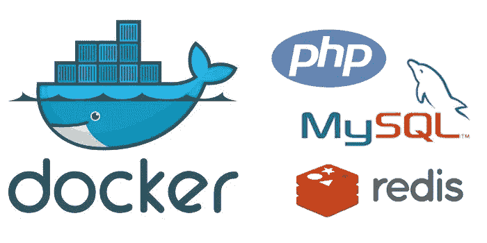
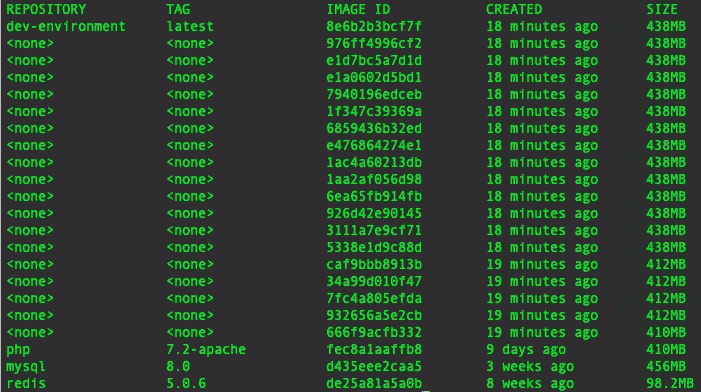
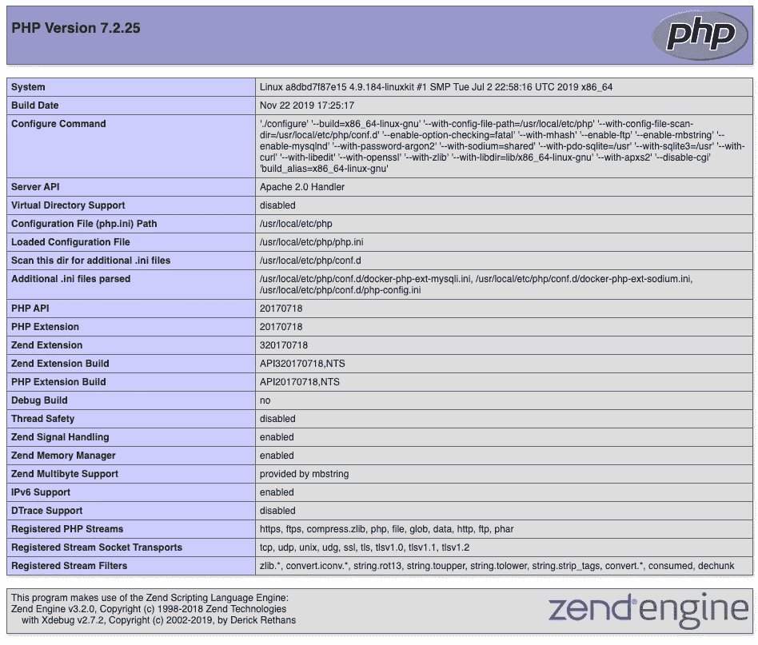

# 如何在 macOS 上的 Docker 容器中运行整个开发环境

> 原文：<https://betterprogramming.pub/php-how-to-run-your-entire-development-environment-in-docker-containers-on-macos-787784e94f9a>

## 使用 Docker 容器创建 PHP 7.2 本地主机、MySQL 8 服务器和 Redis 服务器开发环境的分步指南



我写过几篇关于使用 Homebrew 在各种 macOS 机器版本上设置 PHP localhost 开发环境的文章，包括两篇关于在 Docker 容器中运行 MySQL 8.0 的文章。

现在我已经升级到了 macOS 10.15 Catalina，它具有只读文件系统卷，我决定将我的开发环境完全从 macOS 中剥离出来，并在 Docker 容器中运行。这开启了各种可能性。首先，我不仅应该能够在所有版本的 macOS 上运行完全相同的开发环境，而且如果我愿意的话，我还应该能够在 Ubuntu 桌面上运行这些完全相同的容器——或者任何其他能够托管 Docker 的操作系统。其次，通过在容器中创建我的开发环境，我可以很容易地在一台新机器上设置我的整个开发环境，只需要几分钟，只需要几个 Docker 命令。

此外，通过将我的 Apache/PHP 环境放在一个容器中，我能够与不同版本的 PHP 或运行 Wordpress 的容器一起运行额外的容器。

# 我们要做的是

在本文中，我们将创建并启动三个 Docker 容器。第一个将包含我们的 Redis 服务器，我们将使用它进行 PHP 会话管理。通过单独运行 Redis 服务器，我们将更接近地模拟生产环境。

第二个容器将遵循我之前在文章[中提供的说明，如何在 macOS 上的 Docker 容器中使用持久本地数据运行 MySQL](https://medium.com/@crmcmullen/how-to-run-mysql-in-a-docker-container-on-macos-with-persistent-local-data-58b89aec496a)，并且是一个 MySQL 8.0 服务器，使用[本地密码认证作为本地主机 MySQL 实例运行](https://medium.com/@crmcmullen/how-to-run-mysql-8-0-with-native-password-authentication-502de5bac661)。

第三个也是最后一个容器是我们的 Apache/PHP 7.2 本地主机服务器。为了实现这一点，我们将使用一个 Dockerfile，它将集合我们开发环境中需要的所有组件，包括 Xdebug、Redis 和 Igbinary PHP 扩展。

所有这三个容器都将加入同一个 Docker 网络，以便 Docker 的本地 DNS 功能可以发挥作用，并且容器可以通过名称而不是 IP 地址相互通信。

我们开始吧！

# 家政

## 下载并安装 docker

如果你还没有，从稳定渠道安装最新版本的 docker for MAC:【https://docs.docker.com/docker-for-mac/install/

## 创建本地绑定文件夹

我们将在 macOS 用户文件夹中创建一些文件夹，用于保存 Redis 和 MySQL 容器的配置文件，以及保存 Apache 和 PHP 日志文件的文件夹，以便于查找和访问。这些将在 Docker 运行语句期间被绑定到容器内的适当文件夹。

我们还将创建一个文件夹来存放我们构建的网站，这个文件夹将被绑定到 PHP 容器中的`/var/www/html`文件夹。

打开终端并输入下面的命令。确保用您自己的 macOS 用户名替换`[your_username]`。

注意。个人偏好:我喜欢把我的开发工具收集到一个名为`Develop`的文件夹中。你可以根据自己的喜好随意调整位置。

```
mkdir /Users/[your_username]/Developmkdir /Users/[your_username]/Develop/docker_configs
mkdir /Users/[your_username]/Develop/docker_configs/mysql
mkdir /Users/[your_username]/Develop/docker_configs/redismkdir /Users/[your_username]/Develop/mysql_datamkdir /Users/[your_username]/Develop/logs
mkdir /Users/[your_username]/Develop/logs/apache
mkdir /Users/[your_username]/Develop/logs/phpmkdir /Users/[your_username]/Sites
```

因为 Docker 已经默认将`/Users`文件夹识别为文件共享，所以我们不需要在 Docker 文件共享首选项中做任何事情。

## 创建 Redis 配置文件

我们将为我们的 Redis 服务器创建一个配置文件。这主要是一个占位符文件，供您在以后想要更改其他设置时使用，但在本例中，我们将确保注释掉该行，以绑定 Redis 服务器侦听特定的 IP 地址。我们将允许开发环境中的服务器监听我们将在后面的步骤中创建的 Docker 网络上的所有 IP 地址端口。

现在，我们将创建一个本地的`redis.conf`文件，其中包含我们想要用来在 Docker 运行时修改 Redis 服务器容器内部配置的设置。

```
nano /Users/[your_username]/Develop/docker_configs/redis/redis.conf
```

将以下两行添加到文件中:

```
# bind 127.0.0.1
protected-mode yes
```

Control + o 保存。
Control + x 退出。

## 创建一个 MySQL 配置文件

现在我们将创建一个`my.cnf`文件，该文件将包含一个设置，该设置将我们的 MySQL 8 服务器实例设置为使用本地密码认证而不是默认的`caching_sha2_password`来运行。

```
nano /Users/[your_username]/Develop/docker_configs/mysql/my.cnf
```

将以下两行添加到文件中:

```
[mysqld]
default-authentication-plugin=mysql_native_password
```

Control + o 保存。
Control + x 退出。

## 创建一个 PHP 登陆页面

让我们创建一个 index.php 登陆页面，稍后我们可以用它来验证我们的 PHP 服务器是否正常工作。

```
echo "<?php phpinfo();" > ~/Sites/index.php
```

## 禁用 macOS 版本的 Apache

macOS 10.15 Catalina 预装了 Apache。然而，我们将在一个容器中运行 Apache，然后将端口 80 绑定到它，而不是使用交付的版本。

如果您已经运行了预安装版本的 macOS Apache，则需要首先关闭它，并删除任何自动加载脚本。运行以下两个命令没有坏处，即使是在全新安装时。

请注意，第二个命令是一个单行，由于页面宽度限制，它在 Medium 中换行了。确保复制整行。

```
sudo apachectl stopsudo launchctl unload -w /System/Library/LaunchDaemons/org.apache.httpd.plist 2>/dev/null
```

就是这样。我们做完家务了。我们已经准备好了所有的本地文件夹和文件，并准备开始启动容器。

# 创建码头工人网络

Docker 内置了 DNS。因此，我们将为 Docker 容器创建一个本地网络。通过这样做，只要所有的容器都被添加到同一个网络中，我们所有的容器就能够通过名称而不是 IP 来相互通信。我的例子中的所有容器都是同一个网络的一部分。

您可以随意命名您的网络。因为我们正在构建一个开发环境，所以我将它命名为`dev-network.`

```
docker network create dev-network
```

# 启动 Redis 服务器容器

使用以下命令启动我们将用于 PHP 会话管理的 Redis 服务器容器:

```
docker run --restart always --name redis-localhost --net dev-network -v /Users/[your_username]/Develop/docker_configs/redis/redis.conf:/usr/local/etc/redis/redis.conf -d redis:5.0.6
```

以下是每个参数的含义:

*   `--restart always`会在 Docker 启动时重启这个容器，比如重启笔记本电脑或者 Docker 关闭后重启。如果您想每次都启动自己的容器，请不要使用这个参数。
*   `--name redis-localhost`将这个名称分配给容器实例。
*   `--network dev-network`将把这个容器加入我们在上一步中创建的 docker 网络。
*   `-v /Users/[your_username]/Develop/docker_configs/redis/redis.conf:/usr/local/etc/redis/redis.conf` 会将容器内的配置文件绑定到我们提供的配置文件。
*   `-d`将在分离模式下运行容器，以便它在后台运行。
*   `redis:5.0.6`表示官方 DockerHub Redis 版本标签 5.0.6 是要安装的版本。

除非您已经将 Redis Docker 映像下载到您的笔记本电脑上，否则您第一次运行上述命令时，它会下载该映像。之后，后续运行将会快得多。

您可以运行以下命令来查看您的容器是否正在运行:

```
docker ps
```

# 启动 MySQL 8.0 服务器容器

使用以下命令启动 MySQL 服务器容器。记得用你的 Mac 用户名代替`[your_username]` ，用你最喜欢的 MySQL root 密码代替`[your_password]`。

```
docker run --restart always --name mysql-localhost --net dev-network -v /Users/[your_username]/Develop/mysql_data/8.0:/var/lib/mysql -v /Users/[your_username]/Develop/docker_configs/mysql:/etc/mysql/conf.d -p 3306:3306 -d -e MYSQL_ROOT_PASSWORD=[your_password] mysql:8.0
```

这些参数在上面的 Redis 服务器和我的其他文章中都有很好的解释，所以我将在这里跳过这些细节。请注意，您正在将您的`mysql_data/8.0`文件夹绑定到容器内的`/var/lib/mysql`，这将在容器重启后提供您的持久数据。您还将容器内的`docker_configs/mysql`文件夹绑定到 `/etc/mysql/conf` ，这将覆盖 MySQL 服务器设置。

您可以运行以下命令来查看当前的容器列表:

```
docker ps
```

# 启动 Apache/PHP 7.2 服务器容器

在这一步中，我们将使用 Docker 文件构建一个自定义映像，该映像将包含 Apache 和 PHP 7.2 以及来自 PECL 的 Xdebug、Igbinary 和 Redis PHP 扩展。

一旦构建完成，我们将启动图像到一个容器中。

## 创建 Dockerfile 文件

首先创建一个存储 Docker 文件的位置，它将成为您的 Docker 开发环境:

```
mkdir /Users/[your_username]/Develop/docker_dev_env
```

使用下面的 Gist 文件中的代码创建一个名为`Dockerfile`(没有文件扩展名)的文件，并将其保存到上面创建的目录中。

如果你使用 VSCode 作为你的编辑器，我强烈推荐安装 Docker 扩展。它支持在 Docker 文件中进行颜色编码的语法编辑。

在我们对这个 docker 文件运行 build 命令之前，让我们讨论一下它要做什么:

```
FROM php:7.2-apache# run non-interactive. 
ENV DEBIAN_FRONTEND=noninteractive# update OS and install utils
RUN apt-get update; \
    apt-get -yq upgrade; \
    apt-get install -y --no-install-recommends \
    apt-utils \
    nano; \
    apt-get -yq autoremove; \
    apt-get clean; \
    rm -rf /var/lib/apt/lists/*
```

在第一部分中，我们从官方的 PHP Docker Hub 仓库中提取，特别是提取 7.2-apache 标签。

然后，我们指出我们希望在非交互模式下运行这个 docker 文件，这将取消提示。

接下来，我们运行基本的 Debian Linux 更新和升级，在我们的容器中安装`apt-utils` 和`nano`，并做一些日常工作。

```
# make sure custom log directories exist
RUN mkdir /usr/local/log; \
    mkdir /usr/local/log/apache2; \
    mkdir /usr/local/log/php; \
    chmod -R ug+w /usr/local/log# create official PHP.ini file
RUN cp /usr/local/etc/php/php.ini-development /usr/local/etc/php/php.ini
```

在下一节中，我们将为 Apache 和 PHP 创建自定义日志目录。这些文件将映射到我们在本文开头的整理步骤中创建的本地文件夹。

然后我们将提供的`php.ini`文件的开发版本复制到`php.ini`的可运行版本。

```
# install MySQLi
RUN docker-php-ext-install mysqli# update PECL and install xdebug, igbinary and redis w/ igbinary enabled
RUN pecl channel-update pecl.php.net; \
    pecl install xdebug-2.7.2; \
    pecl install igbinary-3.0.1; \
    pecl bundle redis-5.0.2 && cd redis && phpize && ./configure --enable-redis-igbinary && make && make install; \
    docker-php-ext-enable xdebug igbinary redis# Delete the resulting ini files created by the PECL install commands
RUN rm -rf /usr/local/etc/php/conf.d/docker-php-ext-igbinary.ini; \
    rm -rf /usr/local/etc/php/conf.d/docker-php-ext-redis.ini; \ 
    rm -rf /usr/local/etc/php/conf.d/docker-php-ext-xdebug.ini
```

在下一节中，我们将安装 PHP 扩展。首先，我们安装`mysqli`扩展，在这种情况下，PHP 7.2 不会默认安装这个扩展。

接下来，我们使用 PECL 安装 Xdebug、Igbinary 和 Redis，并将 Igbinary 设置为序列化程序。然后我们在 Docker 中启用这些扩展。

PECL 安装创建了额外的 ini 文件，我们删除了这些文件，因为对这些扩展的引用将在我们自己的定制`php.ini` 覆盖中完成。

```
# Add PHP config file to conf.d
RUN { \
        echo 'short_open_tag = Off'; \
        echo 'expose_php = Off'; \    
        echo 'error_reporting = E_ALL & ~E_STRICT'; \
        echo 'display_errors = On'; \
        echo 'error_log = /usr/local/log/php/php_errors.log'; \
        echo 'upload_tmp_dir = /tmp/'; \
        echo 'allow_url_fopen = on'; \
        echo '[xdebug]'; \
        echo 'zend_extension="xdebug.so"'; \
        echo 'xdebug.remote_enable = 1'; \
        echo 'xdebug.remote_port = 9001'; \
        echo 'xdebug.remote_autostart = 1'; \
        echo 'xdebug.remote_connect_back = 0'; \
        echo 'xdebug.remote_host = host.docker.internal'; \
        echo 'xdebug.idekey = VSCODE'; \
        echo '[redis]'; \
        echo 'extension="igbinary.so"'; \
        echo 'extension="redis.so"'; \
        echo 'session.save_handler = "redis"'; \
        echo 'session.save_path = "tcp://redis-localhost:6379?weight=1&timeout=2.5"'; \
    } > /usr/local/etc/php/conf.d/php-config.ini
```

在上面的下一节中，我们将在容器内的`php/conf.d`文件夹中创建一个`php-config.ini`文件。这些配置设置将在运行时覆盖`php.ini` 文件夹。

需要注意的事项:

我们将`error_log`指向我们之前在这个 Docker 文件中创建的日志文件夹。

我做了以下 Xdebug 覆盖:

```
xdebug.remote_port = 9001
xdebug.remote_host = host.docker.internal
xdebug.idekey = VSCODE
```

这将启用从 VSCode 到 Docker 容器的远程调试(我使用 VSCode)。如果您使用的是 VSCode 之外的 IDE(例如 PHPStorm 等。)，那么您可能需要试验这些设置以使您的 Xdebug 正常工作。但是，因为我已经将端口改为 9001，而不是使用默认端口 9000，所以 PHPStorm 可以开箱即用。

在 VSCode 中，只需确保 Xdebug 端口指向 9001。使用以下 VSCode `launch.json`文件设置:

```
{
    "version": "0.2.0",
    "configurations": [

        {
            "name": "Listen for XDebug",
            "type": "php",
            "request": "launch",
            "port": 9001,
            "log": false,
            "pathMappings": {
                "/var/www/html/":"/Users/[your_username]/Sites/"
            }
        },
        {
            "name": "Launch currently open script",
            "type": "php",
            "request": "launch",
            "program": "${file}",
            "cwd": "${fileDirname}",
            "port": 9001
        }
    ]
}
```

此外，我们还进行了以下会话覆盖:

```
session.save_path = "tcp://redis-localhost:6379?weight=1&timeout=2.5"
```

这将我们的 PHP 会话保存路径指向我们在本文前面创建的`redis-localhost` Redis 服务器容器。

```
# Manually set up the apache environment variables
ENV APACHE_RUN_USER www-data
ENV APACHE_RUN_GROUP www-data
ENV APACHE_LOG_DIR /usr/local/log/apache2# Configure apache mods
RUN a2enmod rewrite# Add ServerName parameter
RUN echo "ServerName localhost" | tee /etc/apache2/conf-available/servername.conf
RUN a2enconf servername# Update the default apache site with the config we created.
RUN { \
 echo '<VirtualHost *:80>'; \
 echo '    ServerAdmin [your_email@example.com](mailto:crmcmullen@gmail.com)'; \
 echo '    DocumentRoot /var/www/html'; \
 echo '    <Directory /var/www/html/>'; \
 echo '        Options Indexes FollowSymLinks MultiViews'; \
 echo '        AllowOverride All'; \
 echo '        Order deny,allow'; \
 echo '        Allow from all'; \
 echo '    </Directory>'; \
 echo '    ErrorLog /usr/local/log/apache2/error.log'; \
 echo '    CustomLog /usr/local/log/apache2/access.log combined' ; \
 echo '</VirtualHost>'; \
 } > /etc/apache2/sites-enabled/000-default.conf
```

在最后一部分，我们将实现 Apache 服务器覆盖，启用`rewrite`和`servername`模块，并创建`000-default.conf`文件覆盖。

# 构建开发环境映像

使用终端，导航到您创建的保存 Docker 文件的新`docker_dev_environment`文件夹。

```
cd /Users/[your_username]/Develop/docker_dev_env
```

现在，我们将运行 Docker build 命令，该命令将使用您刚刚创建的 Docker 文件来创建一个新的自定义映像。我们将把我们的图像命名为`dev-environment.`

```
docker build -t dev-environment .
```

当您看到消息时，`Successfully tagged dev-environment:latest`您的映像将被构建并准备好发布到一个容器中。

如果您想查看到目前为止您拥有的 Docker 图像列表，您可以使用以下命令:

```
docker images -a
```

这将向您显示一个类似如下的列表:



# 将开发环境映像启动到容器中

现在，我们将把我们的新`dev-environment` 图像发布到一个容器中。

```
docker run --restart always --name www-localhost --net dev-network -v /Users/[your_username]/Sites:/var/www/html -v /Users/[your_username]/Develop/logs:/usr/local/log -p 80:80 -d dev-environment
```

让我们来分解这些 Docker 运行设置:

*   `--restart always`会在 Docker 启动的任何时候重启这个容器，比如笔记本电脑重启或者 Docker 关闭后重新启动。如果您想每次都启动自己的容器，请不要使用这个参数。
*   `**--name www-localhost**`将这个名称分配给容器实例。
*   `--network dev-network`将把这个容器加入我们在上一步中创建的 docker 网络。
*   `-v /Users/[your_username]/Sites:/var/www/html` 会将我们在本文顶部的内务处理部分创建的`/Sites`文件夹绑定到容器内的`/var/www/html`文件夹。这会将您的站点文件夹设置为根 web 目录。
*   `-v /Users/[your_username]/Develop/logs:/usr/local/log` 会将`/Develop/logs`文件夹绑定到我们在 Docker 文件的容器内创建的自定义日志文件夹。现在，您的 Apache 和 PHP 日志将很容易在 Finder 的用户文件夹中访问。
*   `-p 80:80`将 macOS 上的端口 80 绑定到容器内部的端口 80。
*   `-d` 将在分离模式下运行容器，以便它在后台运行。
*   `dev-environment`告诉 Docker 使用我们在上一步中创建的开发环境映像启动容器。

# 验证您的环境是否正常工作

此时，您应该能够打开浏览器并导航到您的本地主机。我们在内务处理步骤中创建的 index.php 文件应该会立即加载。如果一切正常，您应该会看到类似如下的屏幕:



您应该能够向下滚动 PHP 信息，看到 Igbinary、MySQLi、Redis 和 Xdebug 都已加载并运行。

# 回顾

我知道这里看起来有很多步骤，但是真的不太复杂。它基本上分为以下六个步骤:

*   内务处理:创建您将在 Docker 运行命令中绑定到的所有文件夹和配置文件。现在您已经将这些配置资产构建到了`/Develop`文件夹中，我建议您将该文件夹保存在某个地方，这样您就可以在将来加载时使用它了。
*   创建码头工人网络。
*   启动 Redis 容器。
*   启动 MySQL 容器。
*   构建`dev-environment`图像。
*   启动`dev-environment`容器。

在 Docker 容器中运行开发环境的美妙之处在于，现在您可以在几分钟之内在一个新的负载上设置好您的开发环境。你现在也可以用不同版本的 PHP 或 Wordpress 自由运行不同的容器，而不必担心本地 macOS 上的设置。您甚至可以通过绑定到不同的端口来并排运行这些容器。您可以在端口 80 上运行您的自定义 PHP 容器，在端口 8080 上运行 Wordpress 容器，两者可以共享相同的 MySQL 和 Redis 容器。

最后，像这样在 Linux 容器中运行您的开发环境将更有可能复制生产环境中运行的内容。

# 有用的 Docker 命令

以下是我在 Docker 文件中尝试不同更改时随手可得的 Docker 命令列表:

*   查看所有图像:
    `docker images -a`
*   删除孤立的图像工件(当 Docker 构建中途失败时很方便):
    `docker system prune`
*   删除 Docker 图片:
    `docker rmi [image_name]:[tag_name]`
*   撞上正在运行的容器:
    `docker exec -it [containter_name] /bin/bash`

就是这样！我希望这篇文章能帮助您找到一种在 macOS 上运行 PHP 开发环境的新方法。请访问我的其他文章来学习其他技巧和技术！