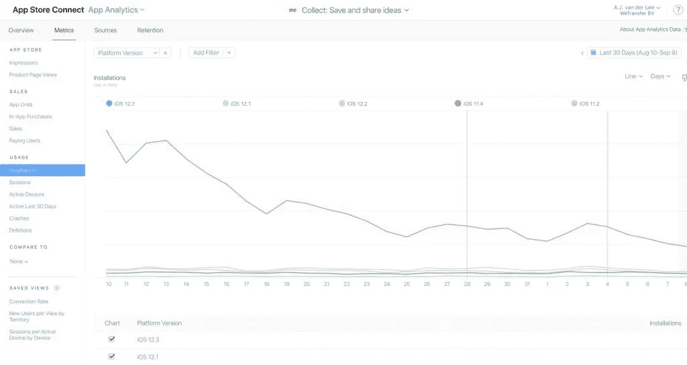
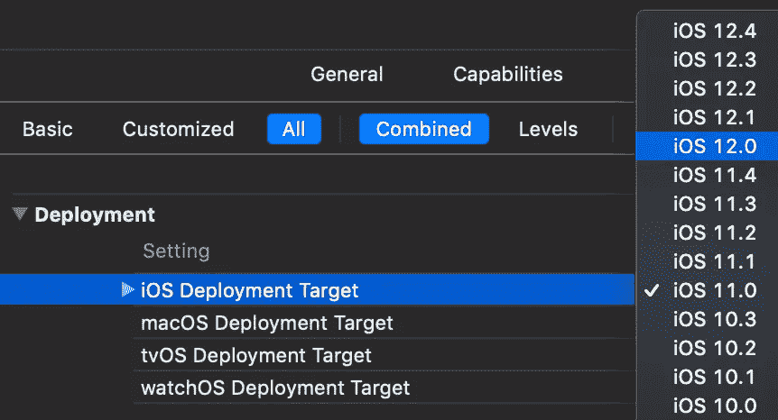

# 选择支持的最低 iOS 版本

> 原文：<https://betterprogramming.pub/picking-a-minimum-ios-version-to-support-c55499875354>

## 当苹果推出更新时该怎么做

当一个新的 iOS 版本到来时，通常需要一段时间来决定你的项目应该设置为哪个最低 iOS 版本——这是一个需要深思熟虑的重要决定。

我们在 iOS 采用率方面很幸运——我们的大多数用户在一年内将更新到最新版本。

*你停止了对老款设备的支持，但这并不意味着他们不能再使用你的应用。*

# 什么是最低 iOS 版本？

最低 iOS 版本是您的应用程序支持的最低 iOS 版本。运行旧版本 iOS 的用户将无法从 app store 下载您的应用程序。

最低 iOS 版本可以在 *iOS 部署目标*下的构建设置中进行设置。macOS、tvOS 和 watchOS 也是如此。

# 我的应用程序应该支持哪个最低 iOS 版本？

这是一个大问题，答案因情况而异。许多公司依赖“当前减一”规则，这归结为支持最新和以前的 iOS 版本。

然而，这并不总是那么容易。有很多原因可以让你做出不同的决定。正如上面的民意调查显示，这不是每个人都一样的决定。

# 放弃(不放弃)iOS 版本的原因

## 失去客户和收入:看看你的数据

放弃一个 iOS 版本意味着失去客户，失去客户可能意味着失去收入。

这取决于具体情况，可以根据您的分析数据来决定。了解每个 iOS 版本的活跃用户数量，了解继续支持旧版本 iOS 的价值。

## 新的 API 仅在较新的 iOS 版本上可用

有时，您的应用程序有一个非常特殊的用例，需要最低 iOS 版本才能使用新的 API。一个例子是某些 Siri 功能、ARKit 或机器学习功能。

## 时间

你支持的每个 iOS 版本都需要测试，这可能会占用很多时间。如果旧版本的 iOS 包含某些需要修复的错误或功能，则需要更长时间。因此，时间可能是放弃 iOS 版本的一个重要原因。

上一段讨论了删除基于某些已发布 API 的版本的事实。虽然你可以为旧版本的 iOS 创建你的应用程序，但是新的 API 可以让你的开发速度提高一倍，因为它们只是让实现某个功能变得更容易。这可能是另一个与时间相关的放弃支持的原因。

# 数据，数据，数据

虽然之前提到过，但在放弃一个 iOS 版本时，数据是你最好的朋友。确保你了解事实，并对你的应用程序放弃某个 iOS、macOS、tvOS 或 watchOS 版本意味着什么有一个概述。

如果您没有内置任何分析，您可以随时转到 App Store Connect 中的应用分析页面。

App Store Connect 中的应用分析

# 说服你的同事或经理

你可能很清楚你应该放弃 iOS 版本，但你并不孤单。确保你有理由放弃 iOS 版本，并用它们来说服你的同事和经理。你不应该放弃一个 iOS 版本，因为它让你的开发者生活变得更容易。进一步思考，进行推理，说服你的同事放弃 iOS 版本对你和产品都更好。

如果你做不到这一点，你应该对自己诚实，再等几个月，再来看看这个决定是否有所改变。

# 如何删除 iOS 版本

最简单的方法是将 iOS 部署目标更改为新的最低 iOS 版本:

更改支持的最低 iOS 版本

然而，为了使这个过程顺利进行，你还可以做更多的事情。

## 准备并决定如何处理您最后支持的版本

你正在放弃对旧设备的支持，但这并不意味着它们不能立即使用你的应用。如果他们已经安装了您的应用程序，他们仍然可以使用。

因此，考虑您希望在这个最新支持的版本中可用的特性是很重要的。有时你可以决定为你最近的新特性创建一个稳定的版本，这样那些用户至少有一个最新的版本。

## 通知用户

如果你是一个好公民，你会确保不支持的 iOS 版本的用户得到通知。告诉他们，他们运行的是不受支持的 iOS 版本，只有更新他们的 iOS 设备，他们才能获得最新版本。尽管由于设备老旧，这可能并不总是对每个用户都可行，但它至少会确保其他用户考虑更新他们的软件。随着采用率的增长，这将使您和其他开发人员都感到高兴。

## 更新您的代码库

一旦你决定了支持哪个最低版本的 iOS 来更新你的代码库。首次使用新的部署目标构建时，Xcode 会自动显示新的警告:

*   不再需要的某些检查
*   从新的最低部署目标开始，不推荐使用的方法

花时间直接解决这些问题，或者提前计划并确保以后解决它们。

## 观看老 WWDC 会议

你可能会对此感到惊讶，但这实际上是我开始写这篇博文的主要原因之一。旧的 WWDC 会议仍然是非常有价值的，你现在实际上可以直接从那些会议开始实现代码，因为你提高了你的最低 iOS 版本！

要知道现在哪些 WWDC 会议是相关的，可能有点难。为了简单一点，这里有一个简单的列表:

*   iOS 12 掉的时候看 WWDC 2019
*   掉 iOS 11 的时候看 WWDC 2018
*   摔 iOS 10 的时候看 WWDC 2017
*   摔 iOS 9 的时候看 WWDC 2016

我想指出的是，一旦相关的 iOS 版本发布，你可以直接从这些会话开始实现代码。然而，你不会是第一个跳过它，等到你实际上只支持 iOS 版本和更高版本的开发者。对于那些开发人员(比如我)来说，重新访问那些旧的会话并看看现在可以开始实现哪些部分是有价值的。

# 结论

如果你独自开发一个应用程序，删除 iOS 版本可能很容易，但如果你在团队中工作，就很难了。慢慢来，浏览你的数据，找理由说服你的团队成员做出一个稳妥的决定。

谢谢！