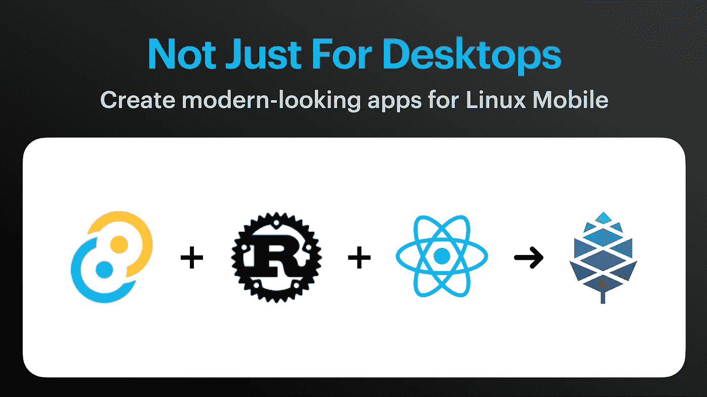
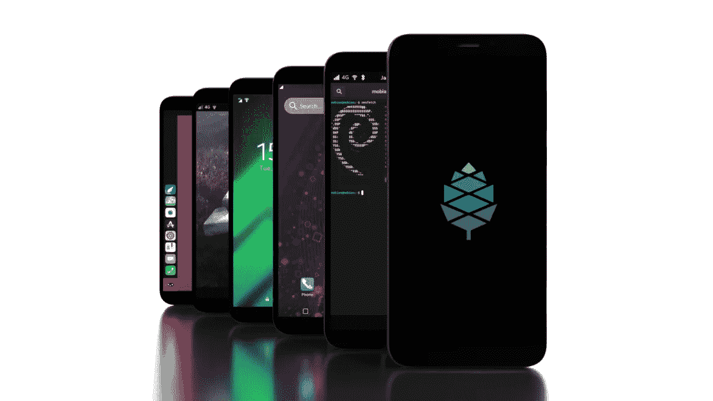
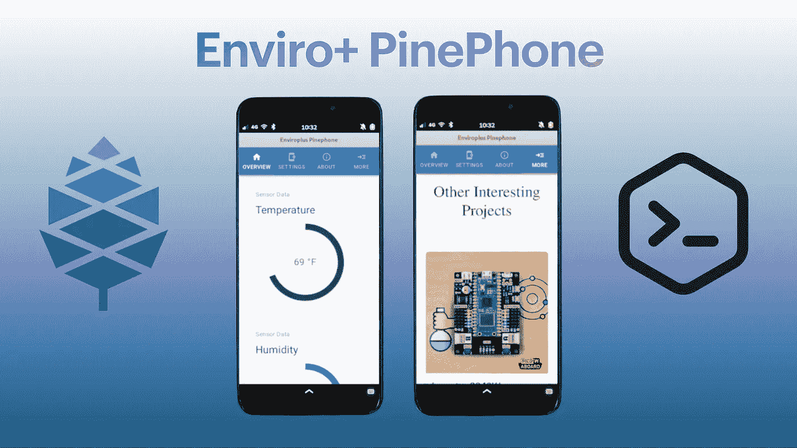

# 用 React 和 Tauri 构建您的第一个移动 Linux 应用程序

> 原文：<https://betterprogramming.pub/pinephone-app-development-a-quick-start-guide-97f2d90a334c>

## PinePhone 应用开发:快速入门指南



为 PinePhone 创建应用程序的新方法

在过去的几年里，纯 Linux 驱动的移动设备已经成为主流。在 Android 设备上运行定制内核的能力并不新鲜，iPhone 越狱也是如此。

这里的不同之处在于，这些设备(至少其中许多设备)都是从零开始构建的，专注于免费和开源技术。因此，他们的目标是运行完全开放的基于 Linux 的操作系统，并且在许多情况下包括物理硬件开关来禁用各种组件，以提供额外的用户隐私。

功能更强大、价格更低廉的 ARM 芯片的出现，意味着许多设备有可能达到或接近运行 iOS 或 Android 的中档闭源设备的水平。

许多爱好者和开发人员(比如我自己)已经开始蜂拥购买这些设备，这让我们中的许多人在得到一台设备后都有了同样的问题:**“这太棒了，但是我该如何为它创建自己的应用程序呢？”**。我希望这篇文章能帮助你们中的一些人回答这个问题，并帮助你们为这些流行的设备开发自己的应用程序！

毫无疑问，市场上最受欢迎的男士晚礼服手机之一是由 T4 pine 64 T5 生产的 T2 pine phone T3(以及最近的 PinePhone Pro)。不幸的是，我的预算中没有购买新的专业版，所以只能选择开发第一代社区版。这里概述的项目绝不是局限于在这些设备上运行。如果你有一个类似于 Librem 5 的 Purism，看看你如何让它工作！



松果电话

在我的上一篇文章中，我写了一个叫做 Tauri 的新框架，我已经开始用它来取代我的基于电子的项目(查看一下)。与 Electron 不同，它使用 Rust 来处理所有后端功能，并允许使用 web 技术来构建您的 UI，而无需使用服务器来进行通信。使用 Tauri 的另一个优势是最终二进制文件的整体大小大大减小，这使得上传、共享和传输到您的设备上变得更加容易。

尽管我最初使用 Tauri 创建了一个新的桌面应用程序，但我认为在 PinePhone 上测试它的功能会很棒！让我们进入正题，好吗？

# 开始项目

Tauri 文档提供了使用命令行工具从头创建新项目的优秀指南，包括使用您选择的前端框架生成完整框架的能力。因为我已经使用 React 开发了一个 web 应用程序，所以我已经有了 UI 代码结构。既然是这样，我需要做的就是在项目目录中创建 Tauri 所需的 Rust 和配置文件:

安装 CLI 工具→ `yarn add -D @tauri-apps/cli`

初始化 Tauri → `yarn tauri init`

如果您正在从头开始创建一个全新的项目，并且您需要为前端和后端生成所有需要的文件**，您应该运行:**

```
yarn create tauri-app
```

## 后端功能

因为我正在构建一个需要定期向本地网络上的 Raspberry Pi 发出 GET 请求的仪表板应用程序，所以我必须确保包含我的应用程序的其他版本用来发出这些请求的相同后端 Rust 函数。

使用 Tauri，不需要为 UI 创建一个`preload.js`文件来调用后端函数。相反，所需要的只是将`@tauri-apps/api`库添加到您的`package.json`文件中。然后，您可以通过以下导入从 JavaScript/React 代码中调用该函数:

```
import { invoke } from '@tauri-apps/api/tauri'
```

使用`invoke`，您可以通过名称调用您的后端函数，传递任何必要的参数。对于我的应用程序，我使用一个 JavaScript 函数进行调用，该函数传递我发出请求的 URL 端点，以便检索特定的传感器值:

相应的后端函数包含在 Tauri 在项目的`src-tauri`目录中创建的`main.rs`文件中:

记住这一点很重要，因为这个应用程序是专门为在 PinePhone(或其他移动 Linux 设备)上运行而编写的，**组件大小和窗口尺寸需要考虑在内。**为了让您了解什么样的尺寸最适合这个项目，我已经创建了一个公共 Gitlab repo，其中包含所有源代码以及成功运行该应用程序的说明:



最终产品

[](https://gitlab.com/dedSyn4ps3/enviroplus-pinephone) [## ed Rutherford/enviro plus pine phone git lab

### GitLab.com

gitlab.com](https://gitlab.com/dedSyn4ps3/enviroplus-pinephone) 

# 二进制创作

一旦你完成了设置你的界面和任何后端函数调用的过程，测试和调试了所有的东西，你可能想要构建一个最终的产品！因为这些设备运行 Linux，Tauri 将构建一个`.deb`和`.AppImage`二进制文件来运行和分发您的应用程序。构建一切就像跑步一样简单:

```
yarn tauri build
```

当我试图在`aarch64`平台上运行时，我确实注意到了自动化 AppImage 构建脚本的一个问题，所以为了成功地完成我的应用程序的 AppImage 构建，我简单地下载并运行了`appimagetool`实用程序来完成打包:

之后，您将得到一个全新的 AppImage，内置了运行所需的一切！简单地使它可执行，并运行它来享受你的新 PinePhone(或类似的)应用程序！

# 一句警告

我爱我的 PinePhone 手机，但是当涉及到在设备上单独进行所有的开发时，我建议不要这样做。**它有足够的能力**，但是热重装会比你想要的花费更多的时间*，构建最终的二进制文件*也是如此。

我发现在一个独立的 ARM 驱动的设备(我的 Raspberry Pi 4)上进行大部分开发和调试要快得多。一旦你算出了正确的窗口尺寸，`dev`预览仍然提供了一个准确的应用程序的外观。

在 Pi 上构建最终的可执行文件后，使用`scp`或图形`SFTP`工具转移到 PinePhone 上非常简单！