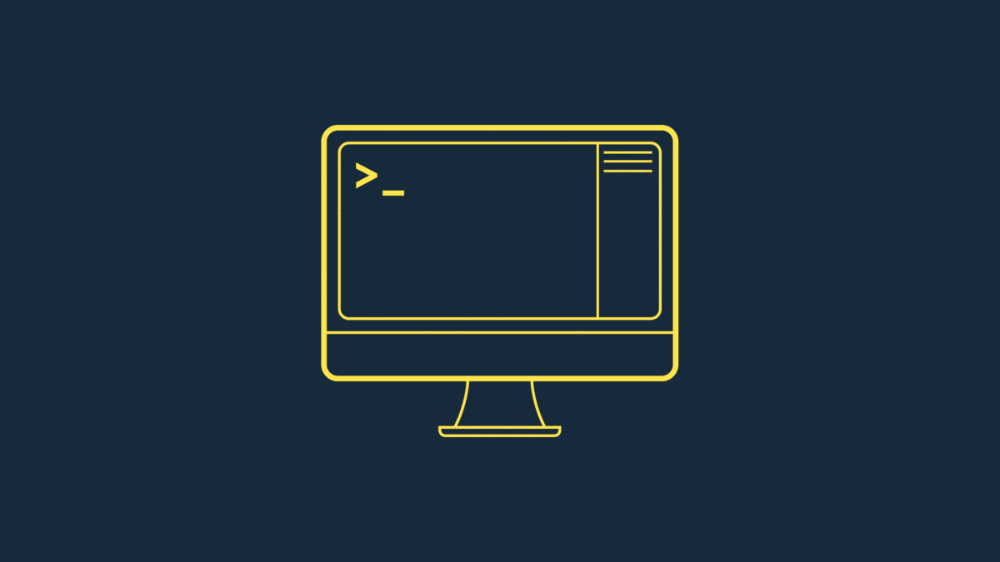
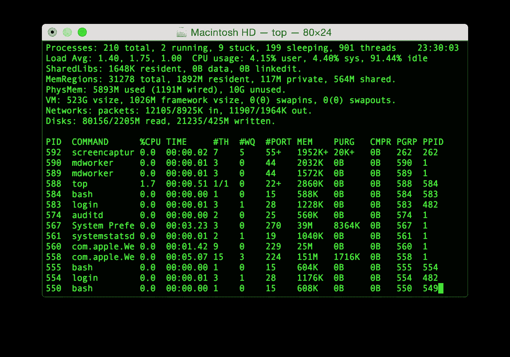

# 先锋挑战:建立一个新的终端

> 原文：<https://betterprogramming.pub/pioneer-challenge-a-new-terminal-b1c609a420e9>

## 自 20 世纪 80 年代以来，我们的终端没有多大变化。让我们改变这一点

图片来源:作者

自 20 世纪 80 年代以来，该航站楼一直没有太大变化。你工作流程的每个其他方面都是完全不同的。特别是在过去的十年里，我们看到公司随着协作软件的出现而改变了行业:Figma(协作设计)，Github(协作代码)，G Suite(协作 Word 和 Excel)，等等。

我们预计，随着疫情的发展，实时协作将主导未来的市场，并迫使人们和企业一起上网。一个全新的领域向雄心勃勃的工程师敞开了大门。

那么，下一步是什么？我们相信 Terminal.app 的创新时机已经成熟。

这在多人模式下会是什么样子，是为团队建造的？肯定有更简单的方法来管理对 AWS/GCP 的捐赠。聊天、跨团队的 CMD+R 和其他 plum 集成(堆栈溢出、Ruby docs、GPT-3)怎么样？

至少，重新想象工程师的指挥中心是一个有趣的实验。如果成功，你的工作有可能从根本上改变这个星球上每个开发人员的工作。

我们很兴奋地宣布我们的第二个先锋挑战:**建造一个新的航站楼。**

**上手:**【https://pioneer.app/challenge】T4

# 它是如何工作的

这一挑战有三个不同的部分。以下是一个概述:

第一阶段:黑客马拉松。任何人都可以参加的 48 小时黑客马拉松，从 8 月 7 日开始。

从黑客马拉松中选出五名获胜者，如果他们愿意，可以免费加入公司。没有股权交换。(所有参与者都将获得免费的 [Repl.it](https://repl.it/) 积分。)

**第二阶段:原型月。这五家公司花了一个月的时间建造他们的原型。每周进度视频在 Frontier 上分享。**

**第三阶段:冠军赛。**一个月后，由大众投票和我们团队共同选出获胜团队。获胜者将获得先锋金:20，000 美元，换取公司 5%的股份。

要开始，在这里用你的名字和过去的项目[注册。](https://pioneer.app/challenge)

# 寻找

*   如果你把获胜的队伍推荐给我们，我们会给你公司 0.5%的股份。你需要他们注册一个独特的链接，你可以在这里为自己生成。
*   可能会有极端的情况，我们*不能*授予你股权(例如，取决于你所在的国家)。我们会尝试用尽所有合理的法律手段来解决这个问题。

**现在申请:**【https://pioneer.app/challenge】T2

# 常见问题解答

## **我怎么知道要造什么？**

花时间与其他开发人员交谈，询问他们的问题，并围绕这些问题开发一个产品。发挥创造力。这里有一个视频可以让你的车轮转动起来:

## 如果我赢得了黑客马拉松，我必须参加挑战吗？

是啊！

## 黑客马拉松将在哪里举行？

所有提交的内容都将通过 [Frontier](https://frontier.pioneer.app/) 托管。在 8 月 7 日星期五之前，你不需要在 Frontier 上发表文章。

## 我们能在黑客马拉松开始前开始黑客活动吗？

不会。所有参与者将在太平洋时间周五中午 12:00 开始黑客攻击。决赛选手将被要求与组织者分享他们的代码，以确认他们在活动开始前没有开始编码。

## **黑客马拉松的评判标准是什么？**

黑客马拉松和挑战赛获胜者的评判标准和奖品在这里[列出](https://docs.google.com/document/d/1jg8tgD_Y2qZmIdYlkObwb-0tMlIzAwPIeK921aZwKcU/edit)。

## 谁是黑客马拉松&挑战赛的评委？

先锋队将选出五名黑客马拉松获胜者。挑战赛的前三名将由公众投票选出。先锋将从剩下的三个中选出获胜者。

## **我可以加入但不参加挑战赛吗？**

为了组建你的公司，你必须承诺参加为期四周的挑战。

## 我需要联合创始人吗？

不要！可以一个人开始。如果你愿意，我们的介绍性纯音频电话可能是一种以低调方式与他人见面的有趣方式。我们的松弛小组是另一个联系的机会。

在挑战过程中，你如何记录参赛者的进步？

周二和周五，五支参赛队伍将在 Frontier 上提供最新进展。这些更新是对 WhatsApp 内部小组的补充，该小组致力于更随意、更频繁的对话。

我已经参加了先锋锦标赛，这对赢得普通锦标赛有何影响？

双重胜利条件有点非目标。我们建议你要么(a)继续参加常规锦标赛，做你喜欢的任何事情，要么(b)完全转向尝试这项挑战。同时做这两件事会很难。

如果我有更多问题怎么办？

请发送电子邮件至 team@pioneer.app。