# Pipedream: API 集成变得简单

> 原文：<https://betterprogramming.pub/pipedream-api-integration-made-easy-f098de654cd1>

## 了解如何使用 Pipedream 通过几次点击来连接 API

照片由[麦克多比胡](https://unsplash.com/@hjx518756?utm_source=medium&utm_medium=referral)在 [Unsplash](https://unsplash.com?utm_source=medium&utm_medium=referral) 上拍摄

[Pipedream](https://pipedream.com/docs/#what-is-pipedream) 只需点击几下鼠标就能组合强大的 API。这是一个集成 API 的无服务器平台。想象一下把 Slack 和吉拉、Telegram 和 Twitter 联系起来，等等。

在本文中，我将介绍 Pipedream 的主要功能。然后，我们将建立一个小的演示项目，看看它是如何简单的工作。

我们开始吧！

# Pipedream 概述

Pipedream 是一个非常棒的低代码平台，可以帮助开发人员非常快速地集成 API。主要思想是将代码“粘合”到一系列工作流步骤中。

## 主要特征

*   完全托管的环境——pipe dream 托管并运行您的代码，因此您无需管理服务器或云资源。
*   OAuth 授权——您不必担心身份验证的实现。例如，您只需将您的 Slack 帐户连接到工作流步骤，并开始使用 Pipedream 生成的访问令牌发送请求。
*   JavaScript 支持—在 Node.js 代码步骤中使用任何 npm 包。Pipedream 宣布 Python、TypeScript 和 GitHub 支持即将推出。
*   大量集成应用程序列表 —将您的应用程序与 AWS、PayPal、Twitter、Yahoo、BitBucket、Discord 等平台连接起来。
*   许多集成的应用程序中都有大量现成的预构建动作，您可以简单地采用他人的代码(动作)并在您的应用程序中使用它。例如，提取推文、创建吉拉机票、发送聊天消息等。类似于 GitHub 中的分叉。
*   免费帐户——如果你注册，你每天可以获得 10，000 次免费调用。

## 用例

为了体验使用 Pipedream 可以构建什么，请考虑以下场景:

*   给自己发邮件，不需要设置域名。
*   实时情感分析—使用 HTTP 请求立即分析文本。
*   数据库自动化—按计划查询 PostgreSQL。
*   聊天集成—获得自定义事件的通知。
*   将 Webhook 请求发送到工作流的端点。

# 项目演示

在这一节中，我们将把 Twitter 与 Slack 联系起来。它将展示集成不同的 API 是多么简单。在项目设置期间，我将解释术语，以便您可以随时学习。

过去几年，加密货币一直是一个热门话题。在这个小项目中，我们将监控 Twitter 的特定加密提及。然后，我们将在 Slack 中给自己发送一条包含提取信息的聊天消息。

1.  在 Pipedream 中创建一个帐户。
2.  转到[工作流程](https://pipedream.com/workflows)选项卡并点击**新建。**

*   *工作流是作为一系列线性步骤执行的代码片段。它们支持应用程序、数据和 API 的集成。例如，您可以有一个工作流来监控 Twitter 的新提及，并给自己发送一条电报消息。*

3.选择 **Twitter** 作为触发器，选择**搜索提及**作为事件源:

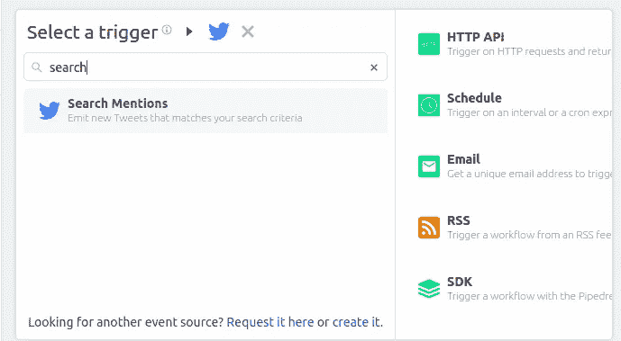

4.连接您的 Twitter 帐户。你需要允许 Pipedream 使用 Twitter。

5.配置**搜索提及**步骤。以下是我的示例配置摘要:

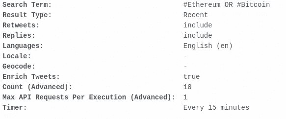

搜索提及配置

你可以看到我正在检查以太坊或比特币推文。请注意，默认运算符是 AND。

6.创建源。然后点击 **+** 符号，添加一个新的带有动作的步骤。

我们想添加**松弛时间**和**发送直接消息**作为操作:

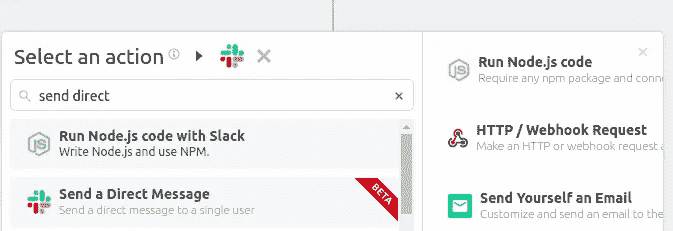

*   *步骤构建工作流程。例如，可以有发送电子邮件的步骤。您可以在步骤之间传递数据变量。通过这种方式，这些步骤可以相互通信。*
*   *动作使您能够重用您的代码，并使其对 Pipedream 用户可用。你可以采取任何行动，并改写它，使之符合你的需要。一个示例操作是向 Google 工作表添加新数据。*

7.连接您的 Slack 帐户。

8.以下是我的配置示例:

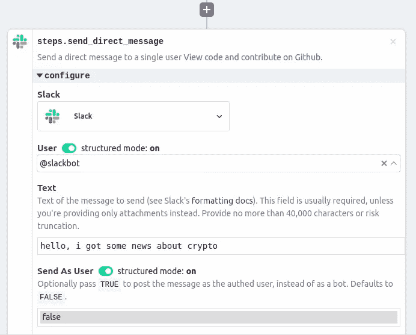

9.单击保存并部署。

现在管道正在等待事件。

*   *触发器定义何时执行您的工作流。触发器可以是聊天消息、HTTP 请求等。您还可以设置一个 cron 调度程序，在指定的时间执行您的工作流。*

请记住，我们设置了一个 cron 作业，每 15 分钟运行一次。如果您想立即测试代码，点击**编辑代码和配置**:

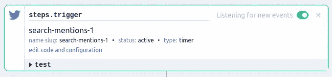

点击**事件**标签页:

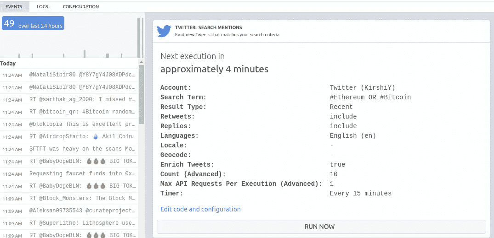

事件选项卡

您可以在这里看到您的配置。要立即运行，点击**立即运行**。

现在，转到**日志**选项卡检查结果:

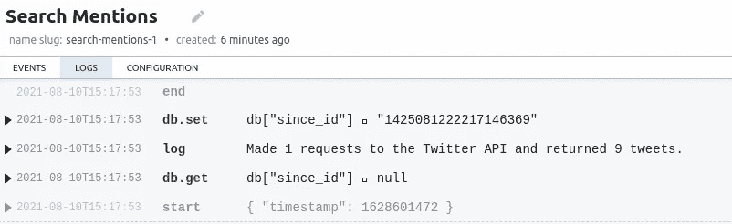

酷！一些推文符合搜索标准。

让我们看看 Slack 上发生了什么:

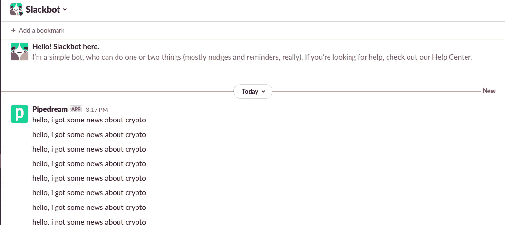

太好了——我收到了 SlackBot 的 9 条信息。不幸的是，他们没有帮助。这就是步骤之间的数据传递发挥作用的方式。

我们想发送一条包含推文文本的消息。传递数据非常容易。返回工作流程并修改步骤 **send_direct_message。**

**文本**值应为`{{steps.trigger.event.full_text}}`:

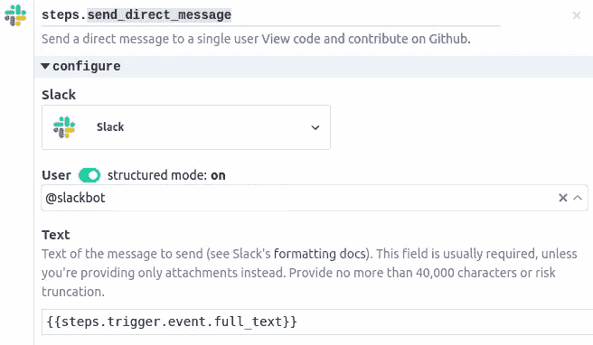

这个值来自我们 Twitter 的步骤:

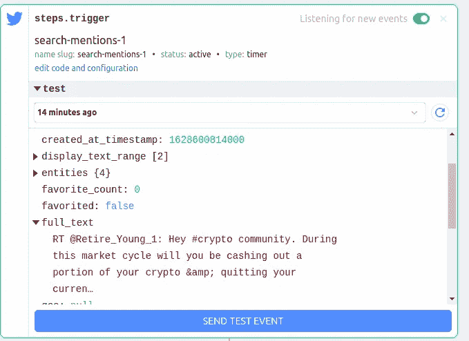

保存并部署更改。

要么重新运行事件，要么简单地使用**发送测试事件**按钮来触发工作流。请注意，自上次调用以来可能没有任何新的 tweets，所以最好使用 test 按钮。

检查您的时差消息:

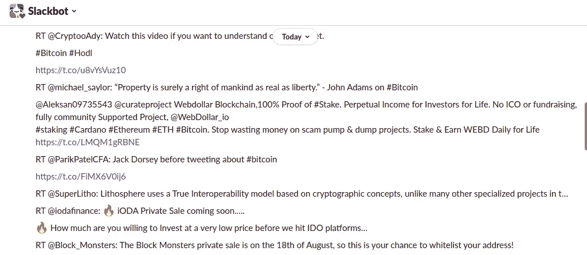

包含 tweet 结果的松弛消息

厉害！现在它像预期的那样工作了。

# 结论

在本教程中，您学习了如何使用 Pipedream 在工作流中集成不同的 API。由于它的低代码特性，使用起来非常简单。

我希望你喜欢这篇文章，并学到了一些新的东西。欢迎在评论中分享你打算用它做什么项目。

我真的很喜欢这个工具，并计划将它集成到我未来的项目中。相关文章敬请关注！

感谢您的阅读，下次再见！