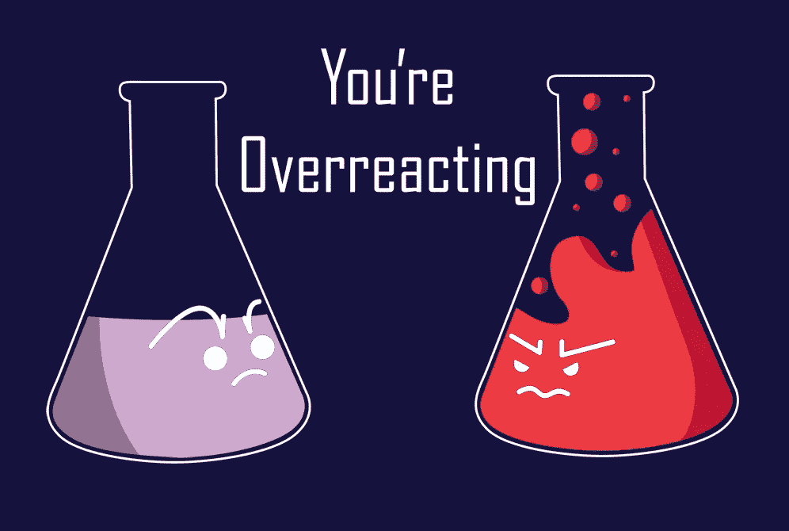
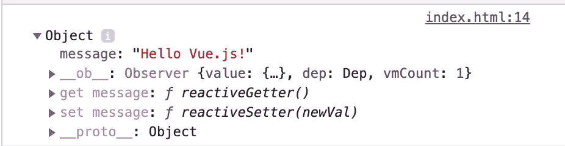
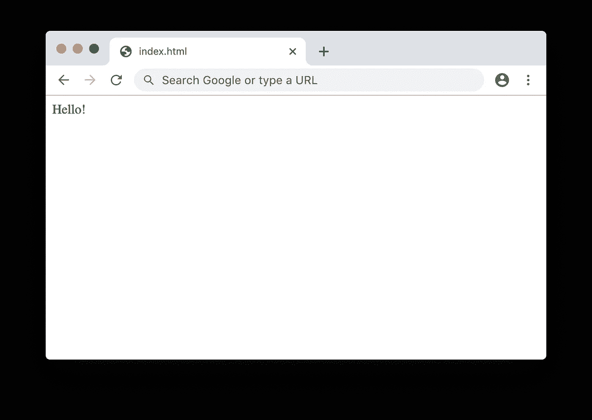
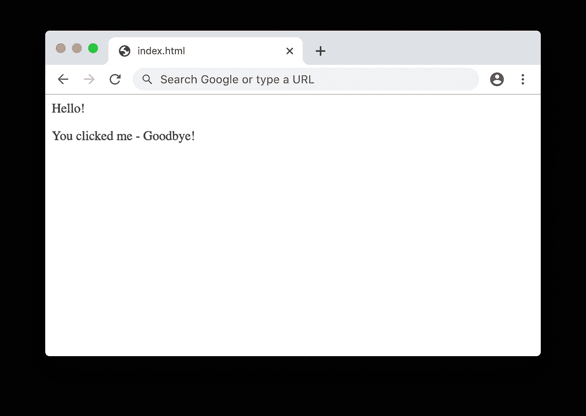

# Vue 反应性的缺陷

> 原文：<https://betterprogramming.pub/pitfalls-of-vues-reactivity-21a5f24ceb38>

## Vue.js 中的数据绑定、重载和反应



我的 Vue 视图有时会拒绝自动重新渲染。在我的代码库中到处抨击之后，我决定适可而止，一头扎进 Vue 的反应系统。

# Vue 的反应性是什么？

Vue 将*数据*绑定到*视图*。

如果您查看这段代码，会发现有一个包含*数据的普通 JavaScript 对象。*在本例中，这是一个值为`Hello Vue.js!`的`message`属性

```
<script src="https://unpkg.com/vue"></script>

<div id="app">
  <p>{{ message }}</p>
</div>
<script>
new Vue({
  el: '#app',
  data: {
    message: 'Hello Vue.js!'
  },
})
</script>
```

*视图*是 HTML 输出。在第四行，我告诉 Vue 显示`message`属性。当在浏览器中呈现时，它将显示“Hello Vue.js！”。


现在，当你改变`message`属性时，反应部分开始发挥作用。Vue 的反应系统将检测对`message`的更改，并更新 HTML 以显示新值。回到以前的 jQuery，您必须手动选择正确的 HTML 节点并更新其内容。

这是和以前一样的代码，但是现在当点击`#app`元素时，消息属性将把值改为“你点击了我！”。

```
<div @click="message = 'You clicked me!'" id="app">
  <p>{{ message }}</p>
</div>
<script>
new Vue({
  el: '#app',
  data: {
    message: 'Hello Vue.js!'
  },
})
</script>
```

当点击`#app`元素时，Vue 确实会自动更新视图！


# 引擎盖下的一瞥

当你设置`data`对象时，Vue 会自动为每个属性添加 getters 和 setters。

您可以致电`console.dir(this.$data)`亲自查看:

```
<script>
new Vue({
  el: '#app',
  data: {
    message: 'Hello Vue.js!'
  },

  mounted() {
      console.dir(this.$data);
  }
})
</script>
```

当打开控制台时，您可以看到 Vue 创建的`get message`和`set message`属性。



每当设置了`message`属性的值，就会自动调用`set message`函数，这将触发视图的重新呈现。

# 陷阱 1:数组

到目前为止，一切都很好。如果我更改了`message`属性，视图会被重新渲染。

但是假设我将代码改为如下:

```
<script src="https://unpkg.com/vue"></script>

<div @click="message[0] = 'You clicked me!'" id="app">
  <p>{{ message[0] }}</p>
</div>
<script>
new Vue({
  el: '#app',
  data: {
    message: ['Hello Vue.js!']
  },
})
</script>
```

一切都是一样的，除了我现在将消息存储在一个数组中。

当我加载页面并点击元素时，没有任何反应。


Vue 将为`message`属性创建一个`getter`和`setter`。但是我更新的是`message`数组中的一个值，而不是数组本身。因此，不会自动触发重新渲染。

# 陷阱 2:添加对象属性

当页面被点击时，我想显示一个再见消息。

我将欢迎信息存储在`message.welcome`中。

```
<script src="https://unpkg.com/vue"></script>

<div @click="message.goodbye = 'You clicked me - Goodbye!'" id="app">
  <p>{{ message.welcome }}</p>
  <p v-if="message.goodbye">{{ message.goodbye }}</p>
</div>
<script>
new Vue({
  el: '#app',
  data: {
    message: {
        welcome: 'Hello!'
    }
  },
})
</script>
```

当页面被点击时，我将添加`message.goodbye`属性。当我点击页面时，应该会出现再见信息，对吗？



但是什么也没发生。仅显示欢迎消息。

这是因为 Vue 将在其生命周期的开始添加`getters`和`setters`。如果在 Vue 实例化后添加属性，它不会知道。因此，设置`message.goodbye`不会触发`setter`，因此 Vue 不会重新渲染。

# 解决方案 1:强制更新

一种解决方案是使用`$forceUpdate()`。这将强制重新渲染当前组件，包括其子组件。

我更新了数组示例代码，以便在组件被单击时调用`$forceUpdate()`:

```
<script src="https://unpkg.com/vue"></script>

<div @click="() => { message[0] = 'You clicked me!'; $forceUpdate(); }" id="app">
  <p>{{ message[0] }}</p>
</div>
<script>
new Vue({
  el: '#app',
  data: {
    message: ['Hello Vue.js!']
  },
})
</script>
```

# 解决方案 2 : Vue 集

`Vue.set()`函数将*给一个对象或数组添加一个反应属性。*

不幸的是，您不能从视图中调用`Vue.set()`函数。所以我加一个`handleClick()`方法。该方法将索引`0`处的`message`数组的值设置为`"You clicked me!"`。

```
<script src="https://unpkg.com/vue"></script>

<div @click="handleClick()" id="app">
  <p>{{ message[0] }}</p>
</div>
<script>
new Vue({
  el: '#app',
  data: {
    message: ['Hello Vue.js!']
  },

  methods: {
      handleClick() {
          Vue.set(this.message, 0, 'You clicked me!');
      }
  }
})
</script>
```

类似地，我可以更新对象属性示例代码来使用`Vue.set()`函数。

```
<script src="https://unpkg.com/vue"></script>

<div @click="handleClick()" id="app">
  <p>{{ message.welcome }}</p>
  <p v-if="message.goodbye">{{ message.goodbye }}</p>
</div>
<script>
new Vue({
  el: '#app',
  data: {
    message: {
        welcome: 'Hello!'
    }
  },

  methods: {
      handleClick() {
          Vue.set(this.message, 'goodbye', 'You clicked me - Goodbye!');
      }
  }
})
</script>
```

在浏览器中运行时，视图会自动重新呈现！



以我的经验来看，如果你完全掌握了 Vue 的反应性系统，就省去了很多令人头疼的问题和调试时间。希望这篇文章能让这个系统更加清晰。