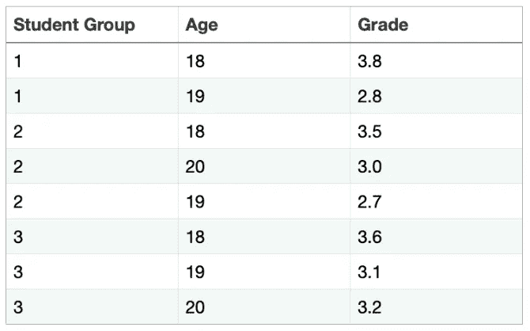
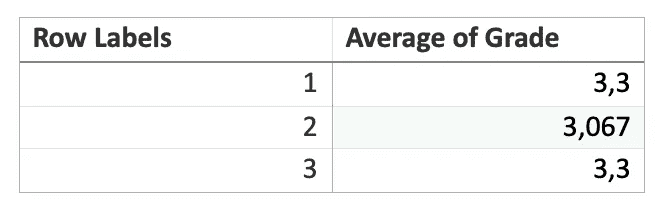
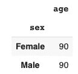
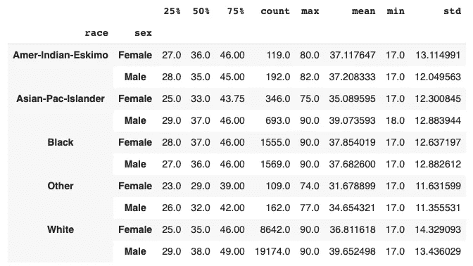
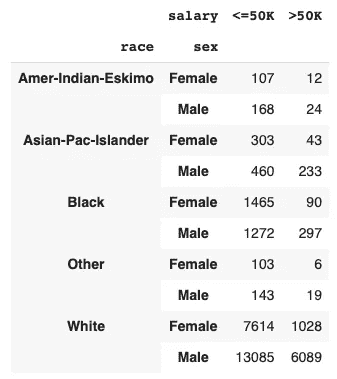
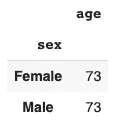
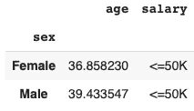
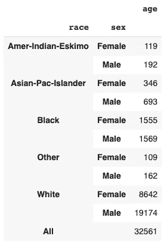

# 带熊猫的 Python 数据透视表

> 原文：<https://betterprogramming.pub/pivot-tables-in-python-with-pandas-d9b42b040bb3>

## 最强大的数据分析工具之一的完整指南


诺德伍德主题公司在 [Unsplash](https://unsplash.com?utm_source=medium&utm_medium=referral) 上拍摄的照片

让我们假设你有很多数据，你不知道如何处理这些数据。或者，假设您需要确定数据中的潜在模式，但不知道如何去做。或者，您可能正忙于创建一些奇特的数据表。

所有这些场景都可以用一个伟大的工具来解决:数据透视表。

数据透视表基本上是通过按特定功能对原始数据进行分组并使用某种函数聚合所需值而创建的表。让我们看一个例子来更好地理解这个定义的含义。

# 例子

假设你是一名学校官员，想要确定哪个老师在他们班的平均成绩方面做得更好。

首先，您有一个来自学校数据库的表，其中每个学生都有一个学生组(每个组有不同的老师)、年龄和最终成绩。



学生数据表

你现在需要做的是以某种方式将你的学生分组，并计算每组学生的平均分数。

结果表将是一个数据透视表，因为我们按组对数据进行分组，并使用均值函数对等级进行汇总(将所有等级相加，然后除以它们的数量)。

我已经在下面创建了所需的数据透视表。



生成的数据透视表

正如我们所看到的，第 1 组和第 3 组的老师做得很好，而第 2 组的老师可能需要更多地与学生合作，以确保更好的学习效果。简单的表格修改帮助我们轻松地回答了这个问题。

数据透视表可以成为数据分析工具箱中最强大、最易于使用的工具之一。因此，让我们深入研究一下吧！

# Python 中的基本数据透视表

为了介绍 Python 数据透视表，我将使用易于访问的开源成人数据[这里](https://archive.ics.uci.edu/ml/datasets/Adult)。它有关于人及其特征的信息，如种族、性别、收入等。您可以使用[这个 GitHub 库](https://github.com/Zhenia-Magic/Adult_Data)下载原始数据和列名

首先，我们需要读取数据(因为它没有内部列名，所以我们需要使用另一个 CSV 文件来读取列并将它们放入数据框中)。

```
import pandas as pd
import csv

with open('col_name.csv', newline='') as f:
    reader = csv.reader(f)
    cols = list(reader)

def flatten(t):
    return [item for sublist in t for item in sublist]

cols = flatten(cols)

data = pd.read_csv("adults.csv", names=cols)
```

对于本文的第一个 Python 数据透视表，我想确定每个性别的最大年龄。为此，我将为数据透视表编写熊猫函数。

它被称为`pd.Dataframe.pivot_table`，具有以下关键参数(还有更多，但在大多数情况下不使用):

*   `index`:数据分组所依据的单个列或列列表。
*   `values`:聚合并显示在结果透视表中的单个列或列列表。
*   `columns`:列，我们将根据它(与索引列同时)对数据进行分组。
*   `aggfunc`:数据透视表中值的聚合函数或函数列表。

我们问题的结果代码是:

```
data.pivot_table(index="sex", values="age", aggfunc="max")
```



生成的数据透视表

## 增加复杂性

下一个数据透视表将是一个多索引数据透视表。如何确定数据中存在的年龄模式？我们将使用 race 和`sex`作为分组列，并使用`pd.Dataframe.describe`函数来聚合年龄。于是，我们将几乎不费时费力地看到大量与年龄相关的统计数据。

现在，我们需要为函数的 index 参数使用一个列列表。这个表的代码如下。

```
data.pivot_table(index=["race", "sex"], values="age", aggfunc="describe")
```



生成的数据透视表

我们已经在本文中介绍了`columns`参数，但是让我们看看它在特定情况下是如何有帮助的。

比方说，我们希望使用与之前相同的分组列(`race`和`sex`)并向其中添加`salary`(它是一个值小于或等于 50 K 美元或大于 50K 美元的二元变量)。现在，我要计算每个类别的人数(基于`gender`、`race`、`income`)。

值得注意的是，为了只计算每个单元格中的人数(而不是一些数学运算，如均值或中值)，我可以使用任何既没有缺失值也没有索引参数作为值的列。在我们的例子中，所有的列都没有`NaNs`，所以我可以选择任何一个。为了方便起见，我决定继续留在`age`专栏。

当然，我可以像下面这样简单地编写命令:

```
data.pivot_table(index=["race", "sex", "salary"], values="age", aggfunc="count")
```


生成的数据透视表

哎呦！这张桌子又长又复杂，不容易看出里面有什么图案。

很高兴，有一个解决方案。我们可以对其中一个索引列使用 columns 参数。尽管可以在 columns 参数中使用任何列，但我建议坚持使用唯一值最少的列，以免表太大。

在这里，我可以选择`gender`或者`income`。但是`income`似乎是与`race`和`gender`分开的更好的选择，因为从逻辑上讲，它不是一个人预先确定的生物特征。

新代码如下所示:

```
data.pivot_table(index=["race", "sex"], columns="salary", values="age", aggfunc="count")
```



生成的数据透视表

好像好多了。现在，您已经知道如何创建好看的数据透视表，所以有时间学习熊猫数据透视表的一些高级功能。

# 高级功能

使用数据透视表可以做的最令人兴奋的事情之一是用自己的聚合函数创建它。这样，您可以更加个性化您的表格。

为了理解需要哪种类型的函数作为`aggfunc`参数，让我们深入研究当使用索引列对数据进行分组时实际会发生什么。

当我们为数据透视表提供一个索引列时，例如`sex`，Pandas 会在该列中查找所有唯一值(在我们的例子中是`male`和`female`)，并通过使用这个唯一值过滤索引列来为每个唯一值创建一个单独的数据框。

因此，我们现在有两个内部数据框架:只有女性和男性。随后，对序列(数据框中的一列)使用聚合函数，我们将其标识为值列。

比如可以是年龄。因此，如果我们有平均值`aggfunc`，我们从女性数据框架中提取所有年龄，并计算女性的平均年龄。然后，我们对男士数据框做同样的处理。

因此，聚合函数是值列中的一系列值所在的函数。

现在，让我们看另一个例子。我想找到男女的年龄范围。该范围是序列中最大值和最小值之间的差值。基于系列计算范围的函数如下所示:

```
def range_func(series: pd.Series) -> int:
	return series.max() - series.min()
```

在我们写好一个函数之后，我们可以把它放入`aggfunc`参数中。

```
data.pivot_table(index="sex", values="age", aggfunc=range_func)
```



生成的数据透视表

使用自定义函数，我们不需要使用引号。

使用数据透视表时，另一个潜在的想法是如何对许多值列使用不同的聚合函数。例如，我想计算均值`age`和众数`salary`(`income`最常见的值)。`Age`和`salary`至少在本质上是不同的变量(`age`是数值型的，而`salary`是分类型的)，所以我不能对它们都使用均值`aggfunc`。但是，有一个解决方案。

我们可以将一个字典(其中键是值列，值是我们想要为该值列计算的聚合函数(或多个函数))放入`aggfunc`参数中。参见下面的代码:

```
data.pivot_table(index="sex", aggfunc={"age": "mean", "salary": lambda x: x.mode()[0]})
```



生成的数据透视表

您也可以通过将`margins`参数设置为`True`来添加总数。

```
data.pivot_table(index=["race", "sex"], values="age", aggfunc="count", margins=True)
```



生成的数据透视表

最后一个小建议是，如果由于缺少特定类别的数据而在数据透视表中获得了一些`NaNs`，只需使用`fill_value`参数并将其设置为您想要查看的任何内容，而不是`NaNs`。

尽管没有`NaNs`，以下是如何使用该参数:

```
data.pivot_table(index="sex", aggfunc={"age": "mean", "salary": "mode"}, fill_value=0)
```

# 结论

就是这样！现在你是熊猫里的数据透视表忍者。开始在任何数据分析项目中创建数据透视表，以更好地理解数据特征和模式。感谢阅读。