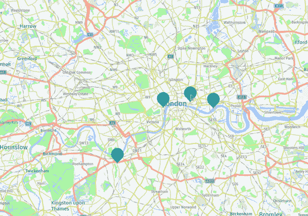
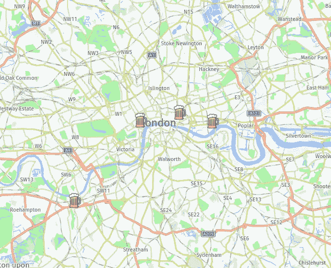

# 使用 Python 和此处的地图规划您的假期

> 原文：<https://betterprogramming.pub/plan-your-holiday-with-python-and-here-maps-aaeeaf9580c3>

## 如何创建自己的地图来可视化您想去的地方


照片由[捕捉人心。](https://unsplash.com/@dead____artist?utm_source=medium&utm_medium=referral)开[退溅](https://unsplash.com?utm_source=medium&utm_medium=referral)。

夏天终于来了。你想去旅行吗？这篇文章可以帮助你进行规划。

网上有很多旅游指南，你可以从中找到一个城市的主要景点。你可以下载一张地图，按照建议去做。但是如果你有一个喜欢的话题，想去某些地方参观呢？

在本教程中，我们将看到如何创建自己的地图，并标记出我们想去的地方。这样，你就可以更容易地组织你的生活，因为你可以在地图上看到这些地方。例如，你可以把最好的啤酒厂、糖果店、艺术博物馆等聚集在一起。

我们开始吧！

# 准备项目

## 收集一份有趣地方的清单

首先，我们来选择一个旅行目的地。在这个例子中，我随机选择了伦敦。酒吧将是我们感兴趣的话题，所以我收集了一份最佳酒吧的清单。

## 准备坐标

现在，我们有一个酒吧名字的列表。我将使用 [geopy](https://pypi.org/project/geopy/) Python 库来检测坐标。

使用`pip`或`pip3`安装库:

```
pip install geopy
```

这是如何获得指定位置的纬度和经度:

```
geolocator = Nominatim(user_agent="your_app_name")
location = geolocator.geocode("London")
print((location.latitude, location.longitude))**(51.5073219, -0.1276474)**
```

## 在地图上标出位置

现在我们有了坐标，想把它们钉在地图上。您可以使用 [Google Maps API](https://developers.google.com/maps) 和 [gmplot](https://pypi.org/project/gmplot/) Python 库来绘制地图。但是由于这个 API 不是免费的，所以我要给你看一个替代品:这里的[API](https://developer.here.com/)。

HERE API 是一个免费的增值工具，可以让您创建自定义地图、可视化位置数据集等等。你可以选择一个免费的计划，每天有多达 25 万笔交易，这对于业余爱好项目来说应该足够了。

您需要设置一个 API 密钥才能使用 HERE 定位服务。按照这些[指令](https://developer.here.com/tutorials/getting-here-credentials/)生成您的密钥。

我们将使用 JavaScript 的[HERE Maps API](https://developer.here.com/documentation/maps/3.1.25.0/dev_guide/index.html)来创建我们的地图。为了将接口与 Python 集成，我们将使用 [Flask](https://pypi.org/project/Flask/) 。这是一个用于创建 web 项目的简单而强大的框架。

安装烧瓶:

```
pip install Flask
```

创建一个新的 Python 文件来构建一个简单的烧瓶模板:

*   我们已经导入了必要的 Flask 和 geopy 库。
*   我们已经定义了一个基本函数，它将基于一个`map.html`文件呈现一个模板。我们将很快创建它。
*   我们已经创建了一个酒吧位置列表，并在字典中提取了纬度和经度。请注意，我只使用了地名，但你也可以写下确切的地址。
*   我们已经从 Python 向 JavaScript 代码传递了`city`和`coordinates`变量。通过将它们放入`{{}}`括号中，您可以在 HTML 或 JavaScript 代码中引用它们。

现在让我们为浏览器中的地图渲染创建 HTML 文件。

Flask 需要一个名为`templates`的文件夹。在文件夹中创建一个`map.html`文件。

代码如下所示:

*   我们已经从`js.api.here`导入了必要的脚本。
*   用你的替换`apikey`。
*   我们已经绘制了一张以伦敦为中心的地图。注意，我们通过调用`{{ city.latitude}}, {{ city.longitude }}`来访问 Python 代码传递的坐标。
*   为了确保地图占据整个容器，我们添加了`addAventListener('resize')`。
*   我们遍历`{{ coordinates }}`值，从纬度和经度值创建一个新的`H.map.Marker`对象。
*   最后，我们将所有标记添加到地图上。

# 测试项目

是时候运行我们的项目了。通过运行 Python 代码启动程序:

```
python3 map_runner.py
```

在`[http://127.0.0.1:5000/](http://127.0.0.1:5000/)`上打开浏览器。你应该看到你的自定义地图。您可以点击标记进行放大，并使用触摸板进行放大/缩小。



带标记的地图

## 升级地图

想让这更有趣吗？让我们给标记添加一些自定义图标。我找到了一个合适的免费图标，更新了这部分代码:

美化后，我们的地图看起来是这样的:



带有自定义图标的地图

太好了！现在我们有了计划。当然，您可以稍微修改代码以包含更多感兴趣的主题，并将所有内容可视化在一张地图上。

# 如何使地图便于携带

以下是几个可以尝试的选项:

*   图截图。
*   将代码部署到您的服务器，并通过您的电话或笔记本电脑访问它。
*   例如，通过使用 AWS 将代码部署到云中。

# 结论

在本教程中，您学习了如何在自己的自定义地图上创建标记。您看到了使用 geopy 库获得坐标是多么容易。

我们只是触及了 HERE Map API 的皮毛。你可以用它实现更多。查看[文档](https://developer.here.com/documentation/examples/maps-js)获取更多示例。

您还看到了如何使用 Flask 框架创建一个简单的 web 项目。你可以在这篇由[hemanthari 2000](https://medium.com/u/c4e35395b2b7?source=post_page-----aaeeaf9580c3--------------------------------)撰写的[文章](https://medium.com/featurepreneur/introduction-to-micro-web-framework-flask-78de9289270b)中了解更多的基础知识。

希望这篇文章能帮你规划下一个假期。欢迎在评论中分享你最想去的地方。

感谢您的阅读和快乐编码！

# 参考

*   [https://pypi.org/project/geopy/](https://pypi.org/project/geopy/)
*   [https://developer . here . com/documentation/examples/maps-js/markers/markers-on-the-map](https://developer.here.com/documentation/examples/maps-js/markers/markers-on-the-map)