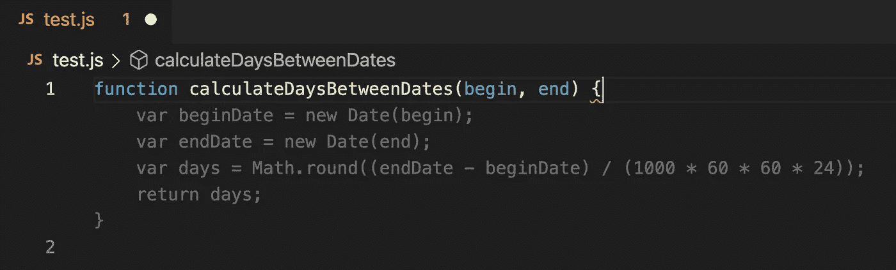
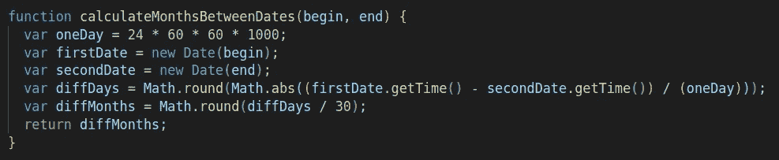
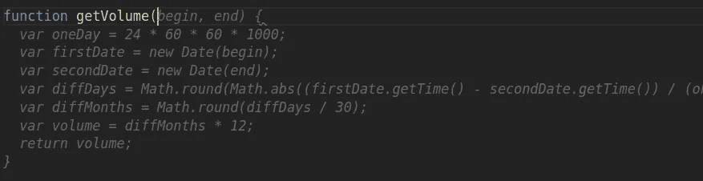
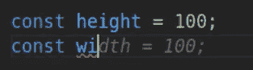
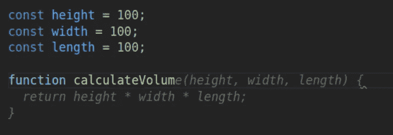
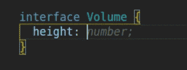
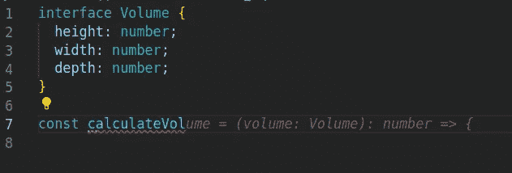
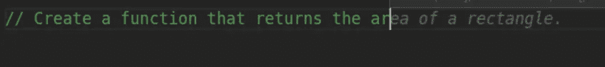
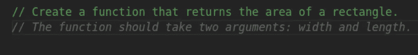
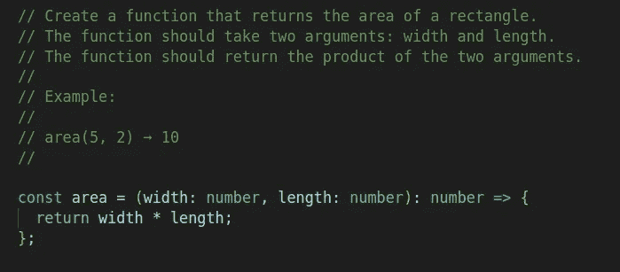

# 通过 Visual Studio 2022 IDE 使用 GitHub Copilot

> 原文：<https://betterprogramming.pub/play-around-with-github-copilot-through-visual-studio-2022-ide-ea56e6638fd9>

## 试用 GitHub Copilot，一窥编程的未来


照片由[安迪·赫尔曼万](https://unsplash.com/@kolamdigital?utm_source=medium&utm_medium=referral)在 [Unsplash](https://unsplash.com?utm_source=medium&utm_medium=referral) 上拍摄

GitHub Copilot 是 GitHub 和 OpenAI 为支持程序员而打造的 AI 工具。

到今天为止，GitHub Copilot 可以作为 Neovim、JetBrains 和 Visual Studio 代码的扩展。

尽管是一个技术预览版，它"*对 Python、JavaScript、TypeScript、Ruby、Java 和 Go 做得特别好，但它理解几十种语言，可以帮助你找到几乎任何事情的方法*，正如 [GitHub Copilot](https://copilot.github.com/) 所报道的那样。

一般来说，如果你对数据科学、web 开发以及更广泛的软件感兴趣，你应该尝试一下。


VS 代码上的 GitHub Copilot 扩展

# 让我们来玩吧！

简而言之，GitHub Copilot 做两件事:

1.  它会自动建议一些你在打字时可能会用到的代码。按下`tab`接受。
2.  如果您对第一个建议不满意，请继续键入或按`Alt + ]`查看下一个建议。如果`Alt + ]`不起作用，你可能有其他扩展使用的相同的键盘快捷键。例如，Jupyter 扩展可能使用`Alt + ]`。但是，您可以更改快捷方式。在 VS 代码中，进入文件>首选项>键盘快捷键下的菜单。(macOS 上的代码>首选项>键盘快捷键)。

边注:我在帖子的最后加了一个快捷方式的总结。

我首先尝试了一些在[文档](https://github.com/github/copilot-docs/blob/main/docs/visualstudiocode/gettingstarted.md#first-suggestion)中提出的例子。根据文件:

1.  创建新的 JavaScript(。js)文件。
2.  键入以下函数头:

```
function calculateDaysBetweenDates(begin, end) {
```

果然，GitHub Copilot 自动建议了文档中的整个功能:



这就是我所得到的，所以我使用文档中的截图

好吧，太好太容易了。

我跟随了太多的向导，那里的一切都是阳光和彩虹，直到我走出建议的道路。

## 在附近散步

然后，我输入了以下内容:

```
function calculateDaysBetweenDates(begin, end) {
```

顾名思义，我想得到两个日期之间的天数。

这类似于以前的功能，我希望它能正常工作。果不其然，我得到了如下函数:



酷，但在我看来还是很简单。

test.js 中的上下文非常清楚，函数名也是如此。

就在这个函数上面，我有了之前的函数`calculateDaysBetweenDates`。

## 走进荒野

我决定尝试一些完全脱离上下文的东西。

当人们开始编码时，他们通常会创建一些函数，在给定一些变量的情况下，输出一个面积或一个体积。所以我简单地输入了:

```
function getVolume(
```

然后砰的一声


[杰夫·金玛](https://unsplash.com/@kingmaphotos?utm_source=medium&utm_medium=referral)在 [Unsplash](https://unsplash.com?utm_source=medium&utm_medium=referral) 上的照片

结果不那么具有爆炸性，但肯定令人振奋:



复制粘贴 lol 炒作这么多。

实际上，这为你应该意识到的一些事情开辟了道路。

# 一些法律上的东西

GitHub Copilot 是在任何许可的公共 GitHub 库上培训的！GitHub 自己也承认一小部分代码可能会被逐字复制。

我注意到了。

由于这个原因，他们得到了一个名为 [GitHub 的自动编码工具处于未经测试的法律基础上](https://www.theverge.com/2021/7/7/22561180/github-copilot-legal-copyright-fair-use-public-code)的帖子。

在这种情况下，一个正在试用 GitHub Copilot 的开发人员注意到，当他要求生成一个关于我的页面时，Copilot 提出了以下文本:

*“我喜欢学习新东西和建造东西”*

和下面的代码

```
I have a <a href="[https://github.com/davidcelis](https://github.com/davidcelis)"> Github</a> account
```

问题是 [davidcelis](https://github.com/davidcelis) 确实存在，目前与副驾驶无关！

目前，GitHub 的首席执行官 Nat Friedman 找到了一个解决方案，他宣布“在公开可用的数据上训练机器学习模型被认为是整个机器学习社区的公平使用”。

这就是所有的人！别担心！

我是否应该认为，推而广之，基于公开可用数据训练的模型将总是公开可用的？

我们会看到的。

# 回到我们的散步

我认为缺少上下文是声明`getVolume`时的问题，所以让我们从给出一些上下文开始。

我从声明一个高度变量开始，结果立刻变得更有趣了:



为上下文添加变量

一个合理的假设是，当我们宣布某种措施时，可能会有一些类似的措施。

我接受了`height = 100`的建议以及以下所有关于宽度和长度的建议！

最后，我再次尝试用一个更恰当的函数来计算体积:



这是一个很好的功能

相当酷！看起来这个工具很有价值！

那么让我们用一些打字稿来测试它吧！

## 键入卷

我开始如下

1.  创建新的 TypeScript(。ts)文件
2.  键入以下界面:

```
interface Volume { 
  height: 
}
```

这是我收到的建议:



界面片段

相当不错！我的意思是，它看起来非常简单，在某种程度上，它让我想起了 typescript 和 [Angular 语言服务](https://angular.io/guide/language-service#angular-language-service)的组合。

然而，远不止如此。

通过简单地接受所有的建议，我很快就用正确的类型创建了一个接口。

在正确的上下文中，Copilot 给出的不仅仅是完成和提示。



Copilot 用类型完成函数声明

## 你可能想尝试的事情

如前所述，如果您对 Copilot 提供的建议不满意，您可以通过以下快捷方式查看更多建议

*   显示下一个建议— `Alt + ] or Option (⌥) + ]`
*   显示以前的建议— `Alt + [ or Option (⌥) + [`

您也可以尝试以下快捷方式:

*   触发建议— `Alt + \ or Option (⌥) + \`
*   在单独的窗格中打开十个建议— `Ctrl + Enter`

还有一些其他的事情值得一提。

Copilot " *可以从简单的注释"*中生成完整的函数。

以下是一些快速截图:



Copilot 会自动完成注释

它不仅在我打字的时候改变了建议，还建议了更多的评论。



副驾驶建议适当的评论

几个`tabs`和`Enter`之后，在通过键入`const`鼓励害羞的副驾驶之后，我可以看到这个功能:



Copilot 建议使用注释和计算矩形面积的功能

# 我的看法

我刚刚开始，感觉棒极了。

在 VS 代码上使用 [Copilot 的开发者也很积极。](https://marketplace.visualstudio.com/items?itemName=GitHub.copilot&ssr=false#review-details)

正如在[文档](https://copilot.github.com/#faq-does-github-copilot-write-perfect-code)中所声明的，GitHub Copilot 并没有写出完美的代码，但是“*试图理解你的意图并尽可能地生成最好的代码，但是它所建议的代码可能并不总是有效，甚至没有意义*”。

尽管有这个警告，结果还是令人印象深刻，我迫不及待地想在一些更大更复杂的应用程序中使用它。

尽管有一些灰色地带。

## 法律方面的东西…

回到这个？

当然，这与我的应用程序无关，但毫无疑问，一些行业不会接受它。

想想金融公司和一般来说处理非常敏感数据的公司。

## …和安全性

根据一些研究， [GitHub 的副驾驶可能会在 40%的情况下将你带入危险水域](https://www.theregister.com/2021/08/25/github_copilot_study/)。

现在的问题是，一般的开发者会做得更好吗？

为了明确起见， [GitHub 声明](https://copilot.github.com/#faq-how-will-github-copilot-get-better-over-time)“*GitHub Copilot 可能会建议使用旧的或不推荐使用的库和语言。你可以在任何地方使用这些代码，但是你要自担风险。*

在这一点上，他们鼓励发现“*危险、有偏见或令人不快的输出*”的开发者向[copilot-safety@github.com](mailto:copilot-safety@github.com)报告。

## 可访问性呢？

我没有探究这一点，但考虑到许多开发人员认为这是事后的想法，一些内联建议可能是一个很好的起点。

## 试验

正如 GitHub 上所宣称的:*测试是任何健壮的软件工程项目的支柱。导入一个单元测试包，让 GitHub Copilot 建议符合您的实现代码*的测试。

也可以在测试文件上使用 GitHub。

# 如何在您的 IDE 中试用 GitHub Copilot

在这一点上，你应该毫不怀疑想要尝试一下。

以下是您需要遵循的步骤:

1.  注册[等候名单](https://copilot.github.com/)以访问 GitHub Copilot 技术预览版。GitHub 的团队在增加容量的同时也将开发者加入到预览版中
2.  收到 GitHub 的确认邮件后，在 IDE 中安装扩展。在 VS 代码中，进入扩展并搜索 GitHub Copilot。你有别的 IDE 吗？遵循这个指南。
3.  系统会提示您将 GitHub 帐户连接到扩展。授权 GitHub Copilot 插件，你就可以开始了。
4.  你需要接受的最后一件事:遥测术语。你可能想了解更多关于 GitHub Copilot 如何收集和使用数据的信息。否则，就这样。

# 快捷方式概述

*   接受建议— `Tab`
*   驳回建议— `Esc`或继续键入
*   显示下一个建议— `Alt + ] or Option (⌥) + ]`
*   显示以前的建议— `Alt + [ or Option (⌥) + [`
*   触发建议— `Alt + \ or Option (⌥) + \`
*   在单独的窗格中打开十个建议— `Ctrl + Enter`