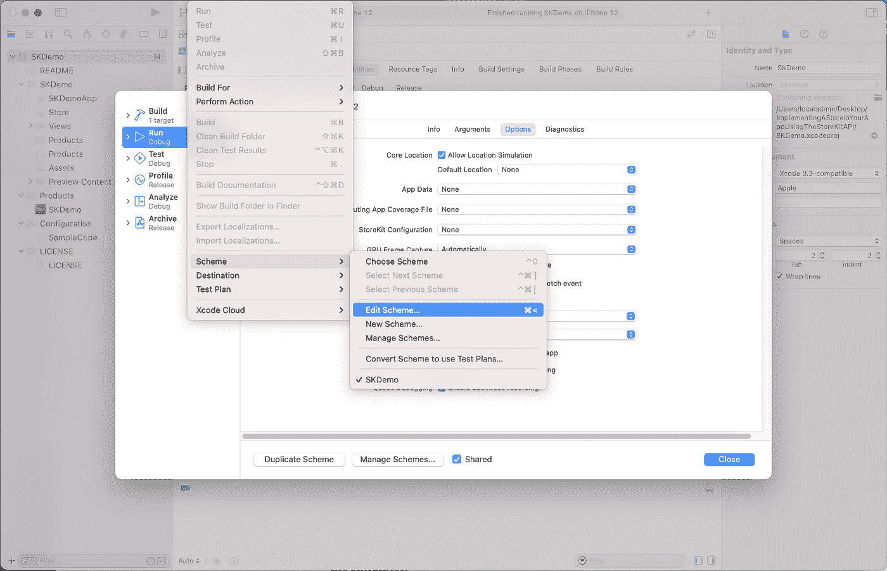
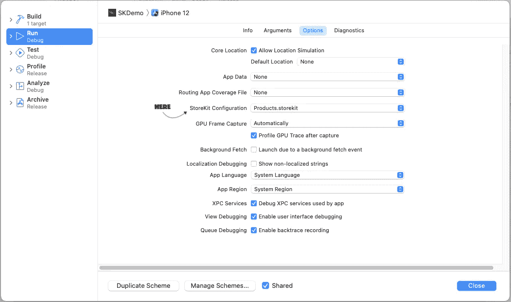
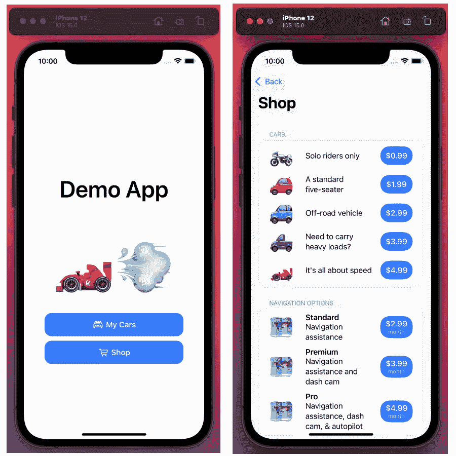
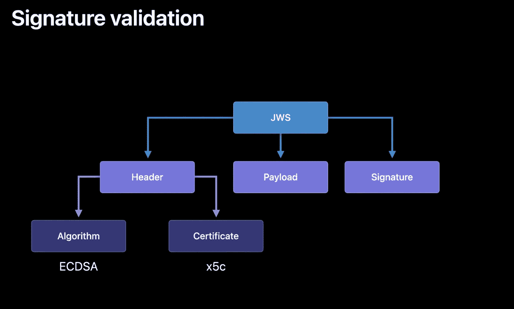
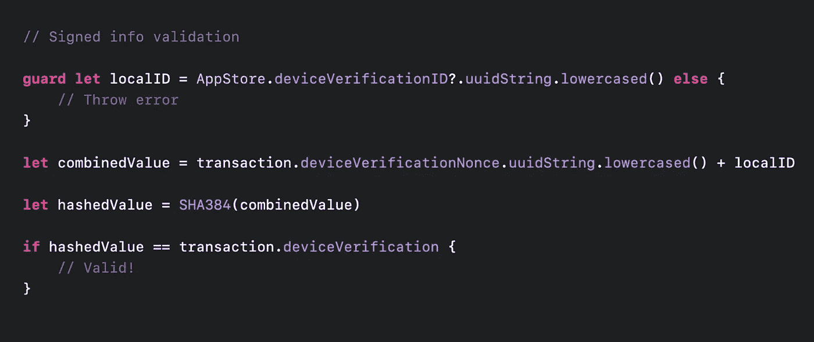

# 在 iOS 15 中试用 StoreKit 2

> 原文：<https://betterprogramming.pub/play-around-with-storekit-2-in-ios-15-f10a8b822b97>

## 酝酿了 10 年的更新


图片由 [Unsplash](https://unsplash.com/s/photos/retail-store?utm_source=unsplash&utm_medium=referral&utm_content=creditCopyText) 上的[克拉克街商业](https://unsplash.com/@mercantile?utm_source=unsplash&utm_medium=referral&utm_content=creditCopyText)拍摄

StoreKit 是很久很久以前为 iOS 3.0 发布的——当然，苹果继续进行调整，但没有重大更新。直到今年的 WWDC2021 上，苹果发布了 StoreKit 2，这是十多年来的首次重大修订。

请和我一起简单浏览一下苹果新框架的客户端代码——尽管就在你开始之前——注意 StoreKit 2.0 需要 iOS15，如果你需要支持 iOS 14 或更低版本，那么你也许应该[从这里开始](/in-app-purchases-and-storekit-in-ios-14-aed2c3e58966)。

看了 WWDC 关于这个主题的演示并查看了代码，我可以理解他们为什么决定把这个叫做 StoreKit 2。新的 API 本身分为五个部分，即产品、购买、交易信息、交易状态和订阅状态。

有一些重大变化的更新，最显著的是用新的并发异步 await 语法替换了委托模式，并将收据的格式更改为 JSON，使用 JSON web signatures 签名，也称为 [x5c 标准](https://datatracker.ietf.org/doc/html/rfc7515)。每笔交易都有一张收据。我注意到下载的演示，它是基于一个 SwiftUI 界面——注意 UIKit 的忠实用户。

我在演示中提到的另一个重大升级与用户体验有关，StoreKit 2 会在重新安装应用程序时自动恢复购买。

幸好有了演示代码，它提供了一个相当全面的新特性示例。和我一起看看上面的代码，同时尝试对它进行一点逆向工程，以更好地理解新的 StoreKit 框架是如何结合在一起的。

# 演示应用程序

首先，你应该从苹果下载完整的代码，你可以在这里找到。一个演示应用程序，您只需在模拟器上签名并运行即可，尽管在运行之前，您需要通过 Xcode 上的 Product->Scheme->Edit Scheme 菜单来更改 StoreKit 配置。



截图取自 Xcode 版本 13.1

您只需要做一个小的调整，将 StoreKit 引用改为指向本地配置。



截图取自 Xcode 版本 13.1

运行它，您会看到最左边的屏幕，这里有两个选项。首先看看你有什么车，其次再买一些。我没有抓拍“我的汽车”菜单，因为当你启动它时，它是空的。



苹果 StoreKit 2 演示应用截图

一旦运行，你可以玩它，买一辆车，和/或导航订阅。一旦在“我的汽车”子菜单中购买，就有更多购买燃料和动力的选项。

# 编码

Bon —在 StoreKit 中，您有非消耗品、消耗品和订阅。在演示应用程序中，演示了如何做到这一点，它设置了一个导航视图，旨在以纵向方式在 iPhone 上运行。

在顶部`ContentView`的导航视图中，还有另外九个视图。虽然我怀疑你真正感兴趣的部分是一个名为`Store.swift`的单独的 Swift 文件。在前面提到的视图中作为环境对象引用的文件。有人将环境对象比作 SwiftUI 版本的单例对象，没有缺点。

关注`Store.swift`代码，我注意到他们一直在使用`@MainActor`标签——swift ui 替代了`DispatchQueue.main.async`。

大约有六个方法，其中的主要类`@Publishing`这个演示应用程序中的主要变量，即汽车、燃料、订阅和所谓的`purchasedIdentifiers`？苹果选择使用一个`plist`来存储产品的本地细节，当商店类别代码初始化时，它被读取。

除了读取`plist`之外，它还调用了两个方法，第一个是设置一个 lister 来捕获事务，第二个是对本地 StoreKit 配置的请求，以返回在`plist`中命名的产品的详细信息。这两个调用都利用了新的并发异步等待原语。

```
updateListenerTask = listenForTransactions()Task {
  //Initialize the store by starting a product request.
  await requestProducts()
}
```

实际上，前一个调用，监听器进入了一个循环，除非特别取消，否则不会退出——只有当类本身被销毁时才会调用。

我发现的下一个方法是购买，它是通过购买按钮调用的，该按钮本身在应用程序的几个不同的菜单中被引用。同样，这只是一项任务。一个任务，它的响应由我前面提到的监听器获取。

```
Task {
  await purchase()
}
```

除此之外，您还有一个方法 isPurchased，它返回最近购买的 JSON 格式的包。JSON，它被提供给`isPurchased`中的第二个方法来验证它是否是它所声称的——这是苹果为您做的验证。

```
guard let result = await Transaction.latest(for: productIdentifier) else {
  //If there is no latest transaction, the product has not been purchased.
  return false
}
```

有趣的是，验证方法使用泛型来返回结果。

```
func checkVerified<T>(_ result: VerificationResult<T>) throws -> T {
  switch result {
    case .unverified:
      throw StoreError.failedVerification case .verified(let safe):
      return safe
    }
}
```

## AppAccountTokens

最后，StoreKit2 中的新功能(在 WWDC 的演示中提到过)，尽管在演示代码中没有，是一个用户生成的 UUID，苹果称之为`appAccountToken`。

其目的是帮助您跟踪哪些应用程序用户帐户开始并完成了与应用程序中的帐户相关联的交易，而不是设备 ID 或 Apple ID。将非/可消费/订阅链接到应用程序中的特定用户，而不是 apple id/设备。

# 人工验证

WWDC2021 StoreKit 2 演讲以加密主题结束，我猜他们决定将最难的部分留给那些足够专注的学生，让他们听完整个演讲。在这最后一部分，他们概述了 JWS 包是由什么组成的。



[WWDC 视频截图](https://developer.apple.com/videos/play/wwdc2021/10114/)

有趣的是，这里提到的算法是 CryptoKit 固有的，尽管我很抱歉地说，演示者通过建议你去谷歌其他地方的细节来掩饰验证签名的任务。

尽管如此，他还是提出了一些对他有利的建议。

*   您应该确认您将在交易中找到的`appID`与应用程序匹配(因此您需要将`appID`嵌入到应用程序中)。
*   您应该执行设备验证检查，他将其定义为执行这段代码，以确认 reciept 中的签名信息是为该设备生成的。



[WWDC 视频截图](https://developer.apple.com/videos/play/wwdc2021/10114/)

所有这些让我结束了这次回顾，一次演讲之旅。我希望你觉得它很有用，也很有趣。