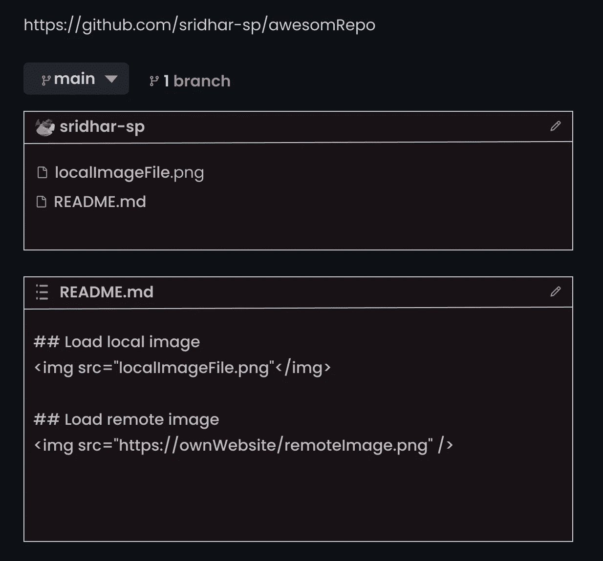
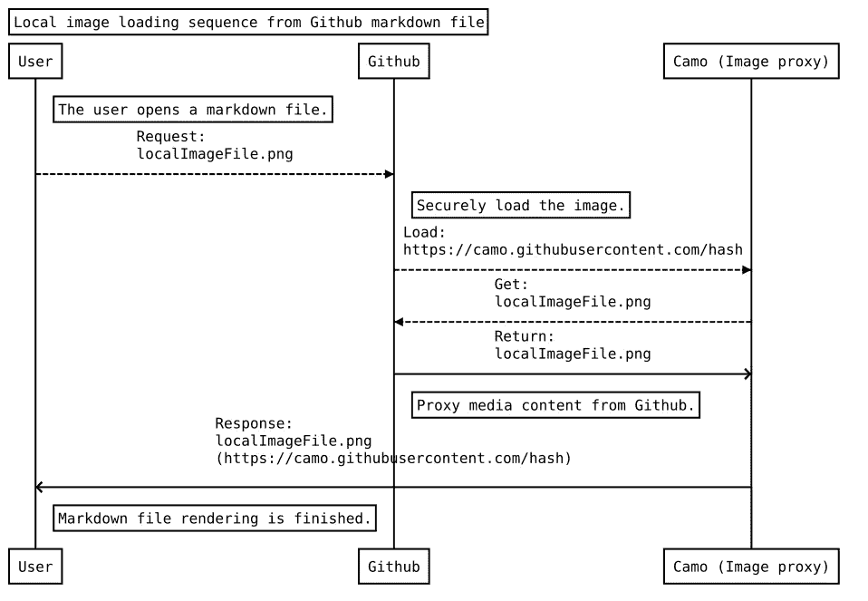
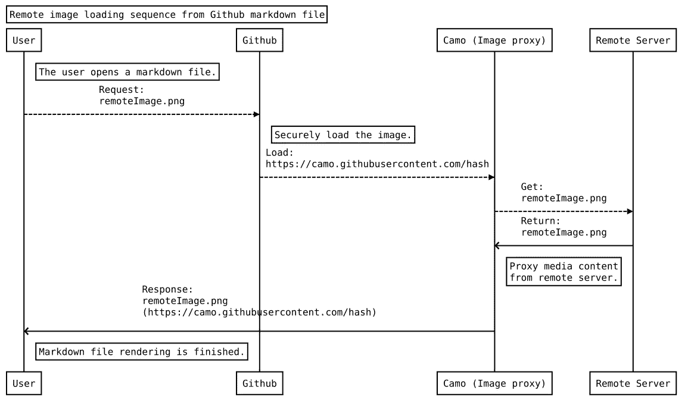
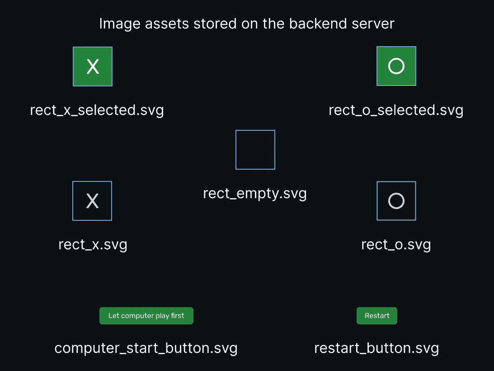
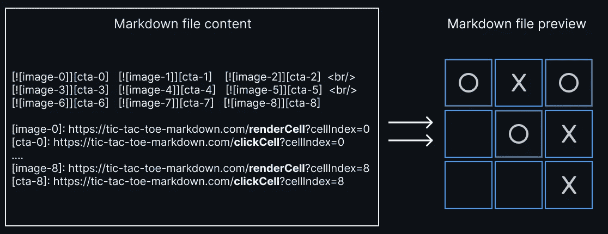
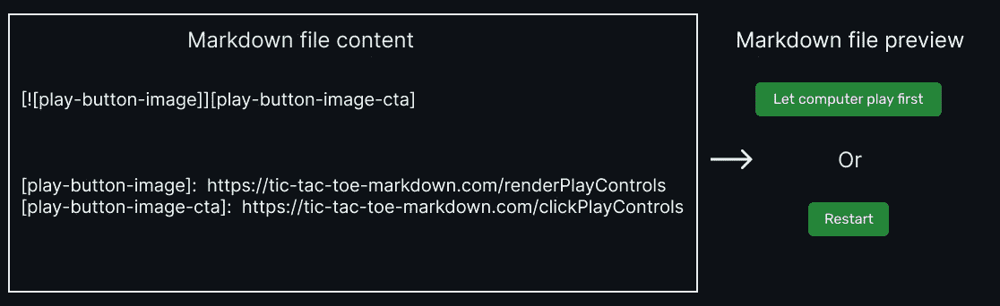
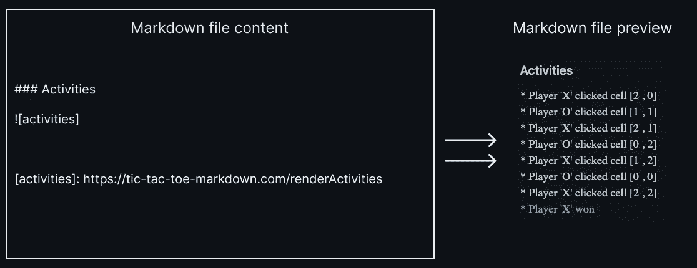
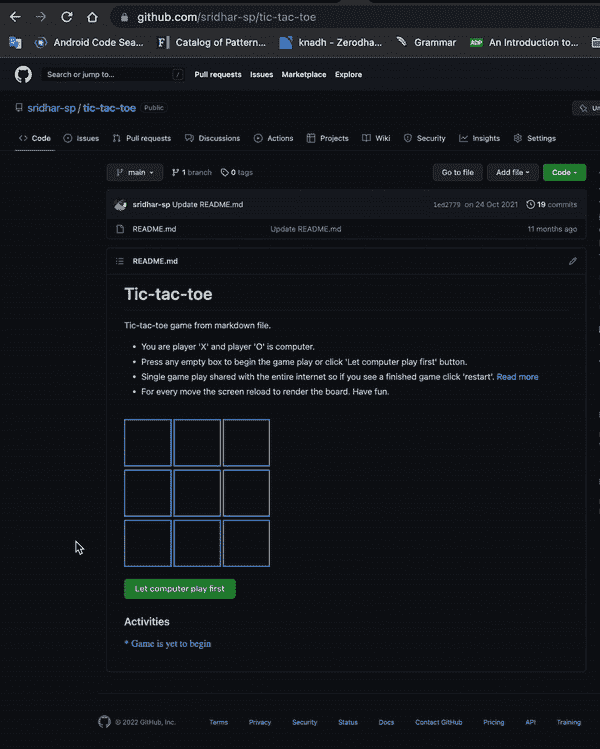
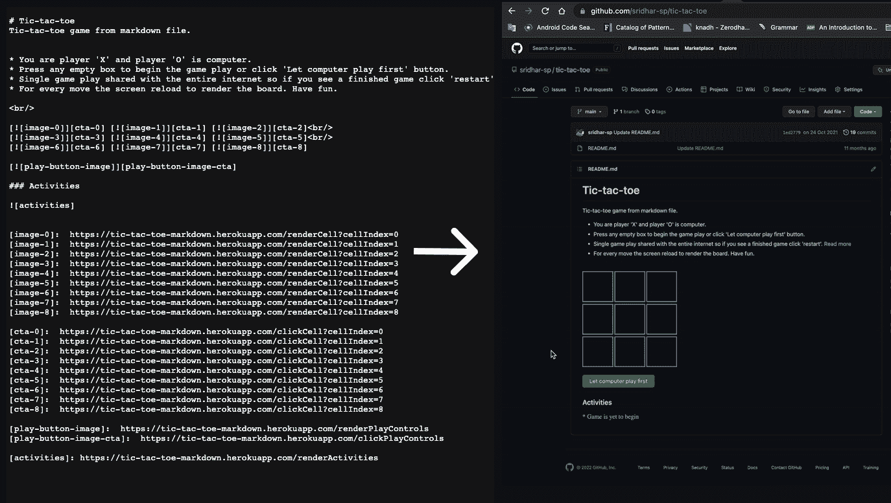

# 在 GitHub README.md 文件中构建一个井字游戏

> 原文：<https://betterprogramming.pub/play-tic-tac-toe-from-github-readme-md-file-754539603380>

## 使用 Go 推进 markdown 文件的边界


一字棋

当有人问“可以从`Github README.md file`开始玩井字游戏吗”时，你的第一反应会是什么？

如果你的答案是“是”，那么你就高兴了。

让我们深入研究一下，看看如何将一个`Github README.md`文件作为井字游戏的前端。

# 这一切是如何开始的

你可能会问我为什么要走这条路，以下是其中的一些原因。

*   我想拓展 markdown 文件的边界，让它尽可能具有交互性。
*   来唯一地识别和跟踪进入我个人 GitHub 项目页面的流量。

为什么我一开始会有这些疯狂的想法？嗯，这是因为每当我向 GitHub readme markdown 文件添加图像或图像链接时，当我试图打开图像时，它总是被替换为代理 URL(代理 URL 看起来像这样:`[https://camo.githubusercontent.com/some-hash](https://camo.githubusercontent.com/some-hash%E2%80%99)`)。

我想知道为什么会这样。我的意思是，代理一个外部 URL 是可以的，但是为什么即使是存放在存储库中的静态图像，当它们从一个自述文件中被引用时，也会获得一个代理 URL 呢？GitHub 在这里想达到什么目的？

然后，我想到了如果在提供图像时没有代理服务器会发生什么。如果没有代理，那么获取图像的 HTTP 请求将直接到达我们的服务器(我们托管图像的地方),我们可以读取 HTTP 请求并尝试获取用户 IP 地址，该地址可用于任何跟踪目的，GitHub 将无法控制它。

所以我有点明白 Github 添加图像代理服务器背后的原因了。在这个阶段，我想知道是否有可能从用户机器发出的 HTTP 请求中获得任何唯一的标识，作为呈现 markdown 文件的一部分。

我希望有一种方法可以唯一地标识每个会话/机器。因此，我想到构建一个简单的游戏，可以在 markdown 文件本身中进行测试。这个想法是建立一个多人游戏，每个玩家都有自己的状态保存在一个唯一的 id 上。“井字游戏”似乎很适合这个，因为它是一个众所周知的游戏，而且实现起来相当简单。

在我开始开发之后，我很快发现我们无法从 readme markdown 文件发出的 http 请求中获得唯一的 id。这是因为每次请求来自随机的代理服务器，除此之外，cookies 也是不允许的。

所以，没有一个唯一的 id，就不会为每个玩家保存任何状态，个人游戏是不可能的。所以，整个互联网只会分享一个单一的玩法。(换句话说，世界上任何人都可以看到和玩游戏，但只有一种玩法是所有人都可以看到的；一个人的改变会反映到所有人身上。)

在这个阶段，我想过放弃任务，但玩一个来自`Github README.md`文件的游戏本身似乎是一个很酷的想法，即使游戏是与整个互联网共享的。所以我把这个想法告诉了我的朋友，他们似乎对这个想法很感兴趣，所以我想投资一些时间来开发它。

# 快速回顾

*   GitHub 使用代理服务器来提供媒体内容，每次都会使用一个随机的代理服务器来提供媒体(当缓存被禁用时)。
*   代理服务器不允许我们存储 cookies。
*   我们想让 markdown 与动态用户界面互动。

# 来自 GitHub Markdown 文件的 HTTP 请求的生命周期

让我们考虑下面的 Github 项目结构——我们有`localImageFile.png`和`README.md file`。

`README.md`文件显示了两个图像，一个来自存储库本身，另一个来自远程服务器。



Github 项目结构

下图所示为从同一回购装载`localImageFile.png`的顺序图:



本地图像加载序列

以下是从远程服务器加载`remoteImage.png`的顺序图:



远程图像加载序列

# 让我们来做井字游戏

*   为游戏构建 API——我们将构建一个后端服务器，将 API 暴露给`start` 游戏、`restart` 游戏、`read the current state`游戏、`make a move`用户和`read the history of the game state`。
*   我们如何从 Github Readme Markdown 文件中调用这些 API——我们将为每个 API 创建 CTA，并在每次点击 CTA 时调用这些 API。
*   我们如何在降价文件上创建 CTA—对于 CTA，我们将使用图像，当单击图像时，将从降价文件发出 HTTP 请求。
*   我们如何在 UI 上显示井字游戏板—你可能已经猜到了。我们将使用图像来反映游戏的当前状态。

简而言之，后端将返回一组我们可以用作 CTA 的图像，当单击图像时，我们将触发相应的 API 来操纵游戏状态。

正如我前面提到的，由于我们无法识别来自同一个系统的请求，所以只有一个游戏将与整个互联网共享。因此，后端在单个变量中维护 3x3 井字游戏的游戏状态。所公开的 API 将基本上尝试修改该单个游戏状态，并使用从服务器发送的图像在 UI(即自述文件)上反映该状态。

## 存储在后端服务器上的图像资产

请记住`svg`文件名，因为我们将很快检查每个图像文件的用途。



[存储在后端服务器上的图像资产](https://github.com/sridhar-sp/tic-tac-toe-backend/tree/main/assets)

后端服务器是用 Go:

让我们看看每个 API，看看它做什么！

## 渲染单元

*   `[renderCell](https://tic-tac-toe-markdown.com/renderCell?cellIndex=0)` API 将*单元格索引*作为 URL 参数，并返回单元格图像。对于一个 3x3 的井字游戏，我们有九个单元格要渲染。后端根据单元的状态返回相应的单元图像。
*   当用户按下单元格时，返回`rect_x.svg`。
*   当计算机按下该单元格时，返回`rect_o.svg`。
*   当没有人按那个单元格时，返回`rect_empty.svg`。
*   返回`rect_x_selected.svg`以突出显示用户赢得的区域。
*   `rect_o_selected.svg`返回以突出显示计算机赢得的区域。

## 单击单元格

*   `[clickCell](https://tic-tac-toe-markdown.com/clickCell?cellIndex=0)` [API](https://tic-tac-toe-markdown.com/clickCell?cellIndex=0) 将单元格索引作为 URL 参数，并将单元格标记为用户选择的(假设单元格为空)。
*   `clickCell` API 被附加到由 renderCell API 渲染的每个单元的锚链接上。

请查看下面的截图，了解降价文件的内容及其预览:



[带预览的 Markdown 文件内容](https://github.com/sridhar-sp/tic-tac-toe)

*   当单击每个单元格时，服务器修改游戏状态并重新加载页面，以便可以从服务器读取新的修改状态。
*   页面重新加载是一个强制步骤。因为这是一个 markdown 文件，所以这是从服务器获取修改状态的唯一方法。

## 重新加载页面

这是关键的一步。还记得 GitHub 如何使用图像代理服务器来提供媒体文件吗？图像代理将响应缓存一段时间。因此，我们需要添加高速缓存控制响应标头“no-cache，no-store，must-revalidate”来禁用此高速缓存机制。

如果我们不禁用缓存机制，那么代理服务器将简单地返回缓存的响应，并且在缓存过期之前不会调用我们的后端。因此，我们将无法向用户反映当前的游戏状态，最终将显示陈旧的数据(不是良好的用户体验)。

```
const REDIRECT_URL = "https://github.com/sridhar-sp/tic-tac-toe"responseWriter.Header().Set("Content-Type", "image/svg+xml") responseWriter.Header().Set("Cache-Control", "no-cache,
no-store,must-revalidate")
responseWriter.Header().Set("expires", "0") responseWriter.Header().Set("pragma", "no-cache")http.Redirect(
 responseWriter, req, 
 REDIRECT_URL, http.StatusMovedPermanently
)
```

## 渲染播放控件

*   当游戏还未开始时，`[renderPlayControls](https://tic-tac-toe-markdown.com/renderPlayControls)` API 返回`computer_start_button.svg`,当游戏结束时返回`restart_button.svg`。

## 单击播放控件

*   这个 [API](https://tic-tac-toe-markdown.com/clickPlayControls) 作为锚附在`renderPlayControls`上
*   当按下播放控制按钮时，相应的操作会在后端发生，例如重新启动游戏或让电脑先走一步。

请参见下面的截图，以查看播放控制降价文件内容及其预览:



播放控件预览

## 渲染游戏活动

*   `[renderActivities](https://tic-tac-toe-markdown.com/renderActivities)` API 以`svg`图像格式返回所有游戏活动。

请看下面的截图，看看游戏活动 markdown 文件内容及其预览:



游戏活动预览

# 演示

```
Player ‘X’ is a human, and Player ‘O’ is a computer.
```



演示

请查看下面的截图，了解降价文件的内容及其预览:



降价文件及其交互式预览

# 源代码

以下是用 Go 编写的最终前端应用和后端的 GitHub 库:

*   [前端—](https://github.com/sridhar-sp/tic-tac-toe) `[Readme.md](https://github.com/sridhar-sp/tic-tac-toe)`
*   [后端进入](https://github.com/sridhar-sp/tic-tac-toe-backend)

# 参考

*   [https://github.com/atmos/camo](https://github.com/atmos/camo)
*   [https://github . blog/2010-11-13-side jack-prevention-phase-3-SSL-proxy-assets/](https://github.blog/2010-11-13-sidejack-prevention-phase-3-ssl-proxied-assets/)
*   [https://docs . github . com/en/authentic ation/keeping-your-account-and-data-secure/about-anonymous-URLs](https://docs.github.com/en/authentication/keeping-your-account-and-data-secure/about-anonymized-urls)

## 使用的库

*   https://github.com/ajstarks/svgo