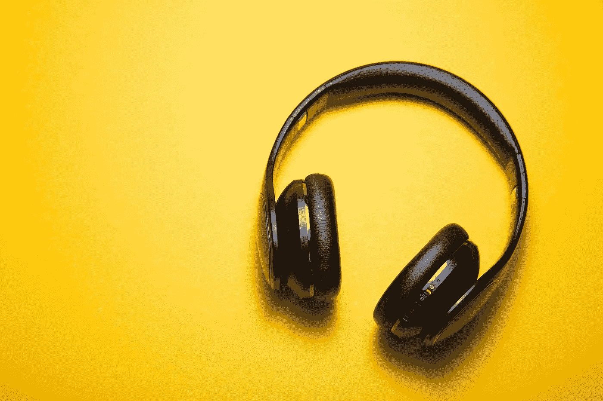

# 如何在 SpriteKit 游戏中播放音乐和音效

> 原文：<https://betterprogramming.pub/playing-music-and-sound-effects-in-a-spritekit-game-e3bdf8cc45e8>

## 将您的游戏带入生活！

照片由[马尔特·温根](https://unsplash.com/@maltewingen?utm_source=unsplash&utm_medium=referral&utm_content=creditCopyText)在 [Unsplash](https://unsplash.com/s/photos/music?utm_source=unsplash&utm_medium=referral&utm_content=creditCopyText) 上拍摄

我和妻子目前正在开发一个小游戏。首先，我们只有一个场景，我们播放一些音频文件。随着游戏的发展，我们希望我们的应用程序设置中有两个滑块，用户可以分别改变背景音乐和声音效果的音量，正如你在下面的 gif 中看到的那样。

在这篇文章中，我将向你展示我们在游戏中管理音乐和音效的方法！

目标是:音乐和效果音量有两个独立滑块。

# 播放音频文件的简单方式

首先，我们来看一个播放音频文件的幼稚方式。

我们用了一个`AVAudioPlayer`来播放背景音乐。这个类使用起来很方便——您可以创建一个实例，其中包含您想要收听的文件的 URL，并使用`play`方法。以下要点显示了如何在操场上执行此操作:

在操场上播放音频文件。

对于效果，我们使用了不同的方法。由于声音效果是由我们的 SKScene 中节点之间的交互触发的，这些节点运行一个 SKAction 来播放声音文件。这里有一个在操场上用这种方式玩声音的例子:

在操场上运行 SKAction 来播放音频文件。

另一种播放音效的方式是使用`AudioToolbox`框架。这个框架允许你注册和播放短音效(30 秒以下)，比`AVAudioPlayer`有更好的性能。然而，由于没有办法以编程方式控制音量，这个选项不适合我们的用例。

用 AudioToolbox 播放一小段音频文件。

# 改进的音频处理

我们需要一个通用的音频播放源，因此我们创建了一个名为 AudioPlayer 的协议。该协议定义了我们希望在应用程序中访问的所有功能。在我们的例子中，我们想要区分背景音乐和音效，背景音乐会一直播放，直到再次暂停，音效表示游戏中的事件。此外，我们希望为每个音频设置不同的音量。以下协议定义了这些功能:

我们对音频播放器的定义。

`Music`和`Effect`都只将两个属性——音频文件的名称和类型包装为`String`。为了有一个共同的基础，我们定义了由两个`struct`实现的协议`SoundFile`

在结构中包装文件名和类型。

基于此，我们可以给`AVAudioPlayer`添加一个方便的初始化器，它将用来播放所有的声音。这个新的初始化器被传递了一个`SoundFile`，并可能返回一个`AVAudioPlayer`设置的实例来播放给定的`SoundFile`。或者它可能抛出一个错误，在这种情况下，我们添加了一个新的包含可能错误的`enum`(例如`fileNotFound`)。

通过音频播放器直接使用我们的音乐和效果结构。

为了方便访问整个应用程序中的所有`SoundFile`，我们添加了一个`struct`包装到其他`struct`中。这些包含所有音频文件，作为结构`Music`和`Effect`的实例。

轻松访问应用程序中的所有音频文件。

除了实现我们的`AudioPlayer`协议之外，我们已经设置好了一切。我们添加了新的类`AudioPlayerImpl`来符合这个协议。

这个类需要有两个属性来保存当前的音乐和效果播放器，否则将听不到声音。此外，两个必需的属性`musicVolume`和`effectsVolume`都将从最大可能值 1.0 开始。由于可能有背景歌曲在播放，我们需要在更改音乐音量时调整当前音乐播放器的音量。

要播放一个新的音乐文件，我们停止当前的播放器，尝试为该文件创建一个新的播放器，将其音量设置为当前选择的音乐音量，然后启动播放器。为了以后能够访问这个新播放器，我们将它保存在`currentMusicPlayer`属性中。

播放音效也同样简单——创建一个新的播放器，设置它的音量，然后启动它。同样，我们需要存储新的播放器来听到一些声音。

把这些放在一起。

现在播放声音文件就像:

使用新播放器。

通过传递这个播放器实例，我们可以在整个应用程序中共享音量级别。

就这样，我希望你会对我的作品感兴趣。如果您有任何问题或改进建议，请告诉我！