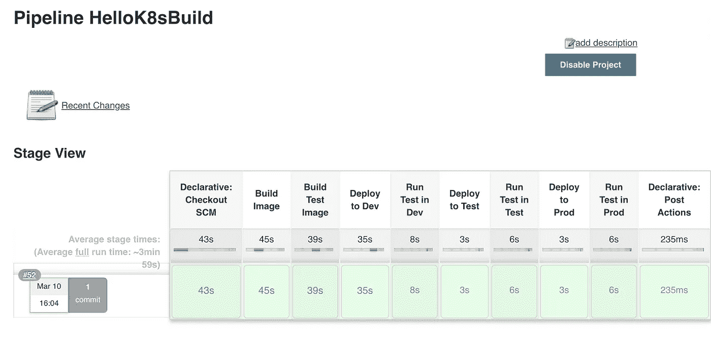

# 玩弄管道

> 原文：<https://betterprogramming.pub/playing-with-pipelines-b5cf357ddd06>

## 如何在新的 Jenkins 实例上构建现有项目


由[马克·阿斯特霍夫](https://unsplash.com/@qa9de?utm_source=unsplash&utm_medium=referral&utm_content=creditCopyText)在 [Unsplash](https://unsplash.com/s/photos/themepark?utm_source=unsplash&utm_medium=referral&utm_content=creditCopyText) 拍摄的照片

上一个帖子，我拿了一个旧的机架式服务器，安装了 [KVM](https://www.linux-kvm.org/page/Main_Page) 、 [NGINX](https://www.nginx.com/) 、 [Postfix](http://www.postfix.org/) 和 Kubernetes，然后把 [Jenkins](https://jenkins.io/) 安装进 Kubernetes。今天，我将把我在 GitHub 上的一个项目放在新的 Jenkins 实例上。

要阅读本文，您应该具备 Linux、网络、Docker 之类的容器以及一般编程概念的基础知识。

您还应该有一个 GitHub 帐户或其他代码库，因为这是构建管道的起点。它还假设您已经安装了我上一篇文章中设置的所有软件， [*使用虚拟机和 Kubernetes*](https://medium.com/better-programming/playing-with-vms-and-kubernetes-26ef93019c22) *。*

我希望我的管道从代码中构建容器映像，将映像安装到运行在 Kubernetes 上的本地存储库中，将映像部署到 Kubernetes 中，最后测试部署的代码。

我在之前的一篇文章[*CI/CD on a budget*](https://medium.com/@rlkamradt/kubernetes-ci-cd-on-a-budget-6e4ea91117a)中做了所有这些事情，但是没有 Jenkins 的帮助，所以我将修改代码以在 Jenkins 管道中运行。

# 入门指南

在我配置 Jenkins 之前，我必须在后缀配置中添加一行，这样它将从 VM 子网中继，在我的例子中是 192.168.122.0/24。更改`mynetworks`设置以添加您的虚拟机子网，然后重启 Postfix。

```
sudo vi /etc/postfix/main.cf #set mynetworks=127.0.0.0/8 <VM subnet>
sudo systemctl restart postfix
```

现在我可以对詹金斯做一点配置了。登录到我们在上一篇文章中创建的 Jenkins 实例。点击*管理 Jenkins* 链接，然后点击*配置系统*链接。

将 Jenkins URL 设置为您用来在浏览器中查看 Jenkins 的 URL，在我的例子中是 [http://jenkins](http://jenkins) (我在 NGINX 设置中使用了一个虚拟主机来将对名为 *jenkins* 的服务器的请求指向 Kubernetes 中的 Jenkins 服务外部 IP，并将其添加到我的/etc/hosts 文件中)。

您可以将*系统管理员*电子邮件地址设置为您的电子邮件，以及全局配置用户名值和全局配置用户名值，这样 Jenkins 就可以将版本更改等内容推送到您的 repo 中。

最后，将 SMTP 服务器设置为您的主主机(Postfix 正在运行的主机)的 IP 地址，并测试配置。

如果邮件不行，可以查看`/var/log/mail.log`看看发生了什么。还是那句话，如果你不能发邮件，那真的不是问题，有就好了。

我们安装的 Jenkins 假定它运行在 Kubernetes 中，并预先配置它使用 Kubernetes。如果您想进行测试，请点击 *Kubernetes Cloud Details* 按钮，然后点击*测试连接*按钮。它应该回应说它是成功的。主要配置就这些了。

# 添加凭据

接下来，我们将添加凭证，以便访问 GitHub。我们将使用 SSH，有两种选择。首先，创建一个新的公钥/私钥，并将公钥添加到 GitHub，将私钥添加到 Jenkins。

第二种选择，对于不太多疑的人来说，是使用您已经用来访问 GitHub 的公钥/私钥对，并将私钥复制给 Jenkins，这样 Jenkins 在 GitHub 看来就是您。我选择第二种选择，因为我更懒惰而不是偏执。

点击*凭证*链接、*系统*链接和*全局凭证(无限制)*链接。然后，点击*添加凭证*链接，选择 *SSH 用户名*种类，将 ID 和用户名设置为您要从中复制私钥的计算机上的用户名。

点击*私钥*按钮，然后*添加*按钮出现一个您的私钥文本框。将文件显示在您本地计算机的`~/.ssh/id_rsa`中，或者您保存私人密钥的任何地方，然后将其剪切并粘贴到 Jenkins 中。

另外，如果您在创建公钥/私钥时使用了密码，请填写密码。请注意，您的私钥是敏感的，因此请确保您不会不小心将其粘贴到您公司的 Slack 通道中。

在我们继续之前，我想测试一下与 GitHub 的连接。我将在回购中创建一个`Jenkinsfile`，我想在本文的其余部分使用它。回购可以在这里找到。

这只是构建文件，这是我正在构建的[实际项目](https://github.com/rkamradt/hellok8s)。我喜欢将管道代码从项目代码中分离出来，这样项目就不会变得混乱。

我将添加一个非常基本的管道，它什么也不做，但它将证明我们到目前为止所做的事情。下面是最基本的管道:

把这个提交给 GitHub。

# 创建第一个作业

现在，在 Jenkins 服务器上创建我们的第一个作业。如果您尚未创建作业，主屏幕将提示您创建作业，并显示“请创建新作业以开始”

点击*新任务*创建一个新任务。给它起个好记的名字，我在叫我的 *HelloK8sBuild* ，然后选择*管道*。点击*确定*按钮将进入配置屏幕。

我们需要的唯一配置是在*管道*部分，从 SCM 中选择*管道脚本*。选择 *Git* 作为 SCM 类型，从项目中添加克隆 URL，在我的例子中是`git@github.com:rkamradt/HelloK8sBuild.git`，并选择您之前创建的凭证。

如果有问题，它会以红色文本发出嘟嘟声，说明它认为有问题，你必须找出为什么你的詹金斯不能与 GitHub 通信。

点击*保存*按钮，然后点击*立即构建*链接启动管道。应该会很快结束。在 Stage 视图中应该有一个 Checkout SCM 和 Stage 1 阶段。您可以单击构建历史中的构建号，并单击控制台输出来查看发生了什么。

如您所见，默认情况下，它创建一个 Kubernetes Pod 作为从属代理，并在其中运行。我的运行时间大约是 30 秒，因为管道本身非常简单，所以大部分时间都是启动一个从站的开销。

显然，这对于像这样的简单管道来说并不是一个好的选择，但是对于像我们将要创建的有许多阶段的更长的管道来说更适合。

在容器中运行的一个问题是很难从容器中运行 Docker 命令。有很多方法可以解决这个问题，但是在我看来，最好的解决方案是不要运行 Docker 命令。

那么，我们如何在 Kubernetes Pod 中创建一个图像呢？一个名为 [Kaniko](https://github.com/GoogleContainerTools/kaniko) 的程序创建了一个图像，并将其存储在一个容器库中，而不使用 Docker。下面是新的詹金斯文件的样子:

这个文件引用了一个`build-pod.yaml`，它是用于运行程序的 Kaniko 映像的容器定义。这里是`build-pod.yaml`:

请注意，我们使用的是`debug`标签，因为普通标签没有`tail`命令，我们使用该命令使 Pod 在运行 Kaniko 时保持忙碌。这是一个小问题，如果我找不到解决的方法，我可能会向 Kaniko 团队提交一个特性请求来允许这个用例。

接下来，让我们看看是否可以从一个 Pod 中运行 kubectl。我们将从一些简单的东西开始，只是一个用`kubectl get all --all-namespaces`命令列出 Kubernetes 中运行的所有项目的 stage。

先加一个`kubectl-pod.yaml`:

我使用的是`linkyard`图片，因为它是我在 Docker Hub 上搜索 kubectl 时列出的第一张图片。稍后我可能会查看另一张图片，但现在，这张图片完成了任务。然后，我向 Jenkinsfile 添加了一个新的 stage。

运行此操作将重建映像，然后列出 pod，其中实际包含运行此阶段的 pod。

当这种方法奏效时，我们应该尝试部署我们在第一阶段构建的映像。

我将创建一个新文件`helloworld.yaml`，并将 stage 中的`kubectl`命令改为`/usr/local/bin/kubectl apply -f helloworld.yaml`，看看会发生什么。

下面是将部署我们新构建的应用程序的`helloworld.yaml`文件:

再次运行我们的管道，一切似乎正常！然而，我在程序实际运行时遇到了一些麻烦，测试舱卡在了`CreatingContainer`状态。

经过一番搜索，我发现如果我在`helloworld.yaml`中将 localhost 改为 127.0.0.1，然后在列出它所知道的端点的部分将`/var/snap/microk8s/current/args/containerd-template.toml`文件改为使用 127.0.0.1 而不是 localhost，它就工作了(在重启 [MicroK8s](https://microk8s.io/) 之后)。

我知道以前使用本地主机是可行的，但是事情在变，我们必须跟着变。

要在主主机(运行所有虚拟机的计算机)上手动测试，您可以运行`kubectl get services`并找到测试服务的 IP 地址。然后，卷曲结果，它应该打印出“Hello World”。

但是让我们更进一步，让我们增加一个测试阶段。这实际上是两个阶段，一个是构建测试映像，另一个是运行测试。

我只是要复制`Jenkinsfile`中的两个阶段，做一点重命名。我还必须创建一个`helloworldtest.yaml`来定义运行测试的作业。以下是我所知道的:

运行作业和检查输出的步骤略有不同，以下是阶段:

这将启动作业，等待它完成，转储日志，最后删除测试。

# 名称空间

我想做的最后一件事是开始在不同的阶段使用名称空间。到目前为止，我们已经使用了默认的名称空间，如果您计划拥有一个复杂的系统，使用默认不是一个好主意。

因此，让我们为开发、测试和生产创建名称空间，然后为每个名称空间添加阶段。事实上，我们将使用`projectname-stage`创建二维名称空间。

在我们的例子中，`helloworld-dev`、`helloworld-test`和`helloworld-prod`。这将为集群中的每个项目提供单独的名称空间。以下是创建它们的方法:

```
kubectl create namespace helloworld-dev
kubectl create namespace helloworld-test
kubectl create namespace helloworld-prod
```

现在你可以使用`kubectl get namespace`命令将它们全部列出。您应该会看到新的名称空间以及 MicroK8s 为您创建的名称空间。

现在我们必须更新 Jenkinsfile 以使用名称空间。我们将首先将它们添加到我们现在拥有的内容中，并对其进行测试，这符合我的理念，即在继续之前进行原子性的更改和测试。

因此，在 Jenkinsfile 中每个有`kubectl`命令的地方，都应该在子命令后添加`-n helloworld-dev`。例如:

```
steps {
            sh "/usr/local/bin/kubectl apply -n helloworld-dev -f desc/helloworld.yaml"
          }
```

现在，运行你的构建，交叉你的手指。构建完成后，获取`helloworld-dev`名称空间的所有对象:

```
rkamradt@beast:~$ kubectl get all -n helloworld-dev
NAME                              READY   STATUS    RESTARTS   AGE
pod/helloworld-7d7547c4cd-gcw6q   1/1     Running   0          12mNAME                 TYPE           CLUSTER-IP       EXTERNAL-IP       PORT(S)        AGE
service/helloworld   LoadBalancer   10.152.183.169   192.168.122.242   80:31567/TCP   12mNAME                         READY   UP-TO-DATE   AVAILABLE   AGE
deployment.apps/helloworld   1/1     1            1           12mNAME                                    DESIRED   CURRENT   READY   AGE
replicaset.apps/helloworld-7d7547c4cd   1         1         1       12m
```

# 更多阶段

看起来不错！现在让我们增加一些阶段。除非通过测试，否则不会进入下一阶段。我将作弊并使用相同的测试来提升到 prod，但显然您会希望在测试阶段有一组更广泛的测试。

编辑您的 Jenkinsfile，首先将您的两个构建(应用程序和测试代码)移到前两个阶段。然后，复制部署和测试阶段两次，每次都更改名称空间。别担心，所有的代码都会在我的 GitHub 项目里。运行新管道，瞧！



那是一条管道！

看一下`kubectl get all --all-namespaces`的结果，您会看到您所有的`helloworld`服务，每个服务都有自己的外部地址。

这篇文章中使用的所有脚本都可以在 GitHub 上找到。我希望这篇文章能给你一些好主意，记住，永远不要停止游戏！