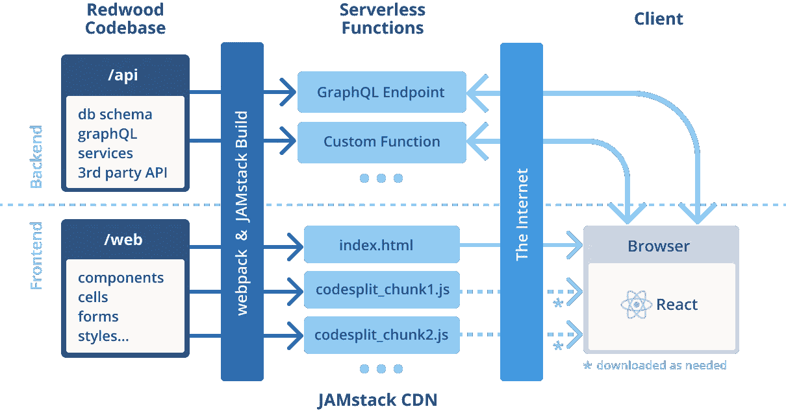

# 我对红木的看法

> 原文：<https://betterprogramming.pub/playing-with-redwood-js-1e7c62cb038e>

## 玩 RedwoodJS，一个固执己见的、全栈的、无服务器的 web 应用程序框架

在 [Unsplash](https://unsplash.com/s/photos/redwoods?utm_source=unsplash&utm_medium=referral&utm_content=creditCopyText) 上由 [Caryle Barton](https://unsplash.com/@carylenicole?utm_source=unsplash&utm_medium=referral&utm_content=creditCopyText) 拍摄的照片。

两周前，当我听了关于红杉树的 [*React 播客*第](https://reactpodcast.simplecast.com/episodes/117)集时，它在我心中引发了许多兴奋。我想马上尝试一下。在使用它一段时间后，我仍然印象深刻，但也看到了这个框架需要改进的地方。

在这篇文章中，我想分享我对此的想法。

# RedwoodJS 是什么？

Redwood 是一个固执己见、全栈、无服务器的 web 应用框架。它与 JAMstack 一起工作，旨在使全栈 web 应用程序的开发和部署更加容易。它由 GitHub 的联合创始人兼前首席执行官汤姆·普雷斯顿-沃纳(Tom Preston-Werner)发起并领导。

Redwood 基于 JAMstack。这意味着您的前端应该在构建时预渲染并部署到 CDN，以实现更快的加载时间和更好的可扩展性。这些静态站点通过在客户端执行 JavaScript 得到增强，以提供额外的资产或连接到您的 API 或第三方服务。

对于后端，Redwood 标准化了创建和编写后端 API 的方式。使用 Redwood，所有这些 API 都是无服务器功能，并且在很多情况下可以自动生成。通过这种架构选择，Redwood 包含了当前 JAMstack 托管提供商(如 Netlify)的许多功能，并在可扩展性方面取代了您。

# RedwoodJS 是如何工作的？

Redwood 把你的应用分成两部分，前端(web)和后端(API)。它使用 yarn 工作空间来支持单个 monorepo 中的两个部分。

web 前端(目前)是用受 Gatsby.js 或 Next.js 启发的组件架构 React 编写的，单个页面属于一个页面的文件夹。这些页面中使用的组件放在一个组件文件夹中。组件和页面可以通过故事书单独检查，通过 Jest 进行单元或集成测试。React 应用在构建时预渲染，并作为静态站点部署到 CDN。

后端使用基于 Apollo 的 GraphQL API。您的 API 的业务逻辑被组织成服务。这些服务和您的 GraphQL API 作为无服务器 lambda 函数部署在 AWS 上。他们可以通过 Prisma 连接和访问数据库。Prisma 在实际的数据库技术和数据库模式之间提供了一个抽象层。Redwood 不包含数据库，需要自己配置。由于 Prisma 是作为一种抽象来使用的，所以您目前可以使用 Prisma 支持的任何关系数据库。

[Redwood.js 架构](https://redwoodjs.com/images/structure.png)

# RedwoodJS 的承诺是什么？

Redwood 提供了许多生成器功能，旨在简化应用程序中代码的创建。为此，它在文件夹结构和命名约定方面非常依赖标准。

例如，一个方面是生成器 CLI。Redwood 为您提供 generator CLI 命令来创建您的前端页面、布局和组件，以及基于您提供的 Prisma 数据库模式的后端服务。这还没有结束。Redwood 使用一种受 Ruby on Rails 启发的技术，称为 scaffolding，它不仅基于数据库模式生成后端服务，还基于该模式生成前端组件和页面。这使得创建 CRUD 操作和在前端访问它们变得毫不费力。

Redwood 引入了一个叫做细胞的概念。单元格是对前端数据提取的抽象。单元格为您提供了自动生成的 React 组件，这些组件表示您的数据获取的当前状态。这些可以是*加载*、*清空*、*失败*、*成功*。基于这些状态，您可以在前端采取行动，并向您的用户提供反馈。

还有其他事情可以让开发人员的工作更轻松，比如提供组件来构建和管理前端表单，或者处理身份验证。有了所有这些“小助手”，Redwood 加快了应用程序的开发，并可以快速创建应用程序的原型。

# RedwoodJS 上有哪些开阔地？

和许多固执己见的框架一样，当你超越界限时，它就崩溃了。你支付灵活，获得速度。在这种情况下，Redwood 也不例外。然而，根据您个人的发展需求，这可能是一种优势。这种灵活性并不总是需要的，尤其是在团队开发工作中。那么，约定可能是一种魅力，可以创建一个由每个团队成员以相同的方式维护和增强的代码库。然而，在我看来，对于一个生产就绪的框架，仍然有一些事情需要解决。

目前 Redwood 只支持 lambda 无服务器功能。目前不支持其他云提供商的功能，如 Azure 或 Google。此外，在 Netlify 的情况下，这些功能仅部署到美国地区。也就是说，这是 Netlify 的问题，不一定是 Redwood 的问题。

通过使用 Prisma 作为抽象层，Redwood 将自己局限于 Prisma 支持的数据库。这些目前只是关系数据库。Prisma 正在研究非关系数据库支持。因此，我们有望在未来看到 Redwood 对非关系数据库的支持。

脚手架看起来有希望将您从为了访问数据而需要在前端和后端编写的讨厌的样板代码中解放出来。但是，当在不同的数据模型之间使用 Prisma 关系时，这些关系不能自动生成。这是已知的，Redwood 团队正在研究解决方案。

当前受到限制的还有创建项目时的 TypeScript 支持。没有自动选项，你需要通过一个通天塔手动配置它[。然而，我注意到有些导入需要手动添加到您的 Routes 和其他组件中，以便正确使用 TypeScript。](https://redwoodjs.com/docs/typescript)

# 结论

Redwood.js 看起来很有前途，我很期待看到 1.0 版本。我可以看到它使得基于 JAMstack 结合 serverless 的 web 应用程序的创建变得更加容易。它取消并强制创建一个好的文件夹和模块结构。为此，它固执己见，占用了你一点自由。然而，我认为这对于实施一个好的应用程序架构是有好处的。

对我来说，要将它用于生产应用程序，还需要做一些改进。Redwood 团队了解这些问题，并正在解决它们。一旦完成，我期待着一个伟大的框架，它结合了非常好的技术堆栈，并加快了我们的可伸缩的无服务器 web 应用程序的开发。

**更新:我想更新一下我说的 Redwood 仅限于 Prisma 和 Prisma 支持的数据库的事实。** Redwood 不一定需要 Prisma 作为数据库客户端，您可以导入任何您喜欢的数据库客户端。比如有项目用过 [FaunaDB](https://css-tricks.com/deploying-a-serverless-jamstack-site-with-redwoodjs-fauna-and-vercel/) 、 [Neo4J](https://community.redwoodjs.com/t/using-redwood-with-neo4j-database/282) 、an [S3 桶](https://tlundberg.com/blog/2020-11-28/redwood-download-files-from-protected-s3/)。 **@anthonyCampolo** 非常感谢提示！

# 参考

我从 Redwood 的文档中获得了关于这篇文章的知识，并对其进行了尝试。