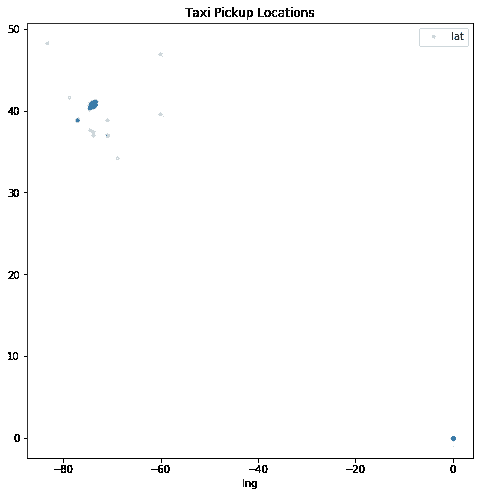
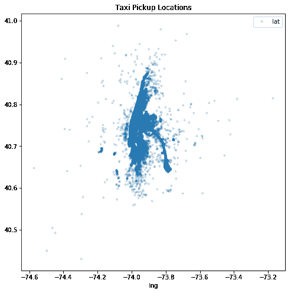
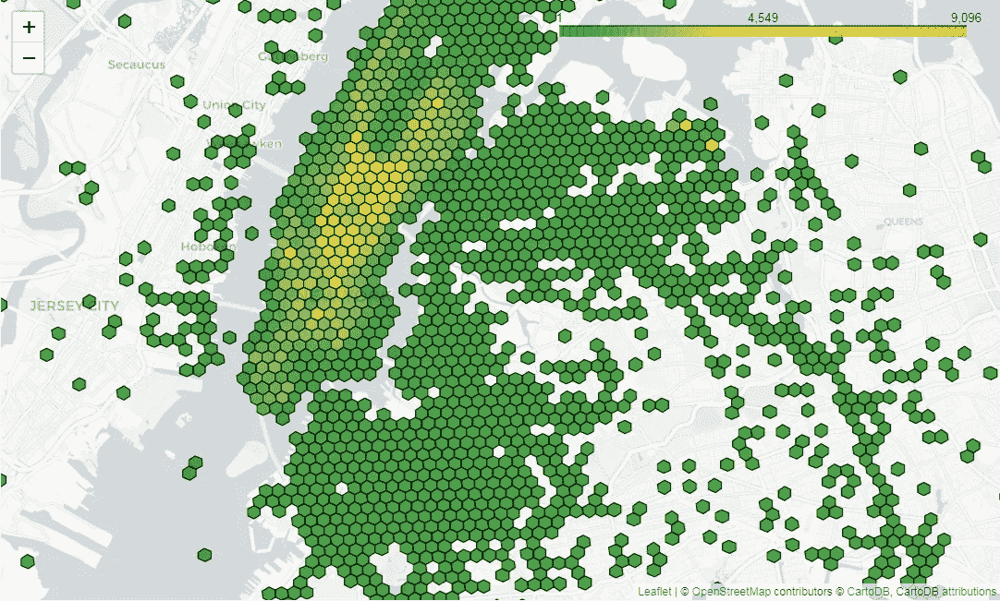
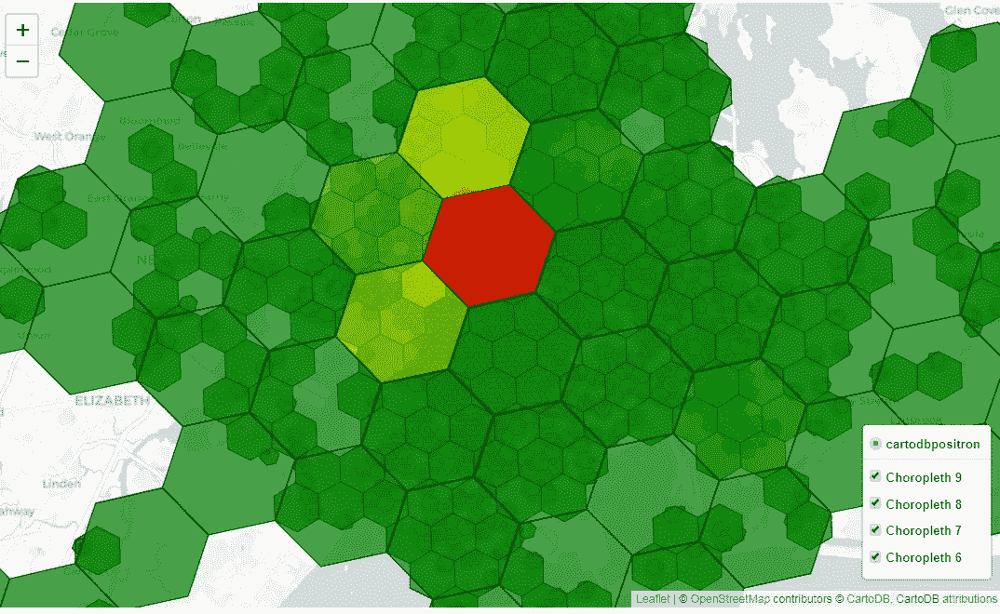

# 玩优步的六边形等级空间索引，H3

> 原文：<https://betterprogramming.pub/playing-with-ubers-hexagonal-hierarchical-spatial-index-h3-ed8d5cd7739d>

## 纽约出租车数据可视化

来源:[https://eng.uber.com/h3/](https://eng.uber.com/h3/)

[H3](https://eng.uber.com/h3/) 是由优步开发并开源的地理空间索引系统。它提供了将纬度/经度坐标转换为 H3 地理空间六边形图块的功能。

它完全是用 C 写的，但是也有其他语言可用的[绑定](https://uber.github.io/h3/#/documentation/community/bindings)，包括 Python、 [R](https://www.r-project.org/) 和 Ruby。

作为一名运输工程师，我们在分析中经常使用区域和分区。然而，手动绘制的地图分区具有局限性，例如，区域的中心不代表数据点的中心，相邻点的数量不相等，相邻点之间的距离不相等，以及一些其他不期望的边界效应。

使用六边形进行空间分析有很多好处，更多用例可在此处阅读。

我用 H3 对纽约市出租车高级轿车委员会(TLC)公开的出租车数据做了一些初步分析。

我想感谢每一个分享他们与 H3 的经历和创作教程的人。他们不是很多，但可用的是非常有用的。

我下载了 2016 年 4 月的出租车数据，因为那一年的出租车数据有出租车搭载的地理位置，而不是搭载位置 id。

TLC 发布的新数据集(2016 年后)只有可映射到出租车区域的上车位置 id。如果你也想下载的话，这里有[网页](https://www1.nyc.gov/site/tlc/about/tlc-trip-record-data.page)。

由于 CSV 文件很大(1.74 GB)，一些人在使用 [pandas](https://pandas.pydata.org/) 库时可能会收到“内存错误”。因此，我试图通过去掉我们不需要的列并改变数据类型来减少一些。

上面的代码应该运行三次左右。现在我们有了包含批量数据帧的`df_list`。让我们把它们都读成一个。

这个数据框现在在我的机器上只使用了 273.2+MB 的内存。所以，挺好的！我还删除了原来的列表，为将来的任务释放一些内存。

让我们首先简化列名，然后画出我们要查看的取货地点。我首先使用全部数据来做这件事，但是实际上你可以只使用 5%的数据来发现异常值。

剧情应该是这样的。

我想主要集中在曼哈顿周围，所以我想出了我自己的纬度值，我想过滤这些数据。请随意更改这些内容。

好了，现在剧情看起来好多了。

现在，我想数一数每个六边形中有多少个数据点(出租车接送),然后以每个六边形的颜色随其值而变化的方式将它们可视化。它的计数越多，就越接近红色。

这里还有另一个函数，它帮助使用[follow](https://python-visualization.github.io/folium/)库构建 choropleth 图。这些助手功能取自[H3-py-笔记本页面](https://github.com/uber/h3-py-notebooks)。

好的，让我们用这些六边形做我们的第一张地图，看看它看起来像什么！

一旦你运行上面的代码，它将显示下面的地图。我希望你现在使用 [Jupyter 笔记本](https://jupyter.org/)。

接下来，我试图找到这些六边形的最佳孔径大小。这是我在一本笔记本上看到的东西，我认为它非常有用。

您可以使用图例绘制多个孔径大小，图例允许您打开/关闭它们。我意识到八或九号是这类分析的最佳选择。你可以看到下面的代码和情节。

如果你想看现场版，这里有链接。

*   [GitHub](https://ak4728.github.io/)

感谢阅读！