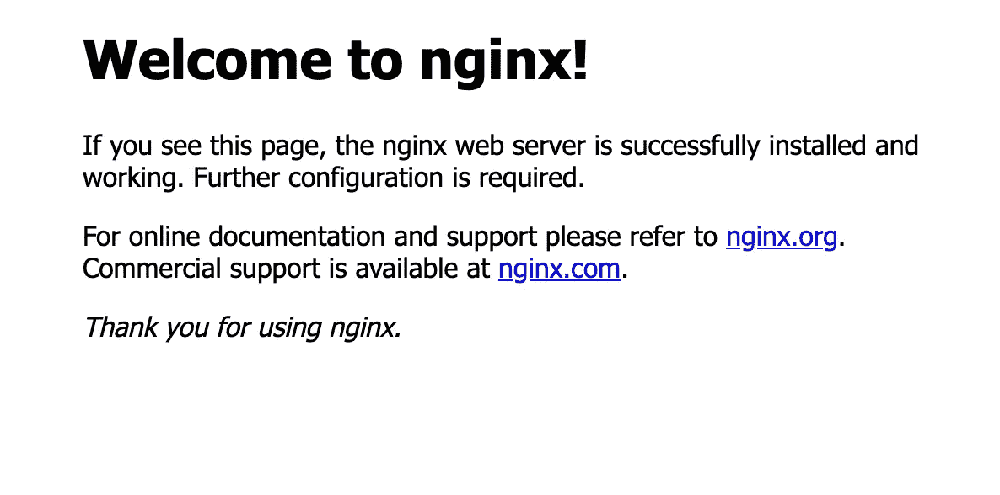
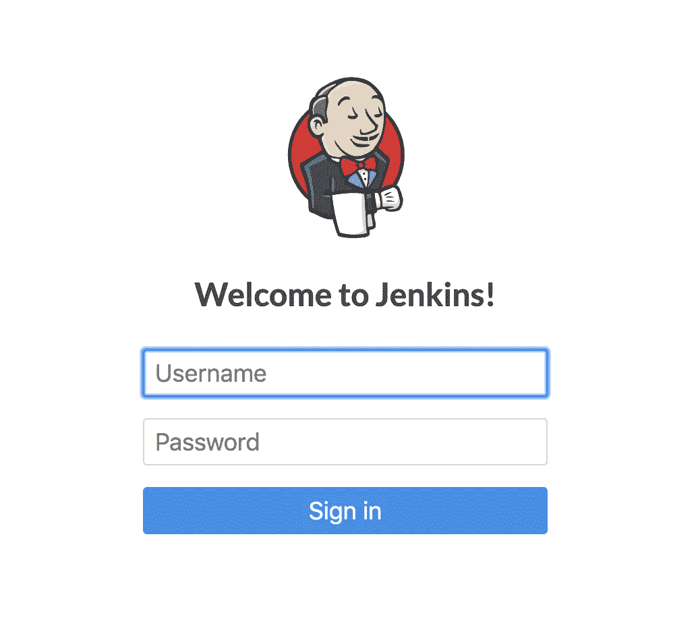

# 玩虚拟机和 Kubernetes

> 原文：<https://betterprogramming.pub/playing-with-vms-and-kubernetes-26ef93019c22>

## 有些人玩老爷车或者收集稀有物品——我玩电脑和软件系统

[阿德里安·布鲁诺](https://unsplash.com/@papidridri44?utm_source=unsplash&utm_medium=referral&utm_content=creditCopyText)在 [Unsplash](https://unsplash.com/s/photos/vintage-cars?utm_source=unsplash&utm_medium=referral&utm_content=creditCopyText) 拍摄的照片

我最近购买了一台翻新的机架式服务器，想作为 Kubernetes 集群试用。我的计划是创建一个有几个虚拟机和一些基本服务器元素的主机。

本文假设读者对 Linux 和命令行有基本的了解，并且有一些网络经验。许多步骤都记录了我的帐户中的 gists，并有我的用户名和其他本地信息。希望您能够找出您的安装需要替换什么。

在我的计划中，Kubernetes 将存在于虚拟机中。所以我要做的第一件事就是安装一台带 KVM 的主机。我将使用 Ubuntu 20.04 的日常版本(直到 4 月发布)。

虽然它还处于预发布阶段，但你可以从这里下载安装镜像。一旦发布，你应该可以从普通的 Ubuntu 下载页面获得安装镜像。您应该能够使用大多数默认选项来运行安装。由于 DHCP 服务器不工作，我不得不手动配置网络，但是一旦配置了网络适配器，它就能够连接到网络和互联网。

当它要求安装额外的软件时，只选择 OpenSSH 服务器。我们希望保持主机尽可能干净，所以我们将保持安装的软件最少。Ubuntu 新安装的一个好处是它会直接从 GitHub 获取你的公钥，所以你所有被 GitHub 信任的电脑都会被你的新服务器信任。

接下来，我们可以安装 KVM 来允许虚拟机。以下是我用来安装 KVM 的步骤:

一旦我们安装了所有的组件，我们就可以用命令`virsh list --all`进行测试，检查基本的 KVM 系统是否工作正常。然后，我们可以创建我们的第一个虚拟机。以下是我用于基本虚拟机的步骤:

您可以通过登录到新的虚拟机来检查它。你会注意到虚拟机在不同的子网上(在我的例子中，它在`192.168.122.0`上，而不是我的主局域网`192.168.0.0`)。它只能由主机直接访问，主机可以用作跳转框。

我想在主机上安装的另外几个软件是 nginx，它可以作为虚拟机和 Postfix 上运行的服务的反向代理，这样需要 SMTP 服务器的服务就可以发送电子邮件。对于 nginx 服务器来说，`sudo apt install nginx`将完成这个任务。要测试它是否已安装，请浏览到`[http://<mainhostIP>/](http://localhost/)`。

标准的 Ubuntu 配置创建了`/etc/nginx/available-sites`和`/etc/nginx/enabled-sites`，这是我过去使用 Apache HTTP 服务器时用过的。

第一次安装时，有一个默认的网站，只是一个欢迎屏幕。它驻留在`available-sites`目录中，并链接到`enabled-sites`目录中。您应该删除它或取消它与`enabled-sites`目录的链接。

这种设置背后的想法是，你可以在`available-sites`中保留暗点，并在你想要曝光它们时将它们链接到`enabled-sites`。您可以使用这个配置，或者您可以直接编辑`/etc/nginx/nginx.conf`文件。当我有一个服务时，我将设置一个反向代理。

下一件事，我想建立一个 SMTP 服务器，使服务可以发送电子邮件。这有点复杂，如果你不能把它设置好，也不是世界末日。这些是我遵循的步骤:

你必须将 Gmail 设置为允许不太安全的访问。同样，如果你不喜欢这样做，能够发送电子邮件是一件好事，而不是必需品。

现在我们已经安装了 VM、nginx 和 Postfix。让我们将 Kubernetes 放在虚拟机上。我将使用 Kubernetes 的 microk8s 发行版，安装非常简单。登录到您的新虚拟机，并运行这些步骤。

启用插件时，`metallb`负载均衡器会询问它可以使用的 IP 地址范围。我使用了虚拟机的子网，并给了它 15 个 IP，所以在我的例子中是`192.168.122.240`–`192.168.122.254`。

要查看在新的 Kubernetes 系统下运行的所有进程，您可以使用命令`microk8s.kubectl get all --all-namespaces`获得一个列表。这是我们将要做的事情所需的基本组件系统。

最后一件事是获取配置，这样我们就可以从主机与我们的 Kubernetes 系统通信。使用命令`sudo microk8s.config`，并复制该命令的输出。请注意，输出包含关于如何与 microk8s 集群通信的敏感信息。然后，注销虚拟机，并返回到主主机。

Kubernetes 是一个通过 API 控制的服务器系统。控制 API 的标准方式是`kubectl`命令行工具。

为了让`kubectl`与正确的 Kubernetes 服务器或集群对话，您需要将集群配置复制到`~/.kube/config`文件中。这就是为什么我们在前一步复制了`microk8s.config`文件的输出。`kubectl`命令可以和`snap install kubectl --classic`一起安装。

接下来，您可以创建`~/.kube/config`文件并将输出直接复制到该文件中。这将设置`kubectl`命令与您的新集群对话。可以用`kubectl get all --all-namespaces`测试一下。它应该给出与您在虚拟机上得到的相同的列表。

让我们在我们的新系统上安装一些有趣的东西。对我来说有趣的是 Jenkins，这样我可以在本地运行构建，并将它们部署到我们新的 Kubernetes 集群。要安装预配置的系统，我将使用 Helm，必须先安装它。一个简单的`sudo snap install helm --classic`命令就可以做到。然后，我们可以安装詹金斯。

以下步骤可用于从 Google Helm repo 或 Bitnami Helm repo 安装 Jenkins。我将使用谷歌头盔回购。

但是在我们可以访问新的 Jenkins 服务器之前，我们必须给它一个负载平衡器(尽管它默认只有一个 pod)，并且我们必须将它添加到 nginx 反向代理中。`kubectl edit service/jenkins`将调出 Jenkins 服务的配置(即其网络访问)，并将`spec.type`更改为`LoadBalancer`。

现在做一个`kubectl get services`，它应该会列出运行它的 IP 地址。现在，您可以配置 nginx 反向代理。我将创建一个名为`/etc/nginx/sites-enabled/jenkins`的文件(假设您已经按照上一步的指示删除了默认站点)。以下是内容:

您应该将`upstream jenkins`块中的 IP 地址更改为由`kubectl get services`命令列出的地址。然后`sudo nginx -s reload`重新加载 nginx 配置。

因为我们使用的是虚拟主机，所以你必须弄乱你将要访问的主机上的`/etc/hosts`，它将把名字`jenkins`绑定到主机的 IP 上。然后，你可以浏览到`[http://jenkins/login](http://jenkins/login)`，瞧！

您可以使用用户名`admin`和通过`kubectl get secret jenkins -o jsonpath="{.data.jenkins-admin-password}" | base64 --decode`命令获得的密码。作为安装詹金斯的一部分，它创建了一个秘密，并将其存储在 Kubernetes 中，以供将来访问。非常方便！

概括地说，我们在 Ubuntu 主机上安装了一个虚拟机，在 VM 上安装了 Kubernetes，在 Kubernetes 上安装了 Jenkins，并通过 nginx 将其暴露给 LAN。在我的下一篇文章中，我将使用 Kubernetes pods 作为工作节点，在我们的新 Jenkins 实例中运行一些作业。