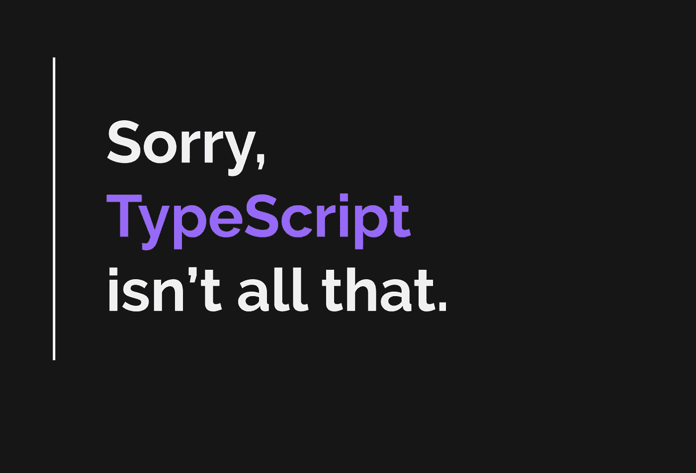

# 请把打字稿放下一会儿

> 原文：<https://betterprogramming.pub/please-put-typescript-down-for-a-moment-103f15378d34>

## 在键入 JavaScript 的时代，有时我们需要后退一步，权衡利弊



首先，让我澄清一下:类型化的 JavaScript 棒极了。我用过 Flow，现在和将来都会继续使用 TypeScript。这是一个发展迅速的强大工具。

但是这种力量的代价是什么呢？这些改变游戏规则的工具有什么缺点？

有时我们需要把我们的工具放在阳光下，这样我们就能看到它们好的和坏的一面。

所以，请暂时放下 8 位的火把和干草叉，让我们以开放的心态探索类型化 JavaScript 的负面影响！

# 代码很容易变得冗长

正如评论中提到的，我主要从 React + Redux 的角度来看这个问题。*您的体验在很大程度上取决于您使用的库！*

一般来说，使用 TypeScript 和 Flow 的讽刺之处在于，手动键入是我们想要尽可能避免的事情！它会使代码更加冗长，容易出错，并且更难管理。

在理想的情况下，我们让 TypeScript 从我们的库中以及语言中已经定义的库中推断类型。这样，我们就获得了类型安全的好处，同时只需管理自定义对象类型。

然而，有时候冗长是无法避免的。让我们看一个用 TypeScript 编写的简单的基于类的 React 组件:

这是一个普通的基于类的 React 组件:

TypeScript 版本多了 248%的代码。是的，道具和状态都有明确的定义，但是那*真的是我们现在所说的*可读吗？

看看这个处理 redux 动作的类型的[例子。它非常聪明和有用——我强烈推荐阅读它——但是为什么它首先是必要的呢？](https://dev.to/pretaporter/typescript-and-redux-my-tips-5da9)

```
type InferValueTypes<T> = T extends { [key: string]: infer U } ? U : never;

type Actions = ReturnType<InferValueTypes<typeof actions>>
```

我甚至不会去探究类型化带来的丑陋…

# 许多库没有类型

虽然类型化的生态系统在增长，但它远没有 100%被覆盖。这意味着，在许多情况下，您是手动推出类型的。

然而，每个大型项目最终都会推出一些邪恶的定制类型(或从 GitHub 版本中复制它们)来适应一些库或用例。

即使是像 Redux 这样最受欢迎的库，管理动作、thunks 等也是一个活地狱。

# 手动编写的类型容易出错

让我们假设一个大型团队正在进行一个项目。约翰写了下面的类型定义:

```
type PropsA = { 
 name: string, 
 date: Date, 
 url: string 
}
```

当这个类型定义被创建时，Pablo 没有意识到它的存在，所以他创建了一个类似的类型:

```
type PropsB = { 
 name: string, 
 date: string, 
 url: string 
}
```

现在我们有了多余的类型，更糟糕的是，`PropsB`的定义略有不同。清晰类型定义的承诺已经成为过去式。

这不是一个很少发生的假设场景。我在投入数百万美元的大型项目中看到过这种情况。

# 它给人一种虚假的安全感

虽然这可能不是最好的方法，但是假设您定义了一个 redux 操作，如下所示:

```
export const MY_BASIC_ACTION: ‘MY_BASIC_ACTION’ = ‘MY_BASIC_ACTION’
```

处理其中的几个就可以了，但是当您有 30 个动作类型时，在将旧动作作为新动作的模板进行复制时，很容易出现以下情况:

```
export const MY_NEW_ACTION: ‘MY_BASIC_ACTION’ = ‘MY_BASIC_ACTION’
```

看到这里的问题了吗？我们刚刚定义了一个新的动作作为第一个动作。

这很难跟踪，因为您将调度`MY_NEW_ACTION`，但它实际上会调度`MY_BASIC_ACTION`。

在 Flow/TypeScript 的怀抱中，你会感到如此安全和模糊，以至于你可能会用头撞墙几个小时才意识到这是…一个类型问题！

# 类型管理本身就是一种技能

JavaScript 已经很难理解了。当您将类型添加到这样一种动态的、无忧无虑的语言中时，正确且高效地编写类型需要很高的技能。

这并不是避免使用类型化 JS 的借口，但是对于时间紧迫或者有大量初级开发人员的真实项目来说，这是需要考虑的。

大多数时候，您可能正在键入组件属性、状态等。然而，总有一天你不得不做一些有点不靠谱的事情。

# 需要管理更多配置

建立一个类型化的生态系统并不是那么简单。您将使用构建工具，管理配置文件，创建更多的依赖项，等等。

曾经很容易集成的库现在会将你指向一个单独的部分，只是为了让它与 TypeScript 一起工作。

你将花费更多的时间在 GitHub 问题中寻找解决方案，试图让 Library Z 与 Flow 或 TypeScript 一起工作。

这真的很让人头疼。

# 一个坚固的 IDE 可能就是你所需要的

VSCode 中的 IntelliSense 与林挺工具相结合，提供了开发人员从 TypeScript 和 Flow 中寻求的许多好处。

说真的，看看你在 IDE 的支持下能走多远。我敢打赌，你会惊讶于你对 TypeScript 的想念是如此之少(但你总是会想念它，至少一点点)。

没有类型安全的舒适性的编码给了你 JavaScript 的全部能力——毕竟，它被设计成松散的类型——并且让你格外注意你写的代码。

# 结论

一个不用类型编写的项目仍然是可导航的和自文档化的，这是一个真正的成就。看起来我似乎非常讨厌 TypeScript，但事实远非如此。我喜欢 TypeScript，我知道它的好处。然而，围绕缺点展开对话也很重要。

毕竟，这是关于在工作中使用最好的工具，对吗？