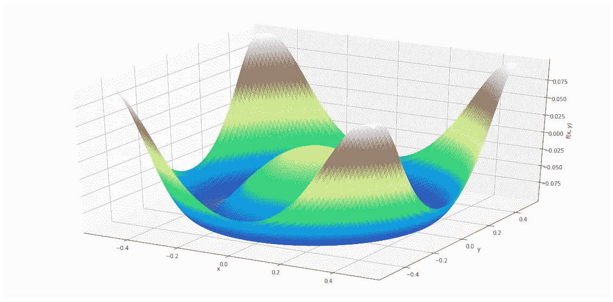

# 用 Matplotlib 和 NumPy 绘制 3D 函数

> 原文：<https://betterprogramming.pub/plot-3d-functions-with-matplotlib-and-numpy-9ab0879d23b2>

## 演示网格、矢量化和其他有用的工具


由[克里斯蒂安·弗雷南](https://unsplash.com/@christianfregnan?utm_source=unsplash&utm_medium=referral&utm_content=creditCopyText)在 [Unsplash](https://unsplash.com/s/photos/cube?utm_source=unsplash&utm_medium=referral&utm_content=creditCopyText) 上拍摄的照片

数学是美丽的，我们手边的软件代表了探索这种美丽的无价之宝。我们以前从未能够以如此容易理解的方式可视化和实验数学对象。

今天，我想分解使用 Python 绘制二元函数所需的步骤。

在此过程中，我们将学习一些 NumPy 过程，让您像向导一样操作矩阵。我将这个过程分解为三个概念性的步骤，这也有助于更新基础数学。

最后，我把所有的东西都放在一个可以开箱即用的函数中，所以如果你只需要这个函数，你可以随意跳到这个函数。

# 定义功能域

数学函数是从一个集合中提取元素并将它们与另一个集合中的一个元素相关联的映射。第一组输入被称为函数的*域*。在我们的例子中，定义域将由实数元组组成。

尽管在任何区间内都有无穷多个实数，但我们显然不能为我们的定义域存储一个无限集合。为了让我们的绘图看起来更好，在我们的域内采样足够多的点就足够了，这样最终的产品看起来会更平滑，不会有不自然的锯齿。

考虑到这一点，我们可以分三步定义我们的域并将其存储在一组数组中。

1.  决定我们领域中两个变量的边界:

```
x_interval = (-2, 2)
y_interval = (-2, 2)
```

2.每个间隔内的采样点:

```
x_points = np.linspace(x_interval[0], x_interval[1], 100)
y_points = np.linspace(y_interval[0], y_interval[1], 100)
```

3.取这两个采样集的[笛卡尔乘积](https://en.wikipedia.org/wiki/Cartesian_product)来产生两个数组，这两个数组(当堆叠时)形成一组有序对，我们可以在其上计算函数:

```
X, Y = np.meshgrid(x_points, y_points)
```

在定义我们的领域时，我们使用了 NumPy 的一些有用的工具:

*   这个函数产生一个均匀分布的实数序列。我还发现它的表亲`np.logspace`，对于制作超参数值的网格来尝试建模之类的事情很有用。
*   文档说它最好——mesh grid 从坐标向量中产生坐标矩阵如果将坐标矩阵一个接一个地堆叠起来，就会得到一个元组网格，可以用作两个变量函数的输入。

# 计算函数值

下一步是将输出值与输入域中的每个点相关联。这是我们可以使用不同功能的地方。我发现 Ben Joffe 的[“Functions 3D:Examples”](https://www.benjoffe.com/code/tools/functions3d/examples)网页是一个很好的灵感来源。

我们可以再次用三个步骤来计算我们的输出集。

1.  将我们的数学函数定义为两个标量输入的 Python 函数:

```
def func3d(x, y):
    return -np.sin(10 * (x**2 + y**2)) / 10
```

2.生成可在输入向量或矩阵上调用的函数的矢量化版本:

```
func3d_vectorized = np.vectorize(func3d)
```

3.从我们的两个域数组计算一个输出数组:

```
Z = func3d_vectorized(X, Y)
```

NumPy 提供的`[vectorize](https://docs.scipy.org/doc/numpy/reference/generated/numpy.vectorize.html)`函数对于将 Python 编写的自定义函数扩展到 [ndarray](https://docs.scipy.org/doc/numpy/reference/generated/numpy.ndarray.html) 矩阵和数组非常有用。它极大地增加了 NumPy 的灵活性，值得添加到您的工具包中。

# 绘制函数图

从这一点来看，事情的进展几乎与他们用 Matplotlib 制作 2D 图的方式相同。为了产生漂亮的 3D 可视化效果，只需要更改一些参数和方法名。

1.  用`projection='3d'`设置绘图图形和坐标轴:

```
plt.figure(figsize=(20, 10))
ax = plt.axes(projection=’3d’)
```

2.选择轴对象的绘图方法，并在我们的函数数据上调用它:

```
ax.plot_surface(X, Y, Z, rstride=1, cstride=1,
                cmap=’terrain’, edgecolor=None)
```

3.设置绘图的其他属性，如标题和轴标签:

```
ax.set(xlabel=”x”, ylabel=”y”, zlabel=”f(x, y)”, 
       title=”Cool Function”)
```

更多绘图方法和参数，请参考 [mplot3d 教程](https://matplotlib.org/mpl_toolkits/mplot3d/tutorial.html)。有关 cmap 参数的更多颜色图，请参考 Matplotib [颜色图教程](https://matplotlib.org/3.1.0/tutorials/colors/colormaps.html)。

# **综合考虑**

为了使这个过程更具可重复性，我将所有这些步骤打包到一个 Python 函数中，用于快速生成表面图。



现在，打包和模块化绘图工具仍然是一门艺术，它取决于个人喜好。特别是像 Matplotlib 这样的库，它是从一个主要用于交互使用的绘图工具发展而来的( [MATLAB plot](https://www.mathworks.com/help/matlab/ref/plot.html) )，它可能会觉得有点不自然地将调用它们的副作用的代码序列改编成更具功能性的东西。

以下是我在包装 3D 绘图代码时的主要考虑。在创建其他绘图工具时，我往往不得不做出类似的决定。

## **参数暴露**

我希望能够调整的主要旋钮是功能域、创建域网格的粒度以及将用于产生输出的实际功能。因此，这是我的前三个论点。

有时我也喜欢暴露绘图方法的参数或图形或轴对象的属性设置。在本例中，我将 title 属性公开为可以在初始函数调用期间设置的内容。

## **使用** `***args**` **或** `****kwargs**`

我喜欢使用`[**kwargs](https://www.geeksforgeeks.org/args-kwargs-python/)`来传递绘图方法的参数，这样我就可以快速地试验可选的颜色图和其他美学参数。

记住，`**kwargs`这个名字只是一个约定，所以有时候我喜欢用更描述性的名字来命名。

## **返回对象**

我偏爱[函数式编程](https://en.wikipedia.org/wiki/Functional_programming)，所以我试着设计我的绘图函数，感觉它们没有[副作用](https://en.wikipedia.org/wiki/Side_effect_(computer_science))。通过使用`[plt.close()](https://matplotlib.org/3.1.3/api/_as_gen/matplotlib.pyplot.close.html)`并返回我的图形和轴对象，我有效地分离了我的情节的创建和可视化。

虽然从技术上来说，这并没有消除 Matplotlib 的副作用，而是在它们可以做任何事情之前清理它们，但这仍然足以让我满意。

返回图形和轴对象允许进一步的定制或更改。例如，要改变图形大小，您可以调用`fig.set_size_inches(<new_width>, <new_height>)`。要更改剧情标题，可以调用`ax.set(title=<new_title>)`。

# 结论

现在，我们知道了生成 3D 可视化所需的步骤，因此数学之美更容易在我们的指尖获得。

要查看，步骤如下:

1.  定义功能域:使用`[np.linspace](https://docs.scipy.org/doc/numpy/reference/generated/numpy.linspace.html)`沿着我们的输入变量采样点，并使用`[np.meshgrid](https://docs.scipy.org/doc/numpy/reference/generated/numpy.meshgrid.html)`创建输入网格。
2.  计算函数值:定义一个两变量的函数——然后使用`[np.vectorize](https://docs.scipy.org/doc/numpy/reference/generated/numpy.vectorize.html)`将其应用于我们的输入网格。
3.  绘图功能:用`[projection=’3d’](https://matplotlib.org/mpl_toolkits/mplot3d/index.html)` 创建 Matplotlib 图形和轴–然后调用绘图方法，并设置附加参数。

您还可以看到我是如何将代码打包成可重用的东西的。我简要地讨论了接口设计，谈到了直接公开哪些参数，使用哪些内部方法来传递参数以使用`*args`或`**kwargs`，以及返回图形和轴对象[如何允许进一步的下游定制](https://medium.com/@rayheberer/generating-matplotlib-subplots-programmatically-cc234629b648)，同时使代码感觉更有功能性。

请随意分享你发现的最酷的功能。如果你包括你的代码，加分。密谋愉快！