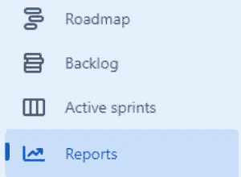
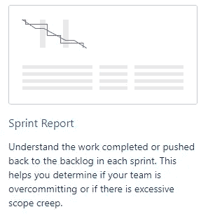
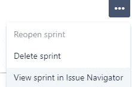
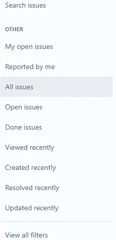
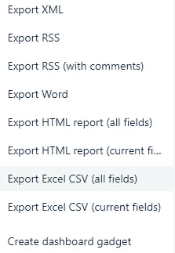
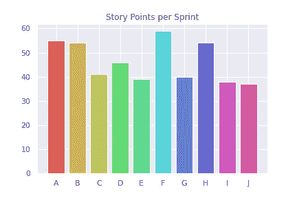

# 用 Python 绘制吉拉的故事点

> 原文：<https://betterprogramming.pub/plotting-story-points-from-jira-with-python-6a7fb8ea0098>

## 使用 Python 从吉拉导出和可视化数据


艾萨克·史密斯在 [Unsplash](https://unsplash.com?utm_source=medium&utm_medium=referral) 上拍摄的照片

我现在的公司使用 [scrum 系统](https://www.alphr.com/business/1009617/what-is-scrum-system/#:~:text=At%20the%20core%20of%20the,work%20collectively%20on%20incremental%20jobs.)和[吉拉软件](https://jira.com/)，这意味着跟踪故事点、问题、史诗等等。尽管吉拉为可视化您的数据提供了一系列功能，但我想看看是否可以沿着不同的史诗来绘制我的故事点。所以，我决定用 Python 做一些基本的数据分析。

***在本文中，我将向您展示如何使用 Python*** 从您的吉拉仪表板绘制数据

# 步伐

这方面的基本步骤是:

1.  从吉拉导出数据
2.  加载数据
3.  清理和准备数据
4.  将数据可视化

我们开始工作吧！

## 1.从吉拉导出数据

从吉拉导出数据的步骤如下:

1.  转到报告



图片由作者提供，截图来自 jira.com

2.转到冲刺报告



图片由作者提供，截图来自 jira.com

3.在 sprint 仪表盘的右上角查看导航问题



图片由作者提供，截图来自 jira.com

4.点击所有问题



图片由作者提供，截图来自 jira.com

5.在导出中单击


图片由作者提供，截图来自 jira.com

6.导出到 CSV



图片由作者提供，截图来自 jira.com

## 加载数据

好了，现在是有趣的部分，让我们使用 Python 加载数据。出于隐私原因，我更改了数据并删除了受限信息。

```
import pandas as pd

df = pd.read_csv("./jira_data.csv")
```

## 清理和准备数据

为了清理数据，我们将只选择我们需要的相关列，删除 nan 和不相关的数据，最后，验证最终的数据帧看起来不错。

我们需要 CSV 提供的列有:

*   ***受托人*** :任务的负责人(这里是我！)
*   ***冲刺*** :冲刺的名称(本例中按字母顺序排列)
*   ***自定义字段(故事点)*** :每个任务的故事点(这里我不确定这个字段是否会有不同的名称，只是寻找类似故事点的东西)

```
df = df[["Assignee", "Sprint", "Custom field (Story Points)"]].reset_index(drop=True)

# drop nans from dataframe
df = df.dropna()
```

现在，我按照 sprint 名称对列进行分组:

```
# letters from A to J in upper case as a list
cols = list(map(chr, range(65, 75)))

cols

for col in df["Sprint"].unique():
    if col not in cols:
        df.drop(df[df["Sprint"] == col].index, inplace=True)

df["Sprint"].unique()array(['J', 'I', 'H', 'G', 'F', 'E', 'D', 'C', 'B', 'A'], dtype=object)df_sorted_points = df.groupby(["Sprint"])["Custom field (Story Points)"].sum().reset_index()
df_sorted_points
```


作者图片

完美！现在我们有了数据，我们可以开始可视化它了！

## 将数据可视化

我从这个例子中想要的只是一个按顺序排列的我的每个 sprint 的故事点的有组织的时间线。

```
import matplotlib.pyplot as plt
import seaborn as sns
sns.set()

colors = sns.color_palette("hls", len(df_sorted_points["Sprint"].unique()))

plt.title("Story Points per Sprint")
plt.bar(df_sorted_points["Sprint"],
        height=df_sorted_points["Custom field (Story Points)"],
        color=colors);
```



作者图片

# 最后的想法

人们可以利用吉拉数据做很多事情来提高生产率，在这种情况下，我的重点主要是获得关于我的 sprint 计划一致性的信息。

在未来，我可能会关注故事点数量和任务花费时间之间的相互作用。

```
**Want to Connect?**Subscribe to my [youtube channel](https://www.youtube.com/channel/UCu8WF59Scx9f3H1N_FgZUwQ) and connect with me on [Tiktok](https://www.tiktok.com/@enkrateialucca?lang=en), [Twitter](https://twitter.com/LucasEnkrateia), [LinkedIn](https://www.linkedin.com/in/lucas-soares-969044167/), and [Instagram](https://www.instagram.com/theaugmentedself/)! Thanks and see you next time! :)
```

## 参考

*   [https://jira.com/](https://jira.com/)
*   [Scrum 定义](https://www.alphr.com/business/1009617/what-is-scrum-system/#:~:text=At%20the%20core%20of%20the,work%20collectively%20on%20incremental%20jobs.)