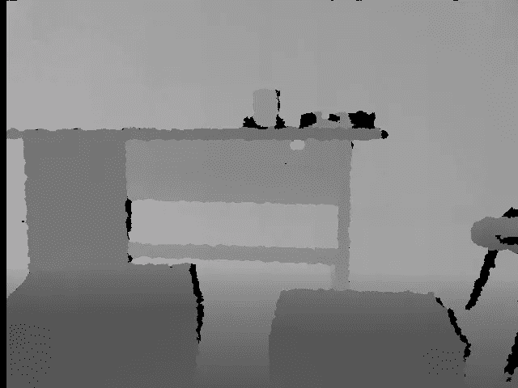
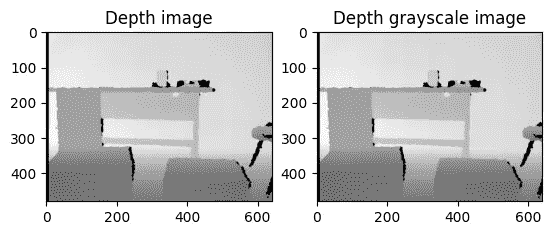
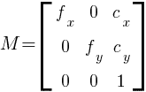
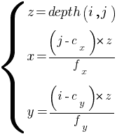
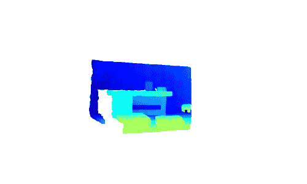
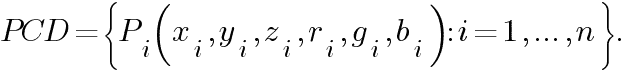
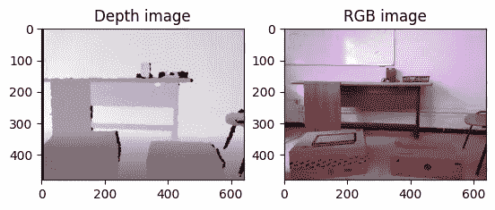
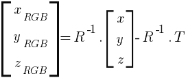
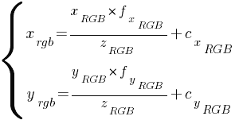
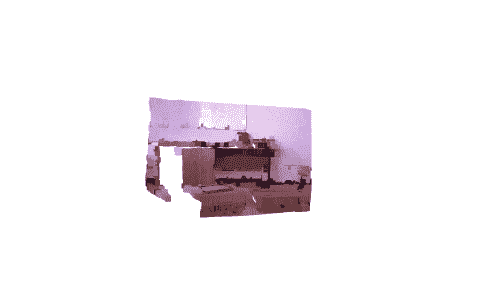

# 在 Python 中从深度图像估计点云

> 原文：<https://betterprogramming.pub/point-cloud-computing-from-rgb-d-images-918414d57e80>

## 基于 RGB-D 图像的点云计算


照片由[乔纳森派](https://unsplash.com/@r3dmax?utm_source=medium&utm_medium=referral)在 [Unsplash](https://unsplash.com?utm_source=medium&utm_medium=referral)

这是我的“点云处理”教程的第二篇文章。“点云处理”教程是初学者友好的，其中我们将简单介绍从数据准备到数据分割和分类的点云处理流水线。

*   [第一篇:点云处理简介](https://medium.com/@chimso1994/introduction-to-point-cloud-processing-dbda9b167534)
*   [文章 2:用 Python 从深度图像中估计点云](https://medium.com/better-programming/point-cloud-computing-from-rgb-d-images-918414d57e80)
*   [第三篇:理解点云:使用 Python 实现地面检测](/understand-point-clouds-a-simple-ground-detection-algorithm-71aaa0dd2b2d)
*   [第 4 篇:Python 中的点云过滤](https://medium.com/@chimso1994/point-cloud-filtering-in-python-e8a06bbbcee5)
*   [第五篇:Python 中点云分割](https://medium.com/@chimso1994/point-cloud-segmentation-in-python-2fdbf5ea0617)

在[之前的教程](https://medium.com/@chimso1994/introduction-to-point-cloud-processing-dbda9b167534)中，我们介绍了点云并展示了如何创建和可视化它们。在本教程中，我们将学习如何在不使用 Open3D 库的情况下从深度图像计算点云。我们还将展示如何优化代码以获得更好的性能。

```
**Table of contents:**
· [1\. Depth Image](#3de9)
· [2\. Point cloud](#9424)
 ∘ [2.2 Depth camera calibration](#fa35)
 ∘ [2.3 Point cloud computing](#2c78)
· [3\. Colored point cloud](#288f)
· [4\. Code optimization](#4391)
 ∘ [4.1 Point cloud](#4eaa)
 ∘ [4.2 Colored point cloud](#7ec8)
· [5\. Conclusion](#d75f)
```

# 1.深度图像

深度图像(也称为深度图)是一种图像，其中每个像素提供其相对于传感器坐标系的距离值。深度图像可以通过结构光或飞行时间传感器来捕捉。为了计算深度数据，结构化光传感器，如微软 Kinect V1，比较投影光和接收光之间的失真。至于像微软 Kinect V2 这样的飞行时间传感器，它们投射光线，然后计算投射和接收光线之间的时间。

除了深度图像之外，一些传感器提供它们相应的 RGB 图像以形成 RGB-D 图像。后者使得计算彩色点云成为可能。本教程将以微软 Kinect V1 RGB-D 图像为例。

让我们从导入库开始:

现在，我们可以导入深度图像并打印其分辨率和类型:

```
Image resolution: (480, 640)
Data type: int32
Min value: 0
Max value: 2980
```

深度图像是一个大小为 *640* × *480* 的矩阵，其中每个像素是一个 *32* (或 *16* )位整数，以毫米为单位表示距离，因此深度图像在打开时看起来是黑色的(见下图)。最小值 *0* 代表噪声(没有距离)，而最大值 *2980* 代表最远像素的距离。


由微软 Kinect V1 生成的深度图像。

为了更好的可视化，我们计算它的灰度图像:

计算灰度图像意味着将深度值缩放到`[0, 255]`。现在图像更清晰了:



计算出的灰度图像。黑色像素代表噪声。

注意，Matplotlib 在可视化深度图像时做同样的事情:



Matplotlib 自动缩放深度图像的像素。

# 2.点云

现在我们已经导入并显示了深度图像，如何从中估算点云呢？第一步是校准深度相机，以估计相机矩阵，然后用它来计算点云。所获得的点云也被称为 2.5D 点云，因为它是根据 2D 投影(深度图像)而不是诸如激光传感器的 3D 传感器来估计的。

## 2.2 深度相机校准

校准相机意味着通过找到失真系数和相机矩阵(也称为内在参数)来估计镜头和传感器参数。一般来说，有三种方法可以校准相机:使用工厂提供的标准参数，使用校准研究中获得的结果或手动校准 Kinect。手动校准摄像机包括应用一种校准算法，如棋盘算法[1]。该算法在机器人操作系统(ROS)和 OpenCV 上实现。校准矩阵 *M* 是一个 *3* × *3* 矩阵；



其中 *fx，fy* 和 *cx，cy* 分别为焦距和光心。对于本教程，我们将使用从 [NYU 深度 V2 数据集](https://cs.nyu.edu/~silberman/datasets/nyu_depth_v2.html)获得的结果:

如果你想自己校准相机，可以参考 OpenCV 教程。

## 2.3 点云计算

这里计算点云就是将深度像素从深度图像 2D 坐标系转换到深度相机 3D 坐标系( *x，y* 和 *z* )。使用以下公式[2]计算 3D 坐标，其中 *depth(i，j)* 是行 *i* 和列 *j* 处的深度值:



该公式适用于每个像素:

让我们使用 Open3D 库来显示它:



由深度图像计算得到的点云。

# 3.彩色点云

如果我们想从 RGB-D 图像中计算彩色点云呢？颜色信息可以增强像点云配准这样的许多任务的性能。在这种情况下，如果输入传感器也提供 RGB 图像，则最好使用它。彩色点云可以定义如下:



其中 *x，y* 和 *z* 是 3D 坐标， *r，g* 和 *b* 代表 RGB 系统中的颜色。

我们从导入先前深度图像的相应 RGB 图像开始:



深度图像及其对应的 RGB 图像

为了找到在深度传感器 3D 坐标系中定义的给定点 *p(x，y，z)* 的颜色:

**1。我们将其转换到 RGB 相机坐标系[2]:**



其中 *R* 和 *T* 分别是两个摄像机之间的外部参数:旋转矩阵和平移向量。

类似地，我们使用来自 [NYU 深度 V2 数据集](https://cs.nyu.edu/~silberman/datasets/nyu_depth_v2.html)的参数:

RGB 相机坐标系中的点计算如下:

**2。使用 RGB 摄像机的固有参数，我们将其映射到彩色图像坐标系[2]:**



这些是获取彩色像素的索引。

请注意，在前面的公式中，焦距和光学中心是 RGB 相机参数。同样，我们使用来自 [NYU 深度 V2 数据集](https://cs.nyu.edu/~silberman/datasets/nyu_depth_v2.html)的参数:

相应像素的指数计算如下:

让我们把所有的放在一起，显示点云:



从 RGB-D 图像计算彩色点云

# 4.代码优化

在这一节中，我们将解释如何优化您的代码，使其更高效，更适合实时应用程序。

## 4.1 点云

使用嵌套循环计算点云非常耗时。对于一幅分辨率为 *480×640* 的深度图像，在一台拥有 *8GB* RAM 和*i7–4500*CPU 的机器上，计算点云大约需要 ***2.154 秒*** 。

为了减少计算时间，可以用向量化操作代替嵌套循环，计算时间可以减少到大约 0.024 秒*:*

*我们还可以通过在开始时计算一次常数来将计算时间减少到大约 0.015 秒*:**

## **4.2 彩色点云**

**至于彩色点云，在同一台机器上，执行前面的例子大约需要 ***36.263 秒*** 。通过应用矢量化，运行时间减少到 **0.722 秒**。**

# **5.结论**

**在本教程中，我们学习了如何从 RGB-D 数据计算点云。在[下一篇教程](https://medium.com/@chimso1994/understand-point-clouds-a-simple-ground-detection-algorithm-71aaa0dd2b2d)中，我们将以一个简单的地面探测为例，来仔细分析点云。**

**谢谢，我希望你喜欢读这篇文章。你可以在我的 [GitHub 库](https://github.com/Chim-SO/pointcloudprocessing)中找到例子。**

# **参考**

**[1]张，张，黄，张(2006).一种新的结构光系统标定方法。*光学工程*， *45* (8)，083601。**

**[2]周，谢(2012).微软 Kinect 校准研究。费尔法克斯乔治梅森大学计算机科学系。**

# **图像制作者名单**

**本文中所有图片和数字的来源未在标题中提及，均由作者提供。**