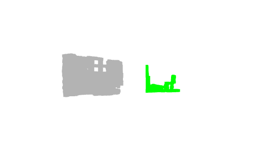
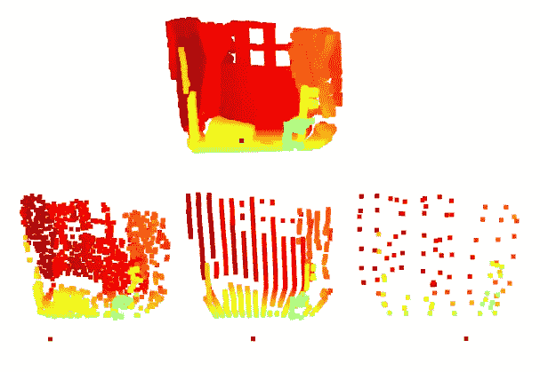
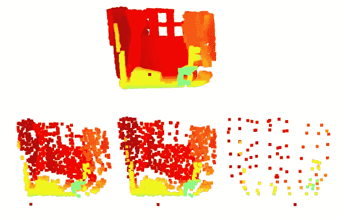
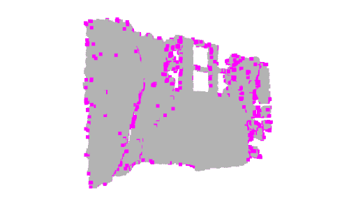
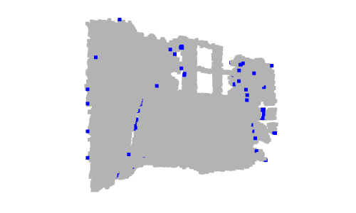

# Python 中点云过滤

> 原文：<https://betterprogramming.pub/point-cloud-filtering-in-python-e8a06bbbcee5>

## 利用 Open3D 进行点云预处理


戴维·马尔库在 [Unsplash](https://unsplash.com?utm_source=medium&utm_medium=referral) 上的照片

这是我的“点云处理”教程的第 4 篇文章。“点云处理”教程是初学者友好的，其中我们将简单介绍从数据准备到数据分割和分类的点云处理流水线。

*   [第一篇:点云处理简介](https://medium.com/@chimso1994/introduction-to-point-cloud-processing-dbda9b167534)
*   [文章 2:用 Python 从深度图像中估计点云](https://medium.com/better-programming/point-cloud-computing-from-rgb-d-images-918414d57e80)
*   [第三篇:理解点云:使用 Python 实现地面检测](/understand-point-clouds-a-simple-ground-detection-algorithm-71aaa0dd2b2d)
*   [第 4 篇:Python 中的点云过滤](https://medium.com/@chimso1994/point-cloud-filtering-in-python-e8a06bbbcee5)
*   [第五篇:Python 中点云分割](https://medium.com/@chimso1994/point-cloud-segmentation-in-python-2fdbf5ea0617)

在本教程中，我们将学习如何使用 Open3D 在 python 中过滤点云以进行下采样和离群点移除。

```
**Table of contents**· [1\. Introduction](#d9b8)
· [2\. Pass-through filter](#830e)
· [3\. Down-sampling](#b2f6)
· [4\. Outlier removal filters](#5fd9)
· [5\. Conclusion](#9412)
```

# 1.介绍

由于所使用的 3D 扫描仪(如结构光扫描仪)或捕获的场景(包括吸收红外光的材料)的性质，计算或收集的点云有时会有噪声。另一方面，一些算法和/或计算机视觉技术对噪声敏感，如估计表面法线和曲率变化。

为了降低噪声，使用了滤波技术。一些过滤器也被用来减少点云密度，从而减少计算时间。在本文中，我们将看到一些常见的过滤器，即:通过过滤器，统计离群点消除过滤器，半径离群点消除过滤器和下采样过滤器。

# 2.通过过滤器

通过滤波器对输入数据施加约束，这些约束通常是阈值或间隔。对于点云，如果一个点满足约束(主要是沿一个或多个轴的间隔),则该点通过过滤器。为了减少噪声，通常根据输入设备的性质和状态来固定间隔:深度数据在间隔内更准确，否则会变得更嘈杂。带通滤波器不仅可以用于从噪声中过滤输入，还可以用于减少数据，例如考虑最近点。

到版本 *0.7.0* ，Open3D 支持函数`**crop_point_cloud(input, min_bound, max_bound)**`，其中[1]:

> `input`是输入的点云。
> 
> `min_bound`是点坐标的最小界限。
> 
> `max_bound`是点坐标的最大界限。
> 
> ***返回*** 区间内的点云。

例如，通过考虑间隔`[0.8, 3]`来过滤点云以减少沿 Z 轴的噪声。对于 X 和 Y 轴，我们将边界设置为无穷大，因为我们没有沿着它们进行过滤:

在 0.7.0 版本之后，可以使用`open3d.geometry.PointCloud`的方法`crop(bounding_box)`来裁剪点云。与前面的函数类似，该方法返回裁剪后的点云。为此，我们首先创建一个包围将要考虑的点的边界框。该边界框由间隔边界的组合创建(见`bounding_box_points`)。这里，我们只沿 Z 轴过滤:只返回其 Z 坐标在`[0.8, 2]`之间的点。最后，使用创建的边界框对象裁剪输入点云:

生成的点云如下所示:



灰色:输入点云。绿色:生成的点云。

# 3.向下采样

向下采样点云包括减少点的数量。例如，它通常用于减少处理步骤的运行时间或选择精确的训练点数。

Open3D 库提供了三种不同的方法来向下采样点云:

*   `random_down_sample(pcd, sampling_ratio)`:从输入点云`pcd`中选择`n*sampling_ratio`个随机点。它可用于数据扩充，因为每次选择不同的点。但是，它对噪音很敏感:可以选择。
*   `uniform_down_sample(every_k_points)`:根据顺序统一选择点。每隔`every_k_points`点选择一个点。总是选择第一个点(具有索引 0)。因此，所选点的指数为:0、`every_k_points`、2 * `every_k_points`等。如果输入的点云是有组织的，函数返回一个均匀的点云；另外，它与第一种方法相似，只是每次都生成相同的输出。
*   `voxel_down_sample(voxel_size)`:创建一个三维体素网格。体素网格将输入分成一组`voxel_size` × `voxel_size` × `voxel_size`体素。每个体素包括属于关于 3 个轴的相同间隔的点。然后，属于同一体素的点被下采样并用它们的质心代替。该过滤器用于减小点云的大小并使其平滑。然而，这是耗时的，因为它在将点云重组为体素之后计算质心，并且它对异常值敏感。

现在，让我们测试所有这些方法，并显示结果点云。为了更好的可视化，我们将`random_down_sample`、`uniform_down_sample`和`voxel_down_sample`分别设置为`sampling_ratio`到`0.005`、`every_k_points`到`200`和`voxel_size`到`0.4`。最后，我们应用平移在同一个窗口中分别显示所有的点云。



有组织的点云向下采样。顶部:输入点云。向下，从左到右:随机向下采样、均匀向下采样和基于体素的向下采样。

注意，`uniform_down_sample`方法产生的点云均匀分布在 3D 空间中。这是因为输入是有组织的点云(列表中的点是有组织的)。

让我们创建一个无组织的点云，通过洗牌点云的前一个点，如下:

然后，与前面的示例类似，我们对`u_pcd`应用不同的下采样方法，并显示结果。可视化窗口如下所示:



无组织点云下采样。顶部:输入点云。向下，从左到右:随机向下采样、均匀向下采样和基于体素的向下采样。

这里，`uniform_down_sample`方法产生的点云在 3D 空间中不是均匀分布的。因为点是无组织的，所以看起来更像是随机下采样。然而，`voxel_down_sample`返回相同的点云，因为它将点重新组织成一个 3D 网格。

# 4.离群点去除过滤器

*   **半径异常值移除**是一个条件过滤器，移除在给定半径的球体内具有少于给定数量的邻居的每个点。Open3D 提供了方法`remove_radius_outlier(nb_points, radius)`，其中:

> `nb_points`是邻居的数量。
> 
> `radius`是球体半径。
> 
> **返回**:过滤后的点云的元组和内联器索引的列表。

*   **统计异常值移除过滤器**移除离其邻居较远的点。对于每个点，计算从它到所有它的邻居的平均距离。然后，如果该点的平均距离在由全局距离平均值和标准差定义的区间之外，则该点是异常值。Open3D 提供了方法`remove_statistical_outliers(nb_neighbors, std_ratio)`其中[2]:

> `nb_neighbors`是邻居的数量。
> 
> `std_ratio`是标准差比率。
> 
> **返回**:过滤后的点云元组和内联器索引列表。

让我们测试这两种方法，并显示结果点云。为了减少运行时间，我们首先应用下采样。在应用离群点去除过滤器后，我们使用`select_by_index(index, invert)`通过索引选择离群点。我们将`invert`设置为`True`来反转索引的选择。



点云异常值去除。左:半径过滤器。右图:统计过滤器。

# 5.结论

为此，我们介绍了最著名的点云过滤器。这些过滤器在 Open3D 中实现。它们也在其他一些点云库中实现，比如 PCL。在大多数实时应用中，特别是对于密集的点云，需要过滤和减少点云的大小。[下一个教程](https://medium.com/@chimso1994/point-cloud-segmentation-in-python-2fdbf5ea0617)讲点云分割。您将会看到，只需使用一些 Python 库就可以简单地做到这一点。

谢谢，我希望你喜欢读这篇文章。你可以在我的 [GitHub 库](https://github.com/Chim-SO/pointcloudprocessing)中找到例子。如果你有任何问题或建议，欢迎在下面给我留言。

# 参考

[1][open 3d . geometry . crop _ point _ cloud](http://www.open3d.org/docs/0.7.0/python_api/open3d.geometry.crop_point_cloud.html?highlight=crop_point_cloud#open3d.geometry.crop_point_cloud)

[2][http://www . open 3d . org/docs/release/python _ API/open 3d . geometry . point cloud . html](http://www.open3d.org/docs/release/python_api/open3d.geometry.PointCloud.html)

# 图像制作者名单

本文中所有图片和数字的来源未在标题中提及，均由作者提供。