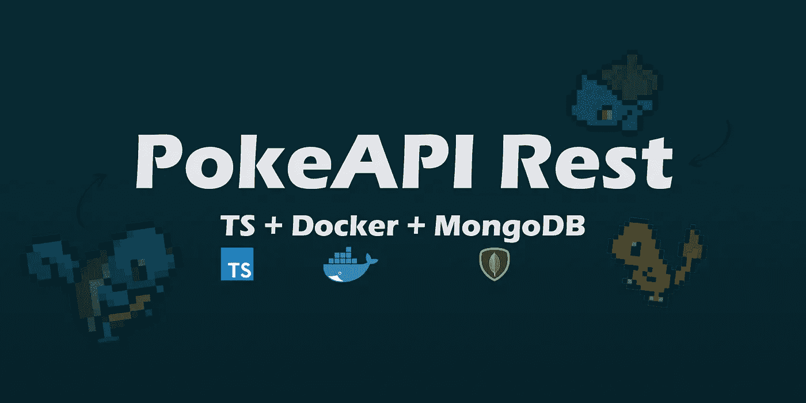
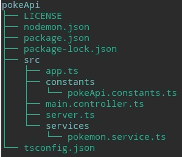
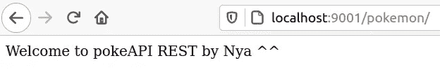

# 用 Express、Typescript、MongoDB 和 Docker 在 Node.js 中创建 REST API 第 1 部分

> 原文：<https://betterprogramming.pub/pokeapi-rest-in-nodejs-with-express-typescript-mongodb-and-docker-part-1-8428b0cd05d>

## 如何在 Node.js 中创建 RESTful PokeAPI



这是系列文章的第一部分，将向您展示如何使用 Express、TypeScript、Docker 和 MongoDB 在 Node.js 中创建 REST API。以下是本系列的其余部分:

[用 Express、Typescript、MongoDB 和 Docker 在 Node.js 中创建 REST API 第二部分](https://medium.com/better-programming/pokeapi-rest-in-nodejs-with-express-typescript-mongodb-and-docker-part-2-38b48af52860)

[用 Express、Typescript、MongoDB 和 Docker 在 Node.js 中创建 REST API 第三部分](https://medium.com/better-programming/pokeapi-rest-in-nodejs-with-express-typescript-mongodb-and-docker-part-3-1b173fc2a482)

你可以在这里找到[的完整代码。](https://github.com/puntotech/pokeAPI/)

# 介绍

在这个系列中，我们将学习如何使用名为 [Express](https://expressjs.com/) 的优秀 web 框架在 Node.js 中创建我们自己的 RESTful API。然而，在我们开始之前，有一点理论:

[REST](https://en.wikipedia.org/wiki/Representational_state_transfer) 代表具象状态转移。Roy Fielding 为他的博士论文设计的令人敬畏的软件架构风格。REST 允许我们通过使用 HTTP 协议来设计松散耦合的应用程序。

HTTP 为我们提供了以下动词，或者说方法:GET、POST、PUT 和 DELETE，分别对应于 Read、Create、Update 和 Delete (CRUD 操作)。还有一些其他的动词，但是它们不经常使用。我们将使用这些动词来发出请求，这些请求将对我们的数据执行各种操作。

因为(依我拙见) [TypeScript](https://www.typescriptlang.org/) 是自切片面包以来最好的东西，这是我们将使用的语言。对于那些不熟悉它的人来说，TypeScript 是 JavaScript 的一个类型化超集，我们将它编译成普通的 JavaScript，它允许我们向 JavaScript 添加类型。

由于我们需要一个数据库来存储我们的数据，我们将使用 MongoDB 的一个 dockerized 实例，以及[mongose，](https://mongoosejs.com/)一个 ODM，它使得与 MongoDB 的交互更加容易。

现在我们知道了我们将做什么以及如何做，让我们开始编码吧。

# 先决条件

## 试映

在我们开始之前，我想向您展示一下在本系列结束时我们的目录树的样子:



pokeApi part1 目录树

*为了防止有人对我如何生成目录树映像感到好奇，我使用了 Linux* `*tree*` *命令，并抓拍了一张我的终端的截图。*

## 安装 Node.js

由于我们将在项目中使用 Node.js，首先要做的是确保它安装在我们的机器上。

*提示:打开您的终端并运行这个命令来检查是否安装了节点:* `*node -v*` *。*

如果没有，可以在这里安装[。](https://nodejs.org/en/)

## 安装 Docker 和 Docker-compose

Docker 是一个奇妙的工具，它允许我们通过使用容器来创建、部署和运行应用程序(或者几乎任何我们想要的东西)。我们可以用几个简单的命令在几分钟内部署一个 MongoDB 数据库(或任何其他数据库)。

提示:运行 `*docker -v*` *看看你的机器上是否有 Docker。*

如果没有，可以在这里安装[。](https://docs.docker.com/install/)

正如我刚才提到的，Docker 非常棒。然而，这纯粹是个人喜好，我更喜欢使用 Docker Compose 部署我的容器，这是 Docker 提供的一个简洁的工具。它允许我们创建一个`.yml`配置文件，我们可以在其中指定容器的所有细节，并使用一个简单的命令部署该容器。

提示:运行 `*docker-compose -v*` *来检查你的机器上是否有 Docker-Compose。*

如果没有，可以在这里安装[。](https://docs.docker.com/compose/install/)

# 设置

## 入门指南

有了所有的先决条件，我们现在可以开始真正的编码了。让我们开始吧:

第一步是创建我们的项目将要存在的文件。我将我们的项目目录命名为`pokeApi`。如果你喜欢，可以随意选择不同的名字，这完全由你决定。要创建并进入我们的项目目录，请打开您的终端并键入以下命令:

```
mkdir pokeApi
cd pokeApi
```

一旦进入我们的项目文件，我们想要创建我们的`package.json`文件。为此，请在终端中键入以下命令:

```
npm init
```

运行这个命令后，我们会被问一系列问题，在回答这些问题后，我们的`package.json`文件就会被创建。

*提示:如果你不想回答 npm 的问题，可以用这个命令来代替:* `*npm init -y*` *。*
您可以随时返回到`package.json`文件，稍后再进行编辑。

## 安装依赖项

能够使用 express，mongoose，TypeScript 等。我们必须安装一些依赖项。为此，请运行以下命令:

```
npm i body-parser cors express mongoose
```

我们还需要安装几个开发所需的依赖项:

```
npm i -D @types/body-parser @types/cors @types/express @types/mongoose @types/node nodemon ts-node typescript
```

*提示:通过在* `*npm i*` *命令中添加* `*-D*` *或* `*--save-dev*` *命令，安装后的依赖项会列在* `*package.json*` *文件中的* `*devDependencies*` *下。*

## 添加 npm 脚本

为了能够运行我们的项目，我们必须在我们的`package.json`文件中创建以下脚本:

```
"scripts": {"start": "nodemon"},
```

## 配置 nodemon

Nodemon 是一个开发 Node.js 应用程序的优秀工具。每当检测到代码中的变化时，它会自动重新启动应用程序。(基本上，每当我们存钱的时候。)

创建一个名为`nodemon.json`的文件，并添加以下内容:

```
{
"watch": ["src"],
"ext": "ts",
"exec": "ts-node ./src/server.ts"
}
```

这告诉 nodemon 应该监视和执行哪些文件。

## 配置 TypeScript

要生成我们的`tsconfig.json`文件，运行以下命令:

```
tsc --init
```

注意，默认生成的`tsconfig.json`文件包含许多配置选项，其中许多我们可能不需要使用。当然，您可以根据自己的喜好配置 TypeScript。如果没有，下面是我使用的配置:

## 创建. gitignore 文件

在这个文件中，我们可以列出希望 git 忽略的所有文件/目录。这意味着当我们添加并提交对项目所做的更改时，这些文件对 git 来说将保持“不可见”。

*提示:非常非常，* ***非常*** *重要补充* `*node_modules*` *到我们的* `*.gitignore*` *。我们绝对不希望这个巨大的文件被推送到我们的存储库中！*

要创建我们的`.gitignore`文件，在根目录下运行以下命令:

```
touch .gitignore
```

然后，在文件中添加以下几行:

```
node_modules
dist
```

# 让编码开始吧

## 设置我们的服务器

我们要做的第一件事是创建我们的基本目录结构。我们将创建一个名为`src`的目录，其中将包含我们所有的项目文件，除了`config`:

```
mkdir src
cd src 
mkdir constants
touch server.ts
touch app.ts 
```

让我们打开刚刚创建的`app.ts`文件，它将包含我们的快速配置。这看起来好像一下子有很多代码，但是不要担心！这只是 express 工作所需的基本配置，我们将仔细检查每一行，以便了解发生了什么:

[https://gist . github . com/nya Garcia/a 2050d 0366 fc 1 dff 5d 6 ed 053 ba 084 e2a](https://gist.github.com/NyaGarcia/a2050d0366fc1dff5d6ed053ba084e2a)

让我们快速浏览一下快速配置:

*   Body parser 允许我们接收不同格式的数据请求，例如`json`或`x-www-form-urlencoded`。
*   CORS(跨源资源共享)使用额外的 HTTP 头，让我们的浏览器知道它必须允许在一个域上运行的 web 应用程序访问来自不同源的服务器的资源。

完成后，我们将创建一个文件来存储应用程序的常量。为什么？因为这样我们只需要声明每个常量一次。每当我们需要使用它的时候，我们只需要导入它。

此外，如果我们需要改变常量的值(是的，即使它是一个常量，当我们需要改变它的值的时候可能会到来)，它将在我们项目的任何地方改变，因为它只在一个地方声明。综上所述，让我们创建我们的常量文件:

```
cd constants
touch pokeApi.constants.ts
```

我们要声明的第一个常量是我们的`PORT`，它将存储我们要为服务器打开的端口号:

```
//src/constants/pokeApi.constants.tsexport const PORT = 9001;
```

现在，转到我们的`server.ts`文件，我们将在这里设置我们的服务器:

[https://gist . github . com/nya Garcia/Abd 9 F3 b 020 e 74 a 9284437 cef 38 da ADB 2](https://gist.github.com/NyaGarcia/abd9f3b020e74a9284437cef38daadb2)

*提示:如果有人不熟悉我在* `*console.log*` *中使用的语法，这是一种叫做模板文字的技术。您在坟墓引号(****`****)内键入所有内容，并使用插值(****$ { }****)来嵌入变量。更多关于此术* [*这里*](https://developer.mozilla.org/en-US/docs/Web/JavaScript/Reference/Template_literals) *。*

请注意，我们正在导入之前创建的应用程序和我们的`PORT` 常量。

就凭这三个 lil 文件，我们就创建了自己的服务器！启动您的终端并执行我们之前创建的 npm 启动脚本。您可以通过键入以下命令来完成此操作:

```
npm run start (or just npm start for the pros)
```

*提示:因为我们使用 nodemon 来查看我们的项目文件，所以我们只需要执行前面的命令一次。每次我们保存更改时，nodemon 都会自动为我们重新启动应用程序。*

执行该命令后，您应该在终端上看到*监听端口 9001* 消息。厉害！我们现在已经启动并运行了我们的服务器。

你也可以去你最喜欢的浏览器查看一下:

```
localhost:9001
```

您应该会看到类似下面的消息:*无法获取/* 。我知道，不是很令人兴奋…但是如果你看到这条信息，它是有效的！如果没有，返回并重新检查您的代码，以确保没有任何遗漏。

## 创建我们的第一条获取路线

既然我们现在已经启动并运行了服务器，我们将创建第一个 GET 路由并显示一条漂亮的欢迎消息。毕竟，“得不到/”并不怎么受欢迎。

为此，我们需要创建一个名为`pokemon.controller.ts`(在`src`中)的文件，它将有一个公共的`router`属性。该属性将保存 Express 路由器的一个实例，我们将使用它来定义我们的路由。我们的控制器最初应该是这样的:

[https://gist . github . com/nya Garcia/2a8c 2224 FB 4 f 62 b 31 f 723 CAE 6326 e 650](https://gist.github.com/NyaGarcia/2a8c2224fb4f62b31f723cae6326e650)

我们的口袋妖怪控制器是我们将要定义所有口袋妖怪路线的地方。每条路线将执行不同的操作，例如:

*   获取数据库中所有可用口袋妖怪的列表。
*   添加一个新的口袋妖怪。
*   更新口袋妖怪。
*   删除一个口袋妖怪。
*   我们还想做什么。

我们要定义的第一个路由是一个简单的 GET 路由，它将返回一条很好的欢迎消息。为此，我们需要创建一个`setRoutes`方法，它将负责定义路线。在其中，我们可以定义第一个 GET 路径，如下所示:

[口袋妖怪控制器版本 2 https://gist . github . com/nya Garcia/3e 718 df 0 ba 1e 43 f 9 EBA 2d 2 e 6376 df 971](https://gist.github.com/NyaGarcia/3e718df0ba1e43f9eba2d2e6376df971)

*提示:不要忘记调用控制器中的* `*setRoutes*` *方法，否则路线将不起作用！*

正如您在前面的代码中看到的，我们使用了快速路由器来定义 GET 路由，它接收两个参数:

*   第一个是我们将用来访问我们的路线的路径，我们将其定义为`/`。
*   第二个是回调函数，它依次接收两个参数(它可以接收可选的第三个参数`next`，我们将在后面的其他路由中使用它):请求和响应对象。请求对象，顾名思义，表示 HTTP 请求，并具有请求查询字符串、参数、主体、HTTP 头等属性。另一方面，Response 对象表示我们的应用程序将发出的 HTTP 响应，以回答任何收到的 HTTP 请求。

因此，通过使用响应对象，我们可以发出欢迎消息。很简单，不是吗？然而，我们的路线有点偏离…

## 关注点的分离

开发人员的主要目标应该是编写干净、可维护的代码。为什么？因为

我们的代码不应该依赖于具体的实现。这到底是什么意思？请允许我举一个例子来说明:

对于这个项目，我们最初将使用 MongoDB 数据库。但是，让我们假设我们需要将数据库更改为 MySQL。由于与数据库交互的所有函数都是在控制器内部定义的，所以为了对 MySQL 数据库进行更改，我们必须进入控制器，修改每一个函数。

然而，如果我们在一个单独的文件中定义所有的 MongoDB 数据库函数，一个名为`PokemonService`的文件实现了一个泛型，如果我们想要更改为 MySQL，我们必须做的就是创建另一个服务，这次是用一个 MySQL 特定的泛型接口实现，并将所述服务注入到我们的控制器中，替换 MongoDB 服务。

简而言之，通过使用服务与我们的数据库进行交互，我们保持了代码的松散耦合，因此是可维护的。

## 创建口袋妖怪服务

因此，我们现在将创建一个名为`services`的目录，并在其中创建一个名为`pokemon.service.ts`的文件。完成后，我们将添加以下代码:

口袋妖怪服务版本 1

一个非常简单的函数，返回我们可爱的欢迎信息。现在，我们需要去我们的`pokemon.controller`做两件事:

1.  导入我们刚刚创建的服务。
2.  从我们的主 GET 路径调用服务的`getWelcomeMessage`函数。

[口袋妖怪控制器第三版 https://gist . github . com/nya Garcia/B2 D5 acfc 9181 f 34 b 064291d 9633 DEA 76](https://gist.github.com/NyaGarcia/b2d5acfc9181f34b064291d9633dea76)

如您所见，我们的主路由现在调用我们刚刚在 PokemonService 中创建的`getWelcomeMessage`函数，并通过使用 Response 对象将其发送出去。

到目前为止，一切顺利。是时候将我们的`Controller` 导入到我们的`app.ts`中了:

[https://gist . github . com/nya Garcia/CD 079617 EBA fad 86 f 033190658813 DDE](https://gist.github.com/NyaGarcia/cd079617ebafad86f033190658813dde)

正如你在第 28 行看到的，我们再次使用了`app.use`方法，它接收一个可选的`path`参数以及中间件回调函数。基本上，我们在这里做的是告诉 Express 每当我们发出以`/pokemon`开头的请求时就调用`PokemonController`路由器。

我们完事了。转到您的浏览器，如果您做的一切都正确，您应该会看到显示的欢迎消息，如下所示:



欢迎信息

# 是时候重构了

## 移除硬编码字符串

还记得我们创建了一个存储所有常量的文件吗？您可能已经意识到，在我们的`welcomeMessage` 函数(在我们的 pokemon 服务中)中，我们返回了一个包含消息的`String` ，我们将它硬编码到了我们的服务中。不是很整齐，对吧？如果我们想改变信息呢？我们必须修改服务，这不是我们想要的。

因此，我们将获取欢迎消息并在我们的`constants`文件中声明它:

[https://gist . github . com/nya Garcia/42d 25352 EB 9044781 fef 07 c 12 ff 3d D5 f](https://gist.github.com/NyaGarcia/42d25352eb9044781fef07c12ff3dd5f)

一旦我们做到了这一点，我们需要在我们的服务中导入常量文件，就像这样:

[口袋妖怪服务第二版 https://gist . github . com/nya Garcia/77 FDC 298d 1822 FBC 27 D6 CD 96 b 3076 CDA](https://gist.github.com/NyaGarcia/77fdc298d1822fbc27d6cd96b3076cda)

如果您返回到浏览器，您应该仍然会看到欢迎消息。

## 提取回调函数

我们可以做的另一件事是将匿名回调函数提取到命名函数中，从而稍微清理一下代码。让我们来看看如何做到这一点:

口袋妖怪控制器第 4 版[https://gist . github . com/nya Garcia/771 a96a 187 bb 25 ee 9 a 41 bde 14953 F4 f 2](https://gist.github.com/NyaGarcia/771a96a187bb25ee9a41bde14953f4f2)

正如您所看到的，通过将回调逻辑提取到`sayHello`函数中，我们的路径看起来更加清晰。现在您可以一目了然地看到它接收的两个参数，路由和回调函数。

# 结论

在这篇文章中，我们介绍了从项目配置的初始设置到定义第一条路由和成功地发出第一个 GET 请求的所有内容。

如果你想查看第一部分的代码，你可以在 PokeAPI 项目的这个分支中找到它。

在本系列的下一部分中，我们将把我们的应用程序连接到 MongoDB 的 dockered 实例，该实例是用 Docker Compose 部署的。我们还将使用 Mongoose 来创建数据模型和模式。这是下一部分的链接:

[用 Express、Typescript、MongoDB 和 Docker 在 Node.js 中创建 REST API 第二部分](https://medium.com/better-programming/pokeapi-rest-in-nodejs-with-express-typescript-mongodb-and-docker-part-2-38b48af52860)

非常感谢你的阅读，我希望你能喜欢这篇文章并觉得有用。请随意与您的朋友和/或同事分享，如果您有任何意见，请随时联系我！