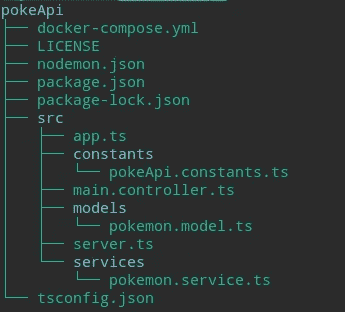
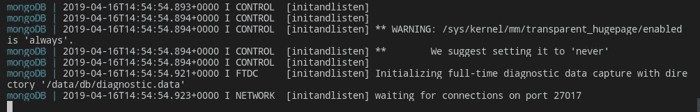
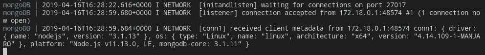

# 用 Express、TypeScript、MongoDB 和 Docker 在 Node.js 中创建 REST API 第 2 部分

> 原文：<https://betterprogramming.pub/pokeapi-rest-in-nodejs-with-express-typescript-mongodb-and-docker-part-2-38b48af52860>

## 创建一个 MongoDB 容器和一个 Mongoose 模型


这是一系列文章的第二部分，将向您展示如何使用 Express、TypeScript、Docker 和 MongoDB 在 Node.js 中创建 REST API。以下是本系列的其余部分:

*   [用 Express、TypeScript、MongoDB 和 Docker 在 NodeJS 中创建 REST API 第 1 部分](https://medium.com/@nyablk97/pokeapi-rest-in-nodejs-with-express-typescript-mongodb-and-docker-part-1-8428b0cd05d)
*   [使用 Express、TypeScript、MongoDB 和 Docker 在 NodeJS 中创建 REST API 第 3 部分](https://medium.com/@nyablk97/pokeapi-rest-in-nodejs-with-express-typescript-mongodb-and-docker-part-3-1b173fc2a482)

你可以在这里找到[的完整代码](https://github.com/puntotech/pokeAPI/)。

# 介绍

在前一篇文章中，我们设置了我们的服务器并实现了我们的第一个 GET route，它返回了一个可爱的欢迎消息。因为我们的目标是对口袋妖怪数据执行基本的 CRUD 操作，所以我们需要一个数据库来存储我们的信息。

在本文中，我们将为我们的 [MongoDB](https://www.mongodb.com/) 数据库创建并部署一个 [Docker](https://www.docker.com/) 容器。我们还将使用[mongose](https://mongoosejs.com/)来定义我们的口袋妖怪数据模型。

# 让我们编码

## 试映

再一次，在我们开始之前，先预览一下我们的目录树在本文结束时的样子:



PokeAPI 第 2 部分目录树

提醒一下:为了运行我们的项目，我们目前使用以下命令:

```
npm run start
```

说完了，我们开始吧。

# 创建 Docker-Compose 文件

我们要做的第一件事是创建一个`docker-compose.yml`文件，与我们的`src`目录在同一层，也就是说，在`src`目录的之外。

完成后，将以下代码复制并粘贴到新创建的文件中:

docker-compose.yml 文件

我将简要解释这些配置选项的含义:

*   `version`:指定我们将要使用的 docker-compose 版本。
*   `services`:我们可以指定一个服务列表，这些服务将与我们的容器一起部署。在我们的例子中，我们需要一个数据库，这就是为什么我们使用下面的属性:
*   `db`:我们表示将部署一个数据库。
*   `container_name`:这是可选的。它允许我们指定一个自定义的容器名。如果我们忽略这个选项，将会生成一个默认的容器名。
*   `image` **:** 指定构建容器的图像。在我们的例子中，最新的 MongoDB 图像。
*   `restart` **:** 如果容器停止，总是重启容器。如果它被手动停止，只有当 Docker 守护进程重新启动或容器本身被手动重新启动时，它才会重新启动。
*   `volumes` **:** 这是一个非常有趣的选项。它允许我们拥有数据持久性。这是什么意思？我们所有的数据都将存储在 Docker 容器中。然而，Docker 容器可以被停止、重启等。在这种情况下，我们的数据会怎么样？它会消失吗？答案是，如果我们使用卷选项，它不会消失。我们可以在本地机器上指定一个存储数据的目录。在我们的例子中，这个目录被命名为`pokeData`。
*   `environment` **:** 我们可以指定环境变量。在我们的例子中，当容器启动时，我们正在创建一个名为 *Pokemon* 的数据库。
*   `ports` **:** 指定将要暴露的端口(主机端口:集装箱端口)。在我们的例子中，我们将本地端口 27017 映射到容器端口 27017 (27017 是 MongoDB 的默认端口)。

*提示:关于 docker-compose 文件的更多信息，可以查看* [*这个链接*](https://docs.docker.com/compose/compose-file/) *。*

现在我们已经准备好了 docker-compose 文件，让我们启动容器。启动您的终端，键入以下命令进行部署:

```
docker-compose up 
```

如果您做的一切都正确，您应该会在终端上看到类似如下的输出:



docker-撰写输出

您还应该看到一个名为`pokeData`的新目录出现在您的目录树中。这是我们之前在 docker-compose 文件中使用“volumes”属性指定的目录。

我们的`pokeData`目录将负责存储我们所有的数据库数据(一旦我们插入一些)，并保持其安全可靠。

Docker 是不是很牛逼很好用？一个简单、直观、文档丰富的配置文件和一个命令是我们启动和运行数据库实例所需要的。太美了。

## **故障排除**

如果您在执行`docker-compose up`命令后得到以下输出:

```
ERROR: Couldn’t connect to Docker daemon at http+docker://localhost — is it running?
```

这意味着你的 Docker 守护进程没有运行。运行以下命令启动 Docker 守护程序:

```
sudo systemctl start docker
```

并再次尝试`docker-compose up`命令。错误应该消失了。

# 将我们的应用程序连接到我们的 Dockerized MongoDB 数据库

我们已经部署并运行了数据库容器，所以我们现在需要将应用程序连接到它。为此，我们需要在我们的`app.ts`文件中创建一个`setMongoConfig`方法，它将负责配置和连接到 Mongo 数据库。这个方法应该是这样的:

app.ts 中的 setMongoConfig 方法

您可能已经注意到，我们再次硬编码了一个变量:Mongoose 连接字符串。为了避免这种情况，让我们打开我们的`pokeapi.constants`文件，并存储在那里:

pokeapi.constants 版本 2

回到我们的`app.ts`，我们现在可以为新定义的常量更改硬编码的字符串:

口袋妖怪控制器第 5 版

如果我们做的一切都正确，我们现在应该在运行`docker-compose up`命令的终端中看到如下所示的输出。如果出于某种原因，您之前停止了 docker-compose，请再次运行该命令。



docker-compose 终端输出

如您所见，我们的 Docker 容器已经接受了我们从应用程序中创建的连接。到目前为止，一切顺利。

# 创建我们的数据模型

既然我们已经连接到了数据库，我们需要一种与它交互的方式。为了实现这一点，我们将使用 Mongoose，它为我们提供了几个数据建模工具，比如模式和模型。Mongoose 使得与 MongoDB 的交互变得非常容易和简单。

> “模型是根据 s **chema** 定义编译的奇特构造函数。一个模型的实例被称为**文档**。模型负责从底层 MongoDB 数据库创建和读取文档。”——猫鼬文件

然而，在我们创建我们的模型之前，我们首先要创建一个接口，它将允许我们键入我们的模型。

## 创建口袋妖怪界面

我们将从在`src`中创建一个接口目录和一个`pokemon.interface.ts`文件开始。在文件内部，我们将定义我们的 Pokemon 接口，它需要扩展 mongose`Document`:

IPokemon 接口

如您所见，代码非常简单。我们所做的就是定义我们希望模型拥有的属性及其类型。一旦我们创建了模型，我们将利用这个接口来输入它。

## 创建口袋妖怪模式和模型

为了存储我们的数据模型，我们将在`src`中创建一个模型目录，其中包含一个名为`pokemon.model.ts`的文件。在这个文件中，我们将导入 Mongoose 并创建一个`PokemonSchema`，然后用它来创建我们的数据模型。我们的模式看起来是这样的:

口袋妖怪模式

如您所见，除了定义我们的模型将拥有的属性，我们还定义了它们的类型，并指定它们都是必需的。我们还添加了一个通用的“Field is required”错误消息，如果我们试图创建一个缺少任何属性的模型，就会显示该消息。

既然我们已经创建了 Pokemon 模式，我们需要用它来创建一个 Mongoose 模型。因此，在同一文件中:

导出口袋妖怪模型

在上面的代码中，我们使用`PokemonSchema`创建了一个 Mongoose 模型，并且使用我们之前创建的`IPokemon`接口对它进行了类型化。

***注意:*** *我完全知道我们在同一个文件中定义了我们的模式和模型，这个文件名为* `*pokemon.model*` *。我认为拥有两个独立的文件——一个用于模式，一个用于模型——有点太多了，因为我们可以用一行代码创建模型。当然，如果您愿意，可以为您的模式创建一个单独的文件。*

我们刚刚创建了口袋妖怪模型，现在是时候将它导入`PokemonService`:

口袋妖怪服务第 3 版

一旦我们创建了 CRUD 路径和它们各自的`db`查询函数，Pokemon 模型稍后将用于查询我们的 MongoDB 数据库。

不过，这一点，我们将留待后面的帖子来说。

# 结论

在这篇文章中，我们学习了如何使用 docker-compose 部署 MongoDB 的实例，以及如何将我们的应用程序连接到它。我们还使用 Mongoose 为数据库创建了模式和模型。

如果你想看这篇文章的完整代码，你可以在 PokeAPI 项目的这个分支[中看到。](https://github.com/puntotech/pokeAPI/tree/02-database)

在本系列的下一部分中，我们将实现创建基本 CRUD 所必需的其余路径，以及它们各自的数据库查询功能。这是下一个的链接:

[](https://medium.com/@nyablk97/pokeapi-rest-in-nodejs-with-express-typescript-mongodb-and-docker-part-3-1b173fc2a482) [## PokeAPI REST 在 NodeJS 中包含 Express、Typescript、MongoDB 和 Docker —第 3 部分

### 序

medium.com](https://medium.com/@nyablk97/pokeapi-rest-in-nodejs-with-express-typescript-mongodb-and-docker-part-3-1b173fc2a482) 

非常感谢你的阅读，我希望你能喜欢这篇文章并觉得有用。请随意与您的朋友和/或同事分享，如果您有任何意见，请随时联系我！