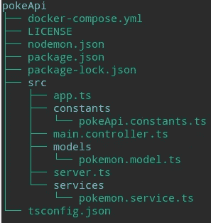
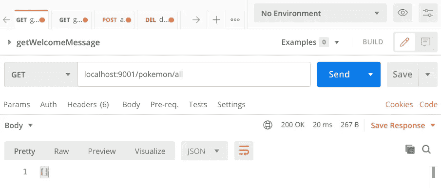
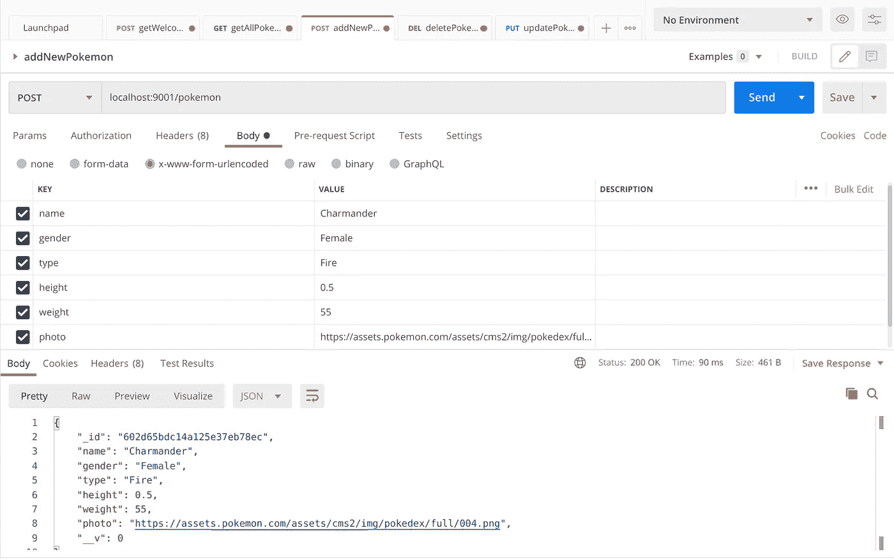
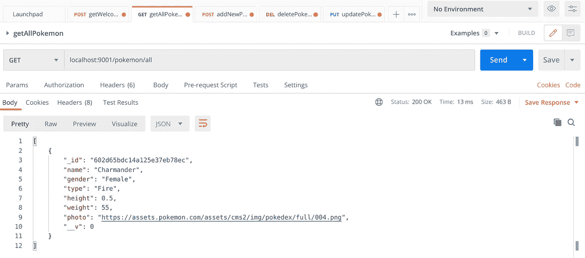
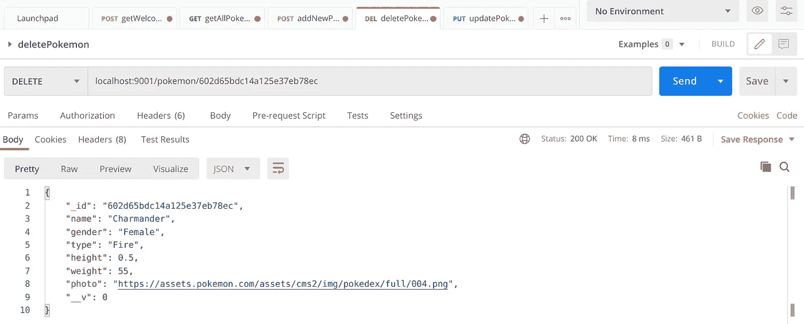
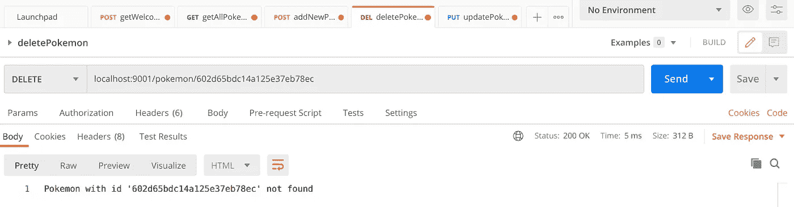
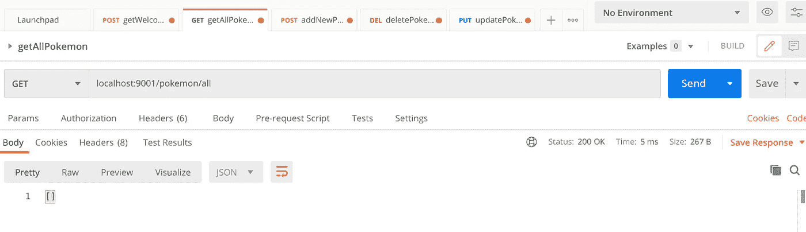
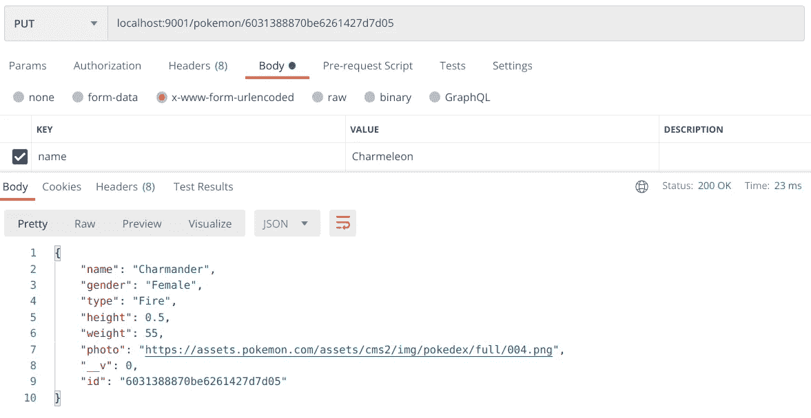
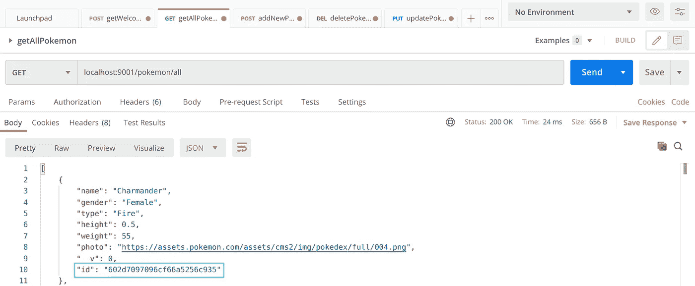

# 用 Express、TypeScript、MongoDB 和 Docker 在 Node.js 中创建 REST API 第 3 部分

> 原文：<https://betterprogramming.pub/pokeapi-rest-in-nodejs-with-express-typescript-mongodb-and-docker-part-3-1b173fc2a482>

## 创建 PokeAPI 路由和查询数据库


这是一系列文章的第三部分，将向您展示如何使用 Express、TypeScript、Docker 和 MongoDB 在 Node.js 中创建 REST API。以下是本系列的其余部分:

如需进一步阅读，请查看以下链接:

*   [用 Express、TypeScript、MongoDB 和 Docker 在 NodeJS 中创建 REST API 第 1 部分](https://medium.com/@nyablk97/pokeapi-rest-in-nodejs-with-express-typescript-mongodb-and-docker-part-1-8428b0cd05d)
*   [用 Express、TypeScript、MongoDB 和 Docker 在 NodeJS 中创建 REST API 第二部分](https://medium.com/@nyablk97/pokeapi-rest-in-nodejs-with-express-typescript-mongodb-and-docker-part-2-38b48af52860)

你可以在这里找到完整的代码。

# 介绍

在前一篇文章中，我们用 docker-compose 部署了一个 [MongoDB](https://www.mongodb.com/) 的实例，并将我们的应用程序连接到它。我们还创建了我们的[mongose](https://mongoosejs.com/)模式和数据模型。

在本文中，我们将实现创建基本 CRUD 所必需的其余路径，以及它们各自的数据库查询功能。这些函数将利用我们之前创建的模型来查询我们的 MongoDB 数据库。

注意:Mongoose 提供了基于回调或承诺的 API。对于这个项目，我们将使用基于承诺的 API，原因很简单，我更喜欢承诺而不是回调，因为我发现它们不那么冗长，因此更干净。你可以在这里阅读更多关于猫鼬承诺[的内容。](https://mongoosejs.com/docs/promises.html)

# 编码开始

## 试映

和往常一样，我们将在这篇文章的结尾先预览一下我们的目录:



PokeAPI 第 3 部分目录树

您可能会注意到，从目录角度来看，自上一篇文章以来没有任何变化。然而，在内容方面，有相当多的变化。

提醒一下，为了运行我们的项目，我们目前使用以下命令:

```
npm run start
```

要启动我们的 dockerized MongoDB 实例，请使用以下命令:

```
docker-compose up
```

说完了，我们开始吧。

# 口袋妖怪服务:查询数据库

现在是时候创建我们的数据库查询函数了。要做到这一点，如前所述，我们将利用我们的口袋妖怪模型。

因为我们的目标是实现四个基本的 CRUD 操作，所以我们要实现的第一个函数是读取`db`的内容。所以，让我们打开`pokemon.service.ts`文件，并添加一个`findAll`方法:

PokemonService 第 4 版——创建新的 findAll 方法

如您所见，我们新的`findAll`方法使用 Pokemon 模型与 MongoDB 交互，并找到 DB 中的所有 Pokemon。由于 mongose 的助手函数在[mongose 文档中有广泛的记载，](https://mongoosejs.com/docs/queries.html)我认为没有必要在这里对它们进行分解。

然而，我将评论一下`exec`函数。正如我前面提到的，我们将使用 Mongoose 的基于承诺的 API，我们将通过使用返回承诺的`exec`函数来实现。

# 实现获取路由

我们现在在`PokemonService`中有了`findAll`函数。为了能够与这个函数交互，我们必须在控制器中创建另一个 GET 路由:

口袋妖怪控制器版本 6-创建一个新的获取路线

代码非常简单，我们已经创建了一个新的 GET route 和一个新的 private `findAll`方法，它主要是调用服务的`findAll`方法并发送响应。当然，我们通过将代码包装在 try/catch 块中来处理可能出现的任何错误。

注意第 27 行的`res.status(500)`？因为默认情况下，Express 将 Response status 属性设置为 200，所以每当出现错误时，我们都需要指定一个错误状态代码，否则我们将面临获得一个通知我们有错误的响应的危险，但这个响应看起来很好，状态为 200 OK！我们当然不希望这种情况发生，因此，如果发现任何错误，我们将发送一个状态代码 500，它代表*内部服务器错误*，表明出现了问题。

*注意:我意识到发送一个通用的 500 状态代码给 ever error 并不是一个好的做法。在本系列的下一部分，我们将实现一个更好的错误处理机制，包括自定义错误、集中式错误处理和正确的状态代码。*

## 测试路线

既然我们已经确定了新路线，是时候测试它了！

*提示:从这里开始，我推荐使用* [*邮递员*](https://www.getpostman.com/) *来测试我们的路线。*

如您所见，访问这条新路由的端点是`/all`。考虑到我们所有的口袋妖怪端点都以`/pokemon`开头，完整的路径应该是`/pokemon/all`。

如果一切顺利，您应该从 Postman 获得如下输出:



邮递员:得到所有口袋妖怪

因为我们没有将任何数据引入到我们的数据库中，所以我们接收到一个空数组。我们现在已经成功地完成了我们的第一个数据库查询！

# 添加新的口袋妖怪

让我们实现一个函数来添加一个新的口袋妖怪到我们的数据库。让我们回到`PokemonService`并创建一个`add`方法:

口袋妖怪服务版本 5-创建一个新的添加方法

简单地解释一下，我们从请求主体创建一个 Mongoose 文档(`newPokemon`)，并将其保存到 db 中。

*注意:mongose 文档是 mongose 模型的实例。*

让我们创建与新功能交互的路线。在我们的控制器中:

口袋妖怪控制器版本 7-增加了一个新的发布路线

考虑到 GET 和 POST 路由具有完全相同的端点，我们可以如上所示将它们链接起来。这样，我们就不必两次声明同一个路由，每个动词声明一次。

注意，这一次，我们的新路由是通过 POST 请求访问的。让我们前往邮差，并添加一个新的口袋妖怪到数据库:



邮递员:添加一个新的口袋妖怪

如果一切顺利，你应该会收到你刚刚添加的口袋妖怪作为输出。为了再次检查我们的小火龙是否被正确添加，我们可以利用之前的 GET 路径来获得所有的口袋妖怪:



邮递员:得到所有口袋妖怪

恭喜，我们的数据库中现在有了一个小火龙。

不要担心`_id`和`__v`字段。它们是由 Mongoose 自动生成的，我们后面会讲到。

# 删除口袋妖怪

现在是时候实现一个删除口袋妖怪的函数了，所以让我们打开`PokemonService`，并创建一个`delete`方法:

口袋妖怪服务版本 6-增加了一个新的删除方法

Mongoose 有一个非常有用的`findByIdAndDelete`助手函数，它允许我们通过它的`_id`字段删除一个文档(在我们的例子中是一个 Pokemon)。

该功能是`findOneAndDelete({_id: pokemonId})` *的简写。*

*注意:如果您需要通过* `*_id*` *以外的任何字段删除单据，您可以使用前面提到的* `*findOneAndDelete*` *功能。更多关于它的信息* [*这里*](https://mongoosejs.com/docs/api.html#model_Model.findOneAndDelete) *。*

## 保护条款

如果你已经熟悉了保护条款，可以跳过这一部分。如果你不是，请和我呆在一起，我们将讨论这个非常有用的技术。

简而言之，保护子句是一种检查，在出现错误或满足条件的情况下，通过返回语句或异常退出函数。它们允许我们在代码中避免不必要的复杂性。这是我们的保护条款:

保护条款

通过颠倒逻辑，并检查口袋妖怪是否已被删除，我们可以避免一个`else`声明。如果条件满足，我们通过抛出一个错误来退出函数。如果口袋妖怪已经删除成功，则返回删除的口袋妖怪结果。简单而优雅。

## 定义删除路线

现在我们已经创建了我们的`delete`函数，是时候创建我们的路线了。因此，在我们的控制器中:

口袋妖怪控制器版本 7-增加了一个新的删除方法

在我们刚刚创建的删除路由中，我们表示将在 URL 中接收一个请求参数，这个参数我们已经命名为`id`。然后我们在第 46 行获得这个参数，通过`req.params`访问它，并把它传递给我们的服务。

访问我们路线的路径如下所示:

```
localhost:9001/pokemon/**123pokemonId**
```

其中`123pokemonId`是`id`参数。

我们再次打开 Postman，并通过删除我们之前添加到 db 中的口袋妖怪(或您选择的任何口袋妖怪)来测试我们的新路线:



邮递员:删除一个口袋妖怪

如你所见，我们收到了刚刚删除的口袋妖怪。如果在数据库中没有找到我们指定 ID 的 Pokemon，我们将收到一条`Pokemon with id '' not found`消息。让我们再次尝试删除同一个口袋妖怪，看看我们是否确实收到了这样的消息:



邮递员:试图删除一个不存在的口袋妖怪

很好，我们现在确信我们的错误处理工作正常。

我们可以通过从数据库中获取所有口袋妖怪来仔细检查我们的小火龙是否已被正确删除:



邮递员:得到所有口袋妖怪

空数组=无口袋妖怪=小火龙已成功删除。

# 更新口袋妖怪

在我们的口袋妖怪服务中:

口袋妖怪服务版本 7-添加更新方法

你可能会注意到，我们的新`update`方法与我们的`delete`方法非常相似。我们存储 Mongoose 查询的结果，然后使用一个 guard 子句在没有找到 Pokemon 的情况下抛出一个错误。如果口袋妖怪更新成功，我们返回它。

在我们的控制器中，让我们创建最终路线:

口袋妖怪控制器版本 9-增加了一个新的上传路线

请注意，我们再次链接了我们的 PUT 和 DELETE 路由，因为它们共享同一个端点。

让我们去邮差那里，测试一下我们的最终路线。不要忘记添加一个新的口袋妖怪，否则你将没有任何数据更新！我选择添加另一个小火龙，现在我将更新它:



邮递员:更新一个口袋妖怪

让我们获得所有的口袋妖怪来检查我们的小火龙:


邮递员:得到所有口袋妖怪

恭喜你！我们的小火龙已经发展成为一个 Charmeleon，我们已经成功地实现了所有基本的 CRUD 函数和它们各自的路由。

# 处理 _id 和 __v

最后但同样重要的是，我们将处理`_id`和`__v`字段。这是由 Mongoose 自动生成的两个字段。让我们来看看它们各自代表了什么，以及我们可以对它们做些什么:

*   版本密钥:`__v`是 Mongoose 自动添加到每个文档中的版本密钥。每当我们执行对数组进行修改的操作时，都会更新这个版本键，该操作可能会改变数组中任何元素的位置。因此，这是一个重要的领域，除非我们知道我们在做什么，否则我们不应该禁用它。如果我们不喜欢这个名字，我们可以通过在模式中添加一行简单的代码来改变它:

自定义版本密钥

如果我们想要禁用它，我再一次提醒你，你应该只在你知道你在做什么的情况下才这样做，我们可以将`versionKey`属性设置为 false，就像这样:

禁用版本密钥

*注意:亚伦·赫克曼有一篇很棒的文章，深入探讨了* `*versionKey*` *。这里的* *你可以读一下* [*。*](http://aaronheckmann.blogspot.com/2012/06/mongoose-v3-part-1-versioning.html)

*   Mongoose ID:默认情况下，mongose 向我们的模式添加了一个`_id`属性。然后，每当我们从一个模式创建一个模型时，Mongoose 自动创建一个 ObjectId 类型的新的`_id`。由于`_id`是 Mongoose 使用的唯一标识符，所以我们无法摆脱它。我们可以做的是，每当我们向客户发送我们的模型时，将其重命名为`id`，因为老实说，`_id`看起来不太好。要重命名它，我们所要做的就是将下面的代码添加到我们的`app.ts`文件中的`setMongoConfig`方法中:

将 _id 重命名为 id

让我们回到 Postman，检查一下`_id`确实已经被重命名为`id`:



邮递员:得到所有口袋妖怪

瞧啊！我们不再有丑陋的`_id`领域。

# 结论

在这篇文章中，我们学习了如何通过 Mongoose 模型和文档来查询 MongoDB。我们还实现了访问 CRUD 函数的路径。

如果你想看这篇文章的完整代码，你可以在 PokeAPI 项目的这个分支[中看到。](https://github.com/puntotech/pokeAPI/tree/03-routes)

非常感谢你的阅读，我希望你能喜欢这篇文章并觉得有用。请随意与您的朋友和/或同事分享，如果您有任何意见，请随时联系我！