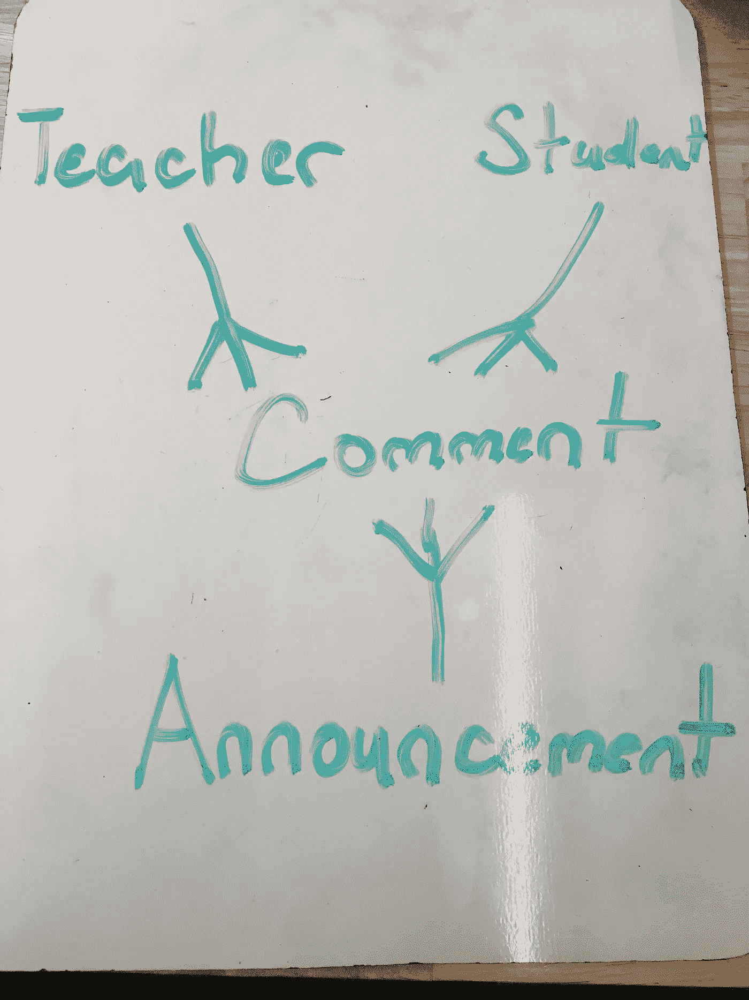
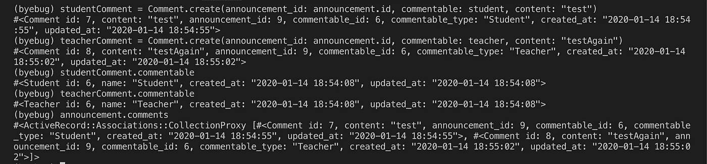

# Rails 中的多态关联

> 原文：<https://betterprogramming.pub/polymorphic-associations-in-rails-72a91ae1a9dd>

## 处理属于多个模型的模型


Natalia Y 拍摄的 Unsplash 照片

不久前，在做一个项目时，我决定为教师和学生建立单独的模型/表格，而不是只有一个用户模型。当时，拥有两个模型对于我的应用程序的结构来说是最好的。

但在某个时候，我确实遇到了一个小问题。在我求指导的时候，被指向了*多态关联*的解决方案。当然，最初我也不知道是什么。

我做了一些研究，以确定它是如何工作的，并将其应用到我的项目中，它解决了我的问题！

在本指南中，我将介绍我在项目中遇到的问题以及多态关联的概念是如何解决这个问题的。(如果您只关心如何实现，请随意向下滚动到解决方案。

# 问题是

为了理解我在拥有`Teacher`和`Student`模型时所面临的问题，让我首先重新创建我当时使用的模型。

## 模型

假设我们有四种型号，`Teacher`、`Student`、`Announcement`和`Comment`。

可以为在线教室创建公告。从该公告开始，可以启动一个线程，教师和学生可以在该公告上添加评论。

让我们来看看模型将会是什么样子:



公告、评论、学生和教师之间的关联

一个`Announcement`、`Teacher`、`Student`可以有很多个`Comments`。一个`Comment`属于一个`Announcement`、`Teacher`和`Student`。

等等，这个逻辑有问题。一个`Comment`当然属于一个`Announcement`，但不能同时属于一个`Teacher` / `Student`。

只有一个人发表了评论。理想情况下，评论只能属于老师或学生。这就是多态关联可以解决困境的地方。

# 解决方案(多态关联)

对于多态关联，一个模型可以在一个关联中属于多个其他模型。

假设我们已经生成了`Teacher`、`Student`和`Announcement`模型。让我们建立`Comment`模型。在终端中:

```
rails g model Comment content:string announcement_id:integer commentable_id:integer commentable_type:string
```

让我们来分解我们与模型一起生成的属性。内容代表`Comment`的字符串，而`announcement_id`代表与之相关联的`Announcement`(一个评论总是与一个公告相关联)。

`commentable_id`代表`foreign_key`，而`commentable_type`告诉评论模型它与哪个模型(老师/学生)相关联。

我们跑吧:

```
rails db:migrate
```

在`app/models/comment.rb`中，我们添加了以下关联:

```
class Comment < ApplicationRecord belongs_to :announcement belongs_to :commentable, polymorphic: trueend
```

对于第一个关联，我们发布了基本的`belongs_to`公告。对于第二个，我们通过制作`Comment` `belong_to :commentable`而不是`Teacher`或`Student`模型来声明多态关联。

Commentable 不是应用程序中的一个模型，它负责多态关联。现在，让我们检查`Teacher`和`Student`型号的另一端的关联。

`app/models/teacher.rb`中的 *:*

```
class Teacher < ApplicationRecord has_many :comments, as: :commentableend
```

在`app/models/student.rb`中:

```
class Student < ApplicationRecord has_many :comments, as: :commentableend
```

两个关联都在说`Teacher`和`Student` `has_many`通过多态关联`commentable`进行注释。

# 测试关联

在`db/seeds.rb`中，让我们创建几个实例来测试关联，并输入`byebug`进入控制台。

```
announcement = Announcement.create(content: "First Announcement")teacher = Teacher.create(name: "Teacher")student = Student.create(name: "Student")byebugputs 'seeded'
```

我们跑吧:

```
rails db:seed
```



Byebug 会话

让我们分解一下在`byebug`会话中执行的命令。用指向`Student`实例的多态`commentable`创建了一个`Comment`实例，并存储到变量`studentComment`中。

类似地，创建另一个`Comment`实例，将`commentable`设置为`Teacher`实例，并存储在变量`teacherComment`中。

通过检查每个`Comment`实例的`commentable`，我们注意到它们分别属于`Student`和`Teacher` 实例。这样，多态关联就建立了。`Comment`可以在单个关联上属于多个模型。

# 结束语

多态关联的思想是建立一个模型，该模型可以在一个关联上属于多个其他模型。

在我的情况下，如果我合并了一个单独的`User`模型而不是`Teacher`和`Student`，这可能是不必要的。

但是会有这样的情况，即使只有一个单一的模型，多态关联可以解决问题。

我们讨论了多态关联的基础和实现。感谢您的阅读！

# 资源

请参考我的 [GitHub repo](https://github.com/reireynoso/polymorpic_assoc_prac) 获取本指南中使用的样本。

感谢阅读！