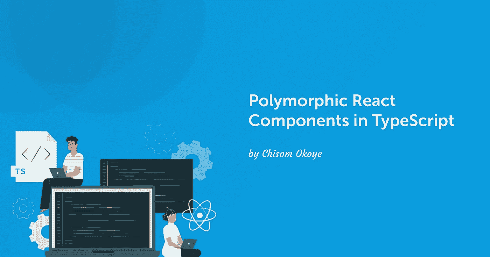

# 利用 TypeScript 创建更好的多态 React 组件

> 原文：<https://betterprogramming.pub/polymorphic-react-components-in-typescript-b6ce455ca70e>

## 编写灵活的组件



可重用组件是 React 中的关键概念之一——您只需编写一个组件，就可以多次重用它们。

基本上，你的组件会接收一些道具，然后在内部使用这些道具，最后渲染一些 React 元素，这些元素会被转换成相应的 DOM 元素。

那么，如果我的组件可以为我提供控制容器元素/节点的灵活性，那又会怎么样呢？这就是所谓多态性模式的起源。

# 什么是多态组件？

根据定义，多形性意味着以一种以上的形式存在。

在 React 组件的世界中，多态组件是可以用不同的容器元素呈现的组件。

也就是说，即使你以前可能从未听说过多态组件。这是一种代码重用模式，就像定制钩子、高阶组件等。

# 多态组件是如何工作的？

假设我们有一个可共享的`<Box />`组件，我们想决定在两种不同的情况下实际的元素是什么，

*   我们希望将 Box 组件呈现为具有`href`属性的锚元素
*   我们希望 Box 组件是 h1 的标题元素。

现在，有了 React 中的多态性概念，我们可以通过向组件添加一个`as`道具来允许调用者灵活地定义他们选择的 HTML 标签。

```
<Box as="a" href="https://www.linkedin.com/in/chisom-okoye-399112122/">
   Home page
</Box>

<Box as="h1">Main heading</Box>
```

# 基本实现

构建您的第一个多态组件非常简单，下面是一个基本实现:

```
export const Box =({as, children, ...others})=> {
   let Component = as || "span"; return (
       <Component {...others}>{children}</Component>
   )
}
```

这里需要注意的一点是，我们将`as`道具默认为`span`，以防用户不传递道具，它应该使用 span 作为 HTML 元素。

其次，我们不能直接使用`as`属性，因为 React 会认为它是一个 HTML 标签的名字(`<as>`)，而事实并非如此。所以我们需要先把它赋给一个大写的变量，然后渲染它。

另外，`...others`很重要，因为我们也将它扩展到了`<Component>`中。这允许我们将我们不知道的附加属性或属性传递给底层元素。一个例子是标签`<a>`所需的 href 属性或者用于图像``的 alt 属性。

这就是我们构建一个基本多态组件所需要的。

但是，这种方法的问题是，没有办法阻止用户传入不受支持的道具或无效的 HTML 元素。也就是说，当我们使用这个组件作为`h1`时，用户可能会试图传递`href`属性，或者用户会为`as`属性传递任何不是有效 HTML 元素的值。

React 中类型脚本的好处来了。

# 利用 Typescript 创建更好的多态组件。

为了利用 typescript 来创建一个没有 bug、体验更好的多态组件，您需要首先确保 react 应用程序有 typescript。要创建一个 react typescript 项目，你可以使用命令`npx create-react-app project-name --template typescript`或将 typescript 添加到现有的 react 应用程序中，可以使用 npm 或 yarn】。然后，随着对 typescript 中泛型的理解，我们可以收紧传递给组件的道具。

更好的实施

```
import { ComponentPropsWithoutRef, ElementType, ReactNode } from "react";

type BoxProps<T extends ElementType > = {
  as?: T;
  children: ReactNode;
};

export const  Box =<T extends ElementType = "span">({
as, 
children, 
...others
}: BoxProps<T> & ComponentPropsWithoutRef<T>) => {
   let Component = as || "span";

   return (
       <Component {...others}>{children}</Component>
   )
}
```

我们在这里所做的基本上是为 Box 组件创建一个类型

```
type BoxProps<T extends ElementType> = {
  as?: T;
  children: ReactNode;
};
```

解释:

其中`T extends ElementType`是一个泛型类型，说明 T 是参数的一个特殊变量类型，在我们的例子中参数是`as`，那么`extends ElementType`意味着我们将泛型约束为一个有效的 HTML 元素，也就是说`as`不能接收不是正确的 HTML 元素的值。

同样值得注意的是，附加到`as`的`?`操作符使其成为可选的，因此当组件没有接收到`as`属性时，typescript 不会报告这个错误。而儿童道具应该是`ReactNode`型。

然后在创建`Box`组件的时候，你可以看到我们的泛型类型`T`被赋给了“span ”,这意味着当用户没有传递任何元素时，`as` props 的默认元素将是`span`。然后我们利用我们创建的`BoxProps`类型作为我们期望的参数的类型。

我们的`Box`组件的下一个奇怪的语法是`& ComponentPropsWithoutRef<T>`。

如果您来自 Styled-components，那么您不会对这个语法感到陌生，因为它实际上是用于样式化伪代码的语法格式:

```
a {
      color : blue;
         &:hover{
            color: red;
        }
   }
```

因此，在 TypeScript 中，我们提取了这种格式，并引入了所谓的交集，这意味着类型`BoxProps`是包含`as`、`children`的对象类型，并且基于`as`属性的类型，我们将返回与传递的字符串属性相关的有效组件属性。

# 结论

也就是说，如果我们继续错误地尝试我们的`<Box />`组件，例如通过传递一个有效的`as`道具和其他不兼容的道具，你将得到一个错误。

```
<Box as="h1" href="https://www.linkedin.com/in/chisom-okoye-399112122/">
    Main heading
</Box>
```

`h1`是`as`道具的完美 HTML 元素，但是`h1`元素不应该有`href`属性。这是错误的，在运行时，typescript 将帮助捕捉这个错误，因为:类型上不存在属性`'href'`...

这很好，因为我们获得了更好的开发者体验和更好的健壮解决方案。