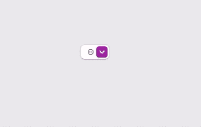
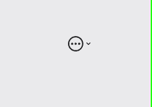

# AppKit 中的弹出和下拉按钮

> 原文：<https://betterprogramming.pub/pop-up-and-pull-down-buttons-in-appkit-17dd1ab2aa46>

## 轻松地在 macOS 上以编程方式创建特殊类型的按钮

被爆料的照片:[https://www . pexels . com/photo/beverage-breakfast-business-咖啡因-545061/](https://www.pexels.com/photo/beverage-breakfast-business-caffeine-545061/)

AppKit framework 在实现 macOS 应用程序时会将各种按钮暴露在布局中，因此我们可以为用户提供最合适的控件，以便在与应用程序的界面交互时使用。尽管`NSButton` 是创建按钮的基类，但是它有一个子类叫做`NSPopupButton`，它给了我们两种特殊类型的按钮:弹出和下拉。这些都是本文所关注的。

更具体地说，在本文中，我将演示如何用 Xcode 以编程方式创建弹出和下拉按钮。即使从一开始，值得注意的是下拉按钮是弹出按钮，区别仅在于几个点。除此之外，配置步骤是相似的，所以知道如何实现其中一个就有可能实现另一个。

弹出和下拉按钮与普通按钮的不同之处在于，当它们被点击时，它们呈现的是一个菜单，而不是执行一个特定的动作。因此，它们非常适合为不常使用的用户提供操作，但是它们很容易访问，只需点击一下。

尽管两者点击时都显示菜单，但它们之间也有三点不同:

1.  弹出按钮的侧面有一个指向上下的双箭头指示器，而下拉按钮只有一个指向正下方的单箭头指示器。
2.  当菜单展开时，弹出按钮显示分配给它们的所有菜单项。下拉按钮使用第一个菜单项作为标签，在菜单展开时只显示其余的菜单项。这个事实使下拉按钮成为工具栏或其他包含动作的地方的理想选择，因为它们可以显示标题、图像或它们的组合，隐藏一堆触发各种操作的菜单项。
3.  当菜单折叠时，弹出按钮显示选定的项目。另一方面，无论选择哪个菜单项，下拉按钮总是显示它们的标签。

接下来，您可以看到弹出(左侧)和下拉(右侧)按钮的示例。最初是默认外观，然后是无边框，最后是菜单展开时显示的菜单项:

# 创建弹出按钮

让我们从通过编程创建弹出按钮开始。不可否认，我们首先需要的是我们正在处理的视图控制器(或视图)类中的一个存储属性，就像下一个:

当谈到以编程方式初始化和配置 UI 控件时，我更喜欢为此创建单独的方法，尤其是在创建一个控件需要几行代码的情况下。本着这种精神，在下一个示例方法中，我们初始化上面声明的`popupButton`:

前面代码片段中包含的`layoutPopupButton()`方法是另一个方法，它将弹出按钮添加到视图控制器的视图中，并设置其约束。它将弹出按钮放在视图的中央，它的实现就在下一个代码段中。但是，请记住，这只是一个适合本文目的的布局，没有其他视图需要考虑。

我们还用不带参数的初始值设定项初始化了前面代码片段中的弹出按钮。还有更多初始化器，可以接受弹出按钮的框架、标题、图像等等。为了使事情简单，我不会把重点放在它们上面，但是我把它留给你去进一步探索，看看是否有更适合你需要的初始化器。

# 向弹出按钮添加菜单项

通常，创建和配置弹出按钮将显示的菜单项是花费大部分时间的地方。有两种方法可以将菜单项分配给弹出按钮，我们将在这里介绍这两种方法。然后，我会告诉你一个更方便的方法来处理一切。

当定义新的菜单项时，我们需要指定接下来的三段数据:

*   菜单项的标题和/或图像。
*   单击时将被调用并执行某些操作的方法。
*   操作方法的目标类。

你可能希望将整个`NSMenuItem` 对象分配给弹出按钮。然而，这里的情况并非如此。一个弹出按钮接受单个或多个标题，并自动创建相应的菜单项。但是，我们仍然需要手动检查它们，并设置它们的行动方法和目标。

让我们先看看如何逐个指定和配置菜单项。您可以在下一个代码片段中看到，我们可以使用`addItem(withTitle:)`方法创建一个提供单个标题的新菜单项:

一旦在调用上述方法后创建了实际的项目，我们就可以使用名为`lastItem`的属性来获取它，然后设置缺失的数据。请记住，`lastItem`返回一个可选对象，所以有必要先打开它:

项目的`action`是一个`Selector`对象，包含项目被点击时调用的方法名。`target`通常是同一个类，由上面的`self`关键字表示，但是如果需要的话，您可以设置不同的目标。

注意，选择器方法必须用`@objc`关键字标记。对于本文，我们将使用 f

`configurePopUpButton()`方法现在如下所示:

这次好多了，但仍有改进的空间，所以我们只能改变需要的东西。

# 配置菜单项的更快方法

假设菜单动作的`target`总是为`self`实例，那么我们只需要为每个菜单项设置标题、图像(可选)和动作方法。基于这种想法，我们可以定义下面的方法，它接受上述所有参数，包括一个参数；我们正在为其配置菜单项的弹出按钮:

***注意*** *:实际上* `*control*` *参数可以省略，但是我在讲下拉按钮的时候也会用同样的方法。所以，我们把它放在那里，使这个方法更通用，而不是针对某个特定的按钮。*

在方法的主体中，我们将把我们已经遇到的内容放在运动中。我们将首先为一个新的菜单项提供标题，然后我们将获取它来分配图像、选择器和目标:

在`configurePopUpButton()`中，我们现在可以多次调用上面的方法来创建我们想要的菜单项，每次都为它提供适当的参数:

毫无疑问，与前一部分中介绍的两个实现相比，这要短一些，但是我们现在有了一个可重用的方法，也可以在其他项目中使用。

# 无边框弹出按钮

默认弹出按钮的外观可能不总是与应用程序的用户界面相匹配。移除可见的默认边框会给人一种不同的感觉，而且尝试起来毫不费力。

我们只需要将`false`设置为`isBordered`属性来移除边框和标准外观:

上述操作的结果如下:

# 创建下拉按钮

下拉按钮是一个弹出按钮，其中一些属性具有不同的值。如果你能创建一个弹出按钮，你就离把它转换成下拉菜单只有一步之遥了。

就像以前一样，让我们从在视图控制器类中声明一个新的`NSPopUpButton`属性开始:

接下来，我们在一个新方法中初始化上面的内容，我们也将在这个地方配置它:

作为参考，`layoutPullDownButton()`如下:

如果您调用`configurePullDownButton()`方法并尝试运行应用程序，您将得到一个弹出按钮。有一个特殊的属性使它从弹出变为下拉；你接下来看到的`pullsDown`:

为了便于演示，假设我们想要配置下拉按钮，使它只显示一个图像，而不是作为标签的标题。为此，有必要将`imageOnly`值设置为`imagePosition`属性，如下所示:

正如在简介中提到的，下拉按钮显示的第一个菜单项是一个标签，而不是菜单的一部分。因此，我们将指定一个包含没有标题的图像的文件。同样，我们将利用前面实现的`addMenuItem(withTitle:image:action:to:)`方法:

本演示中的图像是一个 SF 符号。注意，在这种情况下也需要提供一个 action 方法，但是这个方法仍然是空的:

就像弹出按钮一样，下一步是指定当按钮被单击时将出现在按钮菜单中的菜单项:

有了上面的所有内容，如果我们调用`viewDidLoad()`中的`configurePullDownButton()`，我们将得到以下内容:

我之前提到过无边框弹出按钮。删除边框有时在下拉按钮中更有用，因为它删除了默认外观并强调了显示的图像:

最后，在像这里讨论的情况下，还有一个属性可能对您有用。`imageScaling`允许通过一些默认值缩放显示的图像:

接下来，您可以看到添加了所有内容的`configurePullDownButton()`方法，以及下拉按钮最终的样子:

# 结论

弹出按钮和下拉按钮是 macOS 上的特殊按钮，因为它们在被点击时都呈现一个菜单，但是它们仍然有一些差异，如前几部分所示。以编程方式创建它们并不困难，最重要的任务是定义要显示的菜单项。希望使用`addMenuItem(withTitle:image:action:to:)`方法提出的解决方案可以在您的实际项目中被证明是有用的。但是，即使没有它，一切都是一个简单的过程，需要一些额外的代码行来完成。创建弹出和下拉按钮也可以在界面构建器中以图形方式完成，但这是我可能会在未来的帖子中涉及的主题。

感谢阅读。享受编码！👨‍💻

*最初发布于 2022 年 11 月 11 日*[*https://serial coder . dev*](https://serialcoder.dev/text-tutorials/macos-tutorials/popup-and-pull-down-buttons-in-appkit/)*。*