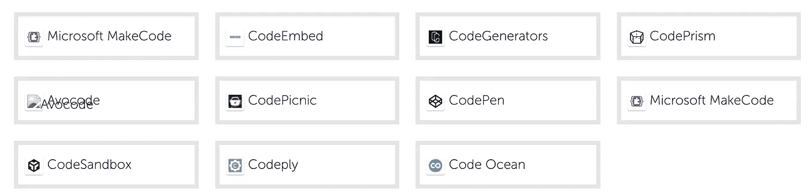
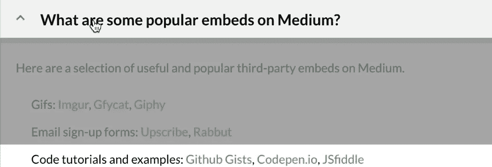
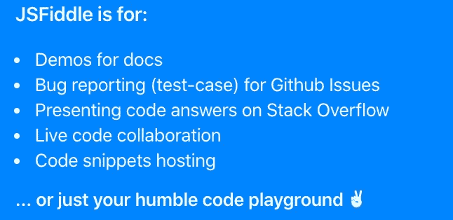
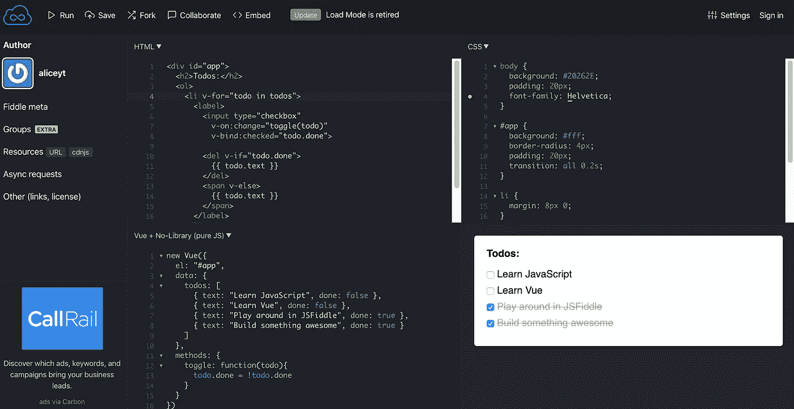

# 3 种流行的嵌入方式，用于在介质上共享代码

> 原文：<https://betterprogramming.pub/popular-embeds-for-sharing-code-on-medium-8ba951e9c5d0>

## **它们嵌入文章后的样子以及使用它们的利与弊(作为读者)**

由[凯利·西克玛](https://unsplash.com/@kellysikkema?utm_source=unsplash&utm_medium=referral&utm_content=creditCopyText)在 [Unsplash](https://unsplash.com/s/photos/share?utm_source=unsplash&utm_medium=referral&utm_content=creditCopyText) 上拍摄的照片

编写代码通常需要共享代码片段。

虽然我们可以使用 Medium 上的内置格式将我们的代码片段格式化为内联代码或代码块，但有时我们希望用口哨和铃铛来显示代码，例如语法突出显示和运行代码的结果。

在这种情况下，我们可以利用媒体的嵌入。至少有 17 个第三方嵌入我们可以在媒体上使用。

其中， [GitHub Gists](https://gist.github.com/) 、 [CodePen.io](https://codepen.io/) 和 [JSFiddle](https://jsfiddle.net/) 是 Medium 上比较流行的三个嵌入。

在本文中，我将展示这三个流行的提供程序是如何在 Medium 上显示的，并从读者的角度谈论使用它们的利弊(这是我戴上读者帽子的地方)。

最后，我将向那些不熟悉使用嵌入的人展示如何插入嵌入。

# 1.GitHub Gists

使用 GitHub Gists 与读者共享单个文件、部分文件和完整的应用程序。

## 文章中嵌入的示例

嵌入用行号显示要点。保存在单个 gist 中的文件将被一个接一个地显示。

## 赞成的意见

*   它有语法高亮显示，并显示一个简单和干净的界面。
*   读者可以通过分叉和克隆保存代码片段。

## 骗局

*   读者不能直接执行代码。他们要么下载代码并在自己的电脑上运行，要么使用第三方网站。

# 2.密码笔

CodePen 是一个社交开发环境，它允许我们与读者共享代码和运行代码的结果。它主要关注前端语言，如 HTML、CSS、JavaScript 和预处理语法。

## 样品

嵌入显示一个带有按钮“运行笔”的占位符

点击我为另一篇文章创建的“运行笔”

## 赞成的意见

*   它有语法高亮。
*   读者可以通过分叉保存代码片段。
*   读者可以在不离开页面的情况下查看代码的结果，并且可以将结果帧的大小从 x1 调整到 x0.25。
*   他们可以通过 CodePen 网站上的评论和赞等社交功能与笔的创作者进行互动。

## 骗局

*   读者必须点击“运行笔”才能看到嵌入笔的代码。
*   读者不能直接在他们所在的页面上修改代码。他们必须直接到 CodePen 进行任何修改。然而，如果你有一个专业订阅，你的嵌入是可编辑的(根据我读到的，因为我没有专业订阅)。

# 3.JSFiddle

JSFiddle 是 JavaScript、CSS、HTML、TypeScript 或 [CoffeeScript](https://coffeescript.org/) 的代码编辑器和游乐场。

我们可以为流行的前端框架(如 React 和 Vue.js)添加样板文件，并向读者显示运行我们代码的结果，而不需要他们下载代码并在本地机器上运行。

## 样品

嵌入允许读者查看不同选项卡中的代码，例如 HTML、CSS、JS 和结果。虽然它不允许在一篇中型文章中修改代码，但读者可以点击 JSFiddle 中的“编辑”来这样做。

使用 VueJS 样板创建的小提琴示例

## 赞成的意见

*   它有语法高亮显示，并显示一个简单和干净的界面。
*   读者可以通过分叉保存代码片段。
*   他们可以查看代码并运行它，而无需离开他们所在的网站。
*   JSFiddle 为希望与其他人一起工作的读者提供了一种协作模式。

## 骗局

*   读者不能直接在他们所在的页面上修改代码。它们必须被定向到 JSFiddle 才能进行任何修改。
*   他们可能会发现 JSFiddle 网站的界面令人生畏:

JSFiddle 网站截图

# 如何在草稿中嵌入内容

对于以前没有在文章中嵌入内容的人，可以在嵌入者的网站上找到说明。

*   [GitHub 要诀](https://help.github.com/en/github/writing-on-github/creating-gists)
*   [密码笔](https://codepen.io/embeds)
*   [js 小提琴](https://docs.jsfiddle.net/embedding-fiddles)

要在特定介质上嵌入内容，您可以遵循以下步骤:

*   从嵌入中复制 URL，例如[https://gist . github . com/TIF fam/06d 34 abb 08 C5 bfad 84 f 269 b 75 db 38615](https://gist.github.com/tiffam/06d34abb08c5bfad84f269b75db38615)。
*   在草稿中，转到新的一行，点击嵌入图标。
*   将 URL 粘贴到媒体编辑器中，并按 Enter 键将该链接转换为嵌入内容。

# 作者说明

由[卢卡·奥尼博尼](https://unsplash.com/@lucaonniboni?utm_source=unsplash&utm_medium=referral&utm_content=creditCopyText)在 [Unsplash](https://unsplash.com/s/photos/author?utm_source=unsplash&utm_medium=referral&utm_content=creditCopyText) 上拍摄的照片

在三个流行的嵌入中，我对 JSFiddle 印象最深，但我更喜欢使用 CodePen 和 GitHub Gist。主要原因是我用起来很舒服，我喜欢他们的网站界面。

我喜欢 CodePen 在他们的主页上展示挑选的笔、项目和收藏。看到人们如何使用和你一样的工具创造出优秀的作品，会让你大开眼界。

我喜欢使用 GitHub Gist，因为这是一种非常简单快捷的分享代码片段的方式。我喜欢 GitHub 的❤️每一帧的结尾。

虽然我在我的文章中不使用 JSFiddle，但如果我真的在 Vue 和 React 上写文章，我不排除使用它。

如果你作为作者或读者喜欢使用其他代码共享嵌入，我很想知道它们是什么以及为什么你喜欢它们。