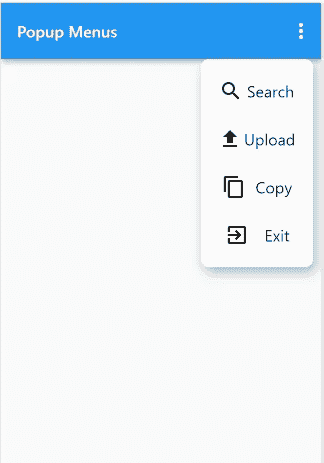
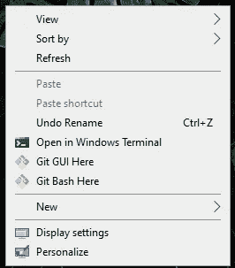
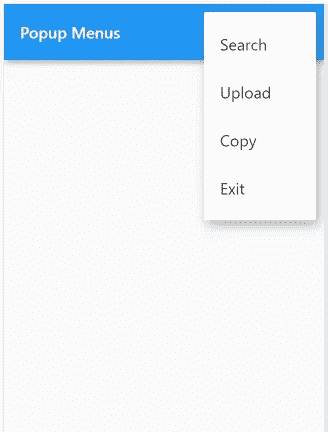
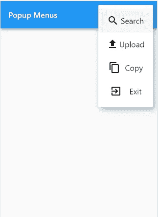
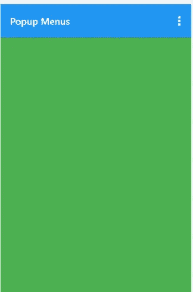

# Flutter 中的弹出菜单定制

> 原文：<https://betterprogramming.pub/popup-menu-customization-in-flutter-aa8827f6ce39>

## **不仅仅是下拉菜单**


克拉克·蒂布斯在 [Unsplash](https://unsplash.com?utm_source=medium&utm_medium=referral) 上拍摄的照片

今天，我们将看看任何应用程序中最常用的部件之一，即弹出菜单。

在阅读结束时，我们将创建如下内容:



如果你想在这里检查代码。

## 目录

1.  介绍
2.  弹出菜单按钮构造函数
3.  创建普通弹出菜单
4.  根据我们的需要定制菜单按钮

# **简介**

弹出菜单是最常用的小工具之一，当按下时显示菜单，当菜单因为一个项目被选中而被取消时调用`onselected` 。想象一下，当你右击鼠标时，你会看到一个菜单项列表，如查看、排序、刷新和…



现在我们知道什么是弹出菜单了。让我们深入研究一下构造函数，看看它的属性。

# **弹出菜单构造器**

```
[PopupMenuButton](https://api.flutter.dev/flutter/material/PopupMenuButton/PopupMenuButton.html)({[Key](https://api.flutter.dev/flutter/foundation/Key-class.html)? key, required [PopupMenuItemBuilder](https://api.flutter.dev/flutter/material/PopupMenuItemBuilder.html)<T> itemBuilder, T? initialValue, [PopupMenuItemSelected](https://api.flutter.dev/flutter/material/PopupMenuItemSelected.html)<T>? onSelected, [PopupMenuCanceled](https://api.flutter.dev/flutter/material/PopupMenuCanceled.html)? onCanceled, [String](https://api.flutter.dev/flutter/dart-core/String-class.html)? tooltip, [double](https://api.flutter.dev/flutter/dart-core/double-class.html)? elevation, [EdgeInsetsGeometry](https://api.flutter.dev/flutter/painting/EdgeInsetsGeometry-class.html) padding = const EdgeInsets.all(8.0), [Widget](https://api.flutter.dev/flutter/widgets/Widget-class.html)? child, [Widget](https://api.flutter.dev/flutter/widgets/Widget-class.html)? icon, [double](https://api.flutter.dev/flutter/dart-core/double-class.html)? iconSize, [Offset](https://api.flutter.dev/flutter/dart-ui/Offset-class.html) offset = Offset.zero, [bool](https://api.flutter.dev/flutter/dart-core/bool-class.html) enabled = true, [ShapeBorder](https://api.flutter.dev/flutter/painting/ShapeBorder-class.html)? shape, [Color](https://api.flutter.dev/flutter/dart-ui/Color-class.html)? color, [bool](https://api.flutter.dev/flutter/dart-core/bool-class.html)? enableFeedback})
```

让我们深入研究一下构造函数的每个参数。

`key`:唯一标识集合中的特定小部件。很少在弹出菜单构造函数中使用。

`itemBuilder`:创建菜单中显示的项目。

`initialValue`:确保打开菜单时该项目高亮显示。确保在菜单项中也提供它。

`onSelected`:当用户从弹出菜单按钮中选择值时调用。

`onCanceled`:当用户没有选择项目就关闭弹出菜单时调用。

`tooltip`:描述长按菜单项时将发生的动作的文本。

`elevation`:控制菜单后面阴影的大小。

`padding`:设置菜单项的填充。能够将填充设置为零非常有用。

`child`:如果提供的话，child 是用于这个按钮的部件，按钮将利用一个墨水瓶来点击。

`offset`:想要在特定位置显示菜单时的有用属性。后面会讨论。

`color`:为弹出菜单提供背景颜色。

`shape`:用于为我们的弹出菜单提供特定的形状。

# **创建普通弹出菜单**

在大多数情况下，我们将在`appbar`中使用一个弹出菜单作为尾随部件。我们也将这样做，但可以在任何地方使用，方法将保持不变。

为了代码的可重用性，我创建了一个名为`_buildAppBar()`的方法，它构造了一个基本的`appbar`，动作作为一个`PopupMenuButton`，动作由`itembuilder`属性组成，属性定义了如何构建一个菜单项，这个菜单项在下面的`_buildPopupMenuItem()`方法中定义。目前的实施结果如下:



`PopupMenuItem`中的子属性可以是任何小部件。假设我们想要一个图标和文本小部件作为菜单项，那么我们做以下事情:

当前实施的结果是:



我们可以通过添加一个名为 color 的属性来改变`PopupMenuButton`的背景颜色，也可以像上面讨论的那样做很多其他定制。

如果我们想在点击特定的`MenuItem`时执行特定的动作，我们必须在`PopupMenuItem`中提供一个名为 value 的额外参数，并根据我们的需要进行调整。

这里我们所做的是，我们在执行方法`_onMenuItemSelected()`的`PopumenuButton`中添加了一个属性名`onSelected`，在该方法中，我们更改了名为`_changeColorAccordingToMenuItem`的变量的值。另外，不要忘记将值参数传递给`_buildPopupMenuItem()`方法。

当前的实施导致点击“上传”选项:



您可以根据需要执行各种其他操作，如在按下菜单项时导航到其他页面。

# 根据我们的需要定制菜单按钮

现在我们需要把`PopupMenu`放在应用栏下面，它应该有一些圆角形状。为了实现这一点，我们将在期望 x 和 y 坐标的`PopupMenuButton`中提供名为`offset`的属性。

对于我们的 y 坐标，我们将计算 appbar 的高度并作为第二个参数传递给`Offset()`构造函数，因为我们希望我们的菜单位于 appbar 下面。

同样，为了制作圆角形状，我们将为我们的`PopupMenuButton`提供形状属性。

最终的代码如下所示:

给定代码的结果如下:


我希望这篇文章对你理解弹出菜单有所帮助。你可以根据自己的需要定制它。感谢阅读。