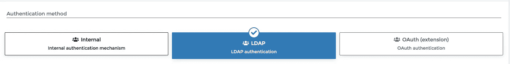
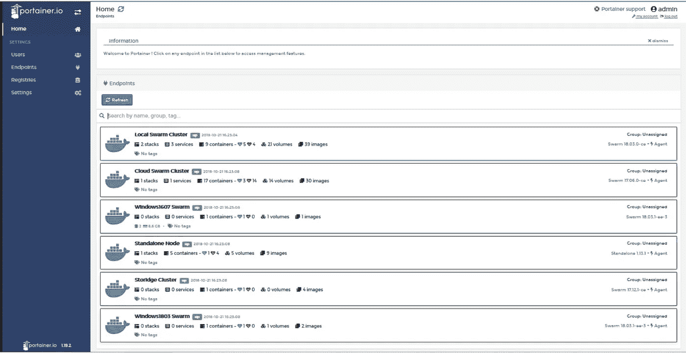
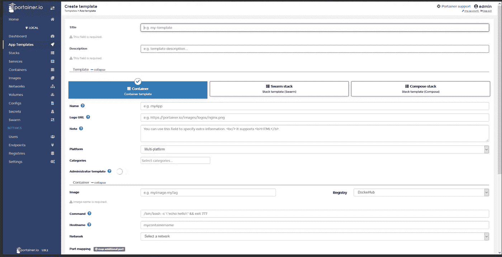
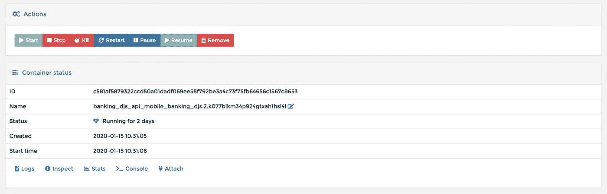
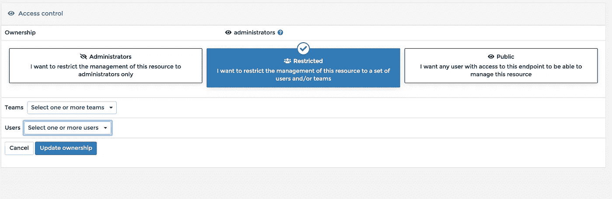

# 集装箱:集装箱审查

> 原文：<https://betterprogramming.pub/portainer-review-382575dabb76>

## Docker 容器和群服务的开源管理器


照片由[艾萨克·史密斯](https://unsplash.com/@isaacmsmith?utm_source=medium&utm_medium=referral)在 [Unsplash](https://unsplash.com?utm_source=medium&utm_medium=referral) 上拍摄

# 什么是 Portainer？

[Portainer](https://github.com/portainer/portainer) 是一个轻量级的管理 UI，允许您轻松管理不同的 Docker 环境。

Portainer 为通过 web 界面管理 Docker 容器和群服务提供了一个简单易行的解决方案。Portainer 支持多种用于管理 Docker 容器的特性，例如管理群服务的创建和删除、用户认证、授权、连接、在运行容器的控制台中执行命令以及查看容器的日志。

在本文中，我将尝试对 Portainer 支持的一些特性进行概述和回顾。

# 安装在 Swarm 上

为了能够在 Swarm 集群上运行 Portainer，您需要部署两个服务。第一个是代理服务，它应该运行在 Swarm 集群的每个节点上。第二个服务是`portainer-ui`，这个服务必须只部署在管理器节点上，以便能够按预期运行 Portainer。这个事实可以被认为是一个缺点，因为它会阻止以`DRAIN` 模式运行管理器，这是 Swarm 推荐的模式。

上面的文件是`docker-compose`文件，可以用来在 Docker Swarm 集群中部署 Portainer。要执行部署，请确保替换了所有占位符，然后执行以下命令。

```
$> docker stack deploy -c docker-compose.yml portainer
```

# 顶级功能

## 证明

Portainer 支持三种不同的用户认证方法。第一种是`internal`方法，用户管理由 Portainer 处理，存储在 Portainer data 文件夹中。第二种方法是`LDAP`，用户由外部 LDAP 服务器管理，比如 ActiveDirectory。我认为`LDAP`认证的唯一缺点是它不能使用环境变量进行配置。最终的认证方法是使用`OAuth`来执行认证。(此功能需要购买一个付费扩展。)



## 管理多个集群(端点)

如下图所示，Portainer 支持使用其用户界面管理多个 Docker Swarm 集群(称为*端点*)。如果您希望在单个用户界面中管理不同环境(如测试、试运行和生产)的集群，这个特性非常有用。



## 模板

Portainer 允许最终用户从预定义的模板中部署通用 Docker 群服务或 Docker 容器。这些模板要么是 Portainer 自带的，要么是最终用户自己定义的。用户定义的模板可用于通过三种模式部署服务:

*   单 Docker 容器—通过定义创建容器所需的所有配置
*   Docker 群服务——通过提供堆栈或服务文件的链接
*   Docker 容器——使用一个`docker-compose`文件



## 查看 Docker 资源

Portainer 提供的另一个重要特性是能够查看、交互和管理 Docker 群资源，如群服务、Docker 网络、群堆栈、容器和 Docker 图像。

Portainer 允许最终用户以一种简单、直观的方式查看这些资源并与之交互。因此，最终用户不需要连接到群集群并从一个节点移动到另一个节点来验证和检查服务和容器。例如，最终用户可以列出部署到给定集群的所有服务，更新这些服务的配置项，并根据需要从 web 界面停止和启动服务。

## 对容器执行操作

这个特性与前一个特性高度相关，但是因为可以在容器上执行的操作非常重要和有用，所以我想强调这些特性。

通常在 Docker Swarm 集群中，如果工程师想要检查给定的容器，检查容器日志，或者连接到 Docker 容器内部的 shell，他们需要执行以下操作。首先，连接到一个管理器节点。然后检查服务的容器部署在哪里(在哪个 worker 节点)。之后，连接到 worker 节点并在容器上执行所需的操作。

托管 Portainer 时，不需要所有这些操作。同样的目标可以直接从 web 界面实现，不需要连接到任何集群节点。



如上图所示，最终用户能够对运行在 Swarm 集群上的任何容器执行以下操作:

*   执行部署命令(启动、停止、终止、重启)
*   查看容器的日志
*   检查容器的配置
*   查看容器资源使用情况，如 CPU 使用情况和内存使用情况
*   打开正在运行的 Docker 容器中的控制台或 shell(您可以指定一个自定义命令)
*   连接到正在运行的 Docker 容器，并观察日志的实时视图

## 用户授权和资源所有权

Portainer 允许我们配置 Portainer 管理的每个资源的所有者，例如堆栈、Docker 服务和 Docker 容器。Portainer 提供了三个选项，用于选择这些资源的所有者。



*   第一个选项是`administrators`，这意味着只有 admin 用户能够管理这个资源。
*   第二个是`restricted`选项。此选项允许将管理资源的权限限制在一组特定的用户。允许向单个用户或团队授予访问权限。
*   第三个选项是`public`，这意味着任何访问 Docker 端点的用户都能够管理资源。

Portainer 包含和支持的功能比上面介绍的更多。然而，上述特性是 Portainer 支持的最有用的特性。

# 付费延期

Portainer 可以通过购买和启用额外的插件来扩展。可用的 Portainer 插件列表如下所述。

## 注册表管理器扩展

这个插件扩展了 Portainer，并为最终用户提供了浏览已定义的外部 Docker 注册表和管理其资源的能力。一旦安装并启用了插件，用户就能够浏览注册表、探索存储库和 Docker 图像、操作附加到存储库和图像的标签、添加新标签、重新标记图像以及删除现有标签。

注册表管理器插件有一个简单直观的图形用户界面，使得管理 Docker 注册表和 Swarm 集群更加容易，可以从一个界面完成。另一方面，插件还有改进的空间。例如，该插件不支持自动清理 Docker 注册表和删除旧的和不需要的 Docker 图像。如果在开发过程中使用 Docker 注册表，并且工程师正在从应用程序的特性分支构建 Docker 映像，那么这个特性就非常重要。在这种情况下，插件中最好有一个功能，可以在 30 天后删除属于该功能分支的所有图像。

## 基于角色的访问控制扩展

基于角色的访问控制扩展(RBAC)扩展了 Portainer 授权功能，并允许最终用户向一个端点或一组端点内的用户或团队分配角色。安装并启用插件后，有多个不同的预定义角色可用。这些角色描述如下。

*   端点管理员:该角色提供对给定端点内部署的资源的完全控制(仅不包括资源和 Portainer 内部设置)。
*   标准用户:该角色对用户自己或用户所属团队成员部署的资源拥有完全的控制权。
*   帮助台:该角色提供对所选端点内所有资源的只读权限。
*   只读用户:该角色为选定端点内的资源子集提供只读权限。

除了上述角色，Portainer 还定义了一个内置的管理员角色，该角色不仅授予对端点资源的访问权限，还授予对 Portainer 设置和所有已定义端点中的所有资源的访问权限。

在我看来，这个插件是对 Portainer web 界面的一个很好的补充，然而，我缺少了以下可以进一步改进这个插件的特性。

*   创建自定义角色的能力
*   授予用户对端点内资源子集的管理权限的能力

## 外部身份验证扩展

这个插件可以用来扩展 Portainer 支持的认证方法。如果认为内部用户管理工作量太大，并且 LDAP 服务器不可用，那么可以使用这个插件来管理使用 OAuth 服务的用户认证。

一旦插件安装并启用，Portainer 设置中的额外认证选项将可用。OAuth 选项增加了将 Portainer 连接到 Microsoft Azure AD、Google Suite/Cloud 身份验证和 GitHub 身份验证的能力。此外，该插件允许使用自定义选项，通过输入正确的 URI 字段，您可以连接到任何 OAuth 提供者。

# 结论

Portainer 是一个很棒的工具，可以用来从一个简单直观的 web 用户界面管理 Docker 容器、群服务和其他资源。Portainer 提供了几个免费功能和付费插件，可以增强用户管理 Docker 集群的体验。另一方面，一些付费插件仍然有一些限制或缺失的功能，可以改善产品。

感谢阅读！