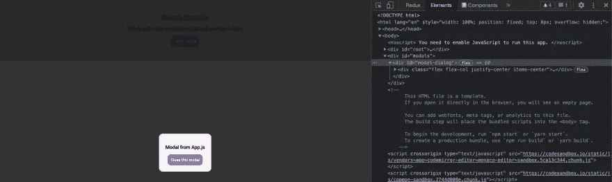

# 如何在 React.js 中使用门户

> 原文：<https://betterprogramming.pub/portals-in-react-js-with-a-practical-example-c6abd976caf>

## 用一个实例来说明


照片由[米赛尔·莫雷诺](https://unsplash.com/@moreno303?utm_source=medium&utm_medium=referral)在 [Unsplash](https://unsplash.com?utm_source=medium&utm_medium=referral) 拍摄

正如 React.js 官方文档中所述，门户提供了一个一流的选项来将子组件呈现到位于父组件的 DOM 层次结构之外的 DOM 节点中。

当我们想要呈现组件，但是我们的父级有一个隐藏的溢出或定义的宽度和高度时，门户是有用的，模态是一个理想的例子，所以我们要从头开始构建一个模态，并应用良好的用户可访问性实践。

你可以在这个 [GitHub 库](https://github.com/jordanrjdev/Portals-example-react)中看到这个例子的完整代码。

首先，我们将创建一个名为`src/Components/Modal/index.js`的组件:

```
export const Modal = (props) => {
  let { children, close, ...rest } = props;
  if (!children) {
    children = <p>This is a example modal</p>;
  } return (
      <div id="modal-dialog" {...rest}>
        <div className="flex flex-col justify-center items-center">
          {children}
          <button onClick={close}>
            Close this modal
          </button>
        </div>
      </div>
  );
};
```

在`src/styles.css`文件中，我们将有以下代码:

```
@import url("https://fonts.googleapis.com/css2?family=Roboto:wght@300;500&display=swap");
* {
  font-size: 62.5%;
  font-family: "Roboto";
  margin: 0;
  padding: 0;
}

#App {
  overflow: hidden;
  height: 20vh;
  background-color: #ccc;
}

#App > h1 {
  font-size: 2rem;
}

div#modal-dialog {
  background-color: rgba(0, 0, 0, 0.8);
  position: fixed;
  z-index: 999;
  height: 100vh;
  width: 100vw;
  top: 0;
  left: 0;
  display: flex;
  align-items: center;
  justify-content: center;
}

div#modal-dialog > div {
  background-color: #f5f5f5;
  padding: 2rem;
  border-radius: 1.2rem;
}

p {
  margin: 1.4rem 0;
  font-size: 1.5rem;
}

button {
  padding: 1rem;
  border-radius: 1rem;
  border: none;
  background-color: #9b59b6;
  color: #fff;
  cursor: pointer;
  transition: all 0.3s ease-in-out;
}

button:hover {
  background-color: #8e44ad;
}

.flex {
  display: flex;
}

.flex-col {
  flex-direction: column;
}

.flex-row {
  flex-direction: row;
}

.justify-center {
  justify-content: center;
}

.items-center {
  align-items: center;
}
```

在这里，我们将有几个样式的模型，我们还为我们的应用程序定义了一些标准类。

现在，在模态中，我们将收到几个*属性*，如子属性、关闭属性(关闭模态的函数)和我们可能有的其他属性，我们还有一个固定元素，即关闭模态的按钮，我们将在那里传递单击事件时关闭的函数。

我们将继续在我们的 index.html 文件中创建一个 div，它将是我们的应用程序的父 div 的兄弟元素，该文件如下所示:

```
<!DOCTYPE html>
<html lang="en">
  <head>
    <meta charset="utf-8" />
    <meta
      name="viewport"
      content="width=device-width, initial-scale=1, shrink-to-fit=no"
    />
    <meta name="theme-color" content="#000000" />
    <link rel="manifest" href="%PUBLIC_URL%/manifest.json" />
    <link rel="shortcut icon" href="%PUBLIC_URL%/favicon.ico" />
    <title>React App</title>
  </head>
  <body>
    <noscript>
      You need to enable JavaScript to run this app.
    </noscript>
    <div id="root"></div>
    <div id="modals"></div>
  </body>
</html>
```

我们将把“modals”的 id 放到这个 div 中，由于门户的原因，modal 组件将被注入到这个 div 中。

这对我们有好处，这样我们的组件就不会受到父组件样式的影响，因为父组件隐藏了溢出，并且定义了高度和宽度，因为它不会正确显示。

现在我们将继续创建`src/App.js`:

```
import { useState } from "react";
import ReactDOM from "react-dom";
import { Modal } from "./Components/Modal";
import "./styles.css";const domElement = document.getElementById("modals");export default function App() {
  const [stateModal, setStateModal] = useState(false);
  const openModal = () => setStateModal(true);
  const closeModal = () => setStateModal(false); return (
    <div id="App" className="flex flex-col justify-center items-center">
      <h1>Portals Example</h1>
      <div className="flex flex-col items-center justify-center">
        <p>This is a div with a defined height and overflow hidden</p>
        <button onClick={openModal}>
          Open modal
        </button>
      </div>
      {stateModal &&
        ReactDOM.createPortal(
          <Modal close={closeModal}>
            <p>Modal from App.js</p>
          </Modal>,
          domElement
        )}
    </div>
  );
}
```

首先我们有导入，在第 6 行我们有一个 div#modal 的引用

```
const domElement = document.getElementById("modals"); //Reference to div#modals for create portal
```

我们需要将它存储在一个变量中，因为我们将需要它来创建门户。

然后我们有了 openModal 的状态，能够知道模态是打开的还是关闭的，我们也有了各自的函数来打开和关闭模态。

我们有打开模态的按钮，下面我们有最重要的东西，这是一个条件，当模态的状态是`true`时，我们将使用 ReactDOM createPortal 函数，作为第一个参数，我们将传递我们想要呈现的元素，第二个参数，我们将传递我们要注入所述组件的 div 的引用，所以我们有这样的东西:

```
{stateModal &&
  ReactDOM.createPortal(
  <Modal close={closeModal}>
      <p>Modal from App.js</p>
  </Mode>,
  domElement
)}
```

有了这个，我们将能够看到在我们的应用程序的父容器之外的 div#modals 中如何呈现模态，这一切都要感谢门户，因此我们的样式没有问题，甚至没有将模态元素从 dom 中分离出来。



# 通过良好实践提高我们的可及性

> *注意:
> 在使用门户时，记住管理键盘焦点非常重要。对于对话框，确保每个人都可以通过遵循* [*WAI-ARIA 模态创建实践*](https://www.w3.org/TR/wai-aria-practices-1.1/#dialog_modal) *与它们进行交互。*

# 以编程方式管理焦点。

我们的 React 应用程序在运行时不断修改 HTML DOM，有时会导致键盘焦点丢失或设置为意外元素。要解决这个问题，我们需要以编程方式将键盘焦点推向正确的方向。例如，在模式窗口关闭后，将键盘焦点重置到打开该窗口的按钮。

然后我们将改进我们的组件，这样就不会出现错误。

如果由于某种原因，你有一个模态来删除一些东西，当模态被打开时，焦点被发送到确认按钮，会发生什么呢？这是糟糕的可访问性管理，因为它可能会被键盘输入无意中激活，所以最好是将焦点放在关闭模态的动作上，并将其返回到激活模态的按钮，这样它就不会迷失在一些不存在的元素中。

为此，我们必须阻止滚动，并防止焦点离开我们的组件，我们将使用 2 个依赖项，我们将通过安装:

```
npm i no-scroll focus-trap-react
```

我们将通过将焦点重定向到取消按钮来改进我们的模态组件，这要感谢 React 的 useRef 钩子。

`src/Components/Modal/index.js`:

```
import noScroll from "no-scroll";
import { useEffect, useRef } from "react";
import FocusTrap from "focus-trap-react";
export const Modal = (props) => {
  let { children, openButtonRef, close, ...rest } = props;
  if (!children) {
    children = <p>This is a example modal</p>;
  }

  let buttonRef = useRef();

  useEffect(() => {
    buttonRef ? buttonRef.current.focus() : null;
    noScroll.on();
    return () => {
      openButtonRef ? openButtonRef.current.focus() : null;
      noScroll.off();
    };
  }, []);

  return (
    <FocusTrap>
      <div id="modal-dialog" {...rest}>
        <div className="flex flex-col justify-center items-center">
          {children}
          <button ref={buttonRef} onClick={close}>
            Close this modal
          </button>
        </div>
      </div>
    </FocusTrap>
  );
};
```

首先，我们导入新的依赖项:

```
import FocusTrap from "focus-trap-react";
import noScroll from "no-scroll";
```

然后，我们创建一个引用，我们将在我们的按钮`let buttonRef = useRef();`
中使用，我们使用关闭按钮模式`<button ref={buttonRef} onClick={close}>Close this modal</button>`进行如下引用

我们还将添加一个新的属性，它是打开我们的模态的按钮的引用，以便在这个模态关闭时返回焦点:`let { children, openButtonRef, close, ...rest } = props;`

使用 useRef，我们将知道何时呈现该模态，这将表明它是打开的，我们将验证是否有对关闭按钮的引用，如果有引用，我们将使用`openButtonRef ? openButtonRef.current.focus() : null;`聚焦它，我们还将使用`noScroll.off()`
阻止滚动到我们的应用程序，最重要的是，当该组件被卸载时，我们将焦点返回到打开该模态的按钮，我们将使用以下代码再次解锁滚动

```
openButtonRef ? openButtonRef.current.focus() : null; 
noScroll.off();
```

其使用效果如下:

```
useEffect(() => {
     buttonRef ? buttonRef.current.focus() : null;
     noScroll.on();
     return() => {
       openButtonRef ? openButtonRef.current.focus() : null;
       noScroll.off();
     };
   }, []);
```

最后，我们将用组件包装我们的模型:

```
<FocusTrap>
{......}
</FocusTrap>
```

在我们的`src/App.js`组件中，我们将创建一个对我们的打开按钮的引用，并将其传递给我们的模块，这样我们的文件将如下所示:

```
import { useRef, useState } from "react";
import ReactDOM from "react-dom";
import { Modal } from "./Components/Modal";
import "./styles.css";

const domElement = document.getElementById("modals");

export default function App() {
  const [stateModal, setStateModal] = useState(false);

  let openButtonRef = useRef();

  const openModal = () => setStateModal(true);
  const closeModal = () => setStateModal(false);

  return (
    <div id="App" className="flex flex-col justify-center items-center">
      <h1>Portals Example</h1>
      <div className="flex flex-col items-center justify-center">
        <p>This is a div with a defined height and overflow hidden</p>
        <button ref={openButtonRef} onClick={openModal}>
          open modal
        </button>
      </div>
      {stateModal &&
        ReactDOM.createPortal(
          <Modal close={closeModal} openButtonRef={openButtonRef}>
            <p>Modal from App.js</p>
          </Mode>,
          domElement
        )}
    </div>
  );
}
```

通过这种方式，我们应用了良好的可访问性实践，滚动将被阻止，焦点也将只限于我们的模式。我们可以使用“Tab”按钮进行测试，在此示例中，我们学习了 react portals 并创建了一个具有良好实践的模式。

现在剩下的就是实践和继续研究我们可以在这个模态组件上改进什么。

告诉我，您还会在哪个示例中使用 react 门户？