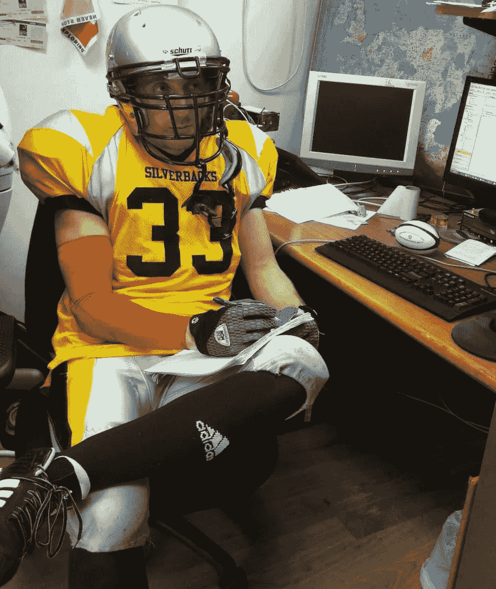
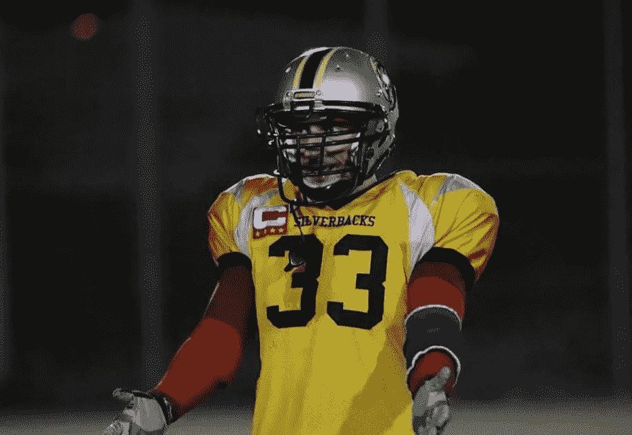
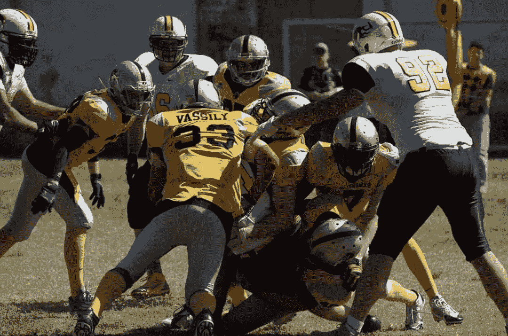
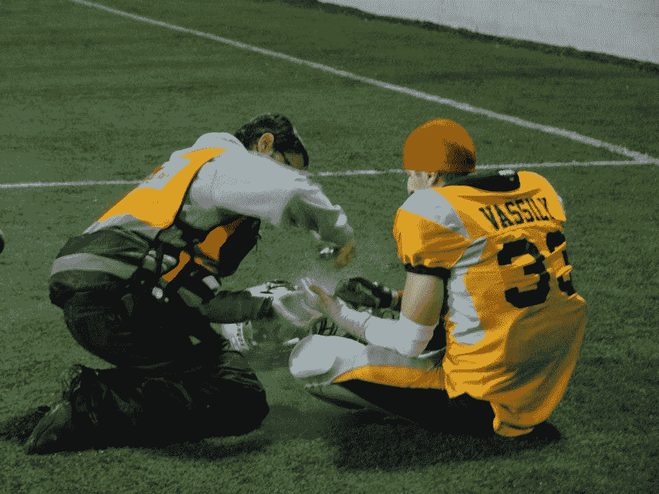
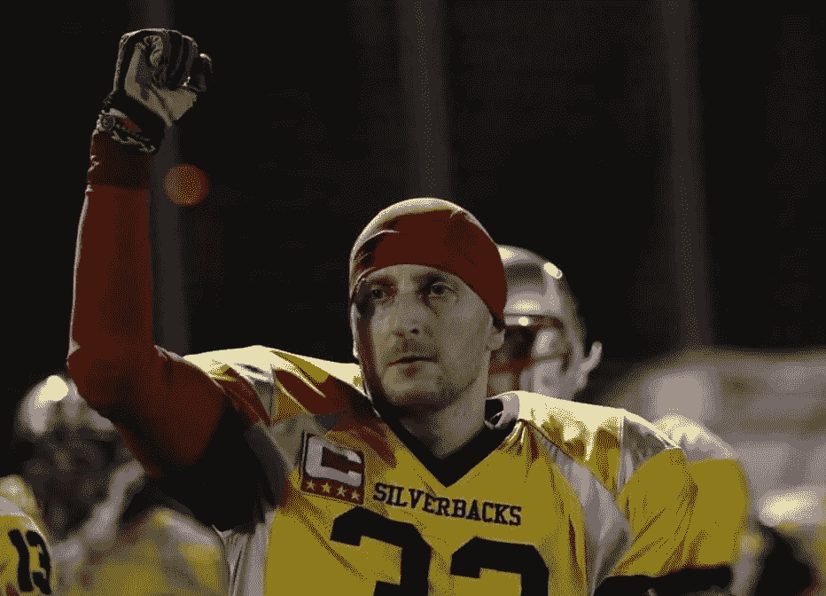

# 我目前的职位:足球堆栈工程师

> 原文：<https://betterprogramming.pub/position-football-stack-engineer-3b88ff139133>

## 软件工程和足球的相似之处

我只用了 20 年的软件工程和 8 个赛季的美式足球比赛就得出一个必然的结论——人类活动的这两个领域比人们想象的有更多的共同点。让我给你分析一下。

# **准备好，开始…**

作为一个新手是艰难的。比通常从外面看起来要难。你很熟练，你受过教育，你掌握了主要概念，你知道规则。然而你不知道。没有。一旦你踏上球场，你就迷失了。这有点像你所学到的，但一切都发生得如此之快，同时发生在如此之多的地方。令人不知所措，有时令人害怕。一切都那么重要。可能，只是在你的脑海里。噪音很大。绝对只是在你的脑海里。哦，所有的事情都会打击你。打击很大。

我的第一份工作是在一家五人初创公司做网页开发，他们在公司老板的公寓里工作。我拥有计算机科学的理学学士学位，但对现实生活中的任何相关事物都一无所知。我几乎无法解释 HTTP 协议是如何工作的，负载平衡听起来就像你在健身房做的事情，边距和填充之间的差异对我来说远不是微不足道的。现在也是。可以毫不夸张地说，我对自己在那里的大部分时间里在做什么只有一个模糊的概念。唯一有点好的(？)消息是他们相应地付出了。我想附近咖啡馆的服务员赚得更多。谁在乎呢。嘿，妈妈，我是工程师！

我的第一个足球职位是在一个全新的、没有经验的、人手不足的、教练很差的、总体来说非常糟糕的球队开始跑。有多糟？前两个赛季我们都是 0 胜 10 负。接下来的三场一共赢了六场。创下联盟史上最大输球的[反]纪录。记分牌显示 0-100。是的，非常酷。总之。第一场季前赛的第一场比赛是一个右投手。QB 成功地投出了球(不要想当然)，我成功地接住了球(你可能想当然)在我知道之前，中后卫的肩膀穿过了我的肋骨，而他的膝盖在我的腹股沟找到了一个软着陆点。我记得的下一件事是一个医生在我的尸体上，我的队友们不断地建议跳到我的伤口上来减轻疼痛。谢谢，我一定会的，只是请先把尸体拖离场地。他们做到了。我只用了 6-7 周就恢复了。谁在乎呢。嘿，妈妈，我是足球运动员！

我不知道，它在我的机器上工作…

嗯，有时候纯粹是运气不好。有些人在一个好的组织中开始他们的职业生涯，然后事情可能会看起来不同。入职流程使入职变得更加顺利。他们从你开始慢慢来。剧本更薄，剧本更简单，支持力度更大。你有导师，你有既定的流程，你不可避免的失误不会影响生产，你的团队总能弥补你的失误。如果你能让自己变得挑剔，请这样做。等待合适的机会，合适的经理/教练，合适的环境，合适的事情。NFL 的平均职业生涯是 3.3 年，软件开发人员的平均任期是 4.2 年。你可以挣扎着度过那些年，也可以享受并在此基础上继续发展。他们说游戏对于资深玩家来说比较慢。工程和足球都是如此。随着经验而来的是更快的反应，更冷静的态度，更广阔的视野。越早发生越好。尽管如此，如果开始不顺利，也不要灰心丧气。最终，情况会好转。你只需要继续比赛。

# **蓝 42！**

足球和软件工程可能是周围充满误解的科目中的佼佼者。其中一个误解是两者都有所谓的个人主义本质。是的，人们都知道足球是一项团队运动。他们确实理解实现游戏目标所需的集体努力。然而，场内场外的交流水平经常被忽略。好像有 11 个人在做他们各自的工作。在任何给定的时刻，他们执行他们的个人任务(在幸运的情况下，拥有个人任务的概念完全被理解，游戏不被解释为一场奇怪的争吵)。对于一个没有受过教育的观众来说，这些大块头只是跑到某个地方，互相厮打。稍微精明一点的观众看到，O 线拦网，接发球跑路线，跑卫带球，D 线冲，线卫跟着带球人，二传掩护接发球。许多演员，离散的行为。软件工程师的情况更糟。许多人认为程序员是坐在他或她的电脑前编写程序的人。嗯，可能他有一个[产品]经理来告诉他们要编程什么。哦，还有一个平面设计师，对吧？负责商标的人。几个演员，分散的行为。

这里有一个简单的揭穿。足球是一种交流的游戏。技能很重要，执行力很关键，沟通也是至高无上的。防御单位纯粹依靠通讯来应对进攻的阵型和行动。一次失误——你付出了沉重的代价。不是得分就是对手的大收获。所有这些 40 码炸弹的闪光亮点大多是由于对防守的误解。进攻战术也很大程度上依赖于机器各部分之间的配合。与足球或篮球不同，一星球员不能对比赛产生太大影响。

软件工程也是如此。无论是车库里的三个人，还是拥有数千名员工的科技巨头。没有人再独自工作了；不确定他们有没有。现代软件太复杂了，不可能由一个人来开发和维护。无论你是一个内向的书呆子，你都不可能在日常工作中排除交流。一个普通的工程师必须与组织内外的众多利益相关者打交道。因此，建立和培养关系往往比创造一个出色的设计或编写干净的代码更重要。毕竟，*人*与*人*一起工作，即使他们被机器包围。

又是一次周会

这些计划可能无懈可击，但如果团队缺乏清晰、及时和有效的沟通，获胜的机会就会大大降低。它们越低，系统就变得越不稳定。这种不稳定性会导致更麻烦的通信。结果是可以预见的:错误开始堆积，球员开始互相指责，似乎没有人关心除了自己以外的任何事情，整个比赛在终场哨声响起之前很久就输了。化学反应、协同作用、相互承诺、团队合作和相互支持——这些都不是陈词滥调，这些是影响结果的真实因素，更重要的是过程本身。

# **小屋，小屋，远足！**

足球是人类发明的最复杂和最具挑战性的运动之一。这是用人形玩的国际象棋。又大又壮又快又健壮的。所需的体能和强度是首屈一指的。必要的长时间身体接触和高速度的间歇跑耗尽了每个运动员的身心。

与普遍的看法相反，防护设备只会让事情变得更糟。更多的攻击性，更少的规则，更重的影响。当两个身体碰撞时，头盔确实可以保护头部不被扯掉，但同样的头盔也是一种武器。如果它击中身体未受保护的部位(除了头部、胸部和上背部以外的所有部位)，就会受伤。非常喜欢。手指骨折、肌肉撕裂、韧带、肌腱、挫伤、脑震荡[随后的边线挫折]——我全都有。比赛后没人去急诊室的情况很少见。赛前完全健康的球员是不存在的。

好吧，伙计，反正我是用右手点击的

身体持续的疼痛和不适显然也是对大脑的挑战。这受到游戏本身的复杂特性的挑战。决策必须在瞬间做出，几十个事件同时发生，大脑必须处理它们，身体必须以某种非常精确的方式做出反应。这是极其困难的。所以，极度满足！

就像构建软件一样。这是一项经常需要深思熟虑的智力活动。你必须推动大脑去理解某种抽象概念，去收集和分析各种各样的数据点，从记忆细胞中检索先前的知识，产生和测试不同的假设，等等，等等。不像足球，它不需要即时，但脑力劳动仍然存在。集中程度仍然很高。嗯，有些事情对有些人来说是自然而然的，不管是体力上的还是智力上的努力。很多任务都是在自动驾驶模式下完成的，无论是跑路线还是跑测试。此外，有许多非比赛时刻，你喜欢扔球和接球，或者通过 Nespresso 机器与同事聊天。然而，你确实需要具备特定的品质，并愿意在关键时刻坚持到底。

好消息是每项技能都可以掌握。更好的消息是，无论你的目标是什么，最终你前进道路上的一切都归结为一件事。努力。传奇人物雷·刘易斯说得很好。“努力是你和你之间的事。努力和任何人都没有关系。”足球如此，职业如此，生活也是如此。

万岁，部署到生产工作！