# 通过 3 个简单的步骤自动完成从 Salesforce 到 Slack 的发布

> 原文：<https://betterprogramming.pub/post-from-salesforce-to-slack-in-3-easy-steps-1d615162e0d0>

## 快速从 Salesforce 发布到 Slack

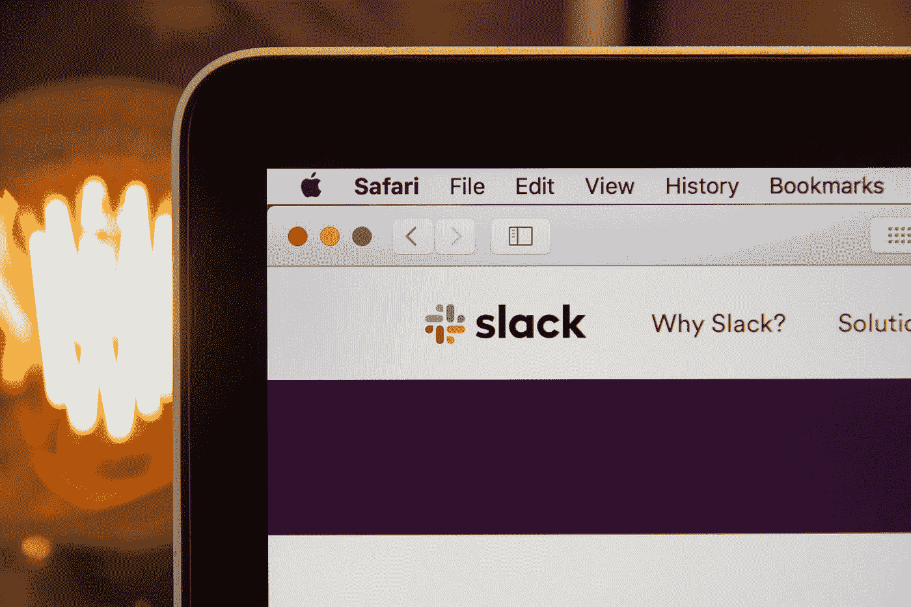

斯蒂芬·菲利普斯-Hostreviews.co.uk 在 Unsplash[拍摄的照片](https://unsplash.com?utm_source=medium&utm_medium=referral)

只需三个简单的步骤，您就可以开始以编程方式从 Salesforce Flows、Process Builders 或 Apex 向您喜爱的松弛渠道发送消息！下面的框架将为您提供开始构建 Salesforce to Slack bot 所需的更多内容，它可以让您的团队了解最新的记录更新。

1.  **创建一个宽松的工作流程。**创建从 salesforce 接收更新的工作流，并将消息发布到您选择的渠道！
2.  **将以下 apex 上传到您的组织。**将以下代码保存到您的组织将为您的流程构建者和流程提供一个 Apex 操作，该操作将打包您的变量，并将它们发送到您在上面创建的工作流。
3.  **自动化！**用你最喜欢的 Process Builder 或者 Flow 给 slack 发消息！

# 为什么？

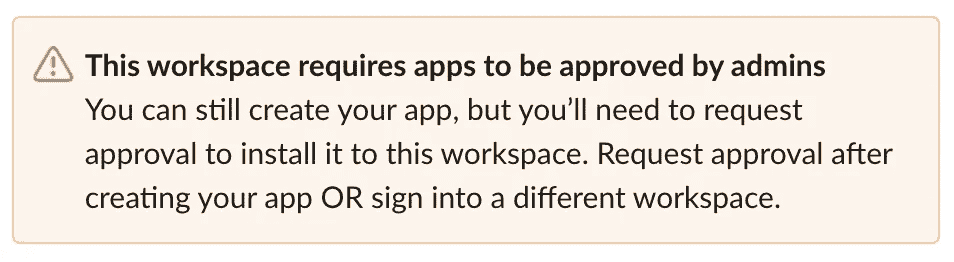

如果您和我一样，当您的 Salesforce 组织中的记录数据发生变化时，您觉得有必要向 Slack 发送消息。而且，如果你真的像我一样，你可能没有一个强有力的案例来呈现给你的管理员，为什么你的应用程序需要访问传入的网络钩子。幸运的是，有一种轻量级的方法可以通过编程将消息发布到 Slack，而不需要请求访问。

# 它是如何工作的

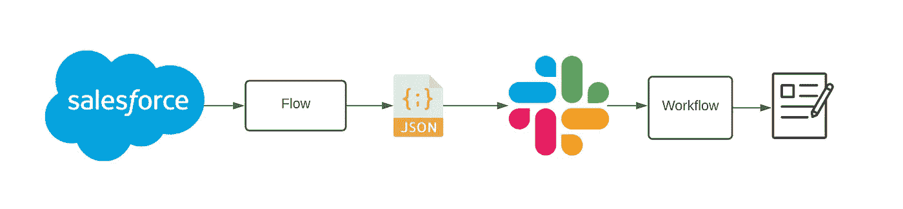

*   3 个组件:
*   Salesforce 流程/流程构建器
*   Salesforce 可调用方法
*   带有 Webhook 的松弛工作流

下面我们有一个流程中的 Apex 动作的例子，它让我们定义 4 个变量发送到 Slack，加上发送到的端点的 URL。通过将流中的 apex 操作与非常简单的 Slack 工作流相结合，我们可以向 Slack 发送包含来自源系统的数据片段的自动化消息。

由于该工具包中的时差变量是通用文本变量，您可以非常有创造性地使用 Salesforce 公式字段。下面是一个流程构建器的例子，它在团队达到 x 点时向团队表示祝贺。您可以在公式中看到，我们向 Slack 传递了 3 个变量；**端点**，它告诉我们要引用哪个工作流；和 **Var1** ，它连接几个记录变量的字符串； **Var2** ，(不在视野内)发出行动号召。

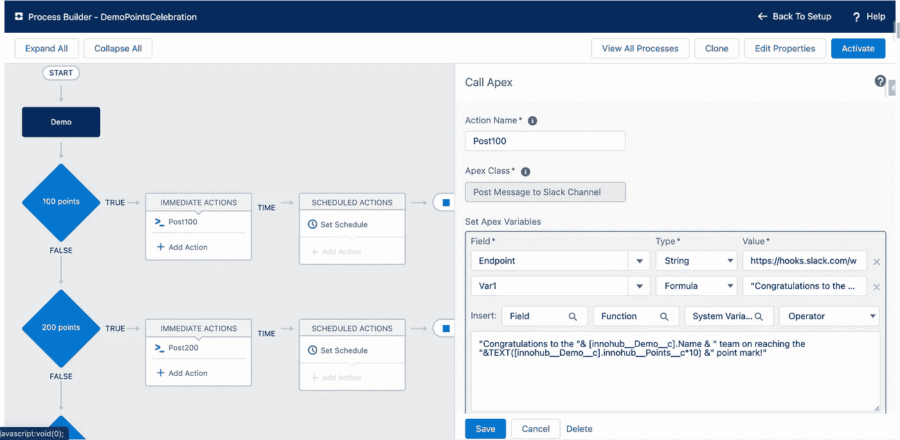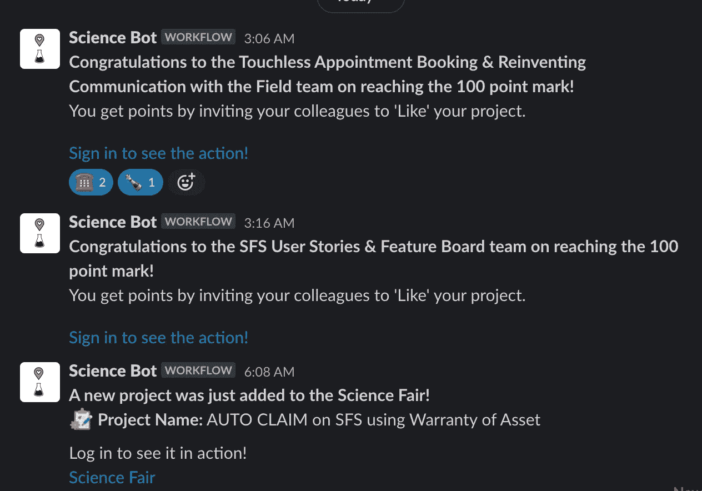

# 自己试试吧！

## 创建宽松的工作流程

首先在 Slack 中创建一个工作流。您可以通过在任何聊天界面中键入`/workflow`来访问工作流构建器。创建新工作流程时，选择 **Webhook** 选项。

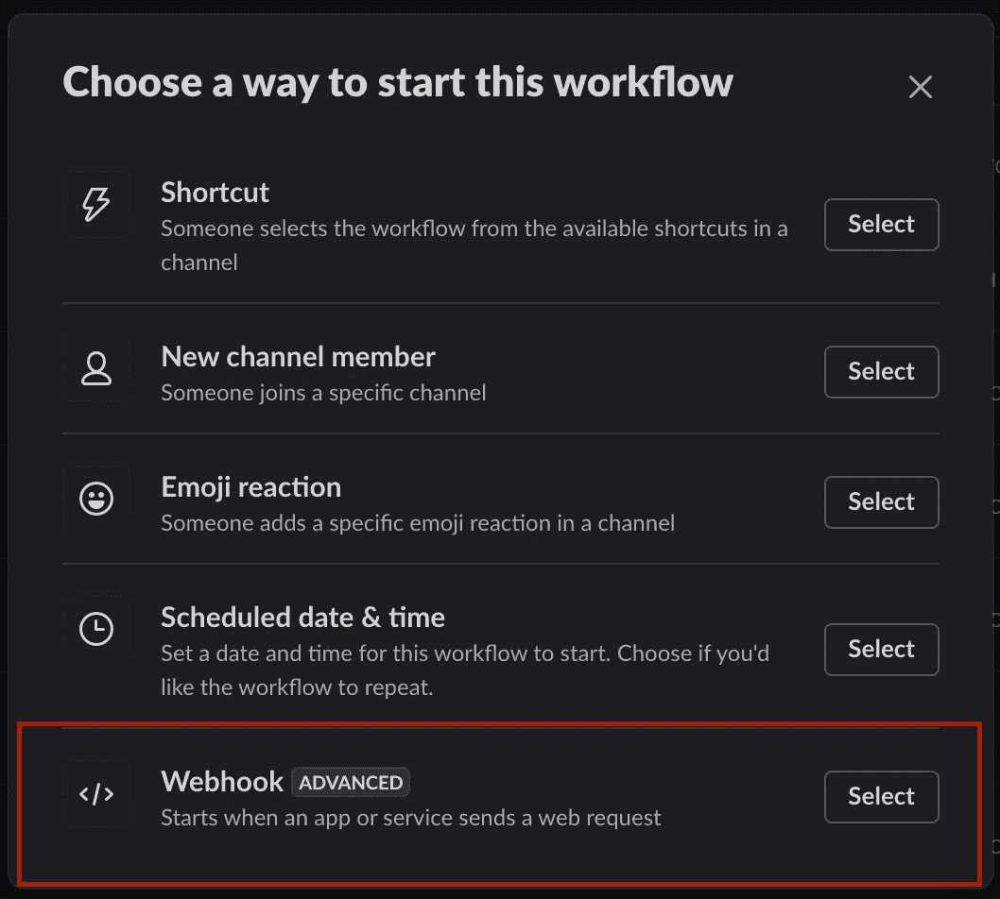

## 生成 Webhook

一旦你创建了你的 Webhook 工作流，是时候添加一些变量了。创建 4 个名为 Var1 — Var4 的变量。点击**保存**。

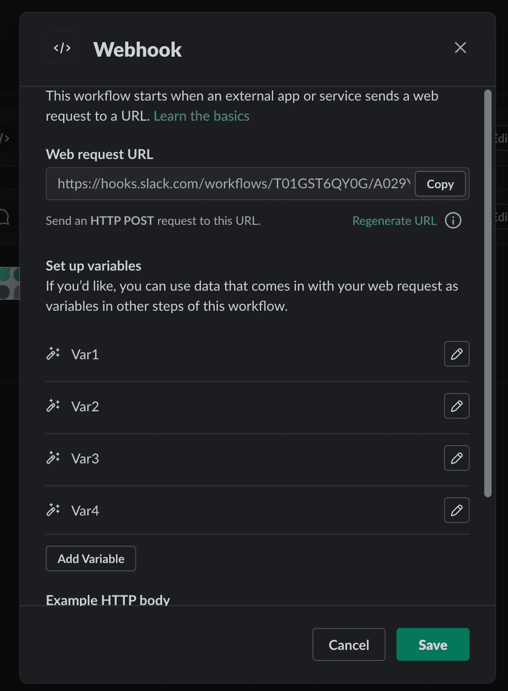

现在**发布**你的流量。一旦您发布了您的流量，您将可以选择复制 Webhook URL。这是 Salesforce 将用来识别其向哪个流发送消息的端点。

此 URL 是您创建的工作流的开放端点，这意味着任何具有该 URL 的人都可以发布到您的工作流。保存此 URL 以供以后参考。

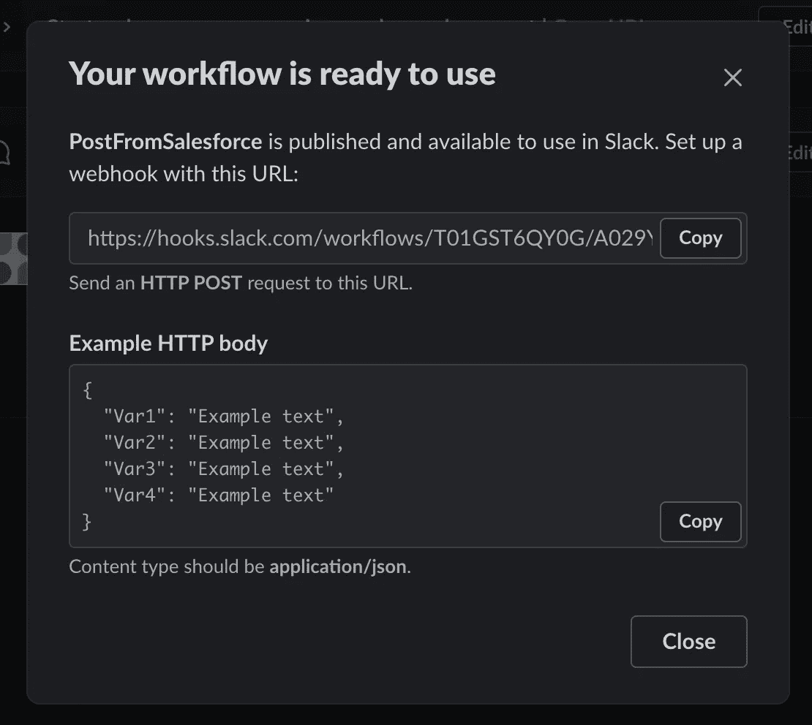

添加将消息发布到松弛通道的步骤。将变量插入消息并保存。

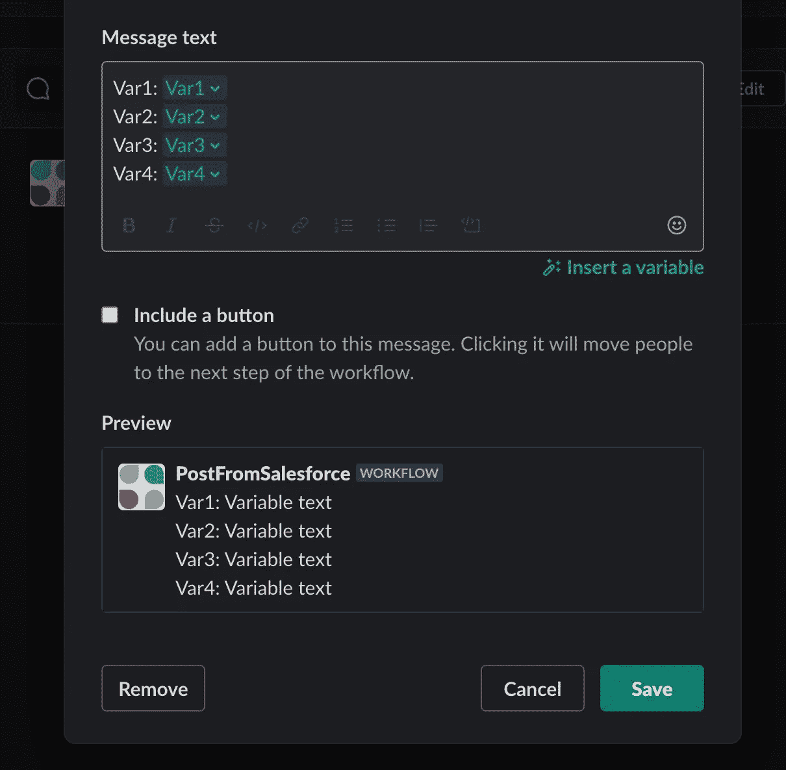

# 插图的编号

`SlackWorkflowCallout`类将获取您在流程中分配的变量，将它们放入一个 JSON 字符串中，并将它们发送到我们上面创建的端点。将以下代码复制到您的 org 和`save`中。

```
global class SlackWorkflowCallout{
    @future(callout=true)
    global static void makePostCallout(String Endpoint,String Var1,String Var2,String Var3,String Var4) {
        Http http = new Http();
        HttpRequest request = new HttpRequest();
        // Set the endpoint of the Slack Work Order Webhook
        request.setEndpoint(Endpoint);
        request.setMethod('POST');
        request.setHeader('Content-Type', 'application/json;charset=UTF-8');

        // Set the body as a JSON object
        request.setBody('{"Var1": "'+Var1+'","Var2": "'+Var2+'","Var3": "'+Var3+'","Var4": "'+Var4+'"}');
        HttpResponse response = http.send(request); // Parse the JSON response
        if (response.getStatusCode() != 201) {
             System.debug('The status code returned was not expected: ' +
        response.getStatusCode() + ' ' + response.getStatus());
        } else {
            System.debug(response.getBody());
        }
    }
}
//gegu
```

# 可调用方法

以下代码将创建一个可以在您的流程中使用的 Apex 操作。

`PostToSlackWorkflow`类正在创建一个可以在您的流中引用的`invocableMethod`和`InvocableVariables`。

这个类将获取变量，并将它们放入上面引用的 JSON 字符串中。将以下代码复制到您的组织并保存。

```
public class PostToSlackWorkflow { // define the variables that you will access from the flow. 
    public class Message {
        @InvocableVariable(label='Endpoint' description='Slack Flow Webhook URL')
        public String Endpoint;
        @InvocableVariable(label='Var1' description='Var1')
        public String Var1;
        @InvocableVariable(label='Var2' description='Var2')
        public String Var2;
        @InvocableVariable(label='Var3' description='Var3')
        public String Var3;
        @InvocableVariable(label='Var4' description='Var4')
        public String Var4; }
    // pass the variables to the callout class / method. You break the variables and the callout into 
    // separate classes so the callout can run asynchronously... there's probably a better way. 
    @InvocableMethod(label='Post Message to Slack Channel')
    public static void PostSlackMessage(List<Message> messageList) {
        for(Message m : messageList) {            
            if(Limits.getFutureCalls() >= Limits.getLimitFutureCalls()) {
                System.debug(LoggingLevel.ERROR, 'Future callout limit exceeded. Skipping records.');
            } else {
                SlackWorkflowCallout.makePostCallout(m.Endpoint, m.Var1, m.Var2, m.Var3, m.Var4); //gegu
            }
        }
    }
}
```

# 流动

将**posttoslackflow**操作添加到您的流程中。

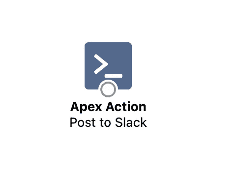

将**端点 URL** 添加到**端点**变量中。在 var 1-var 4 字段中添加您想要在消息中显示的任何输入，然后**保存。**

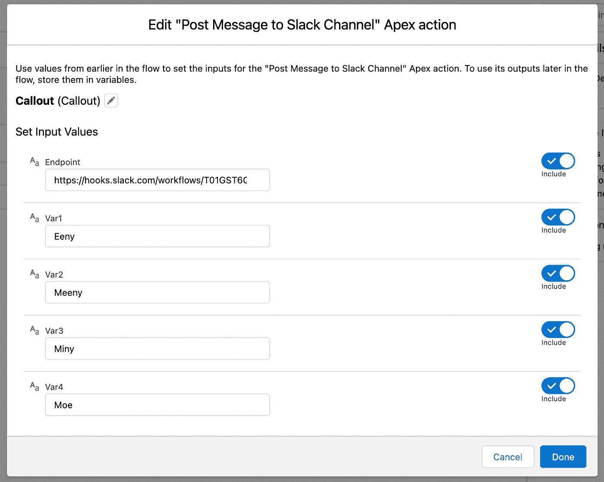

就是这样！借助 Salesforce 流程的强大功能和灵活性，您现在可以向您最喜欢的 Slack 频道发帖。

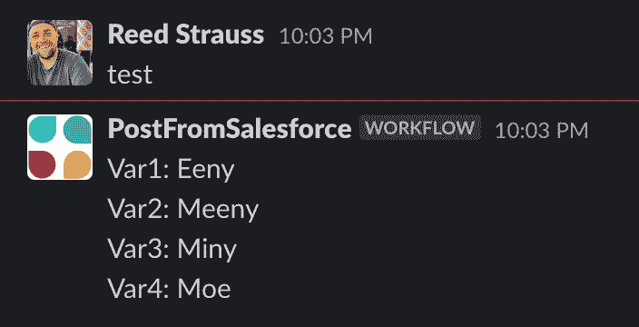

# **补充阅读**

[Slack Webhook 开发者指南](https://slack.com/help/articles/360041352714-Create-more-advanced-workflows-using-webhooks)