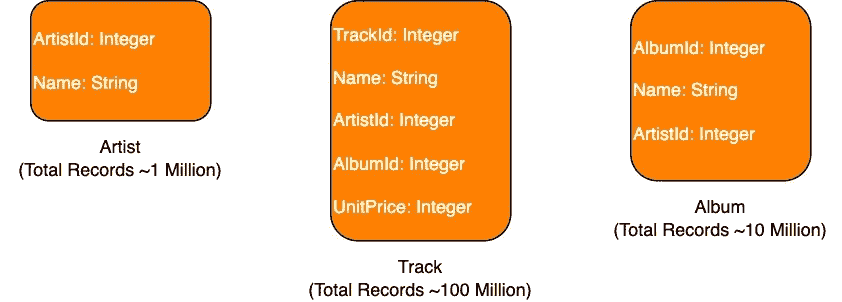
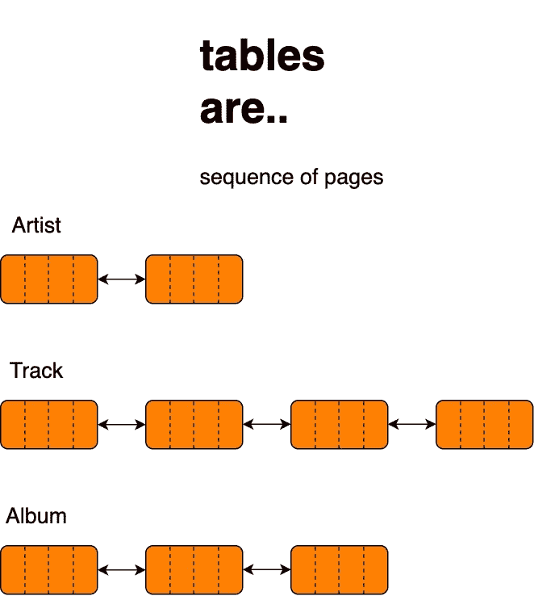
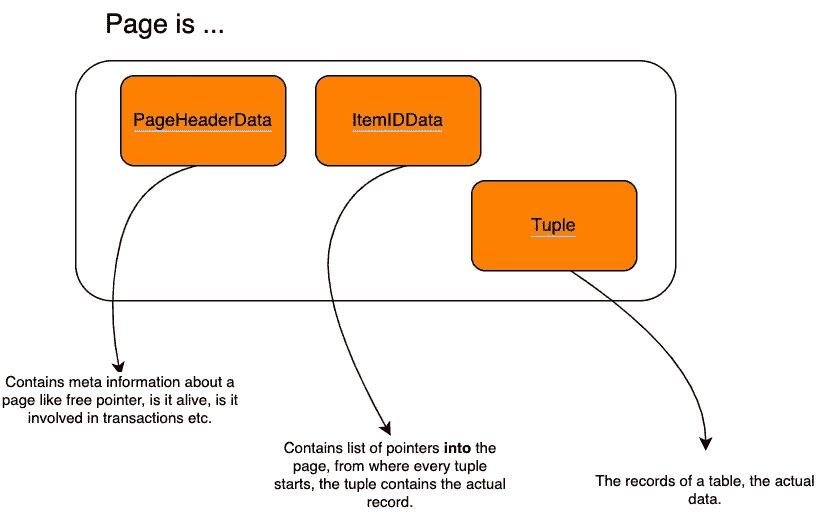
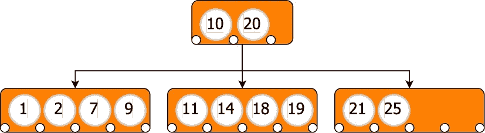
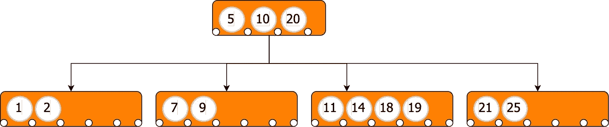

# PostgreSQL:优化查询性能的经验教训

> 原文：<https://betterprogramming.pub/postgresql-lessons-learned-while-optimising-query-performance-56e1652ecd86>

## 让您的结果快很多倍

在过去的一年中，我学到了很多关于如何优化 PostgreSQL 性能的知识，在这篇文章中，我想分享一些关于如何充分利用我们的数据库的重要知识。

您的团队或客户是否向您询问过为什么产品的应用程序运行缓慢？很可能你有😅。

以我的经验来看，

```
Database Performance == Application Performance
```

# 头号问题是缺少索引

导致数据库性能问题的最常见错误是:( 1)查询缺少索引，或者(2)为查询创建的索引没有被利用。

让我们考虑一个存储关于艺术家、他们的曲目和他们各自专辑的数据的数据库。



如果我想用`Name = Levitating`查询一个音轨，我将使用下面的查询:

```
SELECT * FROM Track WHERE Name='Levitating';
```

数据库中的数据以数据页的形式存储在磁盘上。这些页面的结构类似于链表，因为它们包含一个数据部分和另一个指向下一个块的指针部分。这些块不需要以连续的顺序存储。



表格是一系列页面



页面构成

*当记录变得太大而无法存储在一个块中时，PostgreSQL 会将它存储在一个* `*TOAST*` *表中。记录将被分割成块，因此主表(也称为堆)将包含一个指针，指向* `*TOAST*` *表中的右块。*

根据`Track`表的模式，`Track`的一个块在其数据段中将包含多个字段。事实上，记录只能在一个字段中排序，搜索像`Name`这样不是主键的字段，因为`Name`是一个非唯一字段，因此默认情况下不排序，搜索`Name`将需要全表扫描。

这意味着使用上面的查询找到带有`Name=’Levitating’`的轨道，所有大约 1 亿行将必须被扫描。这太疯狂了。将花费几秒钟来得到结果，并且这是对计算资源的不良使用，并且对环境🥲是不利的

## **如何提高上述查询的性能？输入索引。**

索引是一种数据结构，它通过提供指向所请求记录的数据库客户机指针来实现更快的数据查询。一旦知道了记录的位置，就可以通过查找准确的内存地址来快速获取数据。

*底层查询协议允许数据库客户端批量获取结果，而不是一次获取全部结果。*

让我们通过执行以下查询在`Track`表的`Name`字段上创建一个索引:

```
CREATE INDEX CONCURRENTLY ON Track Using btree (Name);
```

索引被实现为 B 树。在剖析上面的查询之前，我将让您对 B 树有一个深入的了解。

b 树是为在磁盘上存储数据而创建的结构，其中访问一个存储位置需要大约 5 毫秒，因此，数据局部性是其设计的一个重要方面，允许在每个树节点中存储多个值。

由于 B 树的分支因子很高，只需很少的磁盘读取操作就可以到达存储数据的目标位置。

具有`m`值的 B 树节点将有多达`m+1`个指向子节点的指针。每个指针指向包含其两个父节点之间的值的子树。



分支因子为 3 的 b 树

在上面的 B 树中:

1.  第一个指针指向值小于 10 的子节点
2.  第二个指针指向一个值在(10，20)之间的子节点
3.  第三个指针指向值大于 20 的子节点

如果我想将值`5`添加到 B 树中，将会对根节点的第一个子节点进行拆分，生成的树将转换为下面的树:



分支因子为 4 的 b 树

拆分会将子对象的中间值插入到父对象中。这意味着分割也会重新平衡树。

在上面的 B 树中，插入`5`会导致拆分，将子节点的中间值移动到父节点中，重新平衡会引入一个新的子节点。

这确保了二叉树的最大深度将是`log(m/2)n`，其中`m`是分支因子，`n`是树中值的数量。

关于 B 树需要注意的要点是:

1.  搜索、插入和删除等操作具有对数时间复杂度。
2.  b 树是非常浅的数据结构。具有数千分支因子的 B 树意味着它们可以在仅仅两到三层中存储数百万个元素。

*一旦创建了列的索引，如果索引的* `*operator class*` *包含查询中与列一起使用的运算符，则* [*查询计划器*](https://www.postgresql.org/docs/9.5/planner-optimizer.html) *将使用使用索引列的表上的任何查询，以创建最佳的查询执行计划。*

执行相同的查询，以获得一个跟踪，其中`Name=’Levitating’`将再次在毫秒内产生结果，因为查询规划器将使用索引，并且只需两到三次磁盘读取就能够找到所需数据的位置。这种情况下使用的扫描将是索引扫描。

像生活中所有美好的事物一样，指数也是有代价的。虽然它们提高了速度，但需要空间来存储索引。这个空间可能从兆字节到千兆字节不等，有时取决于被索引的数据量。

您可以在多个字段上创建索引，也称为复合索引，并且可以在同一个表上创建多个索引，这取决于该表上所需的各种类型的查询。

因此，需要特别注意了解如何在数据库上执行查询，以及我们创建的索引是否被利用。

创建索引时需要考虑几个非常重要的问题:

1.  当且仅当查询的`WHERE`子句至少包含索引最左边的列时，查询才会使用复合索引。
2.  不必为表中的所有行创建索引，可以为行的子集创建索引。这在空间和时间复杂性方面有真正的好处。
3.  `CREATE INDEX CONCURRENTLY ON Track Using btree (Name) WHERE ArtistId In (ArtistId1, ArtistId2, ...);` 使用上面的命令，我们告诉 PostgreSQL 只为`ArtistId`是`(ArtistId1, ArtistId2, ...)`之一的行创建一个索引

*关于* `*CONCURRENTLY*` *的说明用于* `*CREATE INDEX*` *命令*

*当一个表被索引时，PostgreSQL 锁定该表以防写入。读取操作仍然可以执行，但是写入、更新或删除操作会被阻止。在生产环境中，可能不希望出现这种情况，因为在生产环境中，为大型表编制索引可能需要几个小时。*

*当使用* `*CONCURRENTLY*` *时，写操作不会被阻塞，PostgreSQL 将等待此类事务完成。由于允许继续正常操作，构建索引的时间也会随着数据库服务器的 CPU 和内存利用率的增加而增加。*

# 第二个问题是不知道数据库中发生了什么

假设我们想找出数据库中运行速度最慢的三个查询。我们该怎么做呢？

## 1.查找昂贵的查询

```
SELECT queryid, calls, mean_time, substring(query for 100)
FROM pg_stat_statements 
ORDER BY total_time DESC LIMIT 3;
```

这将为我们提供三个最昂贵的查询列表:

```
| query_id   | calls | mean_time | substring |
|------------|-------|-----------|-----------|
| 1819595255 | 18000 | 500.12    | Query 1   |
| 10013512   | 100   | 273.25    | Query 2   |
| 50123753   | 3000  | 252.37    | Query 3   |
```

## 2.分析昂贵的查询

下一步是分析昂贵的查询，并理解查询规划器是如何执行它们的。

```
EXPLAIN SELECT * FROM Album WHERE Name = 'Favourite Worst Nightmare';
                         QUERY PLAN                                          
------------------------------------------------------------
Seq Scan on Album (cost=0.00..169375.85 rows=10000000 width=32) Filter: (Name = 'Favourite Worst Nightmare'::text)
```

`EXPLAIN`提供查询规划器为给定查询生成的执行计划。执行计划显示了如何扫描查询所引用的表。

> *PostgreSQL 使用多种扫描策略:*
> 
> *顺序扫描—顺序扫描表格的所有页面。它基本上是一个线性搜索。顺序扫描在两种情况下发生:*
> 
> 1.`WHERE`子句中的键没有可用的索引
> 
> 2.大多数行将作为查询结果的一部分返回
> 
> *索引扫描—这是一个两步扫描。第一步是从索引中查询数据。该索引返回*[](https://www.postgresql.org/docs/9.3/datatype-oid.html)**主表或堆中的数据。第 2 步是直接访问堆页以获得全部数据。**
> 
> **步骤 2 是必需的，因为查询可能请求获取比索引中可用的更多的列。**
> 
> **仅索引扫描——这与索引扫描相似，只是不需要步骤 2，所有数据都从索引中提取。这是最快的扫描了。必须满足几个条件，查询规划器才能选择仅索引扫描。你可以在* [*维基*](https://www.postgresql.org/docs/10/indexes-index-only-scans.html) *中读到关于它的一切。**
> 
> *还有另外两种类型的扫描策略，它们需要额外的上下文来解释，也许我以后会写一篇关于它们的文章。一种是位图扫描，另一种是 TID 扫描。*

*使用没有任何选项的`EXPLAIN`没有多大帮助；它不执行查询，只显示如何执行查询的计划。*

*`EXPLAIN`与`ANALYZE`一起使用时，将实际运行查询并显示计划和执行查询所花费的时间。在确定查询性能和瓶颈时，这些信息是非常宝贵的。*

*让我们看看在创建了`Name`上的索引后，第一次执行查询时`EXPLAIN ANALYZE`的输出:*

```
*EXPLAIN ANALYZE SELECT * FROM Track WHERE Name='Levitating'; QUERY PLAN                                          
---------------------------------------------------------------Index Scan using idx_name on Track  (cost=0.00..32.97 rows=1 width=64) (actual time=0.352..0.357 rows=1 loops=1)
        Index Cond: (Name='Levitating')
Planning Time: 3.011 ms
Execution Time: 0.379 ms*
```

*查询计划表明所使用的扫描策略是索引扫描，这是有意义的，因为我们要求的是该行中可能不在索引中的所有列。*

*`actual time=0.352..0.357`表示访问第一行花费的时间和读取所有行花费的时间。*

*在我看来，读取`EXPLAIN ANALYZE`的输出对于简单的查询来说是可以的，但是对于复杂的查询来说就变得困难了。我遇到了一个叫做[explain.depesz.com](http://explain.depesz.com/)的工具，它通过将输出分解成组件来简化输出，并为查询执行的每个阶段提供统计数据。*

*当您试图在缓慢的查询中找到瓶颈时，我强烈推荐使用该工具。*

*好吧，我就说到这里。我真的很喜欢写这篇文章，也许我会写更多关于数据库的话题，比如:*

1.  *优化涉及连接的 PostgreSQL 查询*
2.  *查询优化器如何工作以及查询执行的不同阶段*
3.  *为什么缓存并不总是解决问题的答案，通常，人们会低估数据库，直接跳到缓存解决方案*
4.  *数据库设计的注意事项*
5.  *更加*

*直到下次👋🏼*

*如果你喜欢我的内容，考虑分享它，如果我的帖子增加了你的订阅价值，请考虑订阅我的[时事通讯](https://ashutoshnarang.substack.com/p/postgresql-improve-query-performance?r=1b65mw&s=w&utm_campaign=post&utm_medium=web):)。*