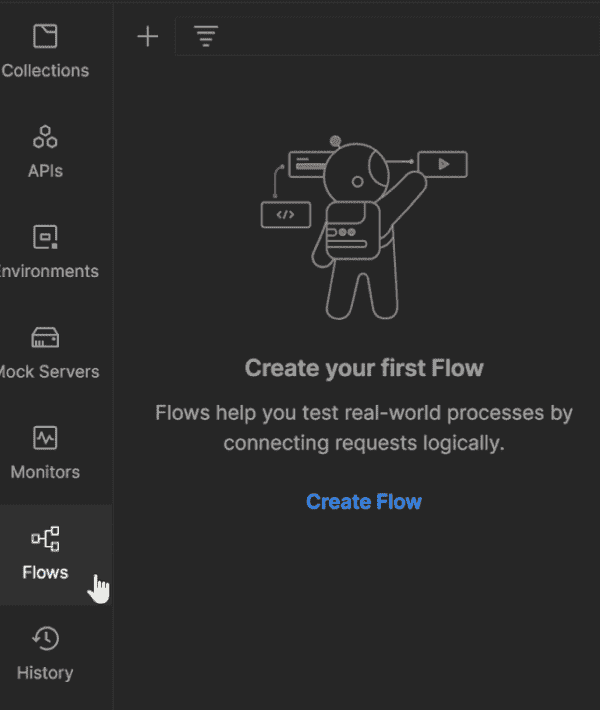
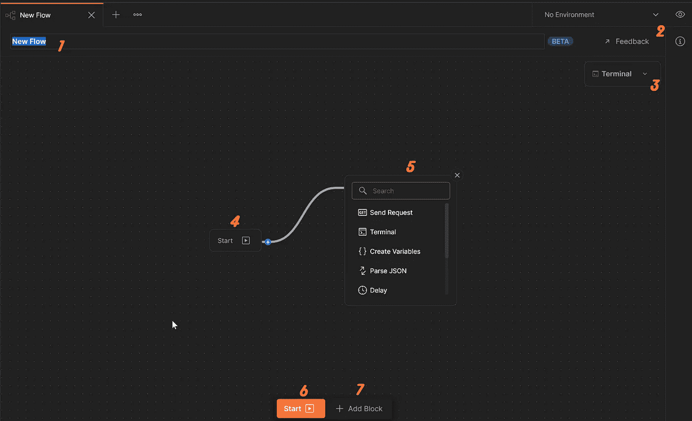
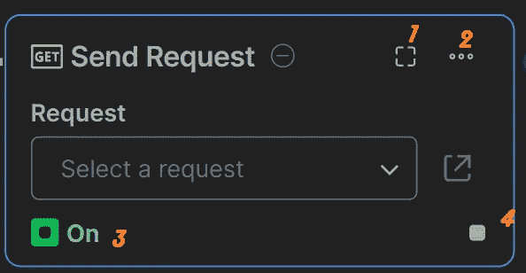
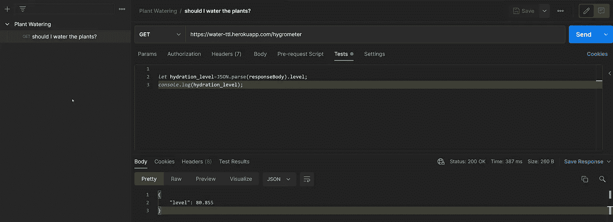
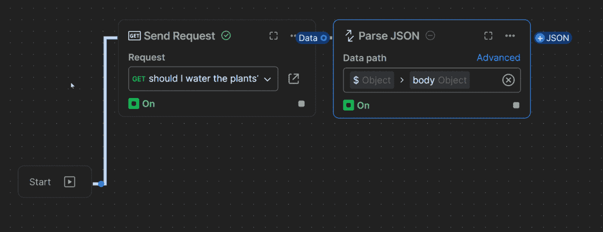
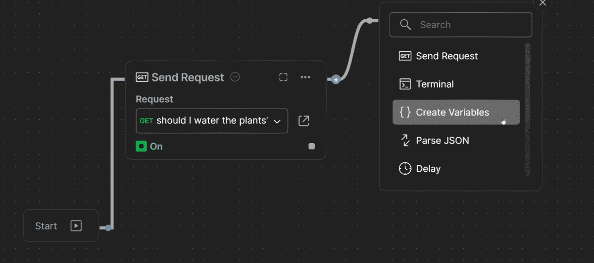
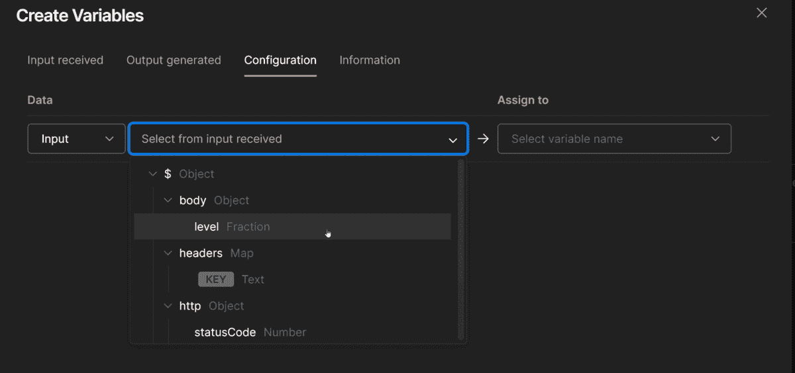
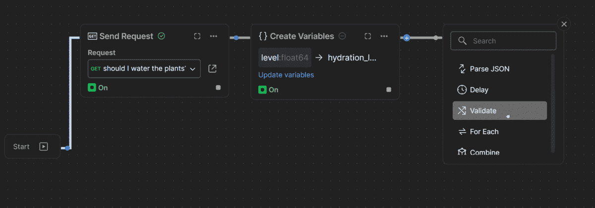
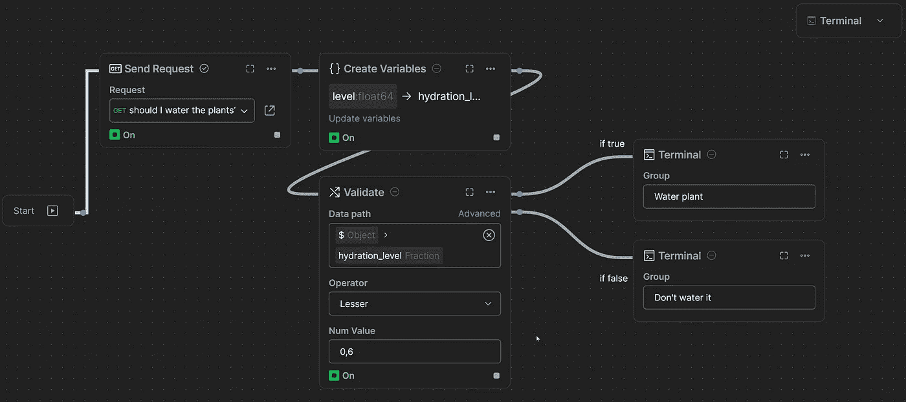

# 满足流量:邮递员的新酷功能

> 原文：<https://betterprogramming.pub/postman-flows-54ede6e0b558>

## 虽然 Postman 的流功能仍在开发过程中，但我们有机会试用测试版。那么，为什么不呢，让我们来玩一玩，探索一下

安东尼奥·加波拉在 [Unsplash](https://unsplash.com?utm_source=medium&utm_medium=referral) 上的照片

## **等等，什么是流动？**

Flows 是一种功能，它意味着在 Postman 中实现无代码工作成为可能。那些处理过链接多个请求、在请求之间共享值和参数以及从响应中检索数据的人会同意我的观点，这不是一个容易完成的任务，至少需要一些 JavaScript 的基础知识。因此，Postman 将使我们的生活变得更加轻松，因为它使无代码工作成为可能，并摆脱了 javascript 的困扰。

因此，让我们深入研究一下，看看它在实践中是如何工作的。

首先，您需要从右上角的菜单中选择*流*，然后点击加号按钮或蓝色的*创建流*按钮。

添加新流程

将添加一个新的流程，并打开流程设计窗口。默认情况下，新流程包含一个开始按钮和一个包含所有可用块类型的菜单块。

1.您可以随时更改流的名称，就像您对 requests 2 所做的一样。到目前为止，Flows 还处于测试版本，您可以将反馈发送到邮递员团队 3。流终端，您可以在这里读取请求日志 4 和 6。开始按钮只是启动流程 5。块菜单，在这里你可以选择不同类型的块 7。添加块按钮打开块的菜单

到目前为止，块菜单包含以下块。我可以想象以后会有更多的区块加入。

*   **发送请求**:这个块添加了一个预定义的请求，也就是说，您应该在集合中的某个地方有这个请求，所以您可以将它添加到这个块中
*   **终端:**它只会显示你的请求日志。
*   **创建变量**:您可以创建变量并使用这些变量，以便在请求之间共享数据。
*   **解析 JSON** :您可以快速解析 JSON 输出，而无需编写一行代码。
*   **延迟:**这个可以用来增加请求之间的延迟。延迟的持续时间应以毫秒为单位定义。
*   **Validate:** 在这个模块的帮助下验证请求的输出，它可以有真或假的输出。
*   **For Each:** 不要试图找出 JavaScript 中的“For Each”语句是如何工作的，你可以直接使用这个代码块，轻松地遍历你的数据。
*   **合并:**合并块用于将两个数据输出合并成一个。
*   **注释:**这个块可以用来在流程的不同地方添加注释，以描述它是如何工作的。把它看做是在代码中添加注释。

所有模块都有 4 个通用按钮，如下图所示👇

1.打开详细信息窗口，您可以在其中查看有关块、其输入和输出参数以及配置 2 的更多详细信息。这将打开一个选择菜单，从中您可以选择查看有关该块的更多信息，复制或删除它 3。绿色按钮表示它触发了块，但不携带任何数据。当您选择使用按钮 4 来链接块 4 时，它将关闭。通过点击这个，你可以链接一个新的块，不需要从链接的块中获取数据

现在是时候使用一些可用的块来设计一个简单的流程了。为此，我们将使用[“邮递员 30 天”](https://www.postman.com/postman/workspace/30-days-of-postman-for-developers/overview)课程中的[请求示例](https://www.postman.com/postman/workspace/30-days-of-postman-for-developers/documentation/1559645-7e3a6d75-57cb-4e54-82ff-b4f9e402c8cc)。所以我们叉*植物浇水*集合🌵，它有一个 GET 请求，请求并获得一个水合程度变量作为响应。分叉的集合应该在我们想要设计流的同一个工作空间中。

下面的 Get 请求用在流示例中。响应是土壤水合程度的**水平**变量。

我们的流程将包含以下步骤:

*   我们发送 GET 请求并得到相应的水合程度
*   我们解析 JSON 响应
*   我们创建一个变量来保存水合程度
*   我们验证水合程度，如果它高于 0.6，那么在终端中我们应该得到一个消息，告诉我们，是时候给它浇水了。如果水合程度低于 0.6，那么我们应该在终端中得到另一个消息，这一次告诉我们，我们不需要担心给植物浇水。

首先，我们添加 GET 请求块。

添加 GET 请求块

块可以用两种方式链接。如果下一个程序块需要从上一个程序块获取数据才能被触发，那么我们使用程序块右上角的***+响应*** 按钮，否则，我们使用程序块右下角的小方形按钮。

添加用于解析请求的 JSON 响应的 Parse JSON 块

在添加变量块之前，单击 start 按钮并运行第一个请求，以便生成输出数据。通常，下一步是在请求之后添加解析 JSON 块，以便解析 JSON 响应，但是由于 Flows 仍然处于测试版本，该块还不能工作，我们将继续进行，不解析响应。

添加创建变量块

当点击*创建变量*块内的*创建变量*按钮时，一个新窗口打开，您可以在此指定变量的输入值和名称。在我们的例子中，变量的输入值将是 GET 请求的响应体中的 level 参数，我们将其命名为 *hydration_level* 。

指定变量值和名称

我们需要验证 *hydration_level* 变量，在此基础上我们将决定是否给植物浇水。所以下一步是添加*验证*块。

添加验证块

在 Validate 块中，我们需要指定应该验证什么、验证操作符和值。我们要检查*水合 _ 水平*是否小于 0.6，因此数据路径将是*水合 _ 水平*，运算符 Lesser 和 Num 值将是 0.6。

最后一步，我们添加 2 个端子，一个用于*真*输出，另一个用于*假*输出。如果*水合 _ 水平*值小于 0.6，则第一个终端被激活，否则，第二个终端被激活，告诉我们不要给植物浇水。最后，我们添加了两个注释块，一个在真输出行上，表示它是真输出，另一个在假输出行上。要运行流程，我们只需单击开始按钮。

最终流程

现在轮到你了，去试试吧。