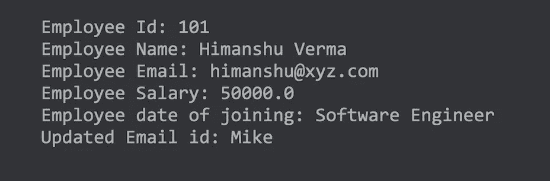
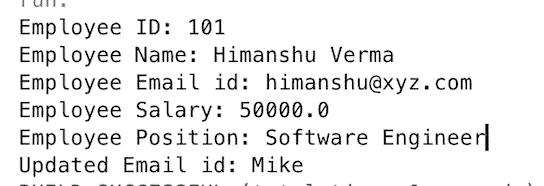

# Android 应用开发 Kotlin 比 Java 好吗？

> 原文：<https://betterprogramming.pub/power-of-kotlin-in-android-apps-development-a6b6bc8671cc>

## 比较编写 Android 应用程序的两种不同方式

[法托斯 Bytyqi](https://unsplash.com/@fatosi?utm_source=unsplash&utm_medium=referral&utm_content=creditCopyText) 在 [Unsplash](https://unsplash.com/s/photos/code?utm_source=unsplash&utm_medium=referral&utm_content=creditCopyText) 上的照片

程序员热爱编码，创造新事物，让人们的生活变得更简单。但是现在，由于现代编程语言，它变得更加有趣和简单。

我们都知道，每一项新技术都有新的东西可以提供，更新旧版本，并引入新技术。手持设备的使用每天都在增加。

众所周知，手持设备在电源、处理和内存方面的资源非常有限。如你所知，Java、C#和 Objective-C 正被用于移动开发。

由于这些语言已有二三十年的历史，而移动设备是在 2005 年之后才出现的，因此很明显，当这些语言被开发出来时，它们并没有想到移动设备。

新的语言正在被构建，记住它们将被用于移动开发。所以，这些编程语言并不像其他语言一样适合应用程序开发。

一些现代编程语言以其简单性和“少写多做”的方法使程序员的生活变得更容易。对于程序员来说，一遍又一遍地写那些肮脏的代码来完成哪怕是最小的任务总是很无聊的，而且过去需要花费大量的精力和时间。

这就是为什么现代编程语言在试图取代旧方法的程序员中越来越受欢迎。

一些最流行的语言(如 [Python](https://www.python.org/) 和 [Kotlin](https://kotlinlang.org/) 等。)非常容易理解，适合更复杂的工作。

在本指南中，我们将看到:

*   科特林是什么？
*   Android 应用开发为什么要用 Kotlin over Java？
*   科特林方法。
*   使用 Kotlin 创建一个登录应用程序。

# 科特林是什么？

> Kotlin 是一种跨平台、静态类型的通用编程语言，具有类型接口。
> 
> Kotlin 被设计为完全与 Java 互操作，其标准库的 JVM 版本依赖于 Java 类库，但类型推断允许其语法更加简洁。
> 
> Kotlin 主要针对 JVM，但也编译成 JavaScript 或本机代码(通过 [LLVM](https://en.wikipedia.org/wiki/LLVM) )。Kotlin 由 JetBrains 和 Google 通过 Kotlin 基金会赞助。 *—维基百科*

# Android 应用开发为什么要用 Kotlin Over Java？

*   与 Java 的互操作性:使用 Kotlin 的主要优势之一是它可以与 Java 互操作，这意味着 Kotlin 和 Java 代码可以在同一个项目中使用，而且，您可以很容易地从 Kotlin 代码中调用 Java 方法或类。
*   Kotlin 比 Java 简洁得多:这无疑是 Kotlin 比 Java 最大的优势之一。在 Kotlin 中，您可以用更少的代码行解决同样的问题。
*   更安全的编码方式:更安全意味着在 Kotlin 中你会有更少的崩溃。应用崩溃的最大原因是由于`NullPointerException` 和 Kotlin 非常聪明地处理了这些异常，而 Java 仍然必须找到一种方法。
*   强大的编译器:Kotlin 是一种现代编程语言，它已经知道其他语言面临的问题。这就是为什么它有一个非常强大的编译器，可以在编译时检测大多数异常，而不是运行时。
*   给你的生产力插上翅膀:科特林的工作原则是“少写多做”。你不需要写样板代码来完成你的工作。
*   易于维护:维护代码的可读性及其性能需要花费大量的时间和精力，而且随着时间的推移，由于需求的变化和软件的故障，有必要更新软件。因此，Kotlin 将帮助您更好地实现这一目标。

注:Java 还没有走向任何地方，但 Kotlin 已经留下来了，这是所有 Android 开发者都在寻找的语言。

# **科特林方法**

在本文的这一部分，我将向您展示用 Kotlin 和 Java 编写代码是多么简单和简洁。

1.  声明一个名为`Employee`的类，没有任何属性或用户定义的构造函数。Kotlin 会自动创建一个非参数化的默认构造函数。
2.  声明一个具有属性的类:不可变的`empID`、可变的`name`、`email`、`salary`和`position`，以及一个具有这些字段的构造函数。
3.  通过默认构造函数创建类`Employee`的实例。注意 Kotlin 中没有`new`关键字。
4.  访问属性`empId`、`name`、`email`、`salary`和`position`。
5.  更新属性`email`的值。

## **输出**

# Java 方法

现在是 Java 方法。

1.  用所有的 getters 和 setters 以及一个用户定义的构造函数声明一个名为`Employee`的类。
2.  声明一个具有属性的类:`empID`、`name`、`email`、`salary`和`position`，以及一个具有这些字段的构造函数。
3.  通过用户定义的带有新关键字的构造函数创建类`Employee`的实例。
4.  访问属性`empId`、`name`、`email`、`salary`和`position`。
5.  更新属性`email`的值。

## **输出**

可以清楚地看到，在 Kotlin 中，一行代码足以完成相同的工作。

# **登录 App**

我将创建一个非常基本的登录应用程序，向您展示 Kotlin 中的变化。

我只是用了两个输入框让用户输入用户名和密码，还有一个按钮让用户登录应用程序。

如果用户输入正确的用户名和密码，它会显示一条简短的提示信息:“哇，你成功登录了！”

# 结论

*   我们讨论了 Kotlin，为什么我们应该在 Java 上使用它，以及它有多强大。
*   我们已经看到了如何轻松地避免编写样板代码。
*   最后，我们创建了一个非常简单的登录应用程序，向您展示在 Kotlin 中是如何完成的。

我希望你喜欢读这篇文章，你也可以访问我的 [**网站**](http://thehimanshuverma.com/) ，在那里我会定期发布文章。

# 了解你的作者

希曼舒·维尔马毕业于印度勒克瑙的 APJ 阿卜杜勒·卡拉姆大学博士。他是 Android & IOS 开发人员、机器学习和数据科学学习者、金融顾问和博客作者。