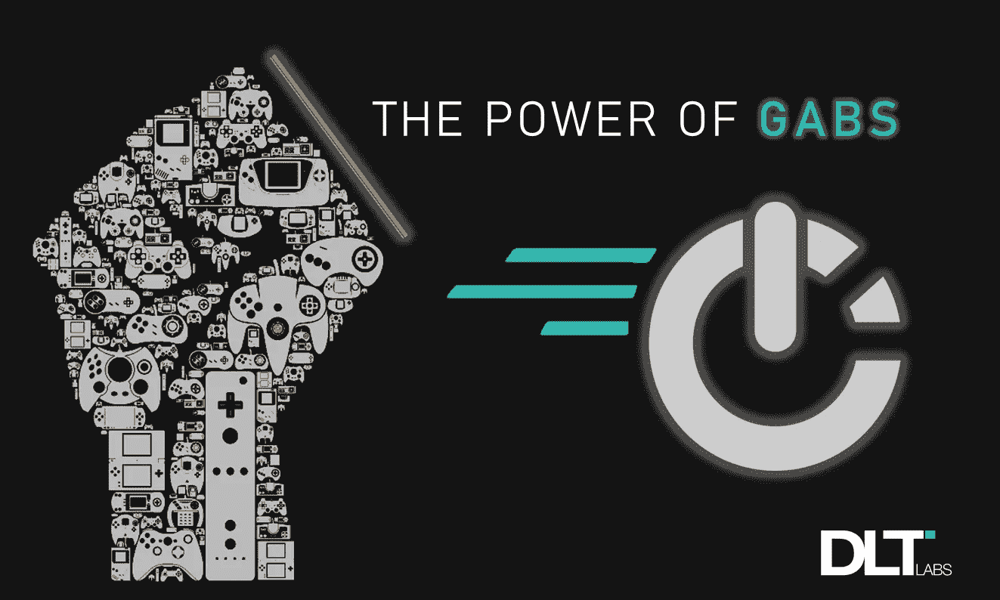

# 动态 JSON 的 Go 包 Gabs 的威力

> 原文：<https://betterprogramming.pub/power-of-the-go-package-gabs-for-dynamic-json-69eb26d91927>

## Go 中的 JSON 很难处理，Gabs 使它变得更容易



谷歌开发的 [Go](https://golang.org/pkg/) 编程语言是基于 C 编程语言的。它被完全编译并与所有打包成执行所需的单个二进制文件的库静态链接。

在这里，我们将讨论如何在 Go 中支持动态 JSON。在理解它之前，我们先回忆一下静态 JSON 在 Go 中是如何工作的。

# **静态 JSON in Go**

静态 JSON 是指编译时其数据结构的先验定义形成的对象。

通过在编译期间在结构中定义键，我们限制了它的作用域，并且我们不能通过添加更多的键来最大化这个作用域。

在 Go 中，JSON 分别由在`encoding/json`包中定义的 marshal 和 unmarshal 函数编码和解码。

## ***样品***

```
import “encoding/json”import “fmt”type demoStatic struct {Name string `json:”name”`Id int `json:”id”`}var myStatic demoStaticobj := demoStatic {“Name”: “foo”,“Id”: 1234}
```

*   封送处理:对象实例返回一个字节片。

```
bytes,_ := json.Marshal(obj)
```

*   解组意味着用结构的引用解码对象实例的字节片。

```
err := json.Unmarshal(bytes, &myStatic)fmt.Println(err)fmt.Println(bytes)
```

Go 结构是不同数据类型的字段集合，属于 case 标准。如果需要在外部使用，字段是大写的**。如果未导出，则它们在**小写**中。如果未经授权访问字段，编译器将返回错误。**

# ****启动动态 JSON****

**与静态 JSON 不同，动态 JSON 有点麻烦，因为它基本上是在运行时处理结构的字段。**

**这就提出了一个问题:“在运行时定义一个结构有帮助吗？”我认为这不是不可能的，但它可能有点复杂。经过坚持不懈的尝试，我们找到了阿什利·杰夫斯开发的包[](https://github.com/Jeffail/gabs)*。***

***Gabs 是一个实用程序，能够处理动态或未知的 JSON 结构，以及嵌套的 JSON 结构。***

## ******样品******

```
*import “github.com/Jeffail/gabs”parsed,err := gabs.ParseJSON([]byte(`{“foo”:{“John”:{“Doe”:”bar”}}}`))out,ok := parsed.Path(“foo.John.Doe”).Data().(string)//out == bar; ok == true*
```

***解析 JSON 结构后，获得的输出是类型`*gabs.Container`。***

*   ****容器*是 Gabs 包中定义的结构，是引用特定元素的包装器。***

```
*type Container struct {obj interface{}}*
```

***因此，如果您通过`New() as obj:= gabs.New()`创建一个新的 JSON 对象，它将返回一个容器的地址，并引用其元素作为`map[string]interface{}`。***

***这意味着一个对象有多个用`interface{}` *映射的字符串键。****

# *****通过 Gabs 设置按键*****

***我们可以在 Gabs 结构中设置多个键，而不用担心 Gabs 的内部机制。***

```
*newObj := gabs.New() // define single object instancenewObj.Set(“value”,”key”)out := newObj.String()fmt.Println(out) //{“key”:”value”}*
```

# *****结论*****

***Go 中的非静态 JSON 可能很难处理。但是，在我们了解了 Gabs 包之后，我们发现管理动态 JSON 更容易了。***

***如果您的 Go 代码中有未知的或动态的 JSON，请阅读 Gabs Go 包文档。你可能也会发现它的用处。***