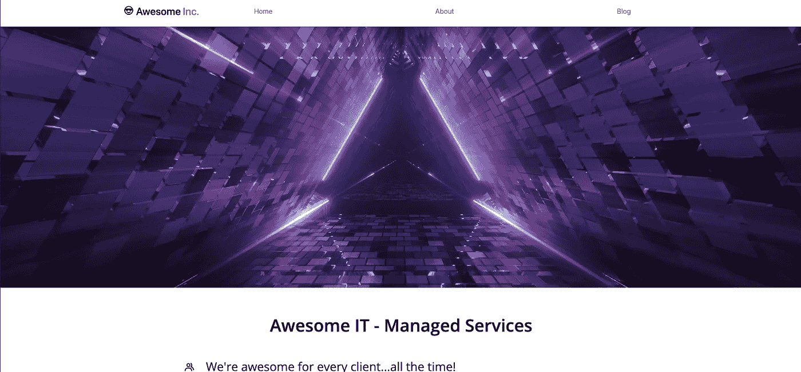
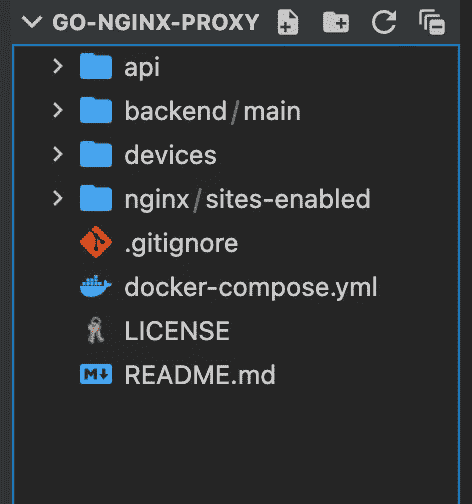

# 使用 Nginx、Docker Compose 和 Go 构建一个模块化的 Web 服务器

> 原文：<https://betterprogramming.pub/power-to-the-proxy-80329995e8>

## 代理人的权力


图片由 creativeart 在 [Freepik](https://www.freepik.com/free-photo/connected-elements_902782.htm#page=3&query=web proxy&position=42&from_view=search&track=ais) 上提供

有时，你很可能听说过“反向代理”或“代理服务器”这样的术语，但它们到底是什么呢？在计算机网络的上下文中，万维网联盟(或 W3C)将它们定义如下:

> 在请求者代理和提供者代理之间中继消息的代理，对于 Web 服务来说，它就像是请求者。

在查看典型实现时，代理通常分为两个不同的类别:

*   正向代理
*   反向代理

转发代理在各种规模的商业网络中非常普遍，在大规模的公司环境中尤其有用。你很有可能在工作中使用电脑试图访问网站或其他网络资源时遇到过这种情况。有没有尝试导航到一个被你的公司封锁的网站？这是一个转发代理过滤网络请求之前，被发送到网上！

虽然我相信我们中的许多人都不喜欢看到这种烦人的代理警报，但我们对这些配置不感兴趣！我们希望利用的是强大的反向代理:

> 反向代理是位于 web 服务器前面的服务器，并且将客户端(例如，web 浏览器)请求转发到那些 web 服务器。反向代理通常用于帮助提高安全性、性能和可靠性。

# 我们的场景

您已经有了一个面向公众的网站，并希望创建几个不同的后端 API 来高效、安全地利用各种通知服务，而不暴露多个开放端口。我们如何着手做这件事？没错……一个反向代理！

像编程世界中的许多事情一样，完成一项任务有几种方法。我们将组织这个项目的方式(这是我的偏好)如下:

*   利用 Go 的速度和丰富的社区框架为我们的通知服务创建 API
*   利用集装箱化的灵活性和附加的安全性
*   利用 Nginx 的内置代理特性来处理我们所有的服务路由

我们项目的总体结构如下:

```
.├── api├── backend│   └── main│       └── assets│           ├── css│           ├── fonts│           ├── img│           └── js├── devices└── nginx└── sites-enabled
```

> 就资源目录而言，assets 文件夹非常简单。它的父目录 backend/main 包含基本的网站模板，用于模拟真实部署中使用的面向公众的网站。

您可能已经注意到在上面的结构中有两个有趣的目录。`api`和`devices`文件夹都保存了模拟后端 API 的示例代码，我们需要这些 API 来接收通知。一个用于新的联系表单提交，另一个用于设备传感器警报，以模拟现场物联网设备触发。

因为 Go 提供了出色的速度和并发性、简单的语法和众多的社区库，所以它很容易成为 API 编程的首选。让我们看看新提交的网站联系表单的示例代码:

这个程序相对来说比较简单，但是让我们回顾一下代码的要点:

*   我们首先运行一个`init`函数来追加/创建一个日志文件，以跟踪容器生命周期中的所有请求(稍后将有更多内容)
*   我们导入了强大的 Gorilla Mux 库和 Logrus，为创建自定义路由和日志条目提供了简单的接口
*   创建两个端点函数来匹配路径查询，每个端点函数都调用一个执行函数，该函数运行特定于路径的 Python 脚本…从而向您(或者客户端)发送电子邮件警报
*   最后，我们创建主路由器，并在`main`函数体中声明我们的定制路由，并在定义的端口上启动我们的 API 服务器

`devices`目录也使用相同的代码结构来创建它的 API。主要区别是用于通知服务的 python 脚本和为每个设备传感器创建的特殊`Sensor`结构。

项目的下一个重要部分涉及到运行 API 服务器的容器的创建。为了给我们的 web 服务器增加模块性和安全性，我们将利用 Docker 在各自独立的环境中运行两个不同的 API。如果你对集装箱化的整个概念不熟悉，一定要查看 Docker 网站[上提供的大量文档，让你快速上手，并在你的机器上设置使用集装箱。](https://www.docker.com/get-started/)

Docker 有一个优秀的编排程序，叫做 Docker Compose。它允许我们编写一个简单的 YAML 文件，声明我们计划使用哪些 docker 图像和资源，它完全符合我们对这个项目的需求！

下面是我们的 web 服务器将如何启动我们需要的容器:

深入研究 Docker Compose 经历的每一个步骤超出了本文的范围；然而，如果您同时查看`devices`和`api`目录，您会在每个目录中看到一个`Dockerfile`。这些包含为每个服务构建映像的指令…这就是 compose 所使用的蓝图。我们马上就来看看这个高级流程！

# 最终作品

剩下我们要做的就是确保我们的服务器正确安装/配置了 Nginx 来托管我们的站点，并相应地路由传入的请求。

如果你还没有在你的服务器上安装和配置 Nginx，我推荐你去看看数字海洋的几个演练之一。它们不仅会引导您完成安装和基本设置的步骤，还包括设置免费 LetsEncrypt 证书的步骤，以便您的页面可以利用 SSL/TLS。

一旦您的 web 服务器目录建立起来(如果还没有的话)，您只需要做一个大的改变。如果你跟随任何一个数字海洋漫游，很可能你会在`/etc/nginx/sites-enabled`中为你的网站创建一个文件。这是声明重要配置的地方，允许我们利用 Nginx 的反向代理能力！下面是我们新网页和 API 路由的配置示例:

请记住，这只是配置文件的一部分，因为其他行是 CertBot 在获取 Lets Encrypt 证书时自动添加的(参见数字海洋文章)，还有其他一些与此无关的内容。

从上述要点中提取的主要细节如下:

*   我们用路线的名称和我们希望它们被代理的地方来声明`location`块。例如，如果一个请求带有 URL`awesomeinc.com/contact`，我们的服务器会将它转发到端口`8081`
*   URL 对应于我们的 API 容器正在监听的端口
*   Nginx 文档推荐使用`limit_req`和其他声明来限制并发请求，它们本身并不完全必要

这样一来，剩下的就是使用`sudo systemctl restart nginx`重启(或最终启动)我们的 Nginx 服务。如果您使用 AWS EC2 之类的东西在云 VM 上托管该服务器，请确保进入您的网络仪表板，只允许传入网络流量到端口`80`和`443`(这应该已经完成以获得 SSL 证书)。只要您已经创建了正确的 DNS 记录，您现在应该能够导航到您的主页，并看到网站被正确地服务！



我们新的 Awesome 公司网页！

# 最后一档

所以现在我们的 web 服务器已经启动并运行了，但是我们的 API 还不可用。

在确认您的主网页可用后，回到您的服务器终端，告诉 docker-compose 为您旋转这些容器！在执行任何操作之前，确保您的合成 YAML 文件位于项目目录的底部是非常重要的，各种服务容器 API 位于它们自己的特定文件夹中(以匹配合成文件声明):



我们的项目

只要一切正常，我们就可以运行一个极其简单的命令来让事情运转起来:

```
sudo docker-compose up -d
```

## 以下是该命令将执行的操作:

*   告诉 compose 遍历配置文件中声明的每个文件夹，并在每个文件夹中使用`Dockerfile`为它们构建“映像”
*   这些图像是 compose 将用来创建新容器的图像
*   构建过程结束后，docker-compose 将在后台运行一切，以允许终端继续使用(T4 代表“分离”)

您可能需要也可能不需要继续并重启您的`nginx`服务，但是一旦一切最终完成，您应该能够测试查询您的后端 API 服务了！我们在上面概述的示例代码中添加了一个特殊的“测试”路线。在本地机器上打开一个终端，使用`curl`向测试端点请求您的域:

```
curl [http://www.awesomeinc.com/test](http://www.awesomeinc.com/test)
```

如果成功了，太棒了！如果没有…不要烦恼！设置这样的后端时，有许多移动部件。回到你的配置文件，检查你的端点声明…然后再试一次。

该项目和所有相关文件都可以在 GitHub 上找到:

[](https://github.com/dedSyn4ps3/go-nginx-proxy) [## GitHub—ded syn 4 PS 3/go-nginx-proxy:Medium 文章的代码文件

### 这个回购是为了持有代理的中等文章权力的代码文件。的整体结构…

github.com](https://github.com/dedSyn4ps3/go-nginx-proxy) 

*什么是反向代理？|代理服务器说明| Cloudflare* 。[https://www . cloud flare . com/learning/cdn/glossary/reverse-proxy/。](https://www.cloudflare.com/learning/cdn/glossary/reverse-proxy/.)