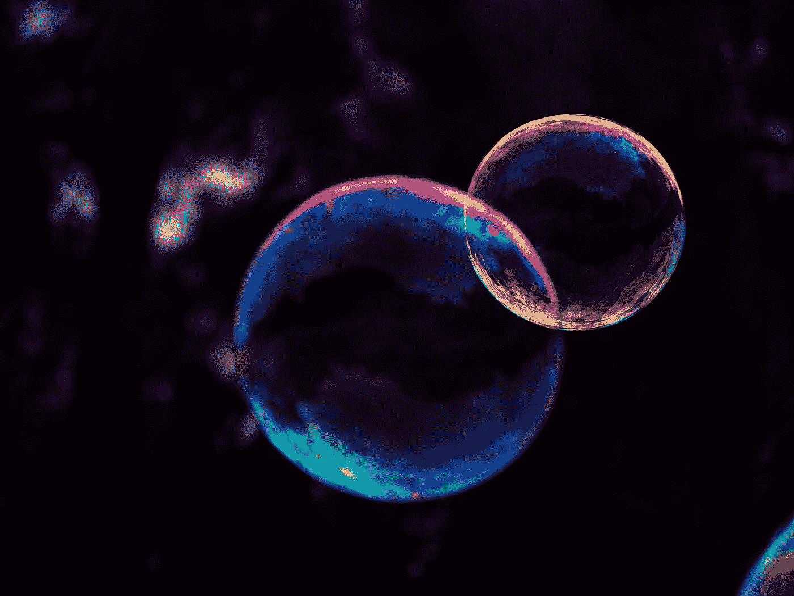
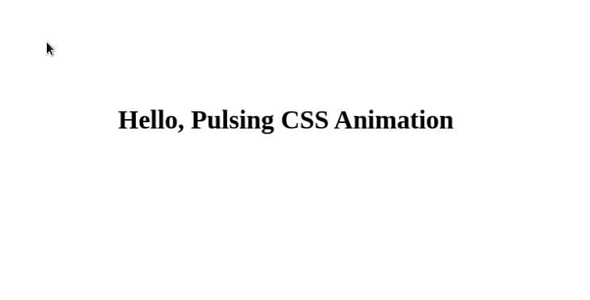

# 使用纯 CSS 动画启动您的前端应用程序

> 原文：<https://betterprogramming.pub/power-up-your-front-end-apps-with-css-only-animations-681722cdd129>

## 制作动画从未如此简单

Marc Sendra Martorell 在 [Unsplash](https://unsplash.com?utm_source=medium&utm_medium=referral) 上拍摄的照片

我已经有一段时间没有尝试提高我的 CSS 技能了，大约一周前，我写了这篇关于如何开始创建 CSS Ar 的文章。虽然我对简单的几行 CSS 代码所能做的事情感到惊讶，但我们在创建前端时通常不会做太多 CSS 艺术。

但是 CSS 没有停留在花哨的形状和渐变颜色上，它走得更远。CSS 更多的中间用途当然包括动画。

我想让大家意识到，你可以用 CSS 创建非常漂亮的动画，尤其是当你不想要复杂的动画时。

让我们来看看如何创建和使用 CSS 动画，结果会自己说话:*我们需要更多地使用它们*。

# 使用关键帧

CSS 的`@keyframes` at-rule 允许你控制动画序列的步骤。为了控制这些步骤，你最有可能使用百分比或者`from`和`to`偏移。

简单的关键帧看起来是这样的:

## 应用关键帧

一旦你有了你的动画，你想应用它，对不对？

为此，我很乐意为实现动画的类创建一种新的样式，这样该类中的每个 HTML 元素都能获得动画。

我们在这里做的是将`myNewKeyFrame`动画“分配”给`newAnimation`类，告诉浏览器我们希望动画持续两秒钟并无限重复。

现在，为了应用这个动画，比如说一个 H1 元素，我们要做如下的事情:`<h1 class="newAnimation">Hello, I'm a CSS Animation</h1>`。

# 动画片

似乎很有希望，也很简单，可以试一试？然后我们开始创作两个真实的动画。

## 脉动动画

这是我最喜欢的动画之一，因为它对 UI 的影响最小，同时在五行代码中极大地改进了页面的设计。

这就是我们在这里要做的事情(GIF 可能有点滞后，但在浏览器上显示时不是这样):

作者截屏

为此，我们首先设置 HTML(注意 H1 的`pulse`类):

现在我们创建动画:

你可以看到，我们希望我们的文本从它的比例(1)开始，然后在两秒钟动画的 30%处，变换它使它变大一点。最后，当动画达到其周期的 80%时，我们将比例设置回原始尺寸。

## 旋转动画

这个看起来像这样(GIF 可能有点滞后，但在浏览器上显示时就不是这样了，它要流畅得多):

作者截屏

同样，让我们在动手使用 CSS 之前设置 HTML。

我们已经创建了一个带有一些边距的 div，现在让我们在那里创建 id 和类是有原因的:

首先，我们制作“浅红色”圆圈，然后添加动画:

我们最初希望我们的圆圈旋转 360 度，然后给它一个轻微的减速效果(50%)，只是为了让它在最后旋转得更多。

# 结论

这有多简单，对吧？想象一下你的动画在运动和计时方面应该是什么样子，调整百分比和变换，最后通过在一些类中实现动画来让它工作。

现在，我会使用其他东西来创建一个复杂的动画，可能是补间动画，但为什么要使用简单的动画库呢？

通过这篇文章，您已经探索了在创建 CSS 动画时`keyframes` at-rule 是如何工作的，现在您已经准备好构建您的第一个纯 CSS 动画了。

感谢阅读，如果你喜欢这篇 CSS 文章，我想你也会喜欢这篇关于 CSS 艺术的文章:

 [## 作为初学者，如何构建令人惊叹的 CSS 艺术

### 级联样式表是强大的——让我们开始使用这种力量吧

better 编程. pub](/how-to-build-amazing-css-art-as-a-beginner-53454a50b0eb)