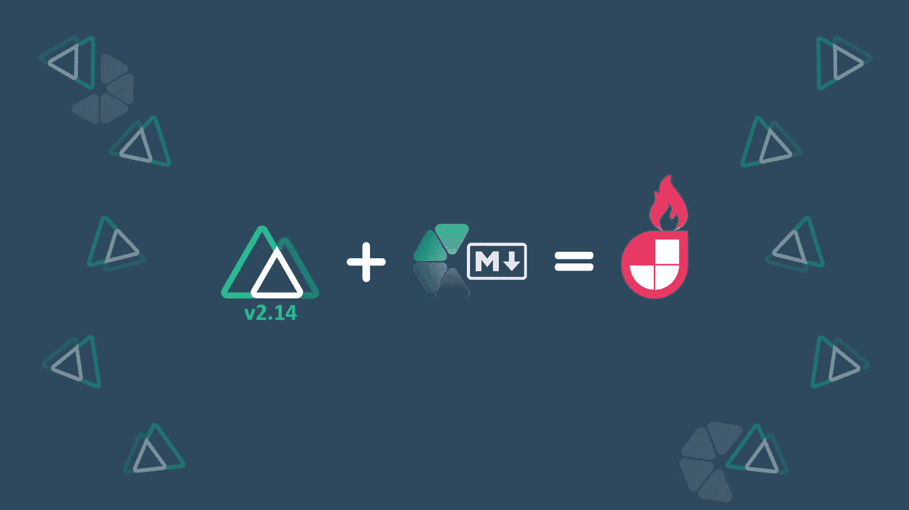
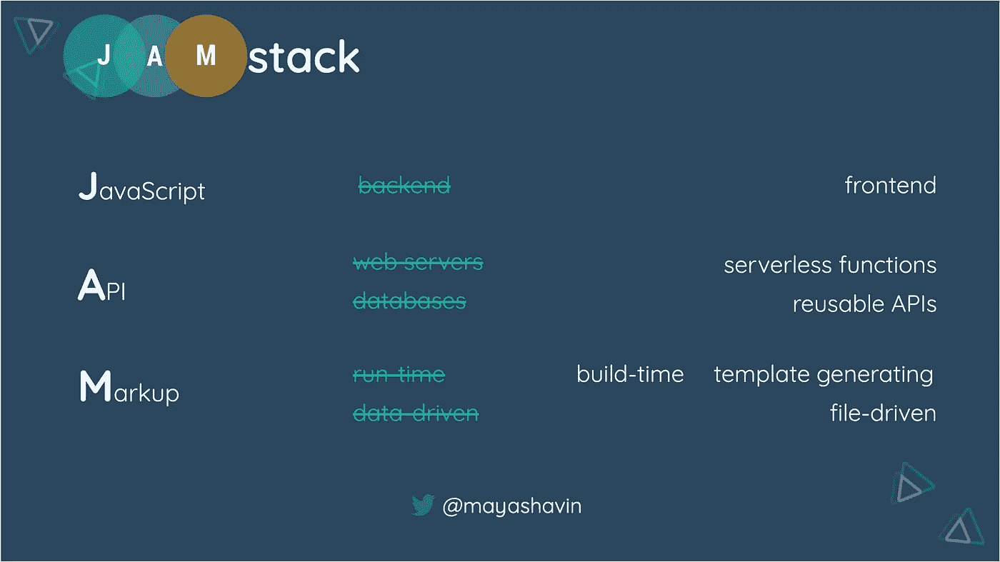
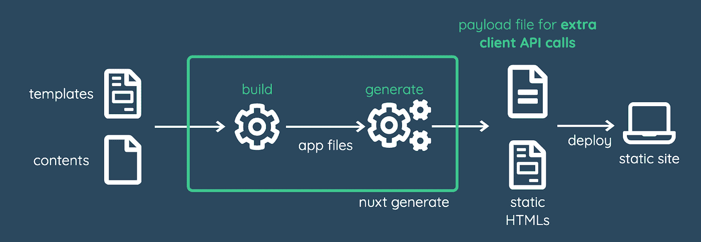
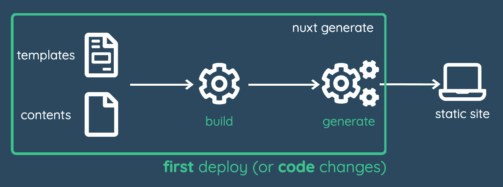
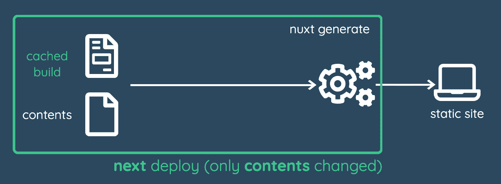
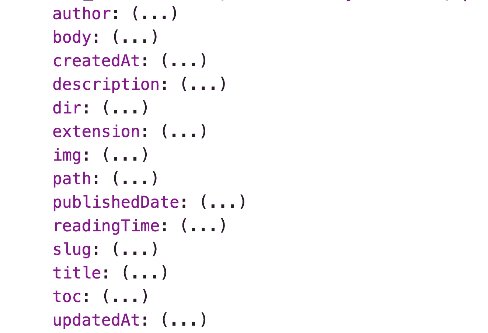
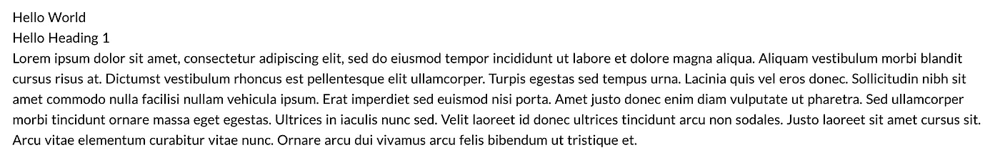
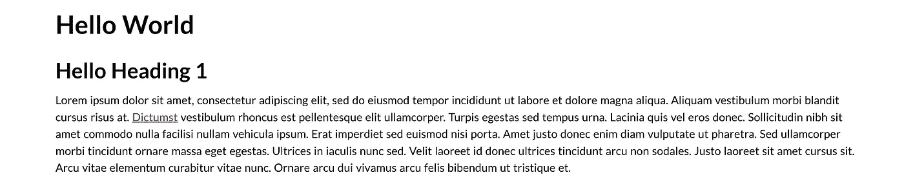
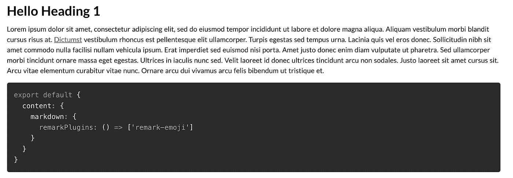
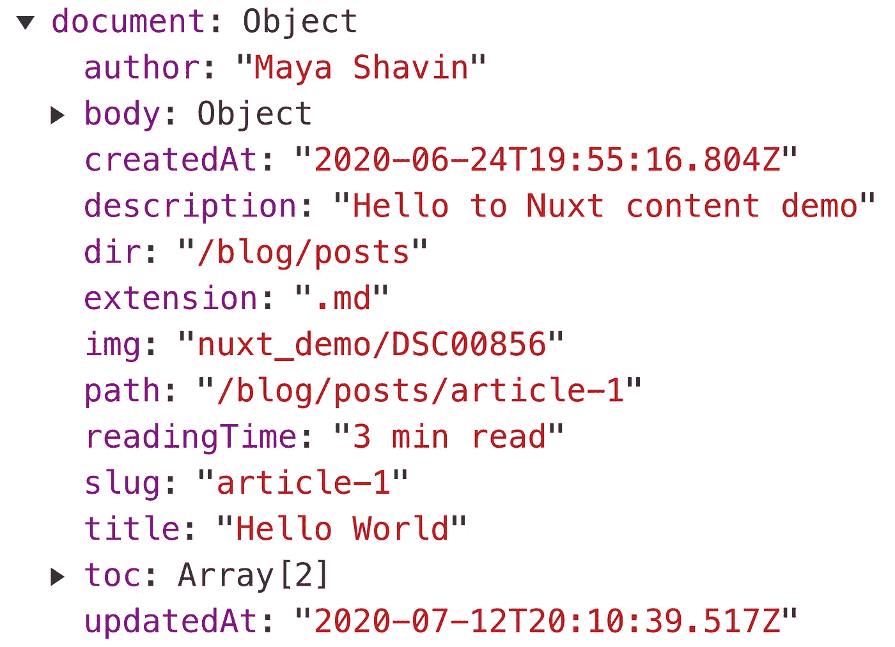

# 使用新的 Nuxt 增强您的 Jamstack

> 原文：<https://betterprogramming.pub/power-up-your-jamstack-with-the-new-nuxt-9b5c3d449876>

## 新功能和新功能



Nuxt 和 Nuxt 内容模块的力量(图片来源:作者)

一直在等待 [Nuxt](https://nuxtjs.org/) 3.0 构建 Jamstack(静态)应用？没必要这样。最新的 Nuxt 版本，v2.14，可能正是你正在寻找的。

好奇？我们开始吧。

# 什么是 Jamstack？

对于不熟悉的人来说， [Jamstack](https://jamstack.org/) (或 Jamstack)是一个 web 开发架构，其中 JAM 代表客户端 JavaScript、可重用 API(而不是多个 web 服务器)和预构建标记(静态 HTML 文件)。



Jamstack 的目标是通过静态构建来提供更快、可伸缩、更安全的应用程序。Jamstack 的趋势从 2019 年开始，我们预计它将在 2020 年继续流行。

那么 Nuxt——一个服务器端(SSR) Vue 框架——目前在 Jamstack 上表现如何呢？

让我们找出答案。

# Jamstack 的 Nuxt 状态(2.13 版之前)

Nuxt 是一个超级酷的框架。它为单个代码库提供了以下两个版本:

*   `universal` SSR(服务器端渲染)
*   `spa`单页应用

后来，为了支持 Jamstack，Nuxt 团队提供了额外的构建命令`nuxt generate`作为静态站点生成器(SSG)。

然而，其静态站点生成器机制并不完全是标准静态站点生成器(SSG)的 100%预期，具有以下一些限制:

*   与普通 SSG 不同，在普通 SSG 中，页面的所有数据都是在构建时预取的，Nuxt 引擎在构建时预呈现模板和内容，但在运行时使用`fetch`和`asyncData`检索外部数据。因此，生成的页面只是半静态的。此外，通过依赖外部调用来完成客户端的数据获取和呈现，在向用户显示内容时可能会有延迟，从而影响应用程序的整体性能。
*   由于 Nuxt 没有像 GraphQL 那样的内置数据层，因此 Nuxt 引擎不知道如何为来自外部数据库的内容自动生成所有动态路由。开发人员必须使用`nuxt.config.js`文件中的`generate.routes`属性指定如何生成这些路线。这种额外的工作导致复杂性和可能缓慢的构建时间，从而导致成本效率，特别是当大多数托管服务如 Netlify 根据构建时间收费时。
*   没有内置的[降价](https://daringfireball.net/projects/markdown/)支持。我们可以使用`@nuxtjs/markdownit`模块；然而，开发人员很难对这个模块进行额外的定制。

因此，在这种情况下，静态站点对性能的影响被释放了一半。

但是随着 Nuxt 2.13 和 Nuxt 内容模块的出现，这些限制终于结束了。

# 从构建过程开始的完全静态

为了更好的开发者体验，从 v2.13 开始，Nuxt 引入了一个新的属性`target: static`，而`mode`在`nuxt.config.js`内保持`universal`(默认)或`spa`，以通知 Nuxt 引擎。我们的应用程序旨在完全静态。

```
/* nuxt.config.js */
export default {
 mode: 'universal', // default mode
 target: 'static', // enable full static mode
 //...
}
```

## 用 n 优化构建`uxt generate`

在 Nuxt v2.13 之前，为了构建一个静态的代码项目，我们使用了`nuxt generate`。通过调用`nuxt generate`，Nuxt 引擎实际上触发了`nuxt build`来启动构建过程，然后在部署之前将应用程序的页面导出到静态 HTMLs。


使用 nuxt 生成时的构建过程

从 2.14 版本开始，`nuxt generate`更加智能。它检测何时没有代码更改，并跳过构建步骤。相反，它重用先前的构建缓存并继续生成静态 HTMLs。

此外，Nuxt 引擎知道如何检测客户端的任何额外异步 API 调用(通过`asyncData`或`fetch`)并将其从生成的 HTML 页面分离到相应的有效负载`.js`文件中。因此，它大大减少了生成的 HTML 页面的大小。同时，在运行时，有效载荷文件将被预加载，使应用程序的性能得到优化，并消除了客户端导航的额外 API 调用。



改进了异步数据调用的有效负载文件

很棒，不是吗？下一个问题是:为什么我们需要为构建静态应用程序保留缓存？

在构建过程中添加缓存支持可以减少不必要的重复部署工作。第一次部署需要将代码和模板完整构建到应用程序文件中，使用并将它们导出到部署所需的静态 HTMLs。



应用的首次部署流程

但是，除非代码和模板发生了变化，否则完整版本并不适合在以后的重新部署中运行。在大多数情况下，网站内容会发生变化，例如添加新的博客文章、修改产品内容等。我们只需要为这个特定内容重新生成动态路由或/和 HTML。因此，运行一个完整的构建会导致成本低效率，特别是当静态托管服务主要根据构建时间向我们收费的时候。对于这样的用例，为了优化重新部署的构建时间，使用先前构建的缓存并仅生成新的内容更新就足够了，而不是整个周期。



无代码更改时的智能部署

## 你提到动态路由，Nuxt 会自动抓取它

从 v2.13 开始，Nuxt 引入了比需要一个数据层更强大的东西，以及`generate.routes`。只要您在任何页面(例如主页上的博客文章列表)上提到您的动态路由，Nuxt 爬虫就会检测并确保所有提到的路由都是在构建和部署期间预先生成的。

默认情况下，Nuxt crawler 是自动启用的。然而，如果我们想使用我们的逻辑来生成路线，我们可以通过设置`crawler: false`来关闭它，并继续在`nuxt.config.js`中实现`export.routes`。

很酷，不是吗？还有更多。Nuxt v2.14 非常优秀，配合其 Nuxt 内容模块，静态功耗更高。

我们来看看 Nuxt 的内容，好吗？

# 您编写内容，Nuxt 负责呈现

Nuxt 内容模块`@nuxt/content`是由 Nuxt 团队的 Benjamin Canac 开发的一个新模块。在写这篇文章的时候，Nuxt 内容版本是 1.4.1。

简而言之，这个内容模块充当基于 Git 的 headless CMS(内容管理服务),从位于本地项目目录的不同文件类型中获取和处理内容，以便在 Nuxt 应用程序中使用。

要开始使用 Nuxt 内容，请运行以下命令之一:

```
yarn add @nuxt/content

#OR
npm i @nuxt/content
```

然后将模块添加到`nuxt.config.js`中的`modules`列表:

```
modules: [
 '@nuxt/content'
]
```

并且该模块已经准备好供您使用。

## 一种简单的使用方法

默认情况下，Nuxt 引擎将使用`content/`部件作为所有降价文件的主目录。

内容模块全局地将`$content`函数实例注入到我们的应用程序中，因此我们可以使用它直接从给定的路径中获取内容。例如，我们可以从`content/blog`目录中检索博客文章列表，如下所示:

这个`$content`实例接收两个参数:`path`和一个额外的对象`options`，它为模块提供额外的配置来覆盖给定路径的默认设置。例如，我们只需要启用`deep: true`从子目录中获取文件，如下面的代码所示:

或者获取一个文件，我们可以将文件名传递给`path`参数或者直接作为`options`:

这两种方法都是合法的。`$content()`返回一个`QueryBuilder`类型的链序列。然后我们可以调用它的方法`fetch()`开始使用 Promise 检索内容。

当`fetch()`解析时，它返回一个对象(如果`path`是单个文件路径)，或者一个对象数组(如果`path`是一个目录)。每个对象的结构与下面的截图相似，自动生成的属性为`body`(主要内容)、`createdAt`、`dir`、`extension`、`path`、`slug`(文件名)、`toc`(目录)和`updatedAt`。



一旦我们有了返回内容对象，我们可以简单地使用模板部分中的`nuxt-content`组件来显示内容的主体:

就是这样。内容模块将负责呈现并显示您的页面内容，如下例所示:



从截图中可以看出，Nuxt Content 只显示最基本样式的内容(即没有样式)，以避免在应用 CSS 样式定制时产生复杂性。Nuxt 为我们提供了`<nuxt-content>`组件的`.nuxt-content`类选择器，我们可以从那里开始定制样式，比如:

我们的内容页面现在看起来更有条理了



仅此而已。我们使用 Nuxt 内容模块将 Markdown 文件中的内容呈现到页面上，只需要三个简单的步骤:

1.  **使用`$content().fetch()`获取**内容。
2.  **相应地使用`<nuxt-content>`及其道具`document`渲染**获取的内容。
3.  **使用类选择器`.nuxt-content`将 CSS 样式**添加到显示的内容中。

很棒？确实如此。那么除此之外，Nuxt Content 还提供了其他什么独特的功能吗？

## 搜索和过滤内容结果

由于 Nuxt Content 使用类似于 [LokiJS](https://github.com/techfort/LokiJS/wiki) 和 [MongoDB](https://www.mongodb.com/) 的查询语法，我们可以通过方法序列链在搜索和过滤特定内容结果集时获得高性能。例如，如果我们只想选择每个内容对象的`title`、`slug`和`updatedAt`属性，并按照编辑时间对文章进行排序(降序)，我们可以这样做:

这里，`only`接收一个从每个返回的内容对象中选择的键数组，`sortBy`接受两个参数，一个要排序的键和排序方向。

您还可以使用`where`过滤符合特定条件的帖子，例如:

或者您可以使用`search(key, value)`对字段执行全文搜索:

另外，您可以通过限制`limit()`接收的结果来实现分页:

您可以在 Nuxt 内容文档和 LokiJS 中探索其他有用的链接方法，以获得这些方法中支持的查询语法。

注意:所有的序列链接必须以`fetch()`结束，以通过 Promise API 收集所需的数据。

## 使用 PrismJS 突出显示代码

Nuxt Content 使用 [PrismJS](https://prismjs.com/) 作为其内置的处理程序，用于在 Markdown 内容中突出显示代码。默认主题相当不错；然而，我们总是可以安装`prism-themes`并从可用的主题列表(24 个不同的主题)中选择一个不同的主题用于我们的应用程序:

```
yarn add prism-themes
```

然后在`nuxt.config.js`中的`content.markdown.prism`字段下定义想要的主题，如下例所示:

带有代码突出显示的呈现内容将如下所示:



很美，不是吗？没有更复杂的解决方法来支持 Markdown 的代码高亮显示。此外，由于`prism-themes` repo 是开源的，您可以随时创建自己的自定义主题。

## YAML 内线降价

Nuxt 内容的一个很好的特性是能够支持降价文件中的 YAML 前端事务块，只要它出现在顶部并采用三点划线之间的 YAML 集的有效形式:

```
--- 
title: Hello World description: Hello to Nuxt content demo img: nuxt_demo/DSC00856 
author: Maya Shavin 
---
```

Nuxt 内容模块将这些字段作为属性注入到传递给`nuxt-content`组件的`document`的内容对象中，如下例所示:



在 Markdown 文件中编写 YAML 块使我们能够轻松地为一篇博客文章添加更多的定制信息，比如作者的详细信息。

## 自动生成目录

当获取一个 Markdown 文件时，Nuxt content 会自动生成一个目录(TOC ),其中包含文件中的所有标题。TOC 是一个数组，作为返回内容对象的属性出现。`toc`数组的每个元素都是一个对象，有三个主要字段:

*   `id` —标题本身为小写，无空格，用于链接
*   `depth` —标题类型(1=h1，2 =h2，等等。)
*   `text` —标题的实际文本

下面是一个包含以下内容的降价文件示例:

```
**# Hello World**

**## Hello Heading 1**

Lorem ipsum dolor sit amet
```

Nuxt 内容将按如下方式生成 TOC:

从这个 TOC 结构中，我们可以相应地构建和显示我们的 TOC 组件。

太棒了。还有什么？

## 都是关于钩子的！

目前，Nuxt 内容提供了两个主要的挂钩:

*   `content:file:beforeInsert`允许在存储文件进行渲染之前向文件添加额外数据。例如，添加外部逻辑是有用的，比如在构建时读取时间计算，从而优化客户端性能。
*   `content:update`内容文件更新时。当您想要实现热重装或实时编辑时，这个钩子很有用。

我们可以通过使用`nuxt.config.js`中的`hooks`属性来添加所需的挂钩，如下例所示:

这就是我们所需要的。现在，获取的文档还会有一个额外的字段`readingTime`,指示阅读博文需要多长时间，所有这些都是在构建时完成的。客户端不需要额外的工作，即使是计算阅读时间。

很酷，不是吗？有了这些功能，我们可以建立一个完全静态的网站，无论是博客还是电子商务商店只使用 Markdown 文件和 Nuxt。

事实上，这些并不是 Nuxt 内容能够提供的唯一特性。而制作一个高性能且美观的静态网站需要高效工具的组合，其中 Nuxt 和 Nuxt 内容是核心。

# 演示

为了实验，我为一家旅游公司做了一个演示 PWA，使用 [Nuxt](https://nuxtjs.org) 、 [Nuxt Content](https://content.nuxtjs.org/) 、 [TailwindCSS](https://tailwindcss.com) 、 [Cloudinary](https://cloudinary.com) ，使用 Netlify 自动部署。


你可以在这里查看这个应用:[https://tfh-tours.netlify.app/](https://tfh-tours.netlify.app/)

而背后的代码一如既往的开源，可以在这个回购中获得:[https://github.com/mayashavin/tours-nuxt-full-static](https://github.com/mayashavin/tours-nuxt-full-static)

# 结论

在我看来，Nuxt v2.1x 和 Nuxt 内容是 Nuxt 团队发布的优秀产品。除了提到的静态站点的构建改进，新的 Nuxt 还提供了其他功能，旨在使开发人员的生活更加舒适，例如自动检测、运行时配置、遥测和主题支持的组件。

此外，Nuxt 内容是一个绝对的胜利，你可以与内容实时交互，并充分利用 Markdown content 提供的功能，同时根据你的应用程序的目标外观和感觉保持用户界面的美观。

如果您达到了这一行(我很感激)，为什么不试试 Nuxt(如果您还没有)，看看它如何增强您的下一个 Jamstack 项目？